# 继承关系图

本文档使用 Mermaid 图表可视化破碎像素地牢中的关键类层次结构。

---

## 1. 行动者层次结构

核心回合制实体系统。所有参与游戏回合制调度的实体都继承自 Actor。

```mermaid
graph TD
    Actor[Actor<br/>Abstract - Turn scheduling base]
    Actor --> Char[Char<br/>Abstract - HP/combat]
    Actor --> Buff[Buff<br/>Abstract - Status effects]
    Actor --> Blob[Blob<br/>Abstract - Area effects]
    
    Char --> Hero[Hero<br/>Player character]
    Char --> Mob[Mob<br/>Abstract - Enemy base]
    Char --> NPC[NPC<br/>Abstract - Non-hostile]
    
    Mob --> Goo[Goo - Sewer Boss]
    Mob --> Tengu[Tengu - Prison Boss]
    Mob --> DM300[DM300 - Caves Boss]
    Mob --> DwarfKing[DwarfKing - City Boss]
    Mob --> YogDzewa[YogDzewa - Final Boss]
    Mob --> Rat[Rat]
    Mob --> Skeleton[Skeleton]
    Mob --> Shaman[Shaman]
    Mob --> Golem[Golem]
    Mob --> Necromancer[Necromancer]
    Mob --> Elemental[Elemental]
    Mob --> Mimic[Mimic]
    Mob --> Ghoul[Ghoul]
    Mob --> Warlock[Warlock]
    Mob --> Monk[Monk]
    Mob --> Succubus[Succubus]
    Mob --> Scorpio[Scorpio]
    Mob --> Eye[Eye]
    Mob --> RipperDemon[RipperDemon]
    Mob --> Gnoll[Gnoll variants]
    Mob --> Bat[Bat]
    Mob --> Crab[Crab]
    Mob --> Snake[Snake]
    Mob --> Swarm[Swarm]
    Mob --> Piranha[Piranha]
    Mob --> Statue[Statue]
    Mob --> Wraith[Wraith]
    Mob --> Thief[Thief]
    Mob --> Brute[Brute]
    Mob --> Spinner[Spinner]
    Mob --> Slime[Slime]
    
    NPC --> Shopkeeper[Shopkeeper]
    NPC --> Wandmaker[Wandmaker]
    NPC --> Blacksmith[Blacksmith]
    NPC --> Ghost[Ghost - Quest NPC]
    NPC --> Imp[Imp]
    NPC --> RatKing[RatKing]
    NPC --> MirrorImage[MirrorImage]
    NPC --> PrismaticImage[PrismaticImage]
    NPC --> Sheep[Sheep]
    
    Buff --> FlavourBuff[FlavourBuff<br/>Minor buffs]
    Buff --> ShieldBuff[ShieldBuff<br/>Shield effects]
    Buff --> CounterBuff[CounterBuff<br/>Stack tracking]
    Buff --> AllyBuff[AllyBuff<br/>Ally markers]
    
    FlavourBuff --> Burning[Burning]
    FlavourBuff --> Poison[Poison]
    FlavourBuff --> Bleeding[Bleeding]
    FlavourBuff --> Paralysis[Paralysis]
    FlavourBuff --> Chill[Chill]
    FlavourBuff --> Roots[Roots]
    FlavourBuff --> Cripple[Cripple]
    FlavourBuff --> Blindness[Blindness]
    FlavourBuff --> Charm[Charm]
    FlavourBuff --> Terror[Terror]
    FlavourBuff --> Dread[Dread]
    FlavourBuff --> Ooze[Ooze]
    FlavourBuff --> Corrosion[Corrosion]
    FlavourBuff --> Frost[Frost]
    FlavourBuff --> Vertigo[Vertigo]
    FlavourBuff --> Weakness[Weakness]
    FlavourBuff --> Vulnerable[Vulnerable]
    FlavourBuff --> Hex[Hex]
    FlavourBuff --> Daze[Daze]
    FlavourBuff --> Degrade[Degrade]
    FlavourBuff --> Doom[Doom]
    FlavourBuff --> Levitation[Levitation]
    FlavourBuff --> Invisibility[Invisibility]
    FlavourBuff --> Light[Light]
    FlavourBuff --> MindVision[MindVision]
    FlavourBuff --> MagicalSight[MagicalSight]
    FlavourBuff --> Awareness[Awareness]
    FlavourBuff --> Foresight[Foresight]
    FlavourBuff --> Shadows[Shadows]
    FlavourBuff --> Haste[Haste]
    FlavourBuff --> GreaterHaste[GreaterHaste]
    FlavourBuff --> Adrenaline[Adrenaline]
    FlavourBuff --> Barkskin[Barkskin]
    FlavourBuff --> Bless[Bless]
    FlavourBuff --> Healing[Healing]
    FlavourBuff --> Regeneration[Regeneration]
    FlavourBuff --> Recharging[Recharging]
    FlavourBuff --> ArtifactRecharge[ArtifactRecharge]
    FlavourBuff --> FireImbue[FireImbue]
    FlavourBuff --> FrostImbue[FrostImbue]
    FlavourBuff --> ToxicImbue[ToxicImbue]
    FlavourBuff --> Preparation[Preparation]
    FlavourBuff --> Combo[Combo]
    FlavourBuff --> Momentum[Momentum]
    FlavourBuff --> SnipersMark[SnipersMark]
    FlavourBuff --> SoulMark[SoulMark]
    FlavourBuff --> WandEmpower[WandEmpower]
    FlavourBuff --> PhysicalEmpower[PhysicalEmpower]
    FlavourBuff --> ScrollEmpower[ScrollEmpower]
    FlavourBuff --> EnhancedRings[EnhancedRings]
    FlavourBuff --> WellFed[WellFed]
    FlavourBuff --> Stamina[Stamina]
    FlavourBuff --> HoldFast[HoldFast]
    FlavourBuff --> Fury[Fury]
    FlavourBuff --> Berserk[Berserk]
    FlavourBuff --> MonkEnergy[MonkEnergy]
    FlavourBuff --> Hunger[Hunger]
    FlavourBuff --> LockedFloor[LockedFloor]
    FlavourBuff --> LostInventory[LostInventory]
    FlavourBuff --> AscensionChallenge[AscensionChallenge]
    FlavourBuff --> LifeLink[LifeLink]
    FlavourBuff --> Invulnerability[Invulnerability]
    FlavourBuff --> AdrenalineSurge[AdrenalineSurge]
    FlavourBuff --> ArcaneArmor[ArcaneArmor]
    FlavourBuff --> ChampionEnemy[ChampionEnemy]
    FlavourBuff --> Corruption[Corruption]
    FlavourBuff --> Amok[Amok]
    FlavourBuff --> Drowsy[Drowsy]
    FlavourBuff --> MagicalSleep[MagicalSleep]
    FlavourBuff --> TimeStasis[TimeStasis]
    FlavourBuff --> BlobImmunity[BlobImmunity]
    FlavourBuff --> MagicImmune[MagicImmune]
    FlavourBuff --> HeroDisguise[HeroDisguise]
    FlavourBuff --> PinCushion[PinCushion]
    FlavourBuff --> RevealedArea[RevealedArea]
    FlavourBuff --> PrismaticGuard[PrismaticGuard]
    FlavourBuff --> GravityChaosTracker[GravityChaosTracker]
    FlavourBuff --> SuperNovaTracker[SuperNovaTracker]
    
    ShieldBuff --> Barrier[Barrier]
    
    Buff --> Sleep[Sleep<br/>Base sleep state]
    
    Blob --> Fire[Fire]
    Blob --> ToxicGas[ToxicGas]
    Blob --> ParalyticGas[ParalyticGas]
    Blob --> ConfusionGas[ConfusionGas]
    Blob --> CorrosiveGas[CorrosiveGas]
    Blob --> StenchGas[StenchGas]
    Blob --> Blizzard[Blizzard]
    Blob --> Inferno[Inferno]
    Blob --> Freezing[Freezing]
    Blob --> Electricity[Electricity]
    Blob --> Web[Web]
    Blob --> Foliage[Foliage]
    Blob --> Regrowth[Regrowth]
    Blob --> SmokeScreen[SmokeScreen]
    Blob --> StormCloud[StormCloud]
    Blob --> Alchemy[Alchemy]
    Blob --> WellWater[WellWater]
    Blob --> SacrificialFire[SacrificialFire]
    Blob --> GooWarn[GooWarn]
    Blob --> VaultFlameTraps[VaultFlameTraps]
    
    WellWater --> WaterOfAwareness[WaterOfAwareness]
    WellWater --> WaterOfHealth[WaterOfHealth]
    
    classDef abstract fill:#f9f,stroke:#333,stroke-width:2px
    classDef boss fill:#f55,stroke:#333,stroke-width:2px
    classDef player fill:#5f5,stroke:#333,stroke-width:2px
    
    class Actor,Char,Mob,NPC,Buff,FlavourBuff,ShieldBuff,CounterBuff,AllyBuff,WellWater abstract
    class Goo,Tengu,DM300,DwarfKing,YogDzewa boss
    class Hero player
```

---

## 2. Item Hierarchy

The item system handles all collectible and usable objects in the game.

```mermaid
graph TD
    Item[Item<br/>Abstract - Base item class]
    
    Item --> EquipableItem[EquipableItem<br/>Abstract - Equipment]
    Item --> Heap[Heap<br/>Ground item pile]
    Item --> Gold[Gold<br/>Currency]
    Item --> Dewdrop[Dewdrop<br/>Healing drop]
    Item --> EnergyCrystal[EnergyCrystal<br/>Energy currency]
    Item --> Ankh[Ankh<br/>Resurrection item]
    Item --> Amulet[Amulet<br/>Victory item]
    Item --> BrokenSeal[BrokenSeal<br/>Warrior starter]
    Item --> ArcaneResin[ArcaneResin<br/>Wand upgrade]
    Item --> LiquidMetal[LiquidMetal<br/>Item repair]
    Item --> KingsCrown[KingsCrown<br/>Subclass unlock]
    Item --> TengusMask[TengusMask<br/>Subclass choice]
    Item --> Stylus[Stylus<br/>Glyph inscriber]
    Item --> Torch[Torch<br/>Light source]
    Item --> Waterskin[Waterskin<br/>Liquid container]
    Item --> Honeypot[Honeypot<br/>Mimic bait]
    Item --> LostBackpack[LostBackpack<br/>Death recovery]
    Item --> Generator[Generator<br/>Item generation]
    
    EquipableItem --> KindOfWeapon[KindOfWeapon<br/>Abstract - Weapons]
    EquipableItem --> KindofMisc[KindofMisc<br/>Abstract - Misc slots]
    EquipableItem --> Artifact[Artifact<br/>Abstract - Artifacts]
    EquipableItem --> Armor[Armor<br/>Abstract - Armor]
    EquipableItem --> Ring[Ring<br/>Abstract - Rings]
    EquipableItem --> Trinket[Trinket<br/>Abstract - Trinkets]
    EquipableItem --> Bag[Bag<br/>Abstract - Containers]
    EquipableItem --> Key[Key<br/>Abstract - Keys]
    
    %% Weapons
    KindOfWeapon --> Weapon[Weapon<br/>Abstract - Melee/Range]
    KindOfWeapon --> SpiritBow[SpiritBow<br/>Huntress weapon]
    KindOfWeapon --> MagesStaff[MagesStaff<br/>Mage weapon]
    
    Weapon --> MeleeWeapon[MeleeWeapon<br/>Abstract - Melee]
    Weapon --> MissileWeapon[MissileWeapon<br/>Abstract - Thrown]
    
    MeleeWeapon --> WornShortsword[WornShortsword]
    MeleeWeapon --> Dagger[Dagger]
    MeleeWeapon --> Dirk[Dirk]
    MeleeWeapon --> Shortsword[Shortsword]
    MeleeWeapon --> HandAxe[HandAxe]
    MeleeWeapon --> Quarterstaff[Quarterstaff]
    MeleeWeapon --> Sickle[Sickle]
    MeleeWeapon --> Gloves[Gloves]
    MeleeWeapon --> Rapier[Rapier]
    MeleeWeapon --> Whip[Whip]
    MeleeWeapon --> Sai[Sai]
    MeleeWeapon --> Scimitar[Scimitar]
    MeleeWeapon --> Sword[Sword]
    MeleeWeapon --> Mace[Mace]
    MeleeWeapon --> Katana[Katana]
    MeleeWeapon --> RoundShield[RoundShield]
    MeleeWeapon --> Longsword[Longsword]
    MeleeWeapon --> BattleAxe[BattleAxe]
    MeleeWeapon --> Flail[Flail]
    MeleeWeapon --> Glaive[Glaive]
    MeleeWeapon --> Spear[Spear]
    MeleeWeapon --> Crossbow[Crossbow]
    MeleeWeapon --> Cudgel[Cudgel]
    MeleeWeapon --> AssassinsBlade[AssassinsBlade]
    MeleeWeapon --> RunicBlade[RunicBlade]
    MeleeWeapon --> Greatsword[Greatsword]
    MeleeWeapon --> WarHammer[WarHammer]
    MeleeWeapon --> Greataxe[Greataxe]
    MeleeWeapon --> Greatshield[Greatshield]
    MeleeWeapon --> Gauntlet[Gauntlet]
    MeleeWeapon --> WarScythe[WarScythe]
    
    MissileWeapon --> ThrowingStone[ThrowingStone]
    MissileWeapon --> ThrowingKnife[ThrowingKnife]
    MissileWeapon --> ThrowingSpike[ThrowingSpike]
    MissileWeapon --> Shuriken[Shuriken]
    MissileWeapon --> ThrowingClub[ThrowingClub]
    MissileWeapon --> FishingSpear[FishingSpear]
    MissileWeapon --> ThrowingSpear[ThrowingSpear]
    MissileWeapon --> Kunai[Kunai]
    MissileWeapon --> Bolas[Bolas]
    MissileWeapon --> Javelin[Javelin]
    MissileWeapon --> Tomahawk[Tomahawk]
    MissileWeapon --> ThrowingHammer[ThrowingHammer]
    MissileWeapon --> HeavyBoomerang[HeavyBoomerang]
    MissileWeapon --> Trident[Trident]
    MissileWeapon --> ForceCube[ForceCube]
    MissileWeapon --> Dart[Dart<br/>Abstract]
    
    Dart --> TippedDart[TippedDart<br/>Abstract - Enhanced]
    
    TippedDart --> AdrenalineDart[AdrenalineDart]
    TippedDart --> BlindingDart[BlindingDart]
    TippedDart --> ChillingDart[ChillingDart]
    TippedDart --> CleansingDart[CleansingDart]
    TippedDart --> DisplacingDart[DisplacingDart]
    TippedDart --> HealingDart[HealingDart]
    TippedDart --> HolyDart[HolyDart]
    TippedDart --> IncendiaryDart[IncendiaryDart]
    TippedDart --> ParalyticDart[ParalyticDart]
    TippedDart --> PoisonDart[PoisonDart]
    TippedDart --> RotDart[RotDart]
    TippedDart --> ShockingDart[ShockingDart]
    
    %% Wands
    KindOfWeapon --> Wand[Wand<br/>Abstract - Wands]
    
    Wand --> DamageWand[DamageWand<br/>Abstract - Damage wands]
    Wand --> WandOfMagicMissile[WandOfMagicMissile]
    
    DamageWand --> WandOfBlastWave[WandOfBlastWave]
    DamageWand --> WandOfCorrosion[WandOfCorrosion]
    DamageWand --> WandOfCorruption[WandOfCorruption]
    DamageWand --> WandOfDisintegration[WandOfDisintegration]
    DamageWand --> WandOfFireblast[WandOfFireblast]
    DamageWand --> WandOfFrost[WandOfFrost]
    DamageWand --> WandOfLightning[WandOfLightning]
    DamageWand --> WandOfLivingEarth[WandOfLivingEarth]
    DamageWand --> WandOfPrismaticLight[WandOfPrismaticLight]
    DamageWand --> WandOfRegrowth[WandOfRegrowth]
    DamageWand --> WandOfTransfusion[WandOfTransfusion]
    DamageWand --> WandOfWarding[WandOfWarding]
    
    %% Armor
    Armor --> ClothArmor[ClothArmor - T1]
    Armor --> LeatherArmor[LeatherArmor - T2]
    Armor --> MailArmor[MailArmor - T3]
    Armor --> ScaleArmor[ScaleArmor - T4]
    Armor --> PlateArmor[PlateArmor - T5]
    Armor --> ClassArmor[ClassArmor<br/>Abstract]
    
    ClassArmor --> WarriorArmor[WarriorArmor]
    ClassArmor --> MageArmor[MageArmor]
    ClassArmor --> RogueArmor[RogueArmor]
    ClassArmor --> HuntressArmor[HuntressArmor]
    ClassArmor --> DuelistArmor[DuelistArmor]
    ClassArmor --> ClericArmor[ClericArmor]
    
    %% Artifacts
    Artifact --> CloakOfShadows[CloakOfShadows]
    Artifact --> DriedRose[DriedRose]
    Artifact --> EtherealChains[EtherealChains]
    Artifact --> HornOfPlenty[HornOfPlenty]
    Artifact --> ChaliceOfBlood[ChaliceOfBlood]
    Artifact --> SandalsOfNature[SandalsOfNature]
    Artifact --> MasterThievesArmband[MasterThievesArmband]
    Artifact --> CapeOfThorns[CapeOfThorns]
    Artifact --> LloydsBeacon[LloydsBeacon]
    Artifact --> TimekeepersHourglass[TimekeepersHourglass]
    Artifact --> TalismanOfForesight[TalismanOfForesight]
    Artifact --> AlchemistsToolkit[AlchemistsToolkit]
    Artifact --> UnstableSpellbook[UnstableSpellbook]
    Artifact --> HolyTome[HolyTome]
    Artifact --> SkeletonKey[SkeletonKey]
    
    %% Rings
    Ring --> RingOfAccuracy[RingOfAccuracy]
    Ring --> RingOfArcana[RingOfArcana]
    Ring --> RingOfElements[RingOfElements]
    Ring --> RingOfEnergy[RingOfEnergy]
    Ring --> RingOfEvasion[RingOfEvasion]
    Ring --> RingOfForce[RingOfForce]
    Ring --> RingOfFuror[RingOfFuror]
    Ring --> RingOfHaste[RingOfHaste]
    Ring --> RingOfMight[RingOfMight]
    Ring --> RingOfSharpshooting[RingOfSharpshooting]
    Ring --> RingOfTenacity[RingOfTenacity]
    Ring --> RingOfWealth[RingOfWealth]
    
    %% Trinkets
    Trinket --> ChaoticCenser[ChaoticCenser]
    Trinket --> CrackedSpyglass[CrackedSpyglass]
    Trinket --> DimensionalSundial[DimensionalSundial]
    Trinket --> ExoticCrystals[ExoticCrystals]
    Trinket --> EyeOfNewt[EyeOfNewt]
    Trinket --> FerretTuft[FerretTuft]
    Trinket --> MimicTooth[MimicTooth]
    Trinket --> MossyClump[MossyClump]
    Trinket --> ParchmentScrap[ParchmentScrap]
    Trinket --> PetrifiedSeed[PetrifiedSeed]
    Trinket --> RatSkull[RatSkull]
    Trinket --> SaltCube[SaltCube]
    Trinket --> ShardOfOblivion[ShardOfOblivion]
    Trinket --> ThirteenLeafClover[ThirteenLeafClover]
    Trinket --> TrapMechanism[TrapMechanism]
    Trinket --> VialOfBlood[VialOfBlood]
    Trinket --> WondrousResin[WondrousResin]
    
    %% Consumables
    Item --> Food[Food<br/>Abstract]
    Item --> Potion[Potion<br/>Abstract]
    Item --> Scroll[Scroll<br/>Abstract]
    Item --> Runestone[Runestone<br/>Abstract]
    Item --> Spell[Spell<br/>Abstract]
    Item --> Bomb[Bomb<br/>Abstract]
    Item --> QuestItem[Quest Items]
    
    Food --> Berry[Berry]
    Food --> SmallRation[SmallRation]
    Food --> SupplyRation[SupplyRation]
    Food --> MysteryMeat[MysteryMeat]
    Food --> ChargrilledMeat[ChargrilledMeat]
    Food --> StewedMeat[StewedMeat]
    Food --> FrozenCarpaccio[FrozenCarpaccio]
    Food --> Blandfruit[Blandfruit]
    Food --> Pasty[Pasty]
    Food --> PhantomMeat[PhantomMeat]
    Food --> MeatPie[MeatPie]
    
    Potion --> Brew[Brew<br/>Abstract]
    Potion --> Elixir[Elixir<br/>Abstract]
    Potion --> ExoticPotion[ExoticPotion<br/>Abstract]
    Potion --> PotionOfHealing[PotionOfHealing]
    Potion --> PotionOfStrength[PotionOfStrength]
    Potion --> PotionOfExperience[PotionOfExperience]
    Potion --> PotionOfToxicGas[PotionOfToxicGas]
    Potion --> PotionOfParalyticGas[PotionOfParalyticGas]
    Potion --> PotionOfLiquidFlame[PotionOfLiquidFlame]
    Potion --> PotionOfFrost[PotionOfFrost]
    Potion --> PotionOfInvisibility[PotionOfInvisibility]
    Potion --> PotionOfLevitation[PotionOfLevitation]
    Potion --> PotionOfMindVision[PotionOfMindVision]
    Potion --> PotionOfHaste[PotionOfHaste]
    Potion --> PotionOfPurity[PotionOfPurity]
    
    Scroll --> InventoryScroll[InventoryScroll<br/>Abstract]
    Scroll --> ExoticScroll[ExoticScroll<br/>Abstract]
    Scroll --> ScrollOfIdentify[ScrollOfIdentify]
    Scroll --> ScrollOfMagicMapping[ScrollOfMagicMapping]
    Scroll --> ScrollOfMirrorImage[ScrollOfMirrorImage]
    Scroll --> ScrollOfTeleportation[ScrollOfTeleportation]
    Scroll --> ScrollOfUpgrade[ScrollOfUpgrade]
    Scroll --> ScrollOfRemoveCurse[ScrollOfRemoveCurse]
    Scroll --> ScrollOfRecharging[ScrollOfRecharging]
    Scroll --> ScrollOfRage[ScrollOfRage]
    Scroll --> ScrollOfTerror[ScrollOfTerror]
    Scroll --> ScrollOfLullaby[ScrollOfLullaby]
    Scroll --> ScrollOfRetribution[ScrollOfRetribution]
    Scroll --> ScrollOfTransmutation[ScrollOfTransmutation]
    
    Runestone --> InventoryStone[InventoryStone<br/>Abstract]
    Runestone --> StoneOfAggression[StoneOfAggression]
    Runestone --> StoneOfAugmentation[StoneOfAugmentation]
    Runestone --> StoneOfBlast[StoneOfBlast]
    Runestone --> StoneOfBlink[StoneOfBlink]
    Runestone --> StoneOfClairvoyance[StoneOfClairvoyance]
    Runestone --> StoneOfDeepSleep[StoneOfDeepSleep]
    Runestone --> StoneOfDetectMagic[StoneOfDetectMagic]
    Runestone --> StoneOfEnchantment[StoneOfEnchantment]
    Runestone --> StoneOfFear[StoneOfFear]
    Runestone --> StoneOfFlock[StoneOfFlock]
    Runestone --> StoneOfIntuition[StoneOfIntuition]
    Runestone --> StoneOfShock[StoneOfShock]
    
    Spell --> InventorySpell[InventorySpell<br/>Abstract]
    Spell --> TargetedSpell[TargetedSpell<br/>Abstract]
    Spell --> Alchemize[Alchemize]
    Spell --> BeaconOfReturning[BeaconOfReturning]
    Spell --> CurseInfusion[CurseInfusion]
    Spell --> MagicalInfusion[MagicalInfusion]
    Spell --> PhaseShift[PhaseShift]
    Spell --> ReclaimTrap[ReclaimTrap]
    Spell --> Recycle[Recycle]
    Spell --> SummonElemental[SummonElemental]
    Spell --> TelekineticGrab[TelekineticGrab]
    Spell --> UnstableSpell[UnstableSpell]
    Spell --> WildEnergy[WildEnergy]
    
    Bomb --> ArcaneBomb[ArcaneBomb]
    Bomb --> Firebomb[Firebomb]
    Bomb --> FlashBangBomb[FlashBangBomb]
    Bomb --> FrostBomb[FrostBomb]
    Bomb --> HolyBomb[HolyBomb]
    Bomb --> Noisemaker[Noisemaker]
    Bomb --> RegrowthBomb[RegrowthBomb]
    Bomb --> ShrapnelBomb[ShrapnelBomb]
    Bomb --> SmokeBomb[SmokeBomb]
    Bomb --> WoollyBomb[WoollyBomb]
    
    %% Bags
    Bag --> VelvetPouch[VelvetPouch]
    Bag --> ScrollHolder[ScrollHolder]
    Bag --> PotionBandolier[PotionBandolier]
    Bag --> MagicalHolster[MagicalHolster]
    
    %% Keys
    Key --> IronKey[IronKey]
    Key --> GoldenKey[GoldenKey]
    Key --> CrystalKey[CrystalKey]
    Key --> WornKey[WornKey]
    
    classDef abstract fill:#f9f,stroke:#333,stroke-width:2px
    classDef tier1 fill:#9f9,stroke:#333
    classDef tier5 fill:#f99,stroke:#333
    
    class Item,EquipableItem,KindOfWeapon,KindofMisc,Weapon,MeleeWeapon,MissileWeapon,Artifact,Armor,ClassArmor,Ring,Trinket,Potion,Scroll,Food,Bag,Key,Wand,DamageWand,Dart,TippedDart,Brew,Elixir,ExoticPotion,ExoticScroll,InventoryScroll,Runestone,InventoryStone,Spell,InventorySpell,TargetedSpell abstract
```

---

## 3. Level Hierarchy

The dungeon generation system creates diverse environments.

```mermaid
graph TD
    Level[Level<br/>Abstract - Base level]
    
    Level --> RegularLevel[RegularLevel<br/>Abstract - Standard levels]
    Level --> DeadEndLevel[DeadEndLevel]
    Level --> LastLevel[LastLevel - Yog arena]
    Level --> LastShopLevel[LastShopLevel]
    Level --> MiningLevel[MiningLevel]
    Level --> VaultLevel[VaultLevel]
    
    RegularLevel --> SewerLevel[SewerLevel<br/>Region 1]
    RegularLevel --> PrisonLevel[PrisonLevel<br/>Region 2]
    RegularLevel --> CavesLevel[CavesLevel<br/>Region 3]
    RegularLevel --> CityLevel[CityLevel<br/>Region 4]
    RegularLevel --> HallsLevel[HallsLevel<br/>Region 5]
    
    Level --> SewerBossLevel[SewerBossLevel<br/>Goo arena]
    Level --> PrisonBossLevel[PrisonBossLevel<br/>Tengu arena]
    Level --> CavesBossLevel[CavesBossLevel<br/>DM-300 arena]
    Level --> CityBossLevel[CityBossLevel<br/>Dwarf King arena]
    Level --> HallsBossLevel[HallsBossLevel<br/>Yog-Dzewa arena]
    
    %% Level builders
    Builder[Builder<br/>Abstract] --> RegularBuilder[RegularBuilder]
    Builder --> LineBuilder[LineBuilder]
    Builder --> LoopBuilder[LoopBuilder]
    Builder --> FigureEightBuilder[FigureEightBuilder]
    Builder --> GridBuilder[GridBuilder]
    Builder --> BranchesBuilder[BranchesBuilder]
    
    %% Level painters
    Painter[Painter<br/>Abstract] --> RegularPainter[RegularPainter]
    Painter --> SewerPainter[SewerPainter]
    Painter --> PrisonPainter[PrisonPainter]
    Painter --> CavesPainter[CavesPainter]
    Painter --> CityPainter[CityPainter]
    Painter --> HallsPainter[HallsPainter]
    Painter --> MiningLevelPainter[MiningLevelPainter]
    
    %% Level features
    Feature[Level Features] --> Chasm[Chasm]
    Feature --> Door[Door]
    Feature --> HighGrass[HighGrass]
    Feature --> LevelTransition[LevelTransition]
    Feature --> Maze[Maze]
    
    %% Rooms
    Room[Room<br/>Abstract] --> ConnectionRoom[ConnectionRoom<br/>Abstract]
    Room --> StandardRoom[StandardRoom<br/>Abstract]
    Room --> SpecialRoom[SpecialRoom<br/>Abstract]
    Room --> SecretRoom[SecretRoom<br/>Abstract]
    Room --> QuestRoom[QuestRoom<br/>Abstract]
    
    ConnectionRoom --> TunnelRoom[TunnelRoom]
    ConnectionRoom --> BridgeRoom[BridgeRoom]
    ConnectionRoom --> PerimeterRoom[PerimeterRoom]
    ConnectionRoom --> MazeConnectionRoom[MazeConnectionRoom]
    ConnectionRoom --> RingBridgeRoom[RingBridgeRoom]
    ConnectionRoom --> RingTunnelRoom[RingTunnelRoom]
    ConnectionRoom --> WalkwayRoom[WalkwayRoom]
    
    SecretRoom --> RatKingRoom[RatKingRoom]
    SecretRoom --> SecretArtilleryRoom[SecretArtilleryRoom]
    SecretRoom --> SecretChestChasmRoom[SecretChestChasmRoom]
    SecretRoom --> SecretGardenRoom[SecretGardenRoom]
    SecretRoom --> SecretHoardRoom[SecretHoardRoom]
    SecretRoom --> SecretHoneypotRoom[SecretHoneypotRoom]
    SecretRoom --> SecretLaboratoryRoom[SecretLaboratoryRoom]
    SecretRoom --> SecretLarderRoom[SecretLarderRoom]
    
    QuestRoom --> BlacksmithRoom[BlacksmithRoom]
    QuestRoom --> GhostRoom[GhostRoom]
    QuestRoom --> ImpRoom[ImpRoom]
    QuestRoom --> WandmakerRoom[WandmakerRoom]
    QuestRoom --> RitualSiteRoom[RitualSiteRoom]
    QuestRoom --> RotGardenRoom[RotGardenRoom]
    QuestRoom --> MassGraveRoom[MassGraveRoom]
    QuestRoom --> AmbitiousImpRoom[AmbitiousImpRoom]
    QuestRoom --> MineEntrance[MineEntrance]
    QuestRoom --> MineLargeRoom[MineLargeRoom]
    QuestRoom --> MineSmallRoom[MineSmallRoom]
    QuestRoom --> MineSecretRoom[MineSecretRoom]
    QuestRoom --> MineGiantRoom[MineGiantRoom]
    QuestRoom --> VaultRooms[Vault Room variants...]
    
    classDef abstract fill:#f9f,stroke:#333,stroke-width:2px
    classDef boss fill:#f55,stroke:#333,stroke-width:2px
    classDef region1 fill:#8f8,stroke:#333
    classDef region5 fill:#88f,stroke:#333
    
    class Level,RegularLevel,Builder,Painter,Room,ConnectionRoom,StandardRoom,SpecialRoom,SecretRoom,QuestRoom abstract
    class SewerBossLevel,PrisonBossLevel,CavesBossLevel,CityBossLevel,HallsBossLevel boss
    class SewerLevel,SewerPainter region1
    class HallsLevel,HallsPainter region5
```

---

## 4. Visual/UI Hierarchy

The rendering system using the Noosa game framework.

```mermaid
graph TD
    Gizmo[Gizmo<br/>Abstract - Base object]
    
    Gizmo --> Visual[Visual<br/>Abstract - Renderable]
    Gizmo --> Group[Group<br/>Container]
    Gizmo --> Tweener[Tweener<br/>Abstract - Animation]
    
    %% Visual subclasses
    Visual --> Image[Image<br/>Sprite]
    Visual --> Camera[Camera<br/>Viewport]
    Visual --> Tilemap[Tilemap<br/>Tile rendering]
    Visual --> ColorBlock[ColorBlock<br/>Solid color]
    Visual --> BitmapText[BitmapText<br/>Bitmap font]
    Visual --> RenderedText[RenderedText<br/>System font]
    Visual --> PointerArea[PointerArea<br/>Touch/mouse]
    Visual --> ScrollArea[ScrollArea<br/>Scrollable]
    Visual --> Halo[Halo<br/>Light effect]
    Visual --> PseudoPixel[PseudoPixel<br/>Single pixel]
    
    Image --> NinePatch[NinePatch<br/>9-slice image]
    Image --> SkinnedBlock[SkinnedBlock<br/>Tiled image]
    Image --> MovieClip[MovieClip<br/>Animated sprite]
    
    BitmapText --> Text[Text<br/>Text utilities]
    
    Visual --> Component[Component<br/>Abstract - UI base]
    
    Component --> Window[Window<br/>Abstract - UI window]
    Component --> Button[Button<br/>UI button]
    Component --> CheckBox[CheckBox<br/>Toggle UI]
    Component --> ScrollBar[ScrollBar<br/>Scroll UI]
    Component --> IconButton[IconButton<br/>Icon button]
    
    %% Group contains visuals
    Group --> Scene[Scene<br/>Abstract - Game scene]
    Group --> Emitter[Emitter<br/>Particle system]
    Group --> UIComponents[UI Containers]
    
    Scene --> PixelScene[PixelScene<br/>Main game scene]
    Scene --> TitleScene[TitleScene]
    Scene --> StartScene[StartScene]
    Scene --> GameScene[GameScene]
    Scene --> RankingsScene[RankingsScene]
    Scene --> BadgesScene[BadgesScene]
    Scene --> SettingsScene[SettingsScene]
    
    %% Tweeners
    Tweener --> AlphaTweener[AlphaTweener<br/>Fade animation]
    Tweener --> PosTweener[PosTweener<br/>Move animation]
    Tweener --> ScaleTweener[ScaleTweener<br/>Size animation]
    Tweener --> CameraScrollTweener[CameraScrollTweener]
    Tweener --> Delayer[Delayer<br/>Delay animation]
    
    %% Windows
    Window --> WndGame[WndGame<br/>Game menu]
    Window --> WndHero[WndHero<br/>Hero stats]
    Window --> WndBag[WndBag<br/>Inventory]
    Window --> WndSettings[WndSettings]
    Window --> WndChallenges[WndChallenges]
    Window --> WndMessage[WndMessage]
    Window --> WndOptions[WndOptions]
    Window --> WndError[WndError]
    Window --> WndInfoItem[WndInfoItem]
    Window --> WndInfoMob[WndInfoMob]
    Window --> WndInfoCell[WndInfoCell]
    Window --> WndInfoBuff[WndInfoBuff]
    Window --> WndInfoTrap[WndInfoTrap]
    Window --> WndInfoPlant[WndInfoPlant]
    Window --> WndJournal[WndJournal]
    Window --> WndRanking[WndRanking]
    Window --> WndStory[WndStory]
    Window --> WndTradeItem[WndTradeItem]
    Window --> WndBlacksmith[WndBlacksmith]
    Window --> WndWandmaker[WndWandmaker]
    Window --> WndSadGhost[WndSadGhost]
    Window --> WndImp[WndImp]
    Window --> WndChooseSubclass[WndChooseSubclass]
    Window --> WndChooseAbility[WndChooseAbility]
    Window --> WndHeroInfo[WndHeroInfo]
    Window --> WndInfoTalent[WndInfoTalent]
    Window --> WndInfoSubclass[WndInfoSubclass]
    Window --> WndInfoArmorAbility[WndInfoArmorAbility]
    Window --> WndTabbed[WndTabbed<br/>Tabbed window]
    Window --> WndTextInput[WndTextInput]
    Window --> WndTitledMessage[WndTitledMessage]
    Window --> WndHardNotification[WndHardNotification]
    Window --> WndQuickBag[WndQuickBag]
    Window --> WndUseItem[WndUseItem]
    Window --> WndUpgrade[WndUpgrade]
    Window --> WndEnergizeItem[WndEnergizeItem]
    Window --> WndGameInProgress[WndGameInProgress]
    Window --> WndResurrect[WndResurrect]
    Window --> WndScoreBreakdown[WndScoreBreakdown]
    Window --> WndDailies[WndDailies]
    Window --> WndDocument[WndDocument]
    Window --> WndSupportPrompt[WndSupportPrompt]
    Window --> WndVictoryCongrats[WndVictoryCongrats]
    Window --> WndCombo[WndCombo]
    Window --> WndMonkAbilities[WndMonkAbilities]
    Window --> WndClericSpells[WndClericSpells]
    Window --> WndKeyBindings[WndKeyBindings]
    Window --> WndList[WndList]
    Window --> WndOptionsCondensed[WndOptionsCondensed]
    Window --> WndQuest[WndQuest]
    Window --> WndJournalItem[WndJournalItem]
    Window --> WndBadge[WndBadge]
    
    %% Effects (extend Visual)
    Visual --> Effect[Effect<br/>Visual effects]
    
    Effect --> FloatingText[FloatingText<br/>Damage numbers]
    Effect --> Lightning[Lightning]
    Effect --> Beam[Beam]
    Effect --> Chains[Chains]
    Effect --> MagicMissile[MagicMissile]
    Effect --> Fireball[Fireball]
    Effect --> Flare[Flare]
    Effect --> Speck[Speck]
    Effect --> Splash[Splash]
    Effect --> Wound[Wound]
    Effect --> Ripple[Ripple]
    Effect --> IceBlock[IceBlock]
    Effect --> ShadowBox[ShadowBox]
    Effect --> CheckedCell[CheckedCell]
    Effect --> TargetedCell[TargetedCell]
    Effect --> Surprise[Surprise]
    Effect --> Identification[Identification]
    Effect --> Degradation[Degradation]
    Effect --> Transmuting[Transmuting]
    Effect --> Enchanting[Enchanting]
    Effect --> BadgeBanner[BadgeBanner]
    Effect --> BlobEmitter[BlobEmitter]
    Effect --> CellEmitter[CellEmitter]
    Effect --> SpellSprite[SpellSprite]
    Effect --> EmoIcon[EmoIcon]
    Effect --> TorchHalo[TorchHalo]
    Effect --> ShieldHalo[ShieldHalo]
    Effect --> Pushing[Pushing]
    Effect --> Swap[Swap]
    Effect --> CircleArc[CircleArc]
    Effect --> DarkBlock[DarkBlock]
    Effect --> GlowBlock[GlowBlock]
    
    classDef abstract fill:#f9f,stroke:#333,stroke-width:2px
    classDef scene fill:#ff9,stroke:#333
    classDef window fill:#9ff,stroke:#333
    
    class Gizmo,Visual,Tweener,Scene,Component,Window abstract
    class PixelScene,TitleScene,StartScene,GameScene scene
```

---

## 5. Hero Ability System

The class-specific abilities for each hero.

```mermaid
graph TD
    ArmorAbility[ArmorAbility<br/>Abstract - Base ability]
    
    %% Warrior
    ArmorAbility --> HeroicLeap[HeroicLeap<br/>Warrior - Jump attack]
    ArmorAbility --> Shockwave[Shockwave<br/>Warrior - Area stun]
    ArmorAbility --> Endure[Endure<br/>Warrior - Damage reduction]
    
    %% Mage
    ArmorAbility --> ElementalBlast[ElementalBlast<br/>Mage - Element attack]
    ArmorAbility --> WildMagic[WildMagic<br/>Mage - Random wand]
    ArmorAbility --> WarpBeacon[WarpBeacon<br/>Mage - Teleport]
    
    %% Rogue
    ArmorAbility --> SmokeBomb[SmokeBomb<br/>Rogue - Escape]
    ArmorAbility --> DeathMark[DeathMark<br/>Rogue - Mark target]
    ArmorAbility --> ShadowClone[ShadowClone<br/>Rogue - Create clone]
    
    %% Huntress
    ArmorAbility --> SpectralBlades[SpectralBlades<br/>Huntress - Ranged attack]
    ArmorAbility --> NaturesPower[NaturesPower<br/>Huntress - Nature boost]
    ArmorAbility --> SpiritHawk[SpiritHawk<br/>Huntress - Hawk ally]
    
    %% Duelist
    ArmorAbility --> Challenge[Challenge<br/>Duelist - Duel enemy]
    ArmorAbility --> ElementalStrike[ElementalStrike<br/>Duelist - Element attack]
    ArmorAbility --> Feint[Feint<br/>Duelist - Deceptive move]
    
    %% Cleric
    ArmorAbility --> AscendedForm[AscendedForm<br/>Cleric - Divine form]
    ArmorAbility --> PowerOfMany[PowerOfMany<br/>Cleric - Ally boost]
    ArmorAbility --> Trinity[Trinity<br/>Cleric - Triple effect]
    
    %% Cleric Spells
    ClericSpell[ClericSpell<br/>Abstract] --> TargetedClericSpell[TargetedClericSpell<br/>Abstract]
    ClericSpell --> InventoryClericSpell[InventoryClericSpell<br/>Abstract]
    
    TargetedClericSpell --> Smite[Smite]
    TargetedClericSpell --> HolyLance[HolyLance]
    TargetedClericSpell --> LayOnHands[LayOnHands]
    TargetedClericSpell --> DivineSense[DivineSense]
    TargetedClericSpell --> Judgement[Judgement]
    TargetedClericSpell --> LifeLinkSpell[LifeLinkSpell]
    TargetedClericSpell --> BeamingRay[BeamingRay]
    TargetedClericSpell --> Sunray[Sunray]
    
    ClericSpell --> AuraOfProtection[AuraOfProtection]
    ClericSpell --> BlessSpell[BlessSpell]
    ClericSpell --> Cleanse[Cleanse]
    ClericSpell --> DivineIntervention[DivineIntervention]
    ClericSpell --> Flash[Flash]
    ClericSpell --> GuidingLight[GuidingLight]
    ClericSpell --> HallowedGround[HallowedGround]
    ClericSpell --> HolyIntuition[HolyIntuition]
    ClericSpell --> HolyWard[HolyWard]
    ClericSpell --> HolyWeapon[HolyWeapon]
    ClericSpell --> MindForm[MindForm]
    ClericSpell --> BodyForm[BodyForm]
    ClericSpell --> SpiritForm[SpiritForm]
    ClericSpell --> MnemonicPrayer[MnemonicPrayer]
    ClericSpell --> Radiance[Radiance]
    ClericSpell --> RecallInscription[RecallInscription]
    ClericSpell --> ShieldOfLight[ShieldOfLight]
    ClericSpell --> Stasis[Stasis]
    ClericSpell --> WallOfLight[WallOfLight]
    
    %% Talents
    Talent[Talent<br/>Hero talent system]
    
    classDef abstract fill:#f9f,stroke:#333,stroke-width:2px
    classDef warrior fill:#e99,stroke:#333
    classDef mage fill:#99e,stroke:#333
    classDef rogue fill:#9e9,stroke:#333
    classDef huntress fill:#9ee,stroke:#333
    classDef duelist fill:#ee9,stroke:#333
    classDef cleric fill:#e9e,stroke:#333
    
    class ArmorAbility,ClericSpell,TargetedClericSpell,InventoryClericSpell abstract
    class HeroicLeap,Shockwave,Endure warrior
    class ElementalBlast,WildMagic,WarpBeacon mage
    class SmokeBomb,DeathMark,ShadowClone rogue
    class SpectralBlades,NaturesPower,SpiritHawk huntress
    class Challenge,ElementalStrike,Feint duelist
    class AscendedForm,PowerOfMany,Trinity cleric
```

---

## 6. Buff/Debuff System Detail

Detailed view of the status effect inheritance.

```mermaid
graph TD
    Buff[Buff<br/>Abstract]
    
    Buff --> PositiveBuff[Positive Buffs]
    Buff --> NegativeBuff[Negative Debuffs]
    Buff --> SpecialBuff[Special/Utility Buffs]
    
    %% Positive Buffs
    PositiveBuff --> Healing[Healing<br/>HP regen]
    PositiveBuff --> Regeneration[Regeneration<br/>Passive HP]
    PositiveBuff --> Barrier[Barrier<br/>Shield HP]
    PositiveBuff --> Bless[Bless<br/>Accuracy boost]
    PositiveBuff --> Haste[Haste<br/>Speed boost]
    PositiveBuff --> GreaterHaste[GreaterHaste]
    PositiveBuff --> Adrenaline[Adrenaline<br/>Attack speed]
    PositiveBuff --> Invisibility[Invisibility<br/>Stealth]
    PositiveBuff --> Levitation[Levitation<br/>Flight]
    PositiveBuff --> Light[Light<br/>Illumination]
    PositiveBuff --> MindVision[MindVision<br/>See enemies]
    PositiveBuff --> MagicalSight[MagicalSight]
    PositiveBuff --> Awareness[Awareness]
    PositiveBuff --> Foresight[Foresight<br/>Trap reveal]
    PositiveBuff --> Shadows[Shadows<br/>Stealth]
    PositiveBuff --> Barkskin[Barkskin<br/>Nature armor]
    PositiveBuff --> FireImbue[FireImbue<br/>Fire damage]
    PositiveBuff --> FrostImbue[FrostImbue<br/>Cold damage]
    PositiveBuff --> ToxicImbue[ToxicImbue<br/>Poison damage]
    PositiveBuff --> Preparation[Preparation<br/>Assassin]
    PositiveBuff --> Combo[Combo<br/>Gladiator]
    PositiveBuff --> Momentum[Momentum]
    PositiveBuff --> SnipersMark[SnipersMark]
    PositiveBuff --> SoulMark[SoulMark]
    PositiveBuff --> WandEmpower[WandEmpower]
    PositiveBuff --> PhysicalEmpower[PhysicalEmpower]
    PositiveBuff --> ScrollEmpower[ScrollEmpower]
    PositiveBuff --> EnhancedRings[EnhancedRings]
    PositiveBuff --> WellFed[WellFed]
    PositiveBuff --> Stamina[Stamina]
    PositiveBuff --> HoldFast[HoldFast]
    PositiveBuff --> Fury[Fury]
    PositiveBuff --> Berserk[Berserk]
    PositiveBuff --> MonkEnergy[MonkEnergy]
    PositiveBuff --> AdrenalineSurge[AdrenalineSurge]
    PositiveBuff --> ArcaneArmor[ArcaneArmor]
    PositiveBuff --> ArtifactRecharge[ArtifactRecharge]
    PositiveBuff --> Recharging[Recharging]
    PositiveBuff --> BlobImmunity[BlobImmunity]
    PositiveBuff --> MagicImmune[MagicImmune]
    PositiveBuff --> Invulnerability[Invulnerability]
    PositiveBuff --> LifeLink[LifeLink]
    PositiveBuff --> PrismaticGuard[PrismaticGuard]
    
    %% Negative Debuffs
    NegativeBuff --> Burning[Burning<br/>Fire DOT]
    NegativeBuff --> Poison[Poison<br/>Poison DOT]
    NegativeBuff --> Bleeding[Bleeding<br/>Bleed DOT]
    NegativeBuff --> Corrosion[Corrosion<br/>Acid DOT]
    NegativeBuff --> Ooze[Ooze<br/>Acid]
    NegativeBuff --> Paralysis[Paralysis<br/>Stun]
    NegativeBuff --> Chill[Chill<br/>Slow]
    NegativeBuff --> Frost[Frost<br/>Frozen]
    NegativeBuff --> Roots[Roots<br/>Rooted]
    NegativeBuff --> Cripple[Cripple<br/>Slow move]
    NegativeBuff --> Blindness[Blindness<br/>No vision]
    NegativeBuff --> Charm[Charm<br/>Mind control]
    NegativeBuff --> Terror[Terror<br/>Fear]
    NegativeBuff --> Dread[Dread<br/>Mass fear]
    NegativeBuff --> Vertigo[Vertigo<br/>Confused move]
    NegativeBuff --> Weakness[Weakness<br/>Less damage]
    NegativeBuff --> Vulnerable[Vulnerable<br/>More damage taken]
    NegativeBuff --> Hex[Hex<br/>Accuracy debuff]
    NegativeBuff --> Daze[Daze<br/>Accuracy debuff]
    NegativeBuff --> Degrade[Degrade<br/>Equipment weak]
    NegativeBuff --> Slow[Slow<br/>Slow actions]
    NegativeBuff --> Drowsy[Drowsy<br/>Sleep inducer]
    NegativeBuff --> MagicalSleep[MagicalSleep]
    
    %% Special Buffs
    SpecialBuff --> Hunger[Hunger<br/>Starvation]
    SpecialBuff --> LockedFloor[LockedFloor]
    SpecialBuff --> LostInventory[LostInventory]
    SpecialBuff --> AscensionChallenge[AscensionChallenge]
    SpecialBuff --> ChampionEnemy[ChampionEnemy]
    SpecialBuff --> Corruption[Corruption<br/>Convert enemy]
    SpecialBuff --> Amok[Amok<br/>Confuse enemy]
    SpecialBuff --> Sleep[Sleep]
    SpecialBuff --> Doom[Doom]
    SpecialBuff --> TimeStasis[TimeStasis]
    SpecialBuff --> PinCushion[PinCushion]
    SpecialBuff --> RevealedArea[RevealedArea]
    SpecialBuff --> HeroDisguise[HeroDisguise]
    SpecialBuff --> GravityChaosTracker[GravityChaosTracker]
    SpecialBuff --> SuperNovaTracker[SuperNovaTracker]
    
    classDef abstract fill:#f9f,stroke:#333,stroke-width:2px
    classDef positive fill:#9f9,stroke:#333
    classDef negative fill:#f99,stroke:#333
    classDef special fill:#ff9,stroke:#333
    
    class Buff abstract
    class Healing,Regeneration,Barrier,Bless,Haste,GreaterHaste,Adrenaline,Invisibility,Levitation,Light,MindVision,MagicalSight,Awareness,Foresight,Shadows,Barkskin,FireImbue,FrostImbue,ToxicImbue,Preparation,Combo,Momentum,SnipersMark,SoulMark,WandEmpower,PhysicalEmpower,ScrollEmpower,EnhancedRings,WellFed,Stamina,HoldFast,Fury,Berserk,MonkEnergy,AdrenalineSurge,ArcaneArmor,ArtifactRecharge,Recharging,BlobImmunity,MagicImmune,Invulnerability,LifeLink,PrismaticGuard positive
    class Burning,Poison,Bleeding,Corrosion,Ooze,Paralysis,Chill,Frost,Roots,Cripple,Blindness,Charm,Terror,Dread,Vertigo,Weakness,Vulnerable,Hex,Daze,Degrade,Slow,Drowsy,MagicalSleep negative
    class Hunger,LockedFloor,LostInventory,AscensionChallenge,ChampionEnemy,Corruption,Amok,Sleep,Doom,TimeStasis,PinCushion,RevealedArea,HeroDisguise,GravityChaosTracker,SuperNovaTracker special
```

---

*Inheritance diagrams generated for Shattered Pixel Dungeon API Reference*