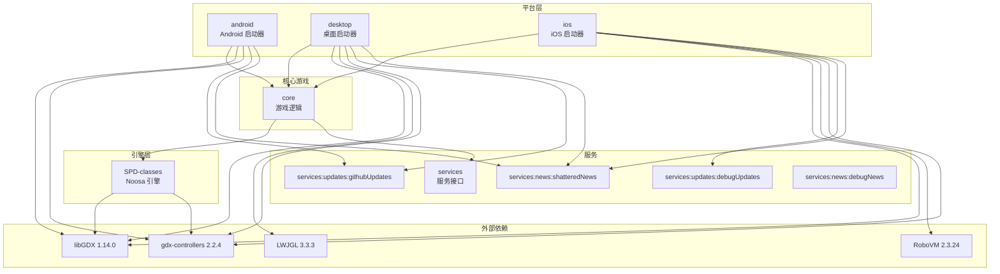
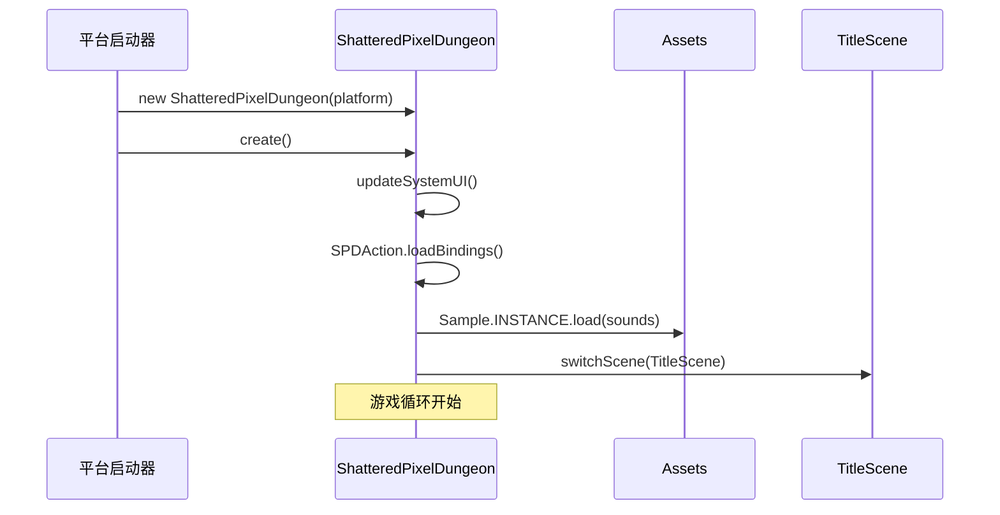
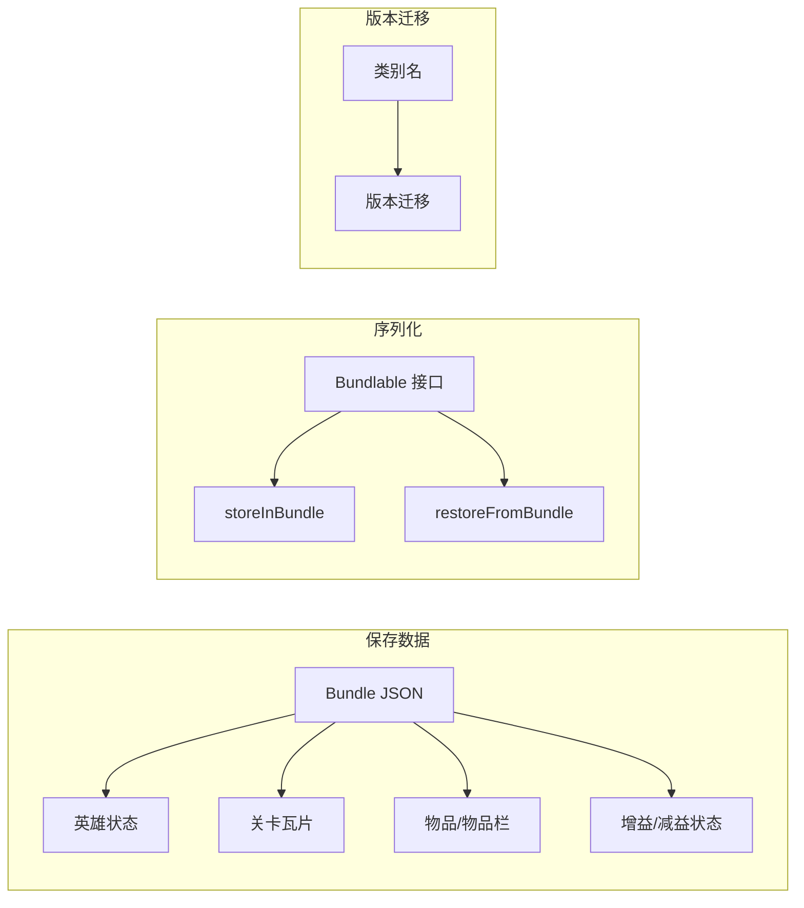

# Shattered Pixel Dungeon - 架构概述

## 执行摘要

Shattered Pixel Dungeon 是一款使用 Java 11+ 和 libGDX 游戏框架构建的传统 Roguelike 地牢爬行游戏。该架构遵循模块化设计，在平台特定代码和共享游戏逻辑之间有清晰的分离。

**版本**: 3.3.8 (Build 896)  
**许可证**: GNU GPL v3  
**目标平台**: Android、iOS、桌面（Windows/macOS/Linux）

---

## 模块架构

### 模块依赖图



---

## 模块描述

### 1. `/core` - 主要游戏逻辑 (1,187 个 Java 文件)

游戏的核心，包含所有游戏机制、UI 和游戏状态管理。

**职责**:
- 游戏实体（行动者、怪物、英雄、NPC）
- 物品系统（武器、护甲、药剂、卷轴、法杖、神器）
- 关卡生成（构建器、绘画器、房间、陷阱）
- 游戏场景（标题、游戏、关卡间过渡）
- UI 组件和窗口
- 精灵和视觉效果
- 通过 Bundle 序列化的保存/加载系统
- 本地化（messages 包）

**关键入口点**: `com.shatteredpixel.shatteredpixeldungeon.ShatteredPixelDungeon`

### 2. `/SPD-classes` - Noosa 渲染引擎 (80 个 Java 文件)

基于 libGDX 构建的自定义游戏引擎，为像素艺术渲染提供 Noosa 框架。

**包结构**:
| 包 | 用途 |
|---------|---------|
| `noosa` | 核心场景图、视觉组件 |
| `noosa.audio` | 音乐和音效管理 |
| `noosa.particles` | 粒子系统 |
| `noosa.tweeners` | 动画缓动 |
| `noosa.ui` | 基础 UI 组件 |
| `glwrap` | OpenGL 包装器 |
| `gltextures` | 纹理管理 |
| `glscripts` | GL 着色器脚本 |
| `input` | 输入处理（键盘、指针、控制器） |
| `utils` | 工具（Bundle、路径查找、随机等） |

**关键类**: `Game`, `Scene`, `Camera`, `Group`, `Gizmo`

### 3. `/android` - Android 平台启动器

使用 libGDX Android 后端的 Android 特定实现。

**配置**:
- 最低 SDK: 21 (Android 5.0)
- 目标 SDK: 36 (Android 15)
- 支持 ARM、ARM64、x86、x86_64 架构
- 使用 R8 进行发布构建（代码压缩/混淆）

**构建变体**:
- `debug`: 使用 debugUpdates/debugNews 服务
- `release`: 使用 githubUpdates/shatteredNews 服务

### 4. `/desktop` - 桌面平台启动器

使用 LWJGL 3 后端的跨平台桌面构建。

**支持平台**:
- Windows 10+ (通过 JDK 17 jpackage)
- macOS 12+ (通过 JDK 17 jpackage)
- Linux glibc 2.17+ (通过 JDK 17 jpackage)

**依赖**:
- libGDX LWJGL3 后端
- LWJGL tinyfd (崩溃对话框显示)
- Beryx runtime 插件 (原生打包)

### 5. `/ios` - iOS 平台启动器

使用 RoboVM 编译器的 iOS 实现。

**配置**:
- RoboVM 2.3.24 用于 AOT 编译
- MetalAngle 后端 (gdx-backend-robovm-metalangle 1.13.1)
- 支持 iOS 设备和模拟器

### 6. `/services` - 新闻和更新服务

用于游戏新闻和更新检查的服务接口。

**子模块**:
| 模块 | 用途 |
|--------|---------|
| `services:updates:githubUpdates` | 生产更新检查器（GitHub 发布）
| `services:updates:debugUpdates` | 调试/本地更新检查
| `services:news:shatteredNews` | 生产新闻源
| `services:news:debugNews` | 调试新闻源 |

---

## 核心包结构

```
com.shatteredpixel.shatteredpixeldungeon/
├── actors/                 # 游戏实体和 AI
│   ├── blobs/             # 区域效果（气体、火焰等）
│   ├── buffs/             # 状态效果和附魔
│   ├── hero/              # 玩家角色
│   │   ├── abilities/     # 英雄职业能力
│   │   │   ├── cleric/    # 牧师能力
│   │   │   ├── duelist/   # 决斗者能力
│   │   │   ├── huntress/  # 女猎手能力
│   │   │   ├── mage/      # 法师能力
│   │   │   ├── rogue/     # 盗贼能力
│   │   │   └── warrior/   # 战士能力
│   │   └── spells/        # 牧师法术
│   └── mobs/              # 敌人 AI 和 NPC
│       └── npcs/          # 非玩家角色
├── effects/               # 视觉效果
│   └── particles/         # 粒子效果
├── items/                 # 可收集物品
│   ├── armor/             # 带刻印/诅咒的护甲
│   ├── artifacts/         # 带能力的独特物品
│   ├── bags/              # 物品栏容器
│   ├── bombs/             # 爆炸物品
│   ├── food/              # 可消耗食物
│   ├── journal/           # 日记物品
│   ├── keys/              # 地牢钥匙
│   ├── potions/           # 药剂、酿造、灵药
│   ├── scrolls/           # 卷轴和法术
│   ├── wands/             # 魔法法杖
│   └── rings/             # 配饰戒指
├── levels/                # 地牢生成
│   ├── builders/          # 关卡布局算法
│   ├── painters/          # 房间装饰
│   ├── rooms/             # 房间模板
│   └── traps/             # 地板陷阱
├── scenes/                # 游戏屏幕
├── sprites/               # 角色/物品精灵
├── ui/                    # UI 组件 (45+ 类)
├── windows/               # 对话框窗口 (50+ 类)
├── mechanics/             # 游戏机制
├── journal/               # 游戏内日记
├── messages/              # 本地化系统
├── plants/                # 地牢植物
├── tiles/                 # 瓦片渲染
├── dungeon/               # 地牢管理
├── statistics/            # 游戏统计
├── challenges/            # 挑战模式
└── badges/                # 成就系统
```

---

## 关键架构类

### 核心游戏循环

| 类 | 包 | 职责 |
|-------|---------|----------------|
| `ShatteredPixelDungeon` | root | 主入口点，扩展 `noosa.Game` |
| `Dungeon` | dungeon | 游戏状态单例（英雄、关卡、深度、金币）
| `Actor` | actors | 使用优先级队列的回合制调度器 |
| `Level` | levels | 地牢楼层表示（瓦片、怪物、物品） |

### 实体层次结构

```
Actor (抽象，可调度)
├── Char (抽象，带生命值/位置的角色)
│   ├── Hero (玩家角色)
│   └── Mob (抽象，AI 控制)
│       └── NPCs (友好角色)
└── Blob (区域效果，无生命值)
```

### 角色系统

| 类 | 用途 |
|-------|---------|
| `Char` | 带有生命值、位置、增益/减益状态、对齐方式的基础角色 |
| `Hero` | 带有职业、子职业、天赋、物品栏的玩家 |
| `Mob` | 带有状态的 AI 控制：SLEEPING（睡眠）、HUNTING（狩猎）、WANDERING（游荡）、FLEEING（逃跑） |
| `Buff` | 状态效果（中毒、火焰、再生等） |

### 物品系统

| 类 | 用途 |
|-------|---------|
| `Item` | 带有等级、诅咒状态、可堆叠的基础可收集物品 |
| `Generator` | 随机物品创建工厂 |
| `KindOfWeapon` | 所有武器的基础 |
| `Armor` | 带有刻印（附魔）和诅咒的护甲 |
| `Wand` | 带有充能的魔法法杖 |
| `Ring` | 被动效果配饰 |

### 关卡生成

| 类 | 用途 |
|-------|---------|
| `Builder` | 关卡布局的策略模式 |
| `Painter` | 用地形装饰房间 |
| `Room` | 房间模板（标准、特殊、首领） |
| `Trap` | 地板陷阱 |

### 序列化

| 类 | 用途 |
|-------|---------|
| `Bundle` | 基于 JSON 的序列化容器 |
| `Bundlable` | 可序列化对象的接口 |
| `Bundle` | 处理保存兼容性的版本迁移 |

---

## 设计模式

### 1. 单例模式
**用途**: 全局访问共享状态

**示例**:
- `Dungeon` - 游戏状态管理
- `Music.INSTANCE` - 音频播放
- `Sample.INSTANCE` - 音效
- `Badges` - 成就追踪

```java
// 使用模式
public class Dungeon {
    public static Hero hero;
    public static Level level;
    public static int depth;
    public static int gold;
    // 全局游戏状态
}
```

### 2. 行动者调度器模式
**用途**: 基于回合的游戏循环与优先级队列

**实现**:
```java
// 优先级顺序（越高先执行）
// VFX > HERO > BLOB > MOB > BUFF

public class Actor {
    private static final HashSet<Actor> all = new HashSet<>();
    private static final PriorityQueue<Actor> queue = new PriorityQueue<>();
    
    protected abstract boolean act();  // 行动者回合时调用
    
    public static void process() {
        Actor current = queue.poll();
        if (current != null) {
            current.act();
            queue.add(current);  // 用新时间重新添加
        }
    }
}
```

### 3. Bundle 序列化模式
**用途**: 带版本迁移的游戏状态保存/加载

**实现**:
```java
public interface Bundlable {
    void restoreFromBundle(Bundle bundle);
    void storeInBundle(Bundle bundle);
}

// 用于向后兼容的版本别名
Bundle.addAlias(NewKey.class, "com.example.OldKey");
```

### 4. 工厂模式
**用途**: 动态物品/敌人创建

**示例**:
- `Generator` - 按类别创建物品，带有加权概率
- `Mob` 工厂方法用于生成敌人

```java
public class Generator {
    public static Item random(Category cat) {
        // 从类别中加权随机选择
        return createItem(classes[randomIndex]);
    }
}
```

### 5. 策略模式
**用途**: 可交换的 AI 行为

**实现** (Mob AI 状态):
```java
public class Mob extends Char {
    protected enum State { SLEEPING, HUNTING, WANDERING, FLEEING }
    
    protected void actSleeping() { /* ... */ }
    protected void actHunting() { /* ... */ }
    protected void actWandering() { /* ... */ }
    protected void actFleeing() { /* ... */ }
}
```

### 6. 构建器模式
**用途**: 关卡生成组合

**实现**:
```java
public abstract class Builder {
    public abstract boolean build(Level level);
}

// 多个构建器组合
RegularBuilder -> SpecialRoomBuilder -> BossBuilder
```

### 7. 组合模式
**用途**: 场景图层次结构

**实现**:
```java
// Noosa 引擎场景图
Group extends Gizmo {
    ArrayList<Gizmo> children;
    // 可以包含 Groups 或单独的 Gizmos
}

// 使用
Scene.add(new Group()
    .add(new Image())
    .add(new Button())
);
```

### 8. 观察者模式
**用途**: 事件处理

**实现**:
```java
public class Signal<T> {
    private List<Listener<T>> listeners = new ArrayList<>();
    
    public interface Listener<T> {
        boolean onSignal(T signal);
    }
    
    public void dispatch(T signal) {
        for (Listener<T> l : listeners) {
            if (l.onSignal(signal)) break;
        }
    }
}

// 使用
Actor.add(sprite);
Dungeon.hero.sprite.showDamage(damage);
```

### 9. 装饰器模式
**用途**: 动态修改物品行为

**示例**:
- 武器附魔 (`Enchantment` 子类)
- 护甲刻印 (`Glyph` 子类)
- 戒指效果 (可叠加修正)

```java
public abstract class Weapon extends KindOfWeapon {
    public Enchantment enchantment;  // 装饰器
    
    public int damageRoll(Char owner) {
        int dmg = super.damageRoll(owner);
        if (enchantment != null) {
            dmg = enchantment.proc(this, owner, enemy, dmg);
        }
        return dmg;
    }
}
```

### 10. 状态模式
**用途**: 内部状态变化的行为

**示例**:
- `Hero` 能力 (激活、冷却、禁用)
- `Buff` 状态 (应用、分离、过期)
- `Item` 状态 (被诅咒、已识别、已装备)

---

## 入口点

### 桌面入口
```
com.shatteredpixel.shatteredpixeldungeon.desktop.DesktopLauncher
```
- 初始化 LWJGL3 后端
- 设置显示和输入
- 创建带平台支持的 `ShatteredPixelDungeon` 实例

### Android 入口
```
com.shatteredpixel.shatteredpixeldungeon.android.AndroidLauncher
```
- 扩展 `AndroidApplication`
- 初始化 libGDX Android 后端
- 处理 Android 生命周期

### iOS 入口
```
com.shatteredpixel.shatteredpixeldungeon.ios.IOSLauncher
```
- RoboVM 编译的入口点
- 初始化 MetalAngle 后端

### 游戏初始化流程



---

## 外部依赖

### libGDX 框架 (v1.14.0)
核心游戏框架提供：
- 跨平台抽象
- OpenGL 渲染
- 音频系统
- 输入处理
- 资产管理

**使用的模块**:
- `gdx-core` - 核心框架
- `gdx-freetype` - TrueType 字体渲染
- `gdx-backend-lwjgl3` - 桌面后端
- `gdx-backend-android` - Android 后端
- `gdx-backend-robovm-metalangle` - iOS 后端

### gdx-controllers (v2.2.4)
游戏手柄/控制器支持：
- 统一控制器 API
- 跨平台输入映射
- 按钮/轴抽象

### RoboVM (v2.3.24)
iOS 编译：
- AOT Java 到原生编译
- Cocoa Touch 绑定
- iOS 应用打包

### LWJGL 3 (v3.3.3)
桌面原生绑定：
- OpenGL 上下文管理
- 窗口管理
- 输入处理
- `tinyfd` 用于崩溃对话框

### org.json (v20170516)
JSON 解析：
- 用于旧版本兼容
- Bundle 序列化格式

---

## 保存系统架构



**支持的保存版本**: v2.5.4+ (旧保存被忽略)

---

## 本地化系统

**位置**: `core/src/main/java/com/shatteredpixel/shatteredpixeldungeon/messages/`

**支持的语言**:
- 英语、中文（简体/繁体）、韩语、俄语
- 西班牙语、葡萄牙语、法语、德语、日语、波兰语
- 意大利语、土耳其语、越南语、乌克兰语、印尼语
- 捷克语、荷兰语、瑞典语、匈牙利语、芬兰语、希腊语、白俄罗斯语、世界语

**资源格式**: assets 中每个语言的属性文件

---

## 性能考虑

1. **行动者调度**: 优先级队列 O(log n) 插入，对回合制性能至关重要
2. **精灵批处理**: Noosa 使用精灵批处理进行高效渲染
3. **对象池**: 重用粒子、效果的对象以减少 GC 压力
4. **资产流**: 资产的延迟加载，精灵表的纹理图集
5. **保存压缩**: Bundle 数据进行压缩以提高存储效率

---

## 构建配置摘要

| 属性 | 值 |
|----------|-------|
| Java 版本 | 11 |
| libGDX 版本 | 1.14.0 |
| Controllers 版本 | 2.2.4 |
| RoboVM 版本 | 2.3.24 |
| 应用版本 | 3.3.8 |
| 版本代码 | 896 |
| 包 | com.shatteredpixel.shatteredpixeldungeon |

---

## 相关文档

- [Android 构建指南](../../../docs/getting-started-android.md)
- [桌面构建指南](../../../docs/getting-started-desktop.md)
- [iOS 构建指南](../../../docs/getting-started-ios.md)
- [Mod 推荐更改](../../../docs/recommended-changes.md)