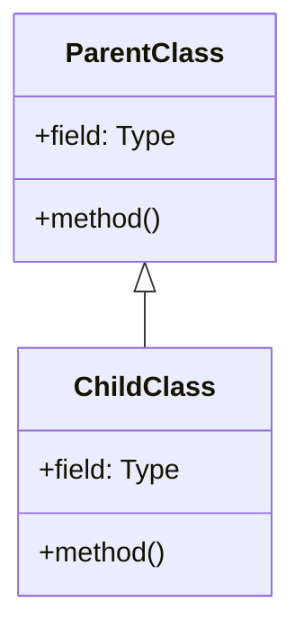

# 文档规范与验收标准

## 一、总则

本文档定义了 ShatteredPixelDungeon / DustedPixelDungeon 源码文档的统一规范，所有文档必须严格遵循。

**核心原则**：
1. 质量高于速度
2. 准确性高于篇幅控制
3. 只以源码为事实来源
4. 禁止臆测、禁止偷懒

---

## 二、14章节结构（强制执行）

每个文件文档必须包含以下章节。如某项不存在，必须显式写"无"或"不适用"。

### 第1章：基本信息

```markdown
## 1. 基本信息

| 属性 | 值 |
|------|-----|
| **文件路径** | [完整路径] |
| **包名** | [包名] |
| **文件类型** | class / abstract class / interface / enum / inner class |
| **继承关系** | extends [父类] implements [接口] |
| **代码行数** | [数字] |
| **所属模块** | core / SPD-classes / desktop / android |
```

### 第2章：文件职责说明

```markdown
## 2. 文件职责说明

### 核心职责
[明确说明该类负责什么]

### 系统定位
[在整体架构中的位置]

### 不负责什么
[明确边界，避免歧义]
```

### 第3章：结构总览

```markdown
## 3. 结构总览

### 主要成员概览
- [字段列表]

### 主要逻辑块概览
- [逻辑块列表]

### 生命周期/调用时机
[如适用]
```

### 第4章：继承与协作关系

```markdown
## 4. 继承与协作关系

### 父类提供的能力
[列出继承的方法和字段]

### 覆写的方法
[列出覆写的方法]

### 实现的接口契约
[列出接口方法]

### 依赖的关键类
[列出依赖]

### 使用者
[列出谁会使用这个类]
```

### 第5章：字段/常量详解

```markdown
## 5. 字段/常量详解

### 静态常量
| 常量名 | 类型 | 值 | 说明 |
|--------|------|-----|------|
| ... | ... | ... | ... |

### 实例字段
| 字段名 | 类型 | 默认值 | 说明 |
|--------|------|--------|------|
| ... | ... | ... | ... |
```

### 第6章：构造与初始化机制

```markdown
## 6. 构造与初始化机制

### 构造器
[构造方法说明]

### 初始化块
[初始化逻辑]

### 初始化注意事项
[特别说明]
```

### 第7章：方法详解（必须覆盖全部方法）

每个方法必须包含：
- 方法签名
- 可见性
- 是否覆写/实现接口
- 方法职责
- 参数说明
- 返回值说明
- 前置条件
- 副作用
- 核心实现逻辑
- 边界情况

```markdown
## 7. 方法详解

### [methodName]()

**可见性**：public / protected / private / package-private

**是否覆写**：是/否，覆写自 [父类/接口]

**方法职责**：[说明]

**参数**：
- `[param]` ([类型])：[说明]

**返回值**：[类型]，[说明]

**前置条件**：[如有]

**副作用**：[如有]

**核心实现逻辑**：
[描述或代码片段]

**边界情况**：[说明]
```

### 第8章：对外暴露能力

```markdown
## 8. 对外暴露能力

### 显式 API
[公开方法列表]

### 内部辅助方法
[不应被外部依赖的方法]

### 扩展入口
[覆写点说明]
```

### 第9章：运行机制与调用链

```markdown
## 9. 运行机制与调用链

### 创建时机
[何时被创建]

### 调用者
[谁会调用]

### 被调用者
[它会调用谁]

### 系统流程位置
[在整体流程中的位置]
```

### 第10章：资源、配置与国际化关联

```markdown
## 10. 资源、配置与国际化关联

### 引用的 messages 文案
| 键名 | 中文翻译 | 用途 |
|------|---------|------|
| ... | ... | ... |

### 依赖的资源
[纹理/图标/音效等]

### 中文翻译来源
[标注来自哪个 *_zh.properties 文件]
```

### 第11章：使用示例

```markdown
## 11. 使用示例

### 基本用法
```java
// 必须是真实可用的代码
```

### 扩展示例
[如适用]
```

### 第12章：开发注意事项

```markdown
## 12. 开发注意事项

### 状态依赖
[说明]

### 生命周期耦合
[说明]

### 常见陷阱
[说明]
```

### 第13章：修改建议与扩展点

```markdown
## 13. 修改建议与扩展点

### 适合扩展的位置
[说明]

### 不建议修改的位置
[说明]

### 重构建议
[如有]
```

### 第14章：事实核查清单

```markdown
## 14. 事实核查清单

- [ ] 是否已覆盖全部字段
- [ ] 是否已覆盖全部方法
- [ ] 是否已检查继承链与覆写关系
- [ ] 是否已核对官方中文翻译
- [ ] 是否存在任何推测性表述
- [ ] 示例代码是否真实可用
- [ ] 是否遗漏资源/配置/本地化关联
- [ ] 是否明确说明了注意事项与扩展点
```

---

## 三、翻译规则（强制执行）

### 3.1 官方翻译来源

所有中文名称必须严格以以下文件为唯一翻译基准：
```
core/src/main/assets/messages/*_zh.properties
```

### 3.2 翻译处理流程

1. **优先查找**：在 *_zh.properties 文件中搜索对应的键
2. **严格复用**：找到后必须完全使用官方翻译，不得修改
3. **保留原文**：如未找到，保留英文原文
4. **谨慎翻译**：只有在确定适合翻译时才给出中文释义，并注明"项目内未找到官方对应译名"

### 3.3 禁止行为

| 禁止行为 | 说明 |
|----------|------|
| 望文生义翻译 | 如 Adrenaline 不能直接译为"激素涌动"，官方译名为"激素涌动" |
| 自创译名 | 必须使用项目既有术语 |
| 同义替换 | 不得用近义词替换官方翻译 |
| 强行翻译 | 应保留英文的地方必须保留英文 |

---

## 四、事实来源约束（最高优先级）

### 4.1 可作为事实来源的内容

- 当前文件源码
- 明确可见的继承关系
- 接口定义
- 直接引用关系
- 可确认的调用关系
- 同模块/同目录中可直接定位到的关联实现
- 项目现有官方翻译资源

### 4.2 禁止作为事实来源的内容

- 类名/变量名的字面含义
- 游戏经验或常识
- 个人理解或推测
- 外部资料（除非明确标注为参考）

### 4.3 不确定信息的处理

如无法从源码确认，只能使用以下措辞：
- "从命名推测……"
- "从调用场景看……"
- "源码中未直接体现，需结合上层逻辑确认……"
- "当前文件本身未实现该效果，可能由外部逻辑读取该状态后生效"

---

## 五、Markdown 格式规范

### 5.1 标题层级

```markdown
# 文件/类名称文档     ← 一级标题，仅用于文档标题
## 1. 基本信息         ← 二级标题，用于章节
### 字段详解           ← 三级标题，用于子章节
```

### 5.2 表格格式

```markdown
| 列1 | 列2 | 列3 |
|-----|-----|-----|
| 内容 | 内容 | 内容 |
```

### 5.3 代码块

使用带语言标记的代码块：
```markdown
```java
// Java 代码
```

```mermaid
// 流程图
```
```

### 5.4 类关系图

统一使用 mermaid classDiagram 语法：



---

## 六、验收标准

### 6.1 必须满足的条件

| 条件 | 说明 |
|------|------|
| 章节完整 | 14个章节全部存在 |
| 字段全覆盖 | 所有字段都有说明 |
| 方法全覆盖 | 所有方法（包括private）都有说明 |
| 翻译正确 | 中文术语来自官方 *_zh.properties |
| 无臆测 | 没有把推测写成事实 |
| 示例真实 | 代码示例可以实际运行 |
| 格式正确 | Markdown语法正确 |

### 6.2 质量分级

| 等级 | 标准 |
|------|------|
| A+ | 完美，可作为参考模板 |
| A | 高质量，仅有微小瑕疵 |
| B | 良好，需要少量补充 |
| C | 及格，需要显著改进 |
| D | 不合格，需要重写 |

---

## 七、检查清单

在提交文档前，必须逐项检查：

- [ ] 14个章节全部存在
- [ ] 所有字段已覆盖
- [ ] 所有方法已覆盖（包括 private/protected）
- [ ] 继承关系已说明
- [ ] 中文翻译来自官方文件
- [ ] 没有推测性内容
- [ ] 代码示例真实可用
- [ ] Markdown 格式正确
- [ ] mermaid 图表正确渲染
- [ ] 消息键已列出（如有）

---

## 八、术语对照表

参考 `_zh.properties` 术语词典文档。

### 常用术语

| 英文 | 中文 | 来源 |
|------|------|------|
| Buff | Buff（保留英文） | - |
| Debuff | Debuff（保留英文） | - |
| Hero | 英雄 | actors |
| Mob | 怪物 | - |
| Level | 关卡 | levels |
| Item | 物品 | items |
| Weapon | 武器 | items |
| Armor | 护甲 | items |
| Potion | 药剂 | items |
| Scroll | 卷轴 | items |
| Wand | 法杖 | items |
| Ring | 戒指 | items |
| Artifact | 神器 | items |
| Seed | 种子 | plants |
| Trap | 陷阱 | levels |