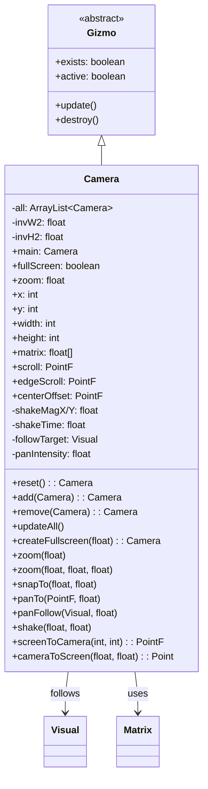

# Camera 类文档

## 1. 基本信息

| 属性 | 值 |
|------|-----|
| 文件路径 | SPD-classes/src/main/java/com/watabou/noosa/Camera.java |
| 包名 | com.watabou.noosa |
| 类类型 | class |
| 继承关系 | extends Gizmo |
| 代码行数 | 321 行 |
| 许可证 | GNU GPL v3 |

## 2. 类职责说明

`Camera` 是游戏相机系统，负责：

1. **视图变换** - 将世界坐标转换为屏幕坐标
2. **缩放控制** - 支持动态缩放和平滑缩放过渡
3. **平移跟随** - 支持平滑平移和跟随目标
4. **震动效果** - 提供相机震动特效
5. **多相机管理** - 支持多个相机同时存在

## 4. 继承与协作关系



## 静态字段表

| 字段名 | 类型 | 默认值 | 说明 |
|--------|------|--------|------|
| all | ArrayList<Camera> | new ArrayList() | 所有活动相机列表 |
| invW2 | float | - | 2/屏幕宽度的倒数（用于矩阵计算） |
| invH2 | float | - | 2/屏幕高度的倒数 |
| main | Camera | null | 主相机引用 |

## 实例字段表

| 字段名 | 类型 | 默认值 | 说明 |
|--------|------|--------|------|
| fullScreen | boolean | false | 是否为全屏相机 |
| zoom | float | - | 缩放倍率 |
| x | int | - | 屏幕上的X位置（像素） |
| y | int | - | 屏幕上的Y位置（像素） |
| width | int | - | 相机视野宽度（世界单位） |
| height | int | - | 相机视野高度（世界单位） |
| screenWidth | int | - | 屏幕像素宽度 |
| screenHeight | int | - | 屏幕像素高度 |
| matrix | float[] | - | 变换矩阵（4x4） |
| edgeScroll | PointF | - | 边缘滚动偏移 |
| scroll | PointF | - | 当前滚动位置 |
| centerOffset | PointF | - | 中心偏移量 |
| shakeMagX | float | 10f | X轴震动幅度 |
| shakeMagY | float | 10f | Y轴震动幅度 |
| shakeTime | float | 0f | 剩余震动时间 |
| shakeDuration | float | 1f | 震动总时长 |
| shakeX | float | - | 当前X轴震动偏移 |
| shakeY | float | - | 当前Y轴震动偏移 |
| followTarget | Visual | null | 跟随目标 |
| panTarget | PointF | - | 平移目标位置 |
| panIntensity | float | 0f | 平移强度 |
| followDeadzone | float | 0f | 跟随死区（百分比） |

## 7. 方法详解

### reset()

**签名**: `public static Camera reset()`

**功能**: 重置相机系统，创建默认全屏相机。

**返回值**: `Camera` - 新创建的主相机

### reset(Camera newCamera)

**签名**: `public static synchronized Camera reset(Camera newCamera)`

**功能**: 重置相机系统，使用指定相机作为主相机。

**参数**:
- `newCamera`: Camera - 新的主相机

**返回值**: `Camera` - 主相机

**实现逻辑**:
```java
// 第70-82行：
invW2 = 2f / Game.width;  // 计算逆宽度
invH2 = 2f / Game.height; // 计算逆高度

// 销毁所有现有相机
for (Camera c : all) {
    c.destroy();
}
all.clear();

// 设置新主相机
return main = add(newCamera);
```

### add(Camera camera)

**签名**: `public static synchronized Camera add(Camera camera)`

**功能**: 添加相机到活动列表。

**返回值**: `Camera` - 添加的相机

### remove(Camera camera)

**签名**: `public static synchronized Camera remove(Camera camera)`

**功能**: 从活动列表移除相机。

**返回值**: `Camera` - 移除的相机

### updateAll()

**签名**: `public static synchronized void updateAll()`

**功能**: 更新所有活动相机。

**实现逻辑**:
```java
// 第94-102行：
for (Camera c : all) {
    if (c != null && c.exists && c.active) {
        c.update();
    }
}
```

### createFullscreen(float zoom)

**签名**: `public static Camera createFullscreen(float zoom)`

**功能**: 创建全屏相机。

**参数**:
- `zoom`: float - 缩放倍率

**返回值**: `Camera` - 新创建的相机

### 构造函数 Camera(int x, int y, int width, int height, float zoom)

**签名**: `public Camera(int x, int y, int width, int height, float zoom)`

**功能**: 创建相机实例。

**参数**:
- `x`, `y`: int - 屏幕位置
- `width`, `height`: int - 视野大小
- `zoom`: float - 缩放倍率

### zoom(float value)

**签名**: `public synchronized void zoom(float value)`

**功能**: 缩放到指定倍率（以视野中心为基准）。

### zoom(float value, float fx, float fy)

**签名**: `public synchronized void zoom(float value, float fx, float fy)`

**功能**: 缩放到指定倍率（以指定点为基准）。

**参数**:
- `value`: float - 新缩放倍率
- `fx`, `fy`: float - 缩放中心点

### update()

**签名**: `@Override public synchronized void update()`

**功能**: 每帧更新相机状态。

**实现逻辑**:

```
第174-226行：更新流程
├─ 第180-187行：处理跟随目标
│  └─ 更新panTarget为目标中心位置
├─ 第189-214行：处理平移
│  ├─ 计算到目标的距离
│  ├─ 应用死区
│  └─ 按intensity移动
├─ 第216-223行：处理震动
│  ├─ 随时间衰减
│  └─ 生成随机偏移
└─ 第225行：更新变换矩阵
```

### snapTo(float x, float y)

**签名**: `public synchronized void snapTo(float x, float y)`

**功能**: 立即移动相机到指定位置（无过渡）。

### panTo(PointF dst, float intensity)

**签名**: `public synchronized void panTo(PointF dst, float intensity)`

**功能**: 平滑移动到目标位置。

**参数**:
- `dst`: PointF - 目标位置
- `intensity`: float - 平移强度（越大越快）

### panFollow(Visual target, float intensity)

**签名**: `public synchronized void panFollow(Visual target, float intensity)`

**功能**: 持续跟随目标。

**参数**:
- `target`: Visual - 跟随目标
- `intensity`: float - 跟随强度

### shake(float magnitude, float duration)

**签名**: `public synchronized void shake(float magnitude, float duration)`

**功能**: 触发相机震动。

**参数**:
- `magnitude`: float - 震动幅度
- `duration`: float - 震动时长（秒）

### screenToCamera(int x, int y)

**签名**: `public PointF screenToCamera(int x, int y)`

**功能**: 将屏幕坐标转换为世界坐标。

**返回值**: `PointF` - 世界坐标

### cameraToScreen(float x, float y)

**签名**: `public Point cameraToScreen(float x, float y)`

**功能**: 将世界坐标转换为屏幕坐标。

**返回值**: `Point` - 屏幕坐标

## 11. 使用示例

### 基础相机操作

```java
// 创建全屏相机
Camera cam = Camera.createFullscreen(2f);

// 缩放
cam.zoom(1.5f);

// 立即移动到位置
cam.snapTo(100, 100);

// 平滑移动
cam.panTo(new PointF(200, 200), 5f);
```

### 跟随英雄

```java
// 在游戏场景中
Camera.main.panFollow(heroSprite, 4f);

// 设置跟随死区（中心50%不触发移动）
Camera.main.setFollowDeadzone(0.5f);
```

### 震动效果

```java
// 受到伤害时震动
Camera.main.shake(10f, 0.5f);  // 幅度10像素，持续0.5秒

// 大爆炸震动
Camera.main.shake(30f, 1f);    // 幅度30像素，持续1秒
```

### 坐标转换

```java
// 鼠标点击位置转世界坐标
PointF worldPos = Camera.main.screenToCamera(mouseX, mouseY);

// 世界位置转屏幕坐标
Point screenPos = Camera.main.cameraToScreen(worldX, worldY);
```

## 注意事项

1. **线程安全** - 关键方法使用synchronized保证线程安全
2. **缩放基准** - zoom以视野中心或指定点为基准
3. **平移强度** - intensity表示1秒内移动的比例，值越大越快
4. **震动衰减** - 震动幅度随时间线性衰减
5. **多相机** - 可以同时存在多个相机（如UI相机和游戏相机）

## 最佳实践

### 响应式相机设置

```java
@Override
public void resize(int width, int height) {
    super.resize(width, height);
    
    // 重新创建全屏相机
    Camera.reset(Camera.createFullscreen(
        Camera.main.zoom
    ));
}
```

### 战斗震动效果

```java
public void onDamageReceived(int damage) {
    // 根据伤害调整震动强度
    float magnitude = Math.min(20f, damage * 0.5f);
    float duration = Math.min(0.8f, damage * 0.02f);
    Camera.main.shake(magnitude, duration);
}
```

## 相关文件

| 文件 | 说明 |
|------|------|
| Gizmo.java | 父类，游戏对象基类 |
| Matrix.java | 矩阵运算工具 |
| Visual.java | 可视对象（跟随目标） |
| PointF.java | 浮点坐标 |
| Point.java | 整数坐标 |
| Game.java | 游戏主类 |
| Scene.java | 场景基类 |