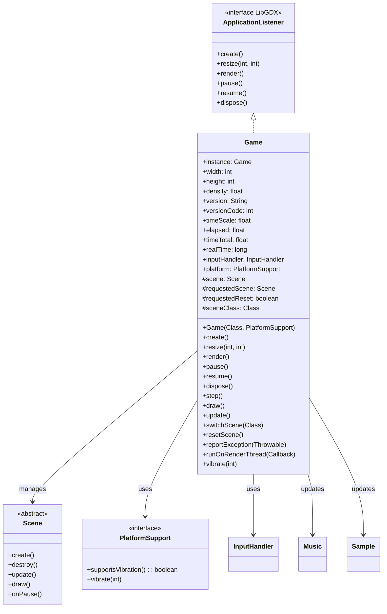

# Game 类文档

## 1. 基本信息

| 属性 | 值 |
|------|-----|
| 文件路径 | SPD-classes/src/main/java/com/watabou/noosa/Game.java |
| 包名 | com.watabou.noosa |
| 类类型 | class |
| 继承关系 | implements ApplicationListener (LibGDX) |
| 代码行数 | 326 行 |
| 许可证 | GNU GPL v3 |

## 2. 类职责说明

`Game` 是游戏引擎的核心类，负责：

1. **游戏生命周期管理** - 实现 LibGDX 的 ApplicationListener 接口，处理创建、暂停、恢复、销毁等生命周期事件
2. **场景管理** - 管理场景切换、重置和回调机制
3. **游戏循环** - 驱动每帧的更新(update)和绘制(draw)流程
4. **时间管理** - 维护游戏时间、帧时间、时间缩放等时间相关状态
5. **输入处理** - 集成输入处理器和控制器支持
6. **异常报告** - 提供统一的异常日志记录机制
7. **平台抽象** - 通过 PlatformSupport 接口提供跨平台功能

## 4. 继承与协作关系



## 静态字段表

| 字段名 | 类型 | 默认值 | 说明 |
|--------|------|--------|------|
| instance | Game | null | 单例实例，全局访问入口 |
| width | int | 0 | 游戏画面宽度（像素） |
| height | int | 0 | 游戏画面高度（像素） |
| density | float | 1 | 屏幕密度（mdpi=1, hdpi=1.5, xhdpi=2...） |
| version | String | null | 游戏版本字符串 |
| versionCode | int | 0 | 游戏版本代码 |
| timeScale | float | 1f | 时间缩放因子（影响游戏速度） |
| elapsed | float | 0f | 上一帧经过的时间（秒） |
| timeTotal | float | 0f | 游戏总运行时间（秒） |
| realTime | long | 0 | 系统时间戳（毫秒） |
| inputHandler | InputHandler | null | 输入处理器实例 |
| platform | PlatformSupport | null | 平台支持接口实现 |

## 实例字段表

| 字段名 | 类型 | 修饰符 | 说明 |
|--------|------|--------|------|
| scene | Scene | protected | 当前活动场景 |
| requestedScene | Scene | protected | 请求切换到的新场景 |
| requestedReset | boolean | protected | 是否请求场景重置 |
| onChange | SceneChangeCallback | protected | 场景切换回调 |
| sceneClass | Class<? extends Scene> | protected static | 场景类引用 |
| versionContextRef | GLVersion | private | OpenGL上下文版本引用 |
| justResumed | boolean | private | 刚恢复标志 |

## 7. 方法详解

### 构造函数 Game(Class<? extends Scene> c, PlatformSupport platform)

**签名**: `public Game(Class<? extends Scene> c, PlatformSupport platform)`

**功能**: 初始化游戏实例，设置初始场景类和平台支持。

**参数**:
- `c`: Class<? extends Scene> - 初始场景类
- `platform`: PlatformSupport - 平台支持实现

**实现逻辑**:
```java
// 第79-84行：
sceneClass = c;           // 保存初始场景类
instance = this;          // 设置单例引用
this.platform = platform; // 保存平台支持
```

### create()

**签名**: `@Override public void create()`

**功能**: LibGDX生命周期方法，游戏启动时调用一次。

**实现逻辑**:

```
第87-117行：初始化流程
├─ 第88-105行：计算屏幕密度
│  ├─ 获取系统报告的密度
│  ├─ 如果密度为无穷大，假设100PPI
│  └─ 桌面端特殊处理（修复Steam Deck等设备的问题）
├─ 第107-110行：初始化输入系统
│  ├─ 创建InputHandler
│  └─ 如果支持控制器，添加ControllerHandler监听器
├─ 第112-116行：GPU数据刷新
│  ├─ 记录GL版本引用
│  ├─ 设置默认混合模式
│  ├─ 重新加载纹理缓存
│  └─ 重新加载顶点缓冲
```

### resize(int width, int height)

**签名**: `@Override public void resize(int width, int height)`

**功能**: 处理窗口/屏幕尺寸变化。

**参数**:
- `width`: int - 新宽度
- `height`: int - 新高度

**实现逻辑**:
```java
// 第122-143行：
if (width == 0 || height == 0) return;  // 忽略无效尺寸

// 检查GL上下文是否被销毁（Android常见情况）
if (versionContextRef != Gdx.graphics.getGLVersion()) {
    versionContextRef = Gdx.graphics.getGLVersion();
    Blending.useDefault();
    TextureCache.reload();   // 重新加载GPU纹理
    Vertexbuffer.reload();   // 重新加载顶点缓冲
}

// 尺寸变化时重置场景
if (height != Game.height || width != Game.width) {
    Game.width = width;
    Game.height = height;
    resetScene();
}
```

### render()

**签名**: `@Override public void render()`

**功能**: 主渲染循环，每帧调用。

**实现逻辑**:

```
第149-171行：渲染流程
├─ 第152-155行：实例检查
│  └─ 如果实例不匹配（多实例），退出应用
├─ 第157-160行：Android恢复优化
│  └─ 如果刚恢复且是Android，跳过此帧
├─ 第162-166行：清除缓冲区
│  ├─ 重置相机
│  ├─ 禁用裁剪测试
│  └─ 清除颜色缓冲
├─ 第166行：绘制场景
│  └─ 调用draw()
└─ 第170行：更新游戏状态
   └─ 调用step()
```

### pause()

**签名**: `@Override public void pause()`

**功能**: 应用暂停时调用（如切换到后台）。

**实现逻辑**:
```java
// 第174-180行：
if (scene != null) {
    scene.onPause();  // 通知场景暂停
}
Script.reset();  // 重置GL脚本
```

### resume()

**签名**: `@Override public void resume()`

**功能**: 应用恢复时调用。

**实现逻辑**:
```java
// 第183-185行：
justResumed = true;  // 设置刚恢复标志
```

### finish()

**签名**: `public void finish()`

**功能**: 退出应用。

**实现逻辑**:
```java
// 第187-190行：
Gdx.app.exit();  // 调用LibGDX退出
```

### destroy()

**签名**: `public void destroy()`

**功能**: 销毁游戏资源。

**实现逻辑**:
```java
// 第192-201行：
if (scene != null) {
    scene.destroy();  // 销毁当前场景
    scene = null;
}
sceneClass = null;
Music.INSTANCE.stop();    // 停止音乐
Sample.INSTANCE.reset();  // 重置音效
```

### resetScene()

**签名**: `public static void resetScene()`

**功能**: 重置当前场景。

**实现逻辑**:
```java
// 第208-210行：
switchScene(instance.sceneClass);  // 重新创建当前场景类
```

### switchScene(Class<? extends Scene> c)

**签名**: `public static void switchScene(Class<? extends Scene> c)`

**功能**: 切换到新场景（无回调）。

**实现逻辑**:
```java
// 第212-214行：
switchScene(c, null);  // 调用完整版本
```

### switchScene(Class<? extends Scene> c, SceneChangeCallback callback)

**签名**: `public static void switchScene(Class<? extends Scene> c, SceneChangeCallback callback)`

**功能**: 切换到新场景（带回调）。

**参数**:
- `c`: Class<? extends Scene> - 新场景类
- `callback`: SceneChangeCallback - 场景切换回调

**实现逻辑**:
```java
// 第216-220行：
instance.sceneClass = c;          // 设置新场景类
instance.requestedReset = true;   // 标记需要重置
instance.onChange = callback;     // 设置回调
```

### scene()

**签名**: `public static Scene scene()`

**功能**: 获取当前活动场景。

**返回值**: `Scene` - 当前场景

### switchingScene()

**签名**: `public static boolean switchingScene()`

**功能**: 检查是否正在切换场景。

**返回值**: `boolean` - 是否正在切换

### step()

**签名**: `protected void step()`

**功能**: 每帧更新逻辑，处理场景切换。

**实现逻辑**:

```
第230-243行：帧更新逻辑
├─ 第232-239行：处理场景切换请求
│  ├─ 清除请求标志
│  ├─ 通过反射创建新场景实例
│  └─ 如果创建成功，执行场景切换
└─ 第242行：调用update()
```

### draw()

**签名**: `protected void draw()`

**功能**: 绘制当前场景。

**实现逻辑**:
```java
// 第245-247行：
if (scene != null) scene.draw();  // 委托给场景绘制
```

### switchScene()

**签名**: `protected void switchScene()`

**功能**: 执行实际的场景切换。

**实现逻辑**:

```
第249-267行：场景切换流程
├─ 第251行：重置相机
├─ 第253-255行：销毁旧场景
├─ 第257行：清除顶点缓冲
├─ 第258行：设置新场景
├─ 第259-261行：创建新场景
│  ├─ 调用onChange.beforeCreate()
│  ├─ 调用scene.create()
│  └─ 调用onChange.afterCreate()
├─ 第262行：清除回调
└─ 第264-266行：重置时间状态
   ├─ elapsed = 0
   ├─ timeScale = 1
   └─ timeTotal = 0
```

### update()

**签名**: `protected void update()`

**功能**: 每帧更新游戏状态。

**实现逻辑**:

```
第269-283行：更新流程
├─ 第271行：计算帧时间（最大200ms防卡顿）
├─ 第272-273行：更新elapsed和timeTotal
├─ 第275行：更新realTime时间戳
├─ 第277行：处理输入事件
├─ 第279-280行：更新音乐和音效
├─ 第281行：更新场景
└─ 第282行：更新所有相机
```

### reportException(Throwable tr)

**签名**: `public static void reportException(Throwable tr)`

**功能**: 报告异常（全局静态方法）。

**参数**:
- `tr`: Throwable - 异常对象

**实现逻辑**:
```java
// 第285-296行：
if (instance != null && Gdx.app != null) {
    instance.logException(tr);  // 正常日志
} else {
    // 初始化期间的fallback
    StringWriter sw = new StringWriter();
    PrintWriter pw = new PrintWriter(sw);
    tr.printStackTrace(pw);
    pw.flush();
    System.err.println(sw.toString());  // 输出到标准错误
}
```

### logException(Throwable tr)

**签名**: `protected void logException(Throwable tr)`

**功能**: 记录异常到LibGDX日志。

**实现逻辑**:
```java
// 第298-304行：
StringWriter sw = new StringWriter();
PrintWriter pw = new PrintWriter(sw);
tr.printStackTrace(pw);
pw.flush();
Gdx.app.error("GAME", sw.toString());  // LibGDX错误日志
```

### runOnRenderThread(Callback c)

**签名**: `public static void runOnRenderThread(Callback c)`

**功能**: 在渲染线程执行回调。

**参数**:
- `c`: Callback - 要执行的回调

**实现逻辑**:
```java
// 第306-313行：
Gdx.app.postRunnable(new Runnable() {
    @Override
    public void run() {
        c.call();
    }
});
```

### vibrate(int milliseconds)

**签名**: `public static void vibrate(int milliseconds)`

**功能**: 触发设备振动。

**参数**:
- `milliseconds`: int - 振动时长（毫秒）

**实现逻辑**:
```java
// 第315-319行：
if (platform.supportsVibration()) {
    platform.vibrate(milliseconds);  // 通过平台支持实现
}
```

## 内部接口

### SceneChangeCallback

**定义**: 第321-324行

```java
public interface SceneChangeCallback {
    void beforeCreate();  // 场景create()之前调用
    void afterCreate();   // 场景create()之后调用
}
```

**用途**: 在场景切换时执行自定义逻辑。

## 11. 使用示例

### 创建游戏实例

```java
// Android平台
public class AndroidLauncher extends AndroidApplication {
    @Override
    protected void onCreate(Bundle savedInstanceState) {
        super.onCreate(savedInstanceState);
        initialize(new Game(TitleScene.class, new AndroidPlatform(this)));
    }
}

// 桌面平台
public class DesktopLauncher {
    public static void main(String[] args) {
        Lwjgl3ApplicationConfiguration config = new Lwjgl3ApplicationConfiguration();
        new Lwjgl3Application(new Game(TitleScene.class, new DesktopPlatform()), config);
    }
}
```

### 切换场景

```java
// 简单切换
Game.switchScene(GameScene.class);

// 带回调切换
Game.switchScene(GameScene.class, new Game.SceneChangeCallback() {
    @Override
    public void beforeCreate() {
        // 场景创建前的准备工作
        Dungeon.loadGame();
    }
    
    @Override
    public void afterCreate() {
        // 场景创建后的初始化
        GameScene scene = (GameScene) Game.scene();
        scene.updateMap();
    }
});
```

### 时间控制

```java
// 暂停游戏
Game.timeScale = 0f;

// 加速游戏（2倍速）
Game.timeScale = 2f;

// 获取帧时间
float deltaTime = Game.elapsed;

// 获取总游戏时间
float totalTime = Game.timeTotal;
```

### 异常处理

```java
try {
    riskyOperation();
} catch (Exception e) {
    Game.reportException(e);  // 统一报告异常
}
```

### 线程安全操作

```java
// 从后台线程在渲染线程执行操作
new Thread(() -> {
    // 后台计算
    final Result result = calculateResult();
    
    // 在渲染线程更新UI
    Game.runOnRenderThread(() -> {
        updateUI(result);
    });
}).start();
```

## 注意事项

1. **单例模式** - `instance`是静态单例，全局只能有一个Game实例
2. **场景切换** - 切换场景会销毁旧场景，所有状态需保存
3. **GL上下文丢失** - Android上GL上下文可能丢失，resize()会检测并重建
4. **帧时间限制** - 最大200ms/帧防止卡顿后时间跳跃
5. **线程安全** - 游戏逻辑应在渲染线程执行，跨线程使用`runOnRenderThread()`

## 最佳实践

### 创建自定义场景

```java
public class MyScene extends Scene {
    
    @Override
    public void create() {
        super.create();
        // 初始化场景资源
    }
    
    @Override
    public void update() {
        super.update();
        // 更新游戏逻辑
    }
    
    @Override
    public void destroy() {
        // 释放资源
        super.destroy();
    }
}
```

### 平滑场景切换

```java
Game.switchScene(NewScene.class, new Game.SceneChangeCallback() {
    @Override
    public void beforeCreate() {
        // 保存旧场景状态
        saveGameState();
    }
    
    @Override
    public void afterCreate() {
        // 加载新场景数据
        loadNewSceneData();
        // 播放过渡音乐
        Music.INSTANCE.play(Assets.Music.THEME);
    }
});
```

## 相关文件

| 文件 | 说明 |
|------|------|
| Scene.java | 场景基类 |
| InputHandler.java | 输入处理器 |
| PlatformSupport.java | 平台支持接口 |
| Music.java | 音乐管理器 |
| Sample.java | 音效管理器 |
| Camera.java | 相机系统 |
| TextureCache.java | 纹理缓存 |
| NoosaScript.java | 着色器脚本 |