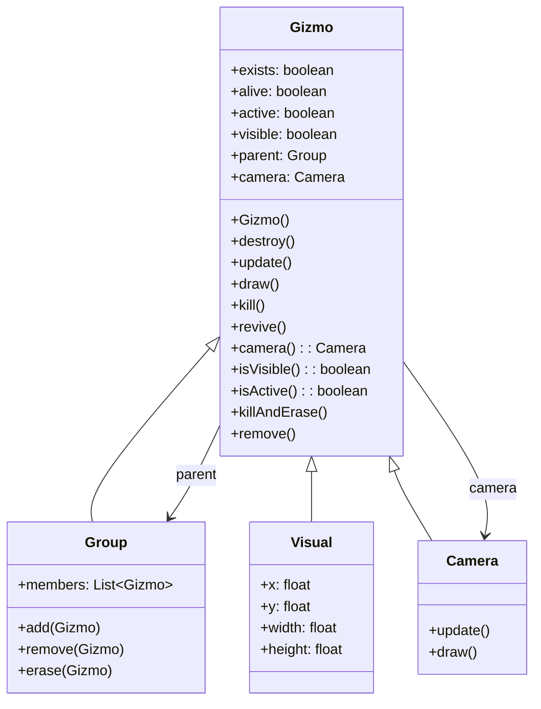

# Gizmo Class Documentation

## 1. 基本信息

| 属性 | 值 |
|------|-----|
| **文件路径** | SPD-classes/src/main/java/com/watabou/noosa/Gizmo.java |
| **包名** | com.watabou.noosa |
| **文件类型** | class |
| **继承关系** | 无（根类） |
| **代码行数** | 101 |
| **所属模块** | SPD-classes |

## 2. 文件职责说明

### 核心职责
Gizmo 类是 noosa 渲染框架中所有对象的基类，提供基础的存在性、活性、激活状态和可见性管理，以及场景图层次结构的基本支持。

`Gizmo` 是Noosa游戏引擎的对象基类，负责：

1. **生命周期管理** - 提供exists、alive、active、visible等状态标志
2. **层次结构** - 支持父子关系的Group结构
3. **更新/绘制** - 定义update()和draw()的基本接口
4. **相机管理** - 提供相机访问的层级查找

## 类关系图



## 实例字段表

| 字段名 | 类型 | 默认值 | 说明 |
|--------|------|--------|------|
| exists | boolean | true | 是否存在（参与绘制） |
| alive | boolean | true | 是否存活（参与更新） |
| active | boolean | true | 是否激活（更新时检查） |
| visible | boolean | true | 是否可见（绘制时检查） |
| parent | Group | null | 父Group引用 |
| camera | Camera | null | 关联的相机 |

### 状态组合说明

| exists | alive | active | visible | 状态说明 |
|--------|-------|--------|---------|----------|
| true | true | true | true | 正常活动 |
| true | true | true | false | 不可见但更新 |
| true | true | false | true | 可见但不更新 |
| false | true | - | - | 不绘制但更新 |
| - | false | - | - | 不更新 |

## 方法详解

### 构造函数 Gizmo()

**签名**: `public Gizmo()`

**功能**: 初始化Gizmo，设置所有状态标志为true。

**实现逻辑**:
```java
// 第35-40行：
exists = true;
alive = true;
active = true;
visible = true;
```

### destroy()

**签名**: `public void destroy()`

**功能**: 销毁Gizmo，清除父引用。

**实现逻辑**:
```java
// 第42-44行：
parent = null;  // 清除父引用，便于GC
```

### update()

**签名**: `public void update()`

**功能**: 每帧更新方法，子类重写以实现逻辑。默认空实现。

### draw()

**签名**: `public void draw()`

**功能**: 每帧绘制方法，子类重写以实现渲染。默认空实现。

### kill()

**签名**: `public void kill()`

**功能**: 杀死Gizmo，设置exists和alive为false。

**实现逻辑**:
```java
// 第52-55行：
alive = false;
exists = false;
```

### revive()

**签名**: `public void revive()`

**功能**: 复活Gizmo，设置exists和alive为true。

**说明**: 不是kill()的完全相反（不会恢复active和visible）。

### camera()

**签名**: `public Camera camera()`

**功能**: 获取关联的相机，支持层级查找。

**返回值**: `Camera` - 相机实例或null

**实现逻辑**:
```java
// 第63-71行：
if (camera != null) {
    return camera;  // 使用自己的相机
} else if (parent != null) {
    return this.camera = parent.camera();  // 向上查找并缓存
} else {
    return null;
}
```

### isVisible()

**签名**: `public boolean isVisible()`

**功能**: 检查是否可见（考虑父级可见性）。

**返回值**: `boolean` - 是否可见

**实现逻辑**:
```java
// 第73-79行：
if (parent == null) {
    return visible;
} else {
    return visible && parent.isVisible();  // 父级不可见则子级也不可见
}
```

### isActive()

**签名**: `public boolean isActive()`

**功能**: 检查是否激活（考虑父级激活状态）。

**返回值**: `boolean` - 是否激活

### killAndErase()

**签名**: `public void killAndErase()`

**功能**: 杀死并从父Group中擦除。

**实现逻辑**:
```java
// 第89-94行：
kill();
if (parent != null) {
    parent.erase(this);  // 从父Group移除但不销毁
}
```

### remove()

**签名**: `public void remove()`

**功能**: 从父Group中移除（会销毁）。

**实现逻辑**:
```java
// 第96-100行：
if (parent != null) {
    parent.remove(this);  // 从父Group移除并销毁
}
```

## 使用示例

### 创建自定义Gizmo

```java
public class MyGizmo extends Gizmo {
    
    private int counter = 0;
    
    @Override
    public void update() {
        super.update();
        counter++;
        if (counter > 100) {
            kill();  // 100帧后自动死亡
        }
    }
    
    @Override
    public void draw() {
        if (!isVisible()) return;
        // 绘制逻辑
    }
}
```

### 状态控制

```java
// 暂停（停止更新但继续绘制）
gizmo.active = false;

// 隐藏（停止绘制但继续更新）
gizmo.visible = false;

// 完全禁用
gizmo.alive = false;
gizmo.exists = false;

// 完全移除
gizmo.killAndErase();  // 或 remove()
```

### 层级结构

```java
Group container = new Group();
Gizmo child = new MyGizmo();
container.add(child);

// child.parent == container
// child.camera() 会向上查找到container的相机

// 移除
container.remove(child);  // 会调用child.destroy()
```

## 子类列表

| 子类 | 功能 |
|------|------|
| Group | 容器，管理多个Gizmo |
| Visual | 可视对象，有位置和尺寸 |
| Camera | 相机系统 |
| Image | 图像显示 |
| MovieClip | 动画剪辑 |
| Text | 文本显示 |
| TouchArea | 触摸区域 |

## 注意事项

1. **状态优先级** - alive控制更新，exists控制绘制
2. **层级可见性** - 父级不可见时子级自动不可见
3. **相机缓存** - camera()方法会缓存查找到的相机
4. **移除vs擦除** - remove()会销毁，erase()不会销毁

## 最佳实践

### 正确的生命周期管理

```java
// 创建和添加
MyGizmo gizmo = new MyGizmo();
group.add(gizmo);

// 暂时禁用
gizmo.active = false;

// 永久移除
gizmo.killAndErase();
// 或者
group.remove(gizmo);
```

### 检查状态后再操作

```java
@Override
public void update() {
    if (!isActive()) return;  // 先检查状态
    // 更新逻辑
}

@Override  
public void draw() {
    if (!isVisible()) return;  // 先检查可见性
    // 绘制逻辑
}
```

## 相关文件

| 文件 | 说明 |
|------|------|
| Group.java | 容器类，管理Gizmo集合 |
| Visual.java | 可视对象基类 |
| Camera.java | 相机系统 |
| Image.java | 图像类 |
| Scene.java | 场景基类 |