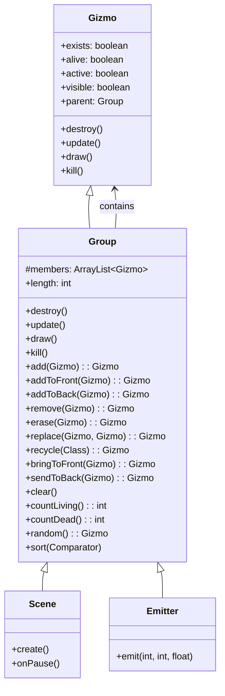

# Group 类文档

## 1. 基本信息

| 属性 | 值 |
|------|-----|
| 文件路径 | SPD-classes/src/main/java/com/watabou/noosa/Group.java |
| 包名 | com.watabou.noosa |
| 类类型 | class |
| 继承关系 | extends Gizmo |
| 代码行数 | 325 行 |
| 许可证 | GNU GPL v3 |

## 2. 类职责说明

`Group` 是Gizmo容器类，负责：

1. **成员管理** - 添加、移除、替换子Gizmo
2. **批量操作** - 批量更新、绘制、销毁所有成员
3. **对象池** - 支持对象回收复用(recycle)
4. **层级控制** - 管理成员的绘制顺序
5. **统计查询** - 统计存活/死亡成员数量

## 4. 继承与协作关系



## 实例字段表

| 字段名 | 类型 | 说明 |
|--------|------|------|
| members | ArrayList<Gizmo> | 成员列表（可能含null） |
| length | int | 成员数量（包含null槽位） |

## 7. 方法详解

### 构造函数 Group()

**签名**: `public Group()`

**功能**: 创建空Group。

**实现逻辑**:
```java
// 第39-42行：
members = new ArrayList<>();
length = 0;
```

### destroy()

**签名**: `@Override public synchronized void destroy()`

**功能**: 销毁Group和所有成员。

**实现逻辑**:
```java
// 第44-59行：
super.destroy();
for (int i = 0; i < length; i++) {
    Gizmo g = members.get(i);
    if (g != null) g.destroy();
}
members.clear();
members = null;
length = 0;
```

### update()

**签名**: `@Override public synchronized void update()`

**功能**: 更新所有存在的活跃成员。

**实现逻辑**:
```java
// 第61-69行：
for (int i = 0; i < length; i++) {
    Gizmo g = members.get(i);
    if (g != null && g.exists && g.active) {
        g.update();
    }
}
```

### draw()

**签名**: `@Override public synchronized void draw()`

**功能**: 绘制所有存在的可见成员。

**实现逻辑**:
```java
// 第71-79行：
for (int i = 0; i < length; i++) {
    Gizmo g = members.get(i);
    if (g != null && g.exists && g.isVisible()) {
        g.draw();
    }
}
```

### kill()

**签名**: `@Override public synchronized void kill()`

**功能**: 杀死Group和所有成员（保留成员但不更新/绘制）。

**实现逻辑**:
```java
// 第81-93行：
for (int i = 0; i < length; i++) {
    Gizmo g = members.get(i);
    if (g != null && g.exists) {
        g.kill();
    }
}
super.kill();
```

### add(Gizmo g)

**签名**: `public synchronized Gizmo add(Gizmo g)`

**功能**: 添加成员到Group末尾。

**参数**:
- `g`: Gizmo - 要添加的成员

**返回值**: `Gizmo` - 添加的成员

**实现逻辑**:
```java
// 第99-122行：
if (g.parent == this) return g;  // 已经在此Group
if (g.parent != null) g.parent.remove(g);  // 从原Group移除

// 尝试填充null槽位
for (int i = 0; i < length; i++) {
    if (members.get(i) == null) {
        members.set(i, g);
        g.parent = this;
        return g;
    }
}

// 添加到末尾
members.add(g);
g.parent = this;
length++;
return g;
```

### addToFront(Gizmo g)

**签名**: `public synchronized Gizmo addToFront(Gizmo g)`

**功能**: 添加成员到前面（最后绘制，显示在最上层）。

### addToBack(Gizmo g)

**签名**: `public synchronized Gizmo addToBack(Gizmo g)`

**功能**: 添加成员到后面（最先绘制，显示在最下层）。

### recycle(Class<? extends Gizmo> c)

**签名**: `public synchronized Gizmo recycle(Class<? extends Gizmo> c)`

**功能**: 回收复用不存在的成员，或创建新成员。

**参数**:
- `c`: Class<? extends Gizmo> - 目标类型

**返回值**: `Gizmo` - 复用或新创建的成员

**实现逻辑**:
```java
// 第177-198行：
Gizmo g = getFirstAvailable(c);
if (g != null) return g;  // 复用存在的

if (c == null) return null;

g = Reflection.newInstance(c);  // 反射创建
if (g != null) return add(g);

return null;
```

### erase(Gizmo g)

**签名**: `public synchronized Gizmo erase(Gizmo g)`

**功能**: 快速移除（用null替换，不减少length）。

**说明**: 比`remove()`快，但留下null槽位。

### remove(Gizmo g)

**签名**: `public synchronized Gizmo remove(Gizmo g)`

**功能**: 真正移除成员（减少length）。

**说明**: 会调用`members.remove()`，开销较大。

### replace(Gizmo oldOne, Gizmo newOne)

**签名**: `public synchronized Gizmo replace(Gizmo oldOne, Gizmo newOne)`

**功能**: 替换成员（保持位置不变）。

### getFirstAvailable(Class<? extends Gizmo> c)

**签名**: `public synchronized Gizmo getFirstAvailable(Class<? extends Gizmo> c)`

**功能**: 获取第一个不存在（可复用）的成员。

### countLiving()

**签名**: `public synchronized int countLiving()`

**功能**: 统计存活的成员数量（exists && alive）。

### countDead()

**签名**: `public synchronized int countDead()`

**功能**: 统计死亡的成员数量（!alive）。

### random()

**签名**: `public synchronized Gizmo random()`

**功能**: 随机获取一个成员。

### clear()

**签名**: `public synchronized void clear()`

**功能**: 清空所有成员。

### bringToFront(Gizmo g)

**签名**: `public synchronized Gizmo bringToFront(Gizmo g)`

**功能**: 将成员移到最前（最后绘制）。

### sendToBack(Gizmo g)

**签名**: `public synchronized Gizmo sendToBack(Gizmo g)`

**功能**: 将成员移到最后（最先绘制）。

### sort(Comparator c)

**签名**: `public synchronized void sort(Comparator c)`

**功能**: 排序成员（仅在未排序时执行）。

## 11. 使用示例

### 基础使用

```java
// 创建Group
Group container = new Group();

// 添加成员
Image img1 = new Image(texture1);
Image img2 = new Image(texture2);
container.add(img1);
container.add(img2);

// 层级控制
container.bringToFront(img1);  // img1显示在img2上面
container.sendToBack(img1);    // img1显示在img2下面

// 移除
container.remove(img1);  // 真正移除
container.erase(img1);   // 快速移除（留下槽位）
```

### 对象池模式

```java
public class BulletPool extends Group {
    
    public Bullet spawn(float x, float y) {
        Bullet b = (Bullet) recycle(Bullet.class);
        if (b != null) {
            b.reset(x, y);
        }
        return b;
    }
}

// 使用
BulletPool pool = new BulletPool();
Bullet b = pool.spawn(100, 100);
```

### 统计和查询

```java
// 获取存活数量
int living = group.countLiving();

// 随机选择
Gizmo randomMember = group.random();

// 查找特定类型
Gizmo available = group.getFirstAvailable(MyGizmo.class);
```

## 绘制顺序说明

成员按索引顺序绘制：
- 索引0最先绘制 → 显示在最下层
- 索引length-1最后绘制 → 显示在最上层

```
addToBack() → 添加到索引0 → 最下层
add() → 添加到末尾 → 最上层
addToFront() → 添加到末尾 → 最上层
bringToFront() → 移到末尾 → 最上层
sendToBack() → 移到索引0 → 最下层
```

## 注意事项

1. **线程安全** - 关键方法使用synchronized
2. **erase vs remove** - erase更快但留下null槽位
3. **回收模式** - recycle()实现对象池，减少GC压力
4. **null处理** - 成员列表可能包含null（被erase的槽位）

## 相关文件

| 文件 | 说明 |
|------|------|
| Gizmo.java | 父类，成员基类 |
| Scene.java | 场景基类，继承Group |
| Emitter.java | 粒子发射器，继承Group |
| Visual.java | 可视对象 |