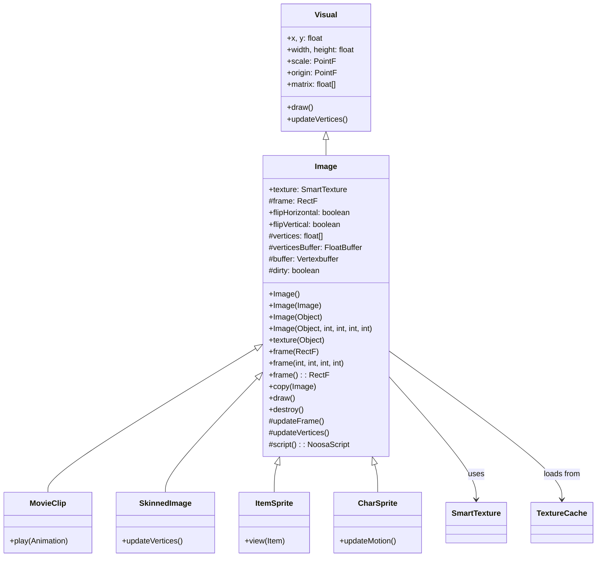

# Image 类文档

## 1. 基本信息

| 属性 | 值 |
|------|-----|
| 文件路径 | SPD-classes/src/main/java/com/watabou/noosa/Image.java |
| 包名 | com.watabou.noosa |
| 类类型 | class |
| 继承关系 | extends Visual |
| 代码行数 | 197 行 |
| 许可证 | GNU GPL v3 |

## 2. 类职责说明

`Image` 是图像显示类，负责：

1. **纹理渲染** - 加载和显示纹理图像
2. **帧裁剪** - 支持从纹理图集(Sprite Sheet)裁剪显示
3. **翻转控制** - 支持水平和垂直翻转
4. **顶点缓冲** - 使用GPU顶点缓冲优化渲染性能

## 4. 继承与协作关系



## 实例字段表

| 字段名 | 类型 | 说明 |
|--------|------|------|
| texture | SmartTexture | 纹理对象 |
| frame | RectF | UV坐标帧（0-1范围） |
| flipHorizontal | boolean | 水平翻转标志 |
| flipVertical | boolean | 垂直翻转标志 |
| vertices | float[] | 顶点数据（16个浮点数） |
| verticesBuffer | FloatBuffer | 顶点缓冲 |
| buffer | Vertexbuffer | GPU顶点缓冲对象 |
| dirty | boolean | 是否需要更新缓冲 |

## 7. 方法详解

### 构造函数

#### Image()

**签名**: `public Image()`

**功能**: 创建空Image。

**实现逻辑**:
```java
// 第47-52行：
super(0, 0, 0, 0);
vertices = new float[16];
verticesBuffer = Quad.create();  // 创建四边形顶点缓冲
```

#### Image(Image src)

**签名**: `public Image(Image src)`

**功能**: 从另一个Image复制创建。

**实现逻辑**:
```java
// 第54-57行：
this();
copy(src);
```

#### Image(Object tx)

**签名**: `public Image(Object tx)`

**功能**: 从纹理资源创建。

**参数**:
- `tx`: Object - 纹理资源（String资源路径或SmartTexture）

#### Image(Object tx, int left, int top, int width, int height)

**签名**: `public Image(Object tx, int left, int top, int width, int height)`

**功能**: 从纹理图集的指定区域创建。

**参数**:
- `tx`: Object - 纹理资源
- `left`, `top`: int - 裁剪起点（像素）
- `width`, `height`: int - 裁剪尺寸（像素）

### texture(Object tx)

**签名**: `public void texture(Object tx)`

**功能**: 设置纹理。

**参数**:
- `tx`: Object - SmartTexture或资源路径

**实现逻辑**:
```java
// 第69-72行：
texture = tx instanceof SmartTexture ? (SmartTexture)tx : TextureCache.get(tx);
frame(new RectF(0, 0, 1, 1));  // 使用整个纹理
```

### frame(RectF frame)

**签名**: `public void frame(RectF frame)`

**功能**: 设置显示帧（UV坐标）。

**参数**:
- `frame`: RectF - UV坐标（0-1范围）

**实现逻辑**:
```java
// 第74-82行：
this.frame = frame;
width = frame.width() * texture.width;   // 计算像素宽度
height = frame.height() * texture.height; // 计算像素高度
updateFrame();
updateVertices();
```

### frame(int left, int top, int width, int height)

**签名**: `public void frame(int left, int top, int width, int height)`

**功能**: 设置显示帧（像素坐标）。

### frame()

**签名**: `public RectF frame()`

**功能**: 获取当前帧。

**返回值**: `RectF` - 当前UV帧

### copy(Image other)

**签名**: `public void copy(Image other)`

**功能**: 复制另一个Image的所有属性。

**参数**:
- `other`: Image - 源Image

**实现逻辑**:
```java
// 第92-106行：
texture = other.texture;
frame = new RectF(other.frame);
width = other.width;
height = other.height;
scale = other.scale;
updateFrame();
updateVertices();
// 复制颜色调制参数
rm = other.rm; gm = other.gm; ...
```

### updateFrame()

**签名**: `protected void updateFrame()`

**功能**: 更新顶点UV坐标（处理翻转）。

**实现逻辑**:
```java
// 第108-135行：
// 根据flipHorizontal设置UV的U坐标
// 根据flipVertical设置UV的V坐标
dirty = true;
```

### updateVertices()

**签名**: `protected void updateVertices()`

**功能**: 更新顶点位置坐标。

**实现逻辑**:
```java
// 第137-152行：
// 设置四个顶点的位置坐标
// 左上(0,0), 右上(width,0), 右下(width,height), 左下(0,height)
dirty = true;
```

### draw()

**签名**: `@Override public void draw()`

**功能**: 绘制图像。

**实现逻辑**:
```java
// 第154-185行：
if (texture == null || (!dirty && buffer == null)) return;

super.draw();  // 更新变换矩阵

// 更新GPU缓冲
if (dirty) {
    verticesBuffer.put(vertices);
    if (buffer == null)
        buffer = new Vertexbuffer(verticesBuffer);
    else
        buffer.updateVertices(verticesBuffer);
    dirty = false;
}

// 绑定纹理和着色器
NoosaScript script = script();
texture.bind();
script.camera(camera());
script.uModel.valueM4(matrix);
script.lighting(rm, gm, bm, am, ra, ga, ba, aa);
script.drawQuad(buffer);
```

### destroy()

**签名**: `@Override public void destroy()`

**功能**: 销毁图像，释放GPU资源。

## 11. 使用示例

### 从资源创建

```java
// 从资源路径创建
Image img = new Image(Assets.Sprites.HERO);

// 从纹理图集裁剪
Image icon = new Image(Assets.Sprites.ITEMS, 16, 0, 16, 16);
```

### 动态修改帧

```java
// 切换动画帧
Image sprite = new Image(Assets.Sprites.HERO);
sprite.frame(0, 0, 16, 16);    // 第1帧
sprite.frame(16, 0, 16, 16);   // 第2帧
```

### 翻转

```java
Image img = new Image(texture);

// 水平翻转
img.flipHorizontal = true;
img.updateFrame();

// 垂直翻转
img.flipVertical = true;
img.updateFrame();
```

### 复制

```java
Image original = new Image(Assets.Sprites.HERO);
Image copy = new Image(original);
```

### 颜色效果

```java
Image img = new Image(texture);

// 半透明
img.alpha(0.5f);

// 着色
img.tint(0xFF0000, 0.5f);  // 红色着色

// 灰度
img.brightness(0.5f);

// 反色
img.invert();
```

## 子类列表

| 子类 | 功能 |
|------|------|
| MovieClip | 帧动画精灵 |
| SkinnedImage | 可拉伸的9-patch图像 |
| ItemSprite | 物品图标 |
| CharSprite | 角色精灵 |
| HeroSprite | 英雄精灵 |
| MobSprite | 怪物精灵 |

## 注意事项

1. **纹理缓存** - 使用TextureCache自动缓存纹理
2. **脏标记** - dirty标志优化GPU更新
3. **帧坐标** - frame()使用UV坐标(0-1)或像素坐标
4. **翻转更新** - 设置flip后需调用updateFrame()

## 相关文件

| 文件 | 说明 |
|------|------|
| Visual.java | 父类 |
| SmartTexture.java | 智能纹理 |
| TextureCache.java | 纹理缓存 |
| NoosaScript.java | 着色器脚本 |
| Quad.java | 四边形顶点工具 |
| Vertexbuffer.java | GPU顶点缓冲 |