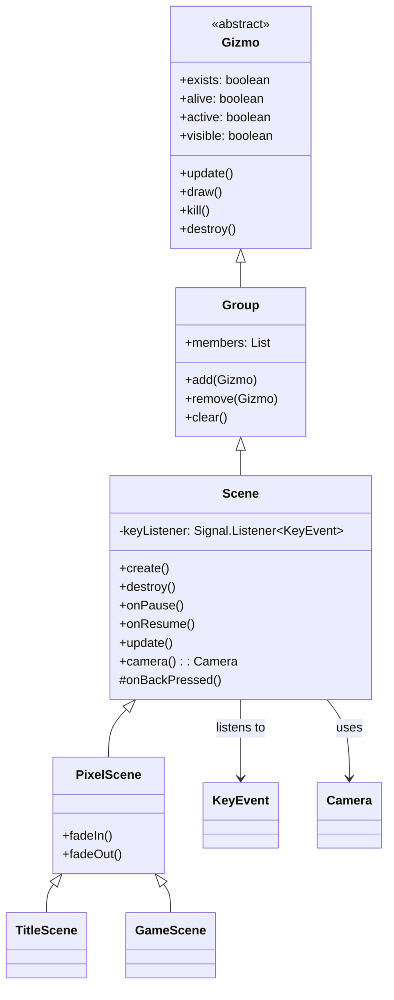

# Scene 类文档

## 1. 基本信息

| 属性 | 值 |
|------|-----|
| 文件路径 | SPD-classes/src/main/java/com/watabou/noosa/Scene.java |
| 包名 | com.watabou.noosa |
| 类类型 | class |
| 继承关系 | extends Group |
| 代码行数 | 75 行 |
| 许可证 | GNU GPL v3 |

## 2. 类职责说明

`Scene` 是所有游戏场景的基类，负责：

1. **场景生命周期** - 提供create()、destroy()、onPause()、onResume()等生命周期方法
2. **返回键处理** - 处理系统返回键事件
3. **相机管理** - 提供默认主相机访问
4. **输入监听** - 注册和管理键盘事件监听器

## 4. 继承与协作关系



## 实例字段表

| 字段名 | 类型 | 修饰符 | 说明 |
|--------|------|--------|------|
| keyListener | Signal.Listener<KeyEvent> | private | 键盘事件监听器 |

## 7. 方法详解

### create()

**签名**: `public void create()`

**功能**: 场景初始化方法，注册返回键监听器。

**实现逻辑**:
```java
// 第33-45行：
KeyEvent.addKeyListener(keyListener = new Signal.Listener<KeyEvent>() {
    @Override
    public boolean onSignal(KeyEvent event) {
        if (Game.instance != null && event.pressed) {
            // 检查是否为返回键
            if (KeyBindings.getActionForKey(event) == GameAction.BACK) {
                onBackPressed();  // 触发返回处理
            }
        }
        return false;  // 不消费事件
    }
});
```

### destroy()

**签名**: `@Override public void destroy()`

**功能**: 场景销毁方法，移除键盘监听器。

**实现逻辑**:
```java
// 第47-51行：
KeyEvent.removeKeyListener(keyListener);  // 移除监听器
super.destroy();  // 调用父类销毁
```

### onPause()

**签名**: `public void onPause()`

**功能**: 场景暂停时调用（应用切换到后台）。默认空实现，子类可重写。

**说明**: 用于保存游戏状态、暂停音乐等。

### onResume()

**签名**: `public void onResume()`

**功能**: 场景恢复时调用（应用回到前台）。默认空实现，子类可重写。

**说明**: 用于恢复游戏状态、继续音乐等。

### update()

**签名**: `@Override public void update()`

**功能**: 每帧更新方法。

**实现逻辑**:
```java
// 第61-64行：
super.update();  // 调用Group.update()更新所有子元素
```

### camera()

**签名**: `@Override public Camera camera()`

**功能**: 返回场景使用的相机。

**返回值**: `Camera` - 主相机实例

**实现逻辑**:
```java
// 第66-69行：
return Camera.main;  // 返回静态主相机
```

### onBackPressed()

**签名**: `protected void onBackPressed()`

**功能**: 处理返回键按下事件。

**实现逻辑**:
```java
// 第71-73行：
Game.instance.finish();  // 默认行为：退出游戏
```

**说明**: 子类通常重写此方法以实现自定义返回行为（如返回上一场景）。

## 11. 使用示例

### 创建自定义场景

```java
public class MenuScene extends Scene {
    
    private Button startButton;
    private Button settingsButton;
    
    @Override
    public void create() {
        super.create();  // 必须调用父类create()
        
        // 创建UI元素
        startButton = new StartButton();
        add(startButton);
        
        settingsButton = new SettingsButton();
        add(settingsButton);
    }
    
    @Override
    public void destroy() {
        // 清理资源
        super.destroy();  // 必须调用父类destroy()
    }
    
    @Override
    public void onPause() {
        // 暂停背景音乐
        Music.INSTANCE.pause();
    }
    
    @Override
    public void onResume() {
        // 恢复背景音乐
        Music.INSTANCE.resume();
    }
    
    @Override
    protected void onBackPressed() {
        // 自定义返回行为：返回标题场景
        Game.switchScene(TitleScene.class);
    }
}
```

### 游戏场景示例

```java
public class GameScene extends Scene {
    
    @Override
    public void create() {
        super.create();
        
        // 初始化游戏世界
        Dungeon.level = new Level();
        
        // 添加游戏元素
        add(new Tilemap());
        add(new HeroSprite());
        add(new MobSprites());
        
        // 设置相机
        Camera.main.zoom = 1f;
    }
    
    @Override
    public void update() {
        super.update();
        
        // 更新游戏逻辑
        Dungeon.level.update();
    }
    
    @Override
    protected void onBackPressed() {
        // 游戏场景中按返回键显示暂停菜单
        Game.scene().add(new WndGame());
    }
}
```

## 注意事项

1. **必须调用父类方法** - `create()`和`destroy()`必须调用父类方法以确保监听器正确注册/移除
2. **返回键处理** - 默认行为是退出游戏，子类应重写以实现合适的返回逻辑
3. **生命周期** - `onPause()`和`onResume()`是空方法，子类按需实现
4. **相机访问** - 使用`camera()`方法而非直接访问`Camera.main`便于扩展

## 最佳实践

### 场景资源管理

```java
public class MyScene extends Scene {
    
    private List<Gizmo> managedResources = new ArrayList<>();
    
    @Override
    public void create() {
        super.create();
        
        // 添加UI元素并跟踪
        addAndTrack(new Background());
        addAndTrack(new MenuButtons());
    }
    
    private void addAndTrack(Gizmo g) {
        add(g);
        managedResources.add(g);
    }
    
    @Override
    public void destroy() {
        // 清理跟踪的资源
        for (Gizmo g : managedResources) {
            g.destroy();
        }
        managedResources.clear();
        
        super.destroy();
    }
}
```

### 返回键链式处理

```java
@Override
protected void onBackPressed() {
    // 如果有打开的窗口，关闭最上层的
    if (!members.isEmpty() && members.get(members.size() - 1) instanceof Window) {
        ((Window) members.get(members.size() - 1)).hide();
        return;
    }
    
    // 否则返回上一场景
    Game.switchScene(previousScene);
}
```

## 相关文件

| 文件 | 说明 |
|------|------|
| Group.java | 父类，UI元素容器 |
| Game.java | 游戏主类，管理场景切换 |
| Camera.java | 相机系统 |
| KeyEvent.java | 键盘事件系统 |
| PixelScene.java | 像素游戏场景基类 |
| TitleScene.java | 标题场景实现 |
| GameScene.java | 游戏主场景实现 |