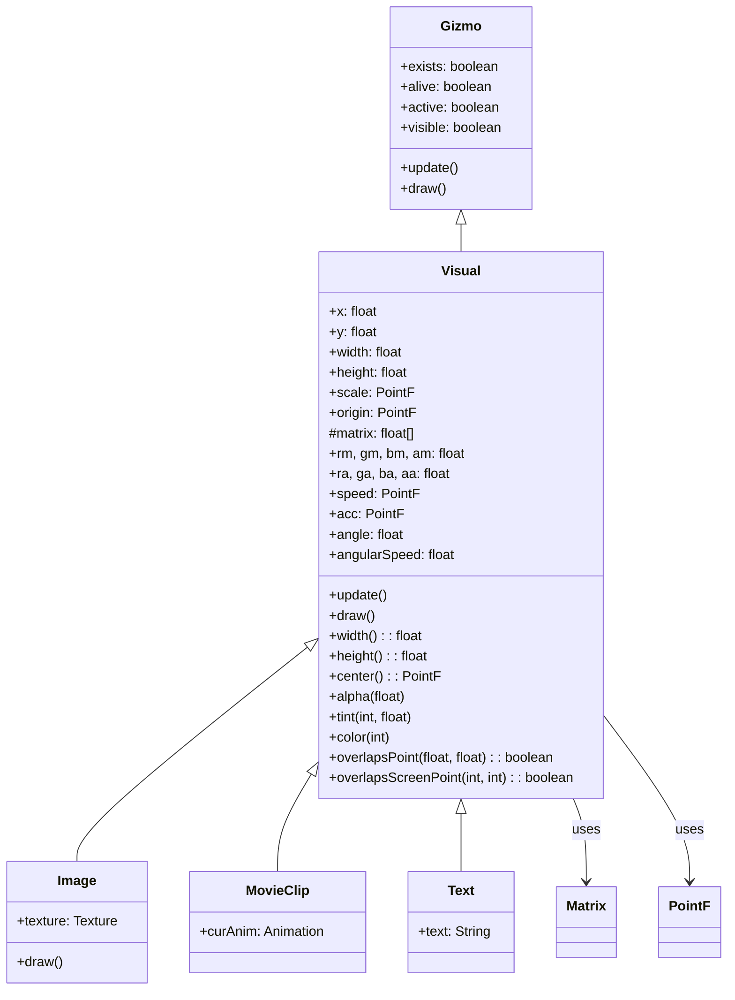

# Visual Class Documentation

## 1. 基本信息

| 属性 | 值 |
|------|-----|
| **文件路径** | SPD-classes/src/main/java/com/watabou/noosa/Visual.java |
| **包名** | com.watabou.noosa |
| **文件类型** | class |
| **继承关系** | extends Gizmo |
| **代码行数** | 297 |
| **所属模块** | SPD-classes |

## 2. 文件职责说明

### 核心职责
Visual 类是 noosa 渲染框架中所有可视化元素的基类，负责管理位置、尺寸、变换（缩放、旋转）、颜色效果和基本运动物理。

### 系统定位
作为 Gizmo 的子类，Visual 在场景图层次结构中提供了完整的 2D 变换矩阵支持、渲染状态管理和简单的物理运动系统。它是 Image、BitmapText、Tilemap 等具体可视化组件的共同父类。

### 不负责什么
- 不直接处理纹理或具体的渲染实现（由子类如 Image 处理）
- 不管理音频播放（由 audio 包处理）
- 不处理用户输入事件（由 input 包和 Scene 处理）
4. **运动系统** - 支持速度、加速度、角速度
5. **碰撞检测** - 点和屏幕坐标的碰撞检测

## 类关系图



## 实例字段表

### 位置和尺寸

| 字段名 | 类型 | 说明 |
|--------|------|------|
| x | float | X坐标 |
| y | float | Y坐标 |
| width | float | 宽度（原始值） |
| height | float | 高度（原始值） |

### 变换

| 字段名 | 类型 | 默认值 | 说明 |
|--------|------|--------|------|
| scale | PointF | (1, 1) | 缩放因子 |
| origin | PointF | (0, 0) | 旋转/缩放原点 |
| matrix | float[] | - | 4x4变换矩阵 |
| angle | float | 0 | 旋转角度（度） |

### 颜色调制

| 字段名 | 说明 |
|--------|------|
| rm, gm, bm | RGB乘数（Multiply） |
| am | Alpha乘数 |
| ra, ga, ba | RGB加数（Add） |
| aa | Alpha加数 |

**颜色公式**: `final = src * m + a`

### 运动

| 字段名 | 类型 | 说明 |
|--------|------|------|
| speed | PointF | 速度（像素/秒） |
| acc | PointF | 加速度（像素/秒²） |
| angularSpeed | float | 角速度（度/秒） |

## 方法详解

### 构造函数 Visual(float x, float y, float width, float height)

**签名**: `public Visual(float x, float y, float width, float height)`

**功能**: 创建Visual实例。

**实现逻辑**:
```java
// 第58-73行：
this.x = x;
this.y = y;
this.width = width;
this.height = height;
scale = new PointF(1, 1);
origin = new PointF();
matrix = new float[16];
resetColor();  // 设置默认颜色
speed = new PointF();
acc = new PointF();
```

### update()

**签名**: `@Override public void update()`

**功能**: 更新运动状态。

**实现逻辑**:
```java
// 第75-78行：
updateMotion();  // 应用速度和加速度
```

### draw()

**签名**: `@Override public void draw()`

**功能**: 绘制前更新变换矩阵（带缓存优化）。

**实现逻辑**:
```java
// 第84-107行：
// 检查是否有任何变换参数变化
if (lastX != x || lastY != y || lastW != width || ...) {
    // 更新缓存值
    lastX = x; ...
    // 重新计算矩阵
    updateMatrix();
}
```

### updateMatrix()

**签名**: `protected void updateMatrix()`

**功能**: 计算变换矩阵。

**实现逻辑**:
```java
// 第109-122行：
Matrix.setIdentity(matrix);
Matrix.translate(matrix, x, y);           // 移动到位置
if (origin.x != 0 || origin.y != 0)
    Matrix.translate(matrix, origin.x, origin.y);  // 移动原点
if (angle != 0)
    Matrix.rotate(matrix, angle);         // 旋转
if (scale.x != 1 || scale.y != 1)
    Matrix.scale(matrix, scale.x, scale.y);  // 缩放
if (origin.x != 0 || origin.y != 0)
    Matrix.translate(matrix, -origin.x, -origin.y);  // 移回原点
```

### center()

**签名**: `public PointF center()`

**功能**: 获取中心点坐标。

**返回值**: `PointF` - 中心点

### center(PointF p)

**签名**: `public PointF center(PointF p)`

**功能**: 将中心设置到指定点。

**参数**:
- `p`: PointF - 目标中心点

### originToCenter()

**签名**: `public void originToCenter()`

**功能**: 将原点设置到中心（用于中心缩放/旋转）。

### width() / height()

**签名**: `public float width()` / `public float height()`

**功能**: 获取缩放后的宽度/高度。

**返回值**: `float` - width * scale.x 或 height * scale.y

### updateMotion()

**签名**: `protected void updateMotion()`

**功能**: 更新运动（位置和角度）。

**实现逻辑**:
```java
// 第170-184行：
// 应用加速度
if (acc.x != 0) speed.x += acc.x * Game.elapsed;
if (acc.y != 0) speed.y += acc.y * Game.elapsed;
// 应用速度
if (speed.x != 0) x += speed.x * Game.elapsed;
if (speed.y != 0) y += speed.y * Game.elapsed;
// 应用角速度
if (angularSpeed != 0) angle += angularSpeed * Game.elapsed;
```

### 颜色方法

#### alpha(float value)

**功能**: 设置透明度（0-1）。

```java
am = value;
aa = 0;
```

#### alpha()

**功能**: 获取当前透明度。

```java
return am + aa;
```

#### tint(int color, float strength)

**功能**: 着色（混合原色和指定颜色）。

#### color(int color)

**功能**: 完全替换颜色。

#### hardlight(int color)

**功能**: 强光模式（只用乘数）。

#### invert()

**功能**: 反色效果。

#### brightness(float value)

**功能**: 设置亮度（0-1）。

#### resetColor()

**功能**: 重置为默认颜色。

### 碰撞检测

#### overlapsPoint(float x, float y)

**功能**: 检查世界坐标点是否在Visual内。

#### overlapsScreenPoint(int x, int y)

**功能**: 检查屏幕坐标点是否在Visual内。

#### isVisible()

**功能**: 检查是否在相机视野内（用于优化绘制）。

## 使用示例

### 基础使用

```java
// 创建Visual
Visual v = new Visual(100, 100, 50, 50);

// 设置位置
v.x = 200;
v.y = 150;

// 缩放
v.scale.set(2, 2);  // 2倍大小

// 旋转（以中心为轴）
v.originToCenter();
v.angle = 45;  // 旋转45度

// 设置透明度
v.alpha(0.5f);  // 半透明

// 着色（红色）
v.tint(0xFF0000, 0.5f);  // 50%红色着色
```

### 运动效果

```java
// 向右移动
v.speed.x = 100;  // 每秒100像素

// 加速运动
v.acc.x = 50;  // 每秒加速50像素

// 旋转
v.angularSpeed = 90;  // 每秒旋转90度
```

### 中心对齐

```java
// 将Visual中心设置到某点
v.center(new PointF(200, 200));

// 让另一个Visual居中显示在本Visual上
Visual child = new Visual(0, 0, 20, 20);
child.point(v.center(child));
```

## 子类列表

| 子类 | 功能 |
|------|------|
| Image | 图像显示 |
| MovieClip | 动画精灵 |
| Text | 文本显示 |
| TouchArea | 触摸区域 |
| Emitter | 粒子发射器 |

## 注意事项

1. **矩阵缓存** - draw()会缓存变换参数，避免重复计算
2. **颜色调制** - 使用乘数(m)和加数(a)实现灵活的颜色效果
3. **运动更新** - 必须调用update()才会应用运动
4. **原点** - 默认原点在左上角，影响缩放和旋转

## 相关文件

| 文件 | 说明 |
|------|------|
| Gizmo.java | 父类 |
| Image.java | 图像类 |
| MovieClip.java | 动画类 |
| Matrix.java | 矩阵运算 |
| PointF.java | 浮点坐标 |
| Camera.java | 相机系统 |