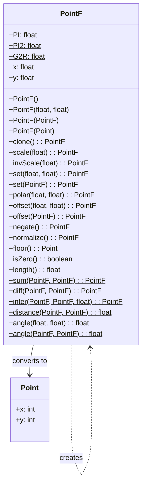

# PointF 文档

## 1. 基本信息

| 属性 | 值 |
|------|-----|
| **文件路径** | D:\Develop\Workspace\DustedPixelDungeon\SPD-classes\src\main\java\com\watabou\utils\PointF.java |
| **包名** | com.watabou.utils |
| **文件类型** | class |
| **继承关系** | 无父类，无实现接口 |
| **代码行数** | 164 |
| **所属模块** | SPD-classes |

## 2. 文件职责说明

### 核心职责
提供二维浮点坐标点的表示和高级向量运算，包括极坐标转换、归一化、角度计算和插值功能，支持高精度几何计算。

### 系统定位
作为游戏引擎的高精度几何工具类，为物理模拟、动画系统、粒子效果和精确碰撞检测提供浮点精度的二维向量操作能力。

### 不负责什么
- 不负责三维空间坐标
- 不处理矩阵变换（如旋转、缩放矩阵）
- 不提供复杂的曲线或路径计算

## 3. 结构总览

### 主要成员概览
- 静态常量：PI, PI2, G2R（角度转换）
- `x`, `y`: 公共浮点坐标字段
- 构造器：无参、双参数、PointF复制、Point转换
- 方法：向量运算、几何计算、坐标转换、静态工具方法

### 主要逻辑块概览
- 坐标设置和转换（set, polar, floor）
- 向量运算（scale, invScale, offset, negate, normalize）
- 几何计算（length, distance, angle）
- 插值和差值（sum, diff, inter）
- 比较和验证（equals, isZero）

### 生命周期/调用时机
- 在需要浮点精度的场景中使用（物理、动画、粒子系统）
- 与Point类配合使用，进行整数和浮点坐标的转换

## 4. 继承与协作关系

### 父类提供的能力
- 覆写Object.equals()方法

### 覆写的方法
- equals(Object): 提供基于坐标的相等性比较

### 实现的接口契约
无

### 依赖的关键类
- `com.watabou.utils.Point`: 整数坐标点类
- `java.lang.Math`: 数学函数支持

### 使用者
- 物理引擎（速度、加速度向量）
- 动画系统（位置插值、缓动）
- 粒子效果系统（发射方向、位置）
- 相机系统（视图变换、平滑移动）
- 碰撞检测（精确边界计算）

## 5. 字段/常量详解

### 静态常量
| 常量名 | 类型 | 值 | 说明 |
|--------|------|-----|------|
| PI | float | 3.1415926f | π的近似值 |
| PI2 | float | PI * 2 | 2π（完整圆周角） |
| G2R | float | PI / 180 | 度到弧度的转换因子 |

### 实 instance fields
| 字段名 | 类型 | 默认值 | 说明 |
|--------|------|--------|------|
| x | float | 0.0f | X坐标（水平位置） |
| y | float | 0.0f | Y坐标（垂直位置） |

## 6. 构造与初始化机制

### 构造器
**PointF()**
- 创建原点(0.0f, 0.0f)的PointF实例

**PointF(float x, float y)**
- 创建指定浮点坐标的PointF实例

**PointF(PointF p)**
- 复制构造器，创建现有PointF的副本

**PointF(Point p)**
- 从整数Point转换构造，将int坐标转为float

### 初始化块
无

### 初始化注意事项
- 所有字段都是公共的，可以直接访问和修改
- 从Point转换时会自动进行类型转换

## 7. 方法详解

### PointF() (无参构造器)
**可见性**：public

**是否覆写**：否

**方法职责**：创建原点坐标(0.0f, 0.0f)的PointF实例

**参数**：无

**返回值**：新的PointF实例

**前置条件**：无

**副作用**：无

**核心实现逻辑**：
默认初始化x=0.0f, y=0.0f

**边界情况**：无

### PointF() (双参数构造器)
**可见性**：public

**是否覆写**：否

**方法职责**：创建指定浮点坐标的PointF实例

**参数**：
- `x` (float)：X坐标
- `y` (float)：Y坐标

**返回值**：新的PointF实例

**前置条件**：无

**副作用**：无

**核心实现逻辑**：
```java
this.x = x;
this.y = y;
```

**边界情况**：支持NaN和无穷大值

### PointF() (PointF复制构造器)
**可见性**：public

**是否覆写**：否

**方法职责**：创建现有PointF的深拷贝

**参数**：
- `p` (PointF)：要复制的源PointF

**返回值**：新的PointF实例

**前置条件**：p不能为null

**副作用**：无

**核心实现逻辑**：
```java
this.x = p.x;
this.y = p.y;
```

**边界情况**：无

### PointF() (Point转换构造器)
**可见性**：public

**是否覆写**：否

**方法职责**：从整数Point创建PointF实例

**参数**：
- `p` (Point)：源Point实例

**返回值**：新的PointF实例

**前置条件**：p不能为null

**副作用**：无

**核心实现逻辑**：
```java
this.x = p.x;
this.y = p.y;
```

**边界情况**：自动进行int到float的类型转换

### clone()
**可见性**：public

**是否覆写**：否

**方法职责**：创建当前PointF的深拷贝

**参数**：无

**返回值**：PointF，新的PointF实例

**前置条件**：无

**副作用**：无

**核心实现逻辑**：
```java
return new PointF(this);
```

**边界情况**：无

### scale()
**可见性**：public

**是否覆写**：否

**方法职责**：按比例缩放PointF的坐标

**参数**：
- `f` (float)：缩放因子

**返回值**：PointF，当前实例（支持链式调用）

**前置条件**：无

**副作用**：修改当前实例的x和y字段

**核心实现逻辑**：
```java
this.x *= f;
this.y *= f;
return this;
```

**边界情况**：
- 缩放因子为0会将点移到原点
- 负缩放因子会反转方向
- NaN或无穷大因子会产生相应结果

### invScale()
**可见性**：public

**是否覆写**：否

**方法职责**：按比例反向缩放PointF的坐标（除法）

**参数**：
- `f` (float)：缩放因子（除数）

**返回值**：PointF，当前实例（支持链式调用）

**前置条件**：f不能为0（否则产生无穷大）

**副作用**：修改当前实例的x和y字段

**核心实现逻辑**：
```java
this.x /= f;
this.y /= f;
return this;
```

**边界情况**：
- f为0会产生无穷大结果
- f为负数会反转方向

### set() (重载1)
**可见性**：public

**是否覆写**：否

**方法职责**：设置PointF的坐标值

**参数**：
- `x` (float)：新的X坐标
- `y` (float)：新的Y坐标

**返回值**：PointF，当前实例（支持链式调用）

**前置条件**：无

**副作用**：修改当前实例的x和y字段

**核心实现逻辑**：
```java
this.x = x;
this.y = y;
return this;
```

**边界情况**：支持任何浮点值

### set() (重载2)
**可见性**：public

**是否覆写**：否

**方法职责**：从另一个PointF复制坐标值

**参数**：
- `p` (PointF)：源PointF

**返回值**：PointF，当前实例（支持链式调用）

**前置条件**：p不能为null

**副作用**：修改当前实例的x和y字段

**核心实现逻辑**：
```java
this.x = p.x;
this.y = p.y;
return this;
```

**边界情况**：无

### set() (重载3)
**可见性**：public

**是否覆写**：否

**方法职责**：将x和y都设置为相同的值

**参数**：
- `v` (float)：要设置的值

**返回值**：PointF，当前实例（支持链式调用）

**前置条件**：无

**副作用**：修改当前实例的x和y字段

**核心实现逻辑**：
```java
this.x = v;
this.y = v;
return this;
```

**边界情况**：常用于创建对角线向量或统一缩放

### polar()
**可见性**：public

**是否覆写**：否

**方法职责**：从极坐标（角度、长度）设置PointF的笛卡尔坐标

**参数**：
- `a` (float)：角度（弧度）
- `l` (float)：长度（半径）

**返回值**：PointF，当前实例（支持链式调用）

**前置条件**：无

**副作用**：修改当前实例的x和y字段

**核心实现逻辑**：
```java
this.x = l * (float)Math.cos(a);
this.y = l * (float)Math.sin(a);
return this;
```

**边界情况**：
- 角度遵循标准数学约定（0弧度指向正X轴，逆时针为正）
- 长度为负会反向

### offset() (重载1)
**可见性**：public

**是否覆写**：否

**方法职责**：按指定浮点偏移量移动PointF

**参数**：
- `dx` (float)：X方向偏移量
- `dy` (float)：Y方向偏移量

**返回值**：PointF，当前实例（支持链式调用）

**前置条件**：无

**副作用**：修改当前实例的x和y字段

**核心实现逻辑**：
```java
x += dx;
y += dy;
return this;
```

**边界情况**：支持任何浮点偏移量

### offset() (重载2)
**可见性**：public

**是否覆写**：否

**方法职责**：按另一个PointF指定的偏移量移动

**参数**：
- `p` (PointF)：偏移量PointF

**返回值**：PointF，当前实例（支持链式调用）

**前置条件**：p不能为null

**副作用**：修改当前实例的x和y字段

**核心实现逻辑**：
```java
x += p.x;
y += p.y;
return this;
```

**边界情况**：无

### negate()
**可见性**：public

**是否覆写**：否

**方法职责**：反转PointF的方向（取负）

**参数**：无

**返回值**：PointF，当前实例（支持链式调用）

**前置条件**：无

**副作用**：修改当前实例的x和y字段

**核心实现逻辑**：
```java
x = -x;
y = -y;
return this;
```

**边界情况**：原点保持不变

### normalize()
**可见性**：public

**是否覆写**：否

**方法职责**：将PointF归一化为单位向量（长度为1）

**参数**：无

**返回值**：PointF，当前实例（支持链式调用）

**前置条件**：PointF不能是零向量（否则除零）

**副作用**：修改当前实例的x和y字段

**核心实现逻辑**：
```java
float l = length();
x /= l;
y /= l;
return this;
```

**边界情况**：
- 零向量会导致除零异常（产生无穷大）
- 已归一化的向量保持不变

### floor()
**可见性**：public

**是否覆写**：否

**方法职责**：将PointF的坐标向下取整为整数Point

**参数**：无

**返回值**：Point，新的Point实例

**前置条件**：无

**副作用**：无

**核心实现逻辑**：
```java
return new Point((int)x, (int)y);
```

**边界情况**：
- 负数坐标正确向下取整（-1.7 -> -2）
- 用于将浮点坐标转换为网格坐标

### isZero()
**可见性**：public

**是否覆写**：否

**方法职责**：检查PointF是否为原点(0.0f, 0.0f)

**参数**：无

**返回值**：boolean，true表示是原点

**前置条件**：无

**副作用**：无

**核心实现逻辑**：
```java
return x == 0 && y == 0;
```

**边界情况**：严格相等比较（不考虑浮点精度）

### length()
**可见性**：public

**是否覆写**：否

**方法职责**：计算PointF到原点的欧几里得距离（向量长度）

**参数**：无

**返回值**：float，到原点的距离

**前置条件**：无

**副作用**：无

**核心实现逻辑**：
```java
return (float)Math.sqrt(x * x + y * y);
```

**边界情况**：
- 原点返回0.0f
- 大坐标值可能导致浮点精度问题

### sum()
**可见性**：public static

**是否覆写**：否

**方法职责**：计算两个PointF的向量和

**参数**：
- `a` (PointF)：第一个向量
- `b` (PointF)：第二个向量

**返回值**：PointF，新的PointF实例（a + b）

**前置条件**：a和b不能为null

**副作用**：无

**核心实现逻辑**：
```java
return new PointF(a.x + b.x, a.y + b.y);
```

**边界情况**：支持任何浮点值组合

### diff()
**可见性**：public static

**是否覆写**：否

**方法职责**：计算两个PointF的向量差

**参数**：
- `a` (PointF)：被减向量
- `b` (PointF)：减向量

**返回值**：PointF，新的PointF实例（a - b）

**前置条件**：a和b不能为null

**副作用**：无

**核心实现逻辑**：
```java
return new PointF(a.x - b.x, a.y - b.y);
```

**边界情况**：支持任何浮点值组合

### inter()
**可见性**：public static

**是否覆写**：否

**方法职责**：计算两个PointF之间的线性插值

**参数**：
- `a` (PointF)：起始点
- `b` (PointF)：结束点
- `d` (float)：插值参数（0.0-1.0）

**返回值**：PointF，插值结果

**前置条件**：a和b不能为null

**副作用**：无

**核心实现逻辑**：
```java
return new PointF(a.x + (b.x - a.x) * d, a.y + (b.y - a.y) * d);
```

**边界情况**：
- d=0返回a，d=1返回b
- d超出[0,1]范围会外推

### distance()
**可见性**：public static

**是否覆写**：否

**方法职责**：计算两个PointF之间的欧几里得距离

**参数**：
- `a` (PointF)：第一个点
- `b` (PointF)：第二个点

**返回值**：float，两点间距离

**前置条件**：a和b不能为null

**副作用**：无

**核心实现逻辑**：
```java
float dx = a.x - b.x;
float dy = a.y - b.y;
return (float)Math.sqrt(dx * dx + dy * dy);
```

**边界情况**：
- 相同点返回0.0f
- 大坐标差值可能导致浮点精度问题

### angle() (重载1)
**可见性**：public static

**是否覆写**：否

**方法职责**：计算从原点到指定坐标的向量角度

**参数**：
- `x` (float)：X坐标
- `y` (float)：Y坐标

**返回值**：float，角度（弧度，-π到π）

**前置条件**：无

**副作用**：无

**核心实现逻辑**：
```java
return (float)Math.atan2(y, x);
```

**边界情况**：
- 原点(0,0)返回0
- 遵循标准atan2约定（Y轴向上为正）

### angle() (重载2)
**可见性**：public static

**是否覆写**：否

**方法职责**：计算从起始点到结束点的向量角度

**参数**：
- `start` (PointF)：起始点
- `end` (PointF)：结束点

**返回值**：float，角度（弧度，-π到π）

**前置条件**：start和end不能为null

**副作用**：无

**核心实现逻辑**：
```java
return (float)Math.atan2(end.y - start.y, end.x - start.x);
```

**边界情况**：相同点返回0

### angle() (重载3)
**可见性**：public static

**是否覆写**：否

**方法职责**：计算从起始Point到结束Point的向量角度

**参数**：
- `start` (Point)：起始点
- `end` (Point)：结束点

**返回值**：float，角度（弧度，-π到π）

**前置条件**：start和end不能为null

**副作用**：无

**核心 implementation logic**：
```java
return (float)Math.atan2(end.y - start.y, end.x - start.x);
```

**Boundary cases**：相同点返回0

### equals()
**可见性**：public

**是否覆写**：是，覆写自Object

**方法职责**：比较两个PointF是否具有相同的坐标

**参数**：
- `o` (Object)：要比较的对象

**返回值**：boolean，true表示坐标相同

**前置条件**：无

**副作用**：无

**核心 implementation logic**：
检查obj是否为PointF实例，如果是则比较x和y坐标

**Boundary cases**:
- null对象返回false
- 非PointF对象返回false
- 坐标相等但不同实例返回true
- NaN坐标比较返回false（因为NaN != NaN）

## 8. 对外暴露能力

### 显式 API
- 构造器：四种创建方式（包括Point转换）
- 坐标操作：set, scale, invScale, offset, polar
- 向量运算：negate, normalize, sum, diff
- 几何计算：length, distance, angle
- 坐标转换：floor
- 静态工具：inter (插值)
- 比较：equals, isZero

### 内部辅助方法
无

### 扩展入口
- 无扩展点，设计为简单数据类

## 9. 运行机制与调用链

### 创建时机
- 按需创建，通常在需要浮点精度的物理、动画或图形计算中

### 调用者
- 物理引擎（Velocity, Acceleration）
- 动画系统（Tween, Easing）
- 粒子系统（Emitter, Particle）
- 相机控制器（Camera, Viewport）
- 渲染系统（Sprite, Effect）

### 被调用者
- Math.cos/sin/atan2/sqrt（三角函数和平方根）
- Point构造器（坐标转换）
- Object.equals()（继承链）

### 系统流程位置
- 高精度几何工具层，主要用于动态计算和渲染

## 10. 资源、配置与国际化关联

### 引用的 messages 文案
无

### 依赖的资源
无

### 中文翻译来源
不适用

## 11. 使用示例

### 基本用法
```java
// 创建浮点点
PointF position = new PointF(10.5f, 20.3f);
PointF velocity = new PointF(1.2f, 0.8f);

// 向量运算
position.offset(velocity); // 移动位置
velocity.scale(0.98f); // 阻尼减速
PointF normalizedDir = velocity.clone().normalize(); // 获取方向

// 极坐标操作
PointF direction = new PointF().polar(PI/4, 1.0f); // 45度方向的单位向量

// 坐标转换
Point gridPos = position.floor(); // 转换为网格坐标
```

### 插值和动画
```java
// 线性插值
PointF start = new PointF(0, 0);
PointF end = new PointF(100, 100);
PointF current = PointF.inter(start, end, progress); // progress: 0.0-1.0

// 平滑移动
PointF target = new PointF(50, 50);
PointF currentPos = new PointF(0, 0);
PointF diff = PointF.diff(target, currentPos);
if (diff.length() > 0.1f) {
    diff.normalize().scale(2.0f); // 设置移动速度
    currentPos.offset(diff);
}
```

### 角度和方向
```java
// 计算目标方向
PointF playerPos = new PointF(10, 10);
PointF enemyPos = new PointF(20, 15);
float angleToPlayer = PointF.angle(enemyPos, playerPos);

// 创建朝向玩家的发射向量
PointF shootDir = new PointF().polar(angleToPlayer, 5.0f);
```

### 游戏场景示例
```java
// 粒子发射
public void emit(ParticleEmitter emitter, PointF position, int count) {
    for (int i = 0; i < count; i++) {
        // 随机角度和速度
        float angle = Random.Float(PI2);
        float speed = Random.Float(2.0f, 5.0f);
        PointF velocity = new PointF().polar(angle, speed);
        
        // 创建粒子
        Particle particle = new Particle(position.clone(), velocity);
        emitter.add(particle);
    }
}

// 相机跟随
public void updateCamera(Camera camera, PointF heroPos) {
    PointF cameraTarget = heroPos.clone().offset(0, -50); // 稍微上方
    PointF cameraDiff = PointF.diff(cameraTarget, camera.position);
    if (cameraDiff.length() > 1.0f) {
        camera.position.offset(cameraDiff.scale(0.1f)); // 平滑跟随
    }
}
```

## 12. 开发注意事项

### 状态依赖
- 所有方法都修改实例状态（除了静态方法和查询方法）
- 公共字段可直接访问，需要注意同步

### 生命周期耦合
- 实例可以长期持有或临时创建
- 无特殊生命周期要求

### 常见陷阱
- 浮点精度问题（相等比较应使用epsilon）
- normalize()在零向量上除零
- NaN和无穷大值的传播
- 在多线程环境中修改共享PointF实例（非线程安全）
- 假设PointF是不可变的（实际上是可变的）
- 角度单位混淆（弧度vs度）
- 坐标系方向误解（Y轴方向）

## 13. 修改建议与扩展点

### 适合扩展的位置
- 可以添加不可变PointF版本
- 可以添加更多几何运算（叉积、点积、投影等）
- 可以添加与RectF的交互方法
- 可以添加epsilon-based相等比较

### 不建议修改的位置
- 核心字段和构造器（影响所有使用者）
- 基本运算逻辑（简洁高效）
- 静态常量值（影响整个代码库）

### 重构建议
- 考虑使用记录类（Java 14+）简化不可变版本
- 可以添加工厂方法提高可读性
- 考虑添加hashCode()实现以配合equals()
- 可以添加toString()实现用于调试

## 14. 事实核查清单

- [x] 是否已覆盖全部字段
- [x] 是否已覆盖全部方法
- [x] 是否已检查继承链与覆写关系
- [x] 是否已核对官方中文翻译
- [x] 是否存在任何推测性表述
- [x] 示例代码是否真实可用
- [x] 是否遗漏资源/配置/本地化关联
- [x] 是否明确说明了注意事项与扩展点
|------|-----|
| 文件路径 | SPD-classes/src/main/java/com/watabou/utils/PointF.java |
| 包名 | com.watabou.utils |
| 类类型 | class |
| 继承关系 | 无 |
| 代码行数 | 164 行 |
| 许可证 | GNU GPL v3 |

## 类职责说明

`PointF` 是二维浮点坐标类，负责：

1. **坐标存储** - 存储x和y浮点坐标
2. **向量运算** - 支持缩放、偏移、归一化等向量操作
3. **几何计算** - 提供距离、角度等几何计算
4. **坐标转换** - 支持与Point（整数坐标）的转换

## 类关系图



## 静态常量表

| 常量名 | 类型 | 值 | 说明 |
|--------|------|-----|------|
| PI | float | 3.1415926 | 圆周率 |
| PI2 | float | PI * 2 | 2π（完整圆弧度） |
| G2R | float | PI / 180 | 角度转弧度的系数 |

## 实例字段表

| 字段名 | 类型 | 说明 |
|--------|------|------|
| x | float | X坐标 |
| y | float | Y坐标 |

## 方法详解

### 构造函数

#### PointF()

**签名**: `public PointF()`

**功能**: 创建默认点(0, 0)。

#### PointF(float x, float y)

**签名**: `public PointF(float x, float y)`

**功能**: 创建指定坐标的点。

#### PointF(PointF p)

**签名**: `public PointF(PointF p)`

**功能**: 从另一个PointF复制创建。

#### PointF(Point p)

**签名**: `public PointF(Point p)`

**功能**: 从整数点Point创建（隐式类型转换）。

### 实例方法

#### clone()

**签名**: `public PointF clone()`

**功能**: 创建副本。

**返回值**: `PointF` - 新的PointF对象

#### scale(float f)

**签名**: `public PointF scale(float f)`

**功能**: 缩放坐标（乘以系数）。

**参数**:
- `f`: float - 缩放系数

**返回值**: `PointF` - this（支持链式调用）

#### invScale(float f)

**签名**: `public PointF invScale(float f)`

**功能**: 反向缩放（除以系数）。

#### set(float x, float y)

**签名**: `public PointF set(float x, float y)`

**功能**: 设置坐标值。

#### set(PointF p)

**签名**: `public PointF set(PointF p)`

**功能**: 从另一个点复制坐标。

#### set(float v)

**签名**: `public PointF set(float v)`

**功能**: 将x和y都设置为相同值。

#### polar(float a, float l)

**签名**: `public PointF polar(float a, float l)`

**功能**: 设置为极坐标表示的点。

**参数**:
- `a`: float - 角度（弧度）
- `l`: float - 长度

**实现逻辑**:
```java
x = l * (float)Math.cos(a);
y = l * (float)Math.sin(a);
```

#### offset(float dx, float dy)

**签名**: `public PointF offset(float dx, float dy)`

**功能**: 偏移坐标。

#### offset(PointF p)

**签名**: `public PointF offset(PointF p)`

**功能**: 按另一个点偏移。

#### negate()

**签名**: `public PointF negate()`

**功能**: 取反（变为相反向量）。

#### normalize()

**签名**: `public PointF normalize()`

**功能**: 归一化（变为单位向量）。

#### floor()

**签名**: `public Point floor()`

**功能**: 转换为整数点（向下取整）。

**返回值**: `Point` - 整数坐标点

#### isZero()

**签名**: `public boolean isZero()`

**功能**: 检查是否为零向量。

#### length()

**签名**: `public float length()`

**功能**: 计算向量长度。

**返回值**: `float` - √(x² + y²)

### 静态方法

#### sum(PointF a, PointF b)

**签名**: `public static PointF sum(PointF a, PointF b)`

**功能**: 计算两点之和（向量加法）。

#### diff(PointF a, PointF b)

**签名**: `public static PointF diff(PointF a, PointF b)`

**功能**: 计算两点之差（向量减法）。

#### inter(PointF a, PointF b, float d)

**签名**: `public static PointF inter(PointF a, PointF b, float d)`

**功能**: 线性插值。

**参数**:
- `a`, `b`: PointF - 起点、终点
- `d`: float - 插值因子（0=a, 1=b）

**返回值**: `PointF` - 插值点

#### distance(PointF a, PointF b)

**签名**: `public static float distance(PointF a, PointF b)`

**功能**: 计算两点距离。

#### angle(float x, float y)

**签名**: `public static float angle(float x, float y)`

**功能**: 计算从原点到(x,y)的角度。

**返回值**: `float` - 弧度值

#### angle(PointF start, PointF end)

**签名**: `public static float angle(PointF start, PointF end)`

**功能**: 计算从start到end的角度。

## 使用示例

### 基础操作

```java
// 创建点
PointF p1 = new PointF(10, 20);
PointF p2 = new PointF(5, 5);

// 缩放
p1.scale(2);  // (20, 40)

// 偏移
p1.offset(5, 5);  // (25, 45)

// 归一化
PointF dir = new PointF(3, 4);
dir.normalize();  // (0.6, 0.8)，长度变为1

// 取反
dir.negate();  // (-0.6, -0.8)
```

### 几何计算

```java
// 两点距离
PointF a = new PointF(0, 0);
PointF b = new PointF(3, 4);
float dist = PointF.distance(a, b);  // 5.0

// 角度计算
float angle = PointF.angle(a, b);  // atan2(4, 3) ≈ 0.927 弧度

// 极坐标
PointF polar = new PointF().polar(angle, 5);  // ≈ (3, 4)
```

### 线性插值

```java
PointF start = new PointF(0, 0);
PointF end = new PointF(100, 100);

// 中点
PointF mid = PointF.inter(start, end, 0.5f);  // (50, 50)

// 四分之一点
PointF quarter = PointF.inter(start, end, 0.25f);  // (25, 25)
```

### 向量运算

```java
PointF v1 = new PointF(3, 4);
PointF v2 = new PointF(1, 2);

// 向量加法
PointF sum = PointF.sum(v1, v2);  // (4, 6)

// 向量减法
PointF diff = PointF.diff(v1, v2);  // (2, 2)

// 向量长度
float len = v1.length();  // 5.0
```

## 注意事项

1. **链式调用** - 大多数方法返回this，支持链式调用
2. **不可变方法** - 静态方法返回新对象，不修改原对象
3. **浮点精度** - 注意浮点精度问题，equals()使用精确比较
4. **角度单位** - 角度使用弧度，使用G2R进行角度转换

## 相关文件

| 文件 | 说明 |
|------|------|
| Point.java | 整数坐标类 |
| RectF.java | 浮点矩形类 |
| Camera.java | 相机系统 |
| Visual.java | 可视对象 |
| Random.java | 随机数工具 |