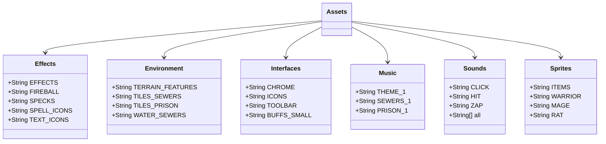

# Assets 类文档

## 1. 基本信息
| 属性 | 值 |
|------|-----|
| 文件路径 | core/src/main/java/com/shatteredpixel/shatteredpixeldungeon/Assets.java |
| 包名 | com.shatteredpixel.shatteredpixeldungeon |
| 类类型 | public class |
| 继承关系 | 无（顶层类） |
| 代码行数 | 341 行 |

## 2. 类职责说明
Assets 类是游戏资源的统一管理中心，定义了所有游戏资源（图片、音频、字体等）的路径常量。它通过内部类组织不同类型的资源，使资源管理更加清晰和易于维护。所有资源路径都是静态常量，方便全局访问。

## 4. 继承与协作关系


## 静态常量表

### Effects 内部类
| 常量名 | 类型 | 值 | 说明 |
|--------|------|-----|------|
| EFFECTS | String | "effects/effects.png" | 通用效果图 |
| FIREBALL | String | "effects/fireball.png" | 火球效果 |
| SPECKS | String | "effects/specks.png" | 粒子效果 |
| SPELL_ICONS | String | "effects/spell_icons.png" | 法术图标 |
| TEXT_ICONS | String | "effects/text_icons.png" | 文本图标 |

### Environment 内部类
| 常量名 | 类型 | 值 | 说明 |
|--------|------|-----|------|
| TERRAIN_FEATURES | String | "environment/terrain_features.png" | 地形特征 |
| TILES_SEWERS | String | "environment/tiles_sewers.png" | 下水道瓦片 |
| TILES_PRISON | String | "environment/tiles_prison.png" | 监狱瓦片 |
| TILES_CAVES | String | "environment/tiles_caves.png" | 洞穴瓦片 |
| TILES_CITY | String | "environment/tiles_city.png" | 城市瓦片 |
| TILES_HALLS | String | "environment/tiles_halls.png" | 大厅瓦片 |
| WATER_SEWERS | String | "environment/water0.png" | 下水道水面 |
| WATER_PRISON | String | "environment/water1.png" | 监狱水面 |

### Interfaces 内部类
| 常量名 | 类型 | 值 | 说明 |
|--------|------|-----|------|
| CHROME | String | "interfaces/chrome.png" | 界面边框 |
| ICONS | String | "interfaces/icons.png" | 图标集 |
| STATUS | String | "interfaces/status_pane.png" | 状态面板 |
| MENU | String | "interfaces/menu_pane.png" | 菜单面板 |
| TOOLBAR | String | "interfaces/toolbar.png" | 工具栏 |
| BUFFS_SMALL | String | "interfaces/buffs.png" | 小型增益图标 |
| BUFFS_LARGE | String | "interfaces/large_buffs.png" | 大型增益图标 |
| TALENT_ICONS | String | "interfaces/talent_icons.png" | 天赋图标 |
| HERO_ICONS | String | "interfaces/hero_icons.png" | 英雄图标 |

### Music 内部类
| 常量名 | 类型 | 值 | 说明 |
|--------|------|-----|------|
| THEME_1 | String | "music/theme_1.ogg" | 主题音乐1 |
| THEME_2 | String | "music/theme_2.ogg" | 主题音乐2 |
| THEME_FINALE | String | "music/theme_finale.ogg" | 终章主题 |
| SEWERS_1~3 | String | "music/sewers_*.ogg" | 下水道音乐 |
| SEWERS_TENSE | String | "music/sewers_tense.ogg" | 下水道紧张音乐 |
| SEWERS_BOSS | String | "music/sewers_boss.ogg" | 下水道Boss音乐 |
| PRISON_1~3 | String | "music/prison_*.ogg" | 监狱音乐 |
| CAVES_1~3 | String | "music/caves_*.ogg" | 洞穴音乐 |
| CITY_1~3 | String | "music/city_*.ogg" | 城市音乐 |
| HALLS_1~3 | String | "music/halls_*.ogg" | 大厅音乐 |

### Sounds 内部类
| 常量名 | 类型 | 值 | 说明 |
|--------|------|-----|------|
| CLICK | String | "sounds/click.mp3" | 点击音效 |
| BADGE | String | "sounds/badge.mp3" | 徽章获得音效 |
| GOLD | String | "sounds/gold.mp3" | 金币音效 |
| HIT | String | "sounds/hit.mp3" | 命中音效 |
| MISS | String | "sounds/miss.mp3" | 未命中音效 |
| HIT_SLASH | String | "sounds/hit_slash.mp3" | 斩击命中 |
| HIT_STAB | String | "sounds/hit_stab.mp3" | 刺击命中 |
| HIT_CRUSH | String | "sounds/hit_crush.mp3" | 重击命中 |
| HIT_MAGIC | String | "sounds/hit_magic.mp3" | 魔法命中 |
| HIT_ARROW | String | "sounds/hit_arrow.mp3" | 箭矢命中 |
| ATK_SPIRITBOW | String | "sounds/atk_spiritbow.mp3" | 灵弓攻击 |
| ATK_CROSSBOW | String | "sounds/atk_crossbow.mp3" | 弩攻击 |
| EAT | String | "sounds/eat.mp3" | 进食音效 |
| READ | String | "sounds/read.mp3" | 阅读音效 |
| DRINK | String | "sounds/drink.mp3" | 饮用音效 |
| ZAP | String | "sounds/zap.mp3" | 法杖发射 |
| LIGHTNING | String | "sounds/lightning.mp3" | 闪电音效 |
| LEVELUP | String | "sounds/levelup.mp3" | 升级音效 |
| DEATH | String | "sounds/death.mp3" | 死亡音效 |
| CURSED | String | "sounds/cursed.mp3" | 诅咒音效 |
| BOSS | String | "sounds/boss.mp3" | Boss出现 |
| BURNING | String | "sounds/burning.mp3" | 燃烧音效 |
| SECRET | String | "sounds/secret.mp3" | 发现秘密 |
| MIMIC | String | "sounds/mimic.mp3" | 宝箱怪音效 |
| all | String[] | 所有音效数组 | 用于预加载 |

### Sprites 内部类
| 常量名 | 类型 | 值 | 说明 |
|--------|------|-----|------|
| ITEMS | String | "sprites/items.png" | 物品图标 |
| ITEM_ICONS | String | "sprites/item_icons.png" | 物品小图标 |
| WARRIOR | String | "sprites/warrior.png" | 战士精灵图 |
| MAGE | String | "sprites/mage.png" | 法师精灵图 |
| ROGUE | String | "sprites/rogue.png" | 盗贼精灵图 |
| HUNTRESS | String | "sprites/huntress.png" | 猎手精灵图 |
| DUELIST | String | "sprites/duelist.png" | 决斗者精灵图 |
| CLERIC | String | "sprites/cleric.png" | 牧师精灵图 |
| AVATARS | String | "sprites/avatars.png" | 头像图标 |
| RAT | String | "sprites/rat.png" | 老鼠精灵图 |
| GOO | String | "sprites/goo.png" | Goo Boss精灵图 |
| TENGU | String | "sprites/tengu.png" | Tengu Boss精灵图 |
| DM300 | String | "sprites/dm300.png" | DM-300 Boss精灵图 |
| KING | String | "sprites/king.png" | 矮人国王精灵图 |
| YOG | String | "sprites/yog.png" | Yog-Dzewa精灵图 |
| GHOST | String | "sprites/ghost.png" | 幽灵NPC精灵图 |
| KEEPER | String | "sprites/shopkeeper.png" | 商店老板精灵图 |

## 11. 使用示例
```java
// 加载音效
Sample.INSTANCE.load(Assets.Sounds.all);

// 播放音效
Sample.INSTANCE.play(Assets.Sounds.HIT);

// 加载精灵图
TextureAtlas atlas = new TextureAtlas(Assets.Sprites.ITEMS);

// 播放音乐
Music.INSTANCE.play(Assets.Music.SEWERS_1, true);

// 获取界面资源
NinePatch chrome = new NinePatch(Assets.Interfaces.CHROME, 0, 0, 20, 20, 6);
```

## 注意事项
1. **路径格式**: 所有路径都是相对于assets目录的
2. **预加载**: Sounds.all 数组用于游戏启动时预加载所有音效
3. **音乐格式**: 音乐文件使用.ogg格式
4. **音效格式**: 音效文件使用.mp3格式

## 最佳实践
1. 使用 Assets.Sounds.all 预加载所有音效
2. 通过内部类组织资源引用，避免路径硬编码
3. 音乐文件较大，按需加载而非预加载