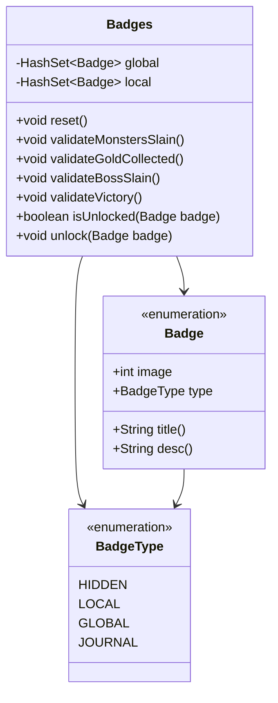

# Badges 类文档

## 1. 基本信息
| 属性 | 值 |
|------|-----|
| 文件路径 | core/src/main/java/com/shatteredpixel/shatteredpixeldungeon/Badges.java |
| 包名 | com.shatteredpixel.shatteredpixeldungeon |
| 类类型 | public class |
| 继承关系 | 无（顶层类） |
| 代码行数 | 1397 行 |

## 2. 类职责说明
Badges 类管理游戏的成就系统。它定义了所有可获得的徽章（成就），处理徽章的解锁、保存和显示。徽章分为本地徽章（单局游戏有效）、全局徽章（跨游戏持久化）和日志徽章（与日志系统关联，即使在种子游戏中也能解锁）。

## 4. 继承与协作关系


## 静态常量表
| 常量名 | 类型 | 值 | 说明 |
|--------|------|-----|------|
| BADGES_FILE | String | "badges.dat" | 徽章数据文件名 |
| BADGES | String | "badges" | Bundle中的徽章键名 |

## 实例字段表
| 字段名 | 类型 | 修饰符 | 说明 |
|--------|------|--------|------|
| global | HashSet&lt;Badge&gt; | private static | 全局已解锁徽章 |
| local | HashSet&lt;Badge&gt; | private static | 本局游戏解锁的徽章 |
| saveNeeded | boolean | private static | 是否需要保存 |

## 徽章枚举（Badge）

### 徽章类型（BadgeType）
| 类型 | 说明 |
|------|------|
| HIDDEN | 内部数据追踪，不显示 |
| LOCAL | 单局游戏有效，添加到全局配置 |
| GLOBAL | 跨多次游戏持久化 |
| JOURNAL | 基于日志，即使在种子游戏中也能解锁 |

### 铜牌徽章（Bronze）
| 徽章名 | 图标ID | 说明 |
|--------|--------|------|
| UNLOCK_MAGE | 1 | 解锁法师 |
| UNLOCK_ROGUE | 2 | 解锁盗贼 |
| UNLOCK_HUNTRESS | 3 | 解锁猎手 |
| UNLOCK_DUELIST | 4 | 解锁决斗者 |
| UNLOCK_CLERIC | 5 | 解锁牧师 |
| MONSTERS_SLAIN_1 | 6 | 击杀10个怪物 |
| MONSTERS_SLAIN_2 | 7 | 击杀50个怪物 |
| GOLD_COLLECTED_1 | 8 | 收集250金币 |
| GOLD_COLLECTED_2 | 9 | 收集1000金币 |
| ITEM_LEVEL_1 | 10 | 获得+3物品 |
| LEVEL_REACHED_1 | 11 | 达到6级 |
| STRENGTH_ATTAINED_1 | 12 | 力量达到12 |
| FOOD_EATEN_1 | 13 | 进食10次 |
| ITEMS_CRAFTED_1 | 14 | 炼金3次 |
| BOSS_SLAIN_1 | 15 | 击败第一个Boss |
| DEATH_FROM_FIRE | 17 | 死于火焰 |
| DEATH_FROM_POISON | 18 | 死于中毒 |
| DEATH_FROM_GAS | 19 | 死于气体 |
| DEATH_FROM_HUNGER | 20 | 死于饥饿 |
| DEATH_FROM_FALLING | 21 | 死于坠落 |
| GAMES_PLAYED_1 | 23 | 玩10局 |
| HIGH_SCORE_1 | 24 | 分数达到5000 |

### 银牌徽章（Silver）
| 徽章名 | 图标ID | 说明 |
|--------|--------|------|
| NO_MONSTERS_SLAIN | 32 | 不杀怪通关一层 |
| BOSS_SLAIN_REMAINS | 33 | 携带遗物击败Boss |
| MONSTERS_SLAIN_3~4 | 34-35 | 击杀100/250个怪物 |
| GOLD_COLLECTED_3~4 | 36-37 | 收集2500/7500金币 |
| BOSS_SLAIN_1_ALL_CLASSES | 54 | 用所有职业击败第一个Boss |
| GAMES_PLAYED_2 | 56 | 玩25局 |

### 金牌徽章（Gold）
| 徽章名 | 图标ID | 说明 |
|--------|--------|------|
| ENEMY_HAZARDS | 64 | 利用环境击杀10个敌人 |
| PIRANHAS | 65 | 击杀6条食人鱼 |
| GRIM_WEAPON | 66 | 使用冷酷武器击杀 |
| ALL_BAGS_BOUGHT | 67 | 购买所有容器袋 |
| VICTORY | 82 | 获胜 |
| BOSS_CHALLENGE_1~2 | 83-84 | 完成Boss挑战 |

### 白金徽章（Platinum）
| 徽章名 | 图标ID | 说明 |
|--------|--------|------|
| MANY_BUFFS | 96 | 同时拥有多个增益 |
| HAPPY_END | 99 | 幸福结局 |
| VICTORY_RANDOM | 100 | 随机职业获胜 |
| VICTORY_ALL_CLASSES | 103 | 用所有职业获胜 |
| DEATH_FROM_ALL | 104 | 经历所有死亡方式 |

### 钻石徽章（Diamond）
| 徽章名 | 图标ID | 说明 |
|--------|--------|------|
| PACIFIST_ASCENT | 120 | 和平飞升 |
| BOSS_CHALLENGE_5 | 122 | 完成最终Boss挑战 |
| CHAMPION_1~3 | 126-127 | 挑战者徽章 |

## 7. 方法详解

### reset
**签名**: `public static void reset()`
**功能**: 重置本地徽章
**实现逻辑**: 
```java
// 第252-255行
local.clear();                                        // 清除本地徽章
loadGlobal();                                         // 加载全局徽章
```

### validateMonstersSlain
**签名**: `public static void validateMonstersSlain()`
**功能**: 验证击杀怪物徽章
**实现逻辑**: 
```java
// 第351-380行
// 检查各个击杀数量的徽章
if (!local.contains(Badge.MONSTERS_SLAIN_1) && Statistics.enemiesSlain >= 10) {
    badge = Badge.MONSTERS_SLAIN_1;
    local.add(badge);
}
// 依次检查50、100、250、500
displayBadge(badge);
```

### validateBossSlain
**签名**: `public static void validateBossSlain()`
**功能**: 验证Boss击杀徽章
**实现逻辑**: 
```java
// 第838-908行
Badge badge = null;
switch (Dungeon.depth) {
    case 5: badge = Badge.BOSS_SLAIN_1; break;         // 第一个Boss
    case 10: badge = Badge.BOSS_SLAIN_2; break;        // 第二个Boss
    case 15: badge = Badge.BOSS_SLAIN_3; break;        // 第三个Boss
    case 20: badge = Badge.BOSS_SLAIN_4; break;        // 第四个Boss
}

if (badge != null) {
    local.add(badge);
    displayBadge(badge);
    
    // 处理职业相关徽章
    if (badge == Badge.BOSS_SLAIN_1) {
        badge = firstBossClassBadges.get(Dungeon.hero.heroClass);
        // 检查是否用所有职业击败
    }
}
```

### validateVictory
**签名**: `public static void validateVictory()`
**功能**: 验证获胜徽章
**实现逻辑**: 
```java
// 第1016-1047行
Badge badge = Badge.VICTORY;
local.add(badge);
displayBadge(badge);

// 检查随机获胜徽章
if (Statistics.qualifiedForRandomVictoryBadge
        && Dungeon.hero.subClass != null
        && Dungeon.hero.armorAbility != null){
    badge = Badge.VICTORY_RANDOM;
    local.add(badge);
    displayBadge(badge);
}

// 检查职业获胜徽章
badge = victoryClassBadges.get(Dungeon.hero.heroClass);
// 检查是否所有职业都获胜
```

### isUnlocked / unlock
**签名**: 
- `public static boolean isUnlocked(Badge badge)`
- `public static void unlock(Badge badge)`

**功能**: 检查/解锁徽章
**实现逻辑**: 
```java
// isUnlocked - 第1194-1196行
return global.contains(badge);

// unlock - 第1209-1214行
if (!isUnlocked(badge) && (badge.type == BadgeType.JOURNAL || Dungeon.customSeedText.isEmpty())){
    global.add(badge);
    saveNeeded = true;
}
```

### displayBadge
**签名**: `private static void displayBadge(Badge badge)`
**功能**: 显示徽章解锁通知
**实现逻辑**: 
```java
// 第1171-1192行
if (badge == null || (badge.type != BadgeType.JOURNAL && !Dungeon.customSeedText.isEmpty())) {
    return;                                            // 种子游戏不显示非日志徽章
}

if (isUnlocked(badge)) {
    // 已解锁，显示"已认可"
    GLog.h(Messages.get(Badges.class, "endorsed", badge.title()));
} else {
    // 新解锁
    unlock(badge);
    GLog.h(Messages.get(Badges.class, "new", badge.title() + " (" + badge.desc() + ")"));
    PixelScene.showBadge(badge);                       // 显示徽章界面
}
```

## 11. 使用示例
```java
// 验证击杀徽章
Statistics.enemiesSlain++;
Badges.validateMonstersSlain();

// 验证Boss击杀
Badges.validateBossSlain();

// 验证获胜
Badges.validateVictory();

// 检查徽章是否解锁
if (Badges.isUnlocked(Badge.VICTORY)) {
    // 特殊处理
}
```

## 注意事项
1. **种子游戏限制**: 在种子游戏中，只有JOURNAL类型徽章可以解锁
2. **徽章持久化**: GLOBAL和JOURNAL类型徽章会跨游戏保存
3. **验证时机**: 每次相关统计更新时调用对应的验证方法

## 最佳实践
1. 在统计更新后立即调用对应的验证方法
2. 使用 Badge.title() 和 Badge.desc() 获取本地化文本
3. 使用 filterReplacedBadges() 过滤显示时只保留最高级徽章