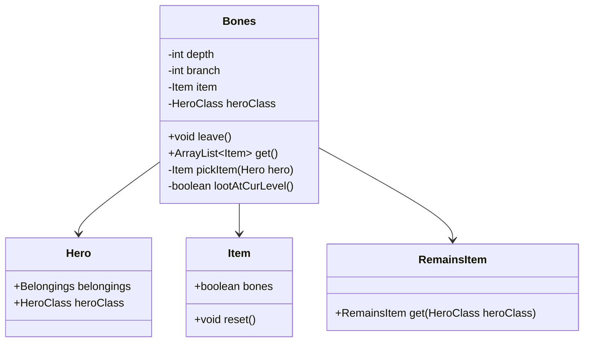

# Bones 类文档

## 1. 基本信息
| 属性 | 值 |
|------|-----|
| 文件路径 | core/src/main/java/com/shatteredpixel/shatteredpixeldungeon/Bones.java |
| 包名 | com.shatteredpixel.shatteredpixeldungeon |
| 类类型 | public class |
| 继承关系 | 无（顶层类） |
| 代码行数 | 272 行 |

## 2. 类职责说明
Bones 类管理游戏中的"遗骸"系统——当英雄死亡时，会留下一个遗骸物品，在后续游戏中可以被其他角色发现。这个系统允许玩家在死亡后获得部分装备物品，增加游戏的连贯性和趣味性。

## 4. 继承与协作关系


## 静态常量表
| 常量名 | 类型 | 值 | 说明 |
|--------|------|-----|------|
| BONES_FILE | String | "bones.dat" | 遗骸数据文件名 |
| LEVEL | String | "level" | 深度键名 |
| BRANCH | String | "branch" | 分支键名 |
| ITEM | String | "item" | 物品键名 |
| HERO_CLASS | String | "hero_class" | 英雄职业键名 |

## 实例字段表
| 字段名 | 类型 | 修饰符 | 说明 |
|--------|------|--------|------|
| depth | int | private static | 遗骸所在深度 |
| branch | int | private static | 遗骸所在分支 |
| item | Item | private static | 遗骸物品 |
| heroClass | HeroClass | private static | 死亡英雄的职业 |

## 7. 方法详解

### leave
**签名**: `public static void leave()`
**功能**: 英雄死亡时留下遗骸
**参数**: 无
**返回值**: 无
**实现逻辑**: 
```java
// 第56-84行
// 遗骸掉落在英雄死亡位置，但最多在最低到达层之上5层
depth = Math.max(Dungeon.depth, Statistics.deepestFloor-5);
branch = Dungeon.branch;

// 每日挑战不产生遗骸
if (Dungeon.daily) {
    depth = branch = -1;
    return;
}

item = pickItem(Dungeon.hero);                         // 选择要留下的物品
heroClass = Dungeon.hero.heroClass;                    // 记录职业

// 保存遗骸数据
Bundle bundle = new Bundle();
bundle.put( LEVEL, depth );
bundle.put( BRANCH, branch );
bundle.put( ITEM, item );
bundle.put( HERO_CLASS, heroClass );

FileUtils.bundleToFile( BONES_FILE, bundle );
```

### pickItem
**签名**: `private static Item pickItem(Hero hero)`
**功能**: 选择要留下的物品
**参数**: `hero` - 死亡的英雄
**返回值**: 选中的物品
**实现逻辑**: 
```java
// 第86-152行
Item item = null;

// 种子游戏不留下物品（防止作弊传输）
if (!Dungeon.customSeedText.isEmpty()){
    return null;
}

// 2/3概率从装备中选择
if (Random.Int(3) != 0) {
    switch (Random.Int(7)) {
        case 0:
            item = hero.belongings.weapon;
            // 如果有两个武器（决斗者），选择更强的
            if (hero.belongings.secondWep != null &&
                    (item == null || hero.belongings.secondWep.trueLevel() > item.trueLevel())){
                item = hero.belongings.secondWep;
            }
            break;
        case 1: item = hero.belongings.armor; break;
        case 2: item = hero.belongings.artifact; break;
        case 3: item = hero.belongings.misc; break;
        case 4: item = hero.belongings.ring; break;
        case 5: case 6:
            item = Dungeon.quickslot.randomNonePlaceholder(); break;
    }
    if (item == null || !item.bones) {
        return pickItem(hero);                          // 重新选择
    }
} else {
    // 1/3概率从背包中选择
    Iterator<Item> iterator = hero.belongings.backpack.iterator();
    ArrayList<Item> items = new ArrayList<>();
    while (iterator.hasNext()){
        curItem = iterator.next();
        if (curItem.bones) {
            items.add(curItem);
        }
    }
    
    // 物品越少，越可能什么都不留
    if (Random.Int(3) < items.size()) {
        item = Random.element(items);
        if (item.stackable){
            item.quantity(Random.NormalIntRange(1, (item.quantity() + 1) / 2));
            if (item.quantity() > 3){
                item.quantity(3);                        // 最多3个
            }
        }
    }
}

return item;
```

### get
**签名**: `public static ArrayList<Item> get()`
**功能**: 获取当前层的遗骸物品
**参数**: 无
**返回值**: 遗骸物品列表
**实现逻辑**: 
```java
// 第154-258行
// 每日挑战不产生遗骸
if (Dungeon.daily){
    return null;
}

if (depth == -1) {
    // 首次调用，从文件加载
    Bundle bundle = FileUtils.bundleFromFile(BONES_FILE);
    depth = bundle.getInt( LEVEL );
    branch = bundle.getInt( BRANCH );
    if (depth > 0) {
        item = (Item) bundle.get(ITEM);
        heroClass = bundle.getEnum(HERO_CLASS, HeroClass.class);
    }
    return get();
} else {
    if (lootAtCurLevel()) {
        // 清空遗骸文件
        Bundle emptyBones = new Bundle();
        emptyBones.put(LEVEL, 0);
        FileUtils.bundleToFile( BONES_FILE, emptyBones );
        depth = 0;
        
        // 挑战或种子游戏不获得物品
        if (Dungeon.challenges != 0 || !Dungeon.customSeedText.isEmpty()){
            item = null;
        }
        
        // 处理神器唯一性
        if (item instanceof Artifact){
            if (Generator.removeArtifact(((Artifact)item).getClass())) {
                Artifact artifact = Reflection.newInstance(((Artifact)item).getClass());
                if (artifact != null){
                    artifact.cursed = true;
                    artifact.cursedKnown = true;
                }
                item = artifact;
            } else {
                item = new Gold(item.value());           // 替换为金币
            }
        }
        
        if (item != null) {
            // 可升级物品变为诅咒
            if (item.isUpgradable() && !(item instanceof MissileWeapon)) {
                item.cursed = true;
                item.cursedKnown = true;
            }
            
            // 等级上限+3
            if (item.isUpgradable()) {
                if (item.level() > 3) {
                    item.degrade(item.level() - 3);
                }
                item.levelKnown = item instanceof MissileWeapon;
            }
            item.reset();
        }
        
        ArrayList<Item> result = new ArrayList<>();
        
        if (heroClass != null) {
            result.add(RemainsItem.get(heroClass));      // 添加遗骸物品
            if (Dungeon.bossLevel()){
                Statistics.qualifiedForBossRemainsBadge = true;
            }
        }
        
        if (item != null) {
            result.add(item);
        }
        
        return result.isEmpty() ? null : result;
    } else {
        return null;
    }
}
```

### lootAtCurLevel
**签名**: `private static boolean lootAtCurLevel()`
**功能**: 检查遗骸是否在当前层
**参数**: 无
**返回值**: 如果遗骸在当前层返回true
**实现逻辑**: 
```java
// 第260-271行
if (branch == Dungeon.branch) {
    if (branch == 0) {
        // 主线：精确匹配深度
        return depth == Dungeon.depth;
    } else if (branch == 1) {
        // 支线：匹配区域即可
        return depth/5 == Dungeon.depth/5;
    }
}
return false;
```

## 11. 使用示例
```java
// 英雄死亡时
Bones.leave();

// 在新游戏中检查遗骸
ArrayList<Item> remains = Bones.get();
if (remains != null) {
    for (Item item : remains) {
        Dungeon.level.drop(item, Dungeon.level.entrance());
    }
}
```

## 注意事项
1. **每日挑战限制**: 每日挑战不会产生或获得遗骸
2. **种子游戏限制**: 种子游戏不会留下物品
3. **神器处理**: 神器如果已被发现，会替换为金币
4. **诅咒物品**: 遗骸物品通常会被诅咒

## 最佳实践
1. 在英雄死亡后调用 leave() 留下遗骸
2. 在进入新关卡时调用 get() 检查遗骸
3. 使用 RemainsItem 显示死亡英雄的信息