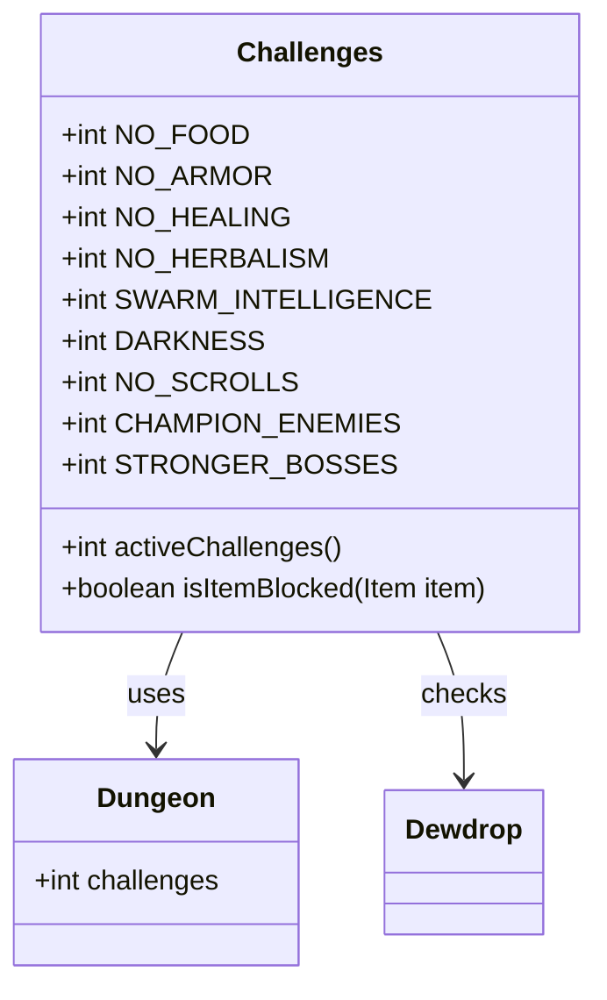

# Challenges 类文档

## 1. 基本信息
| 属性 | 值 |
|------|-----|
| 文件路径 | core/src/main/java/com/shatteredpixel/shatteredpixeldungeon/Challenges.java |
| 包名 | com.shatteredpixel.shatteredpixeldungeon |
| 类类型 | public class |
| 继承关系 | 无（顶层类） |
| 代码行数 | 81 行 |

## 2. 类职责说明
Challenges 类定义了游戏中的挑战系统。挑战是可选的游戏难度修改器，激活后会改变游戏规则，增加游戏难度但也会提高分数倍率。该类提供挑战的常量定义、名称映射和物品限制检查功能。

## 4. 继承与协作关系


## 静态常量表
| 常量名 | 类型 | 值 | 说明 |
|--------|------|-----|------|
| NO_FOOD | int | 1 | 食物短缺挑战（饥饿加速） |
| NO_ARMOR | int | 2 | 无护甲挑战（护甲效果降低） |
| NO_HEALING | int | 4 | 无治疗挑战（生命药水效果降低） |
| NO_HERBALISM | int | 8 | 无草药挑战（露珠不回复生命） |
| SWARM_INTELLIGENCE | int | 16 | 虫群智慧挑战（敌人协同行动） |
| DARKNESS | int | 32 | 黑暗挑战（视野受限） |
| NO_SCROLLS | int | 64 | 无卷轴挑战（升级卷轴减少） |
| CHAMPION_ENEMIES | int | 128 | 精英敌人挑战（敌人有特殊能力） |
| STRONGER_BOSSES | int | 256 | 强化Boss挑战（Boss更强） |
| MAX_VALUE | int | 511 | 最大挑战值（所有挑战激活） |
| MAX_CHALS | int | 9 | 挑战总数 |

### NAME_IDS 数组
挑战名称ID数组，用于本地化：
```java
"champion_enemies", "stronger_bosses", "no_food", "no_armor",
"no_healing", "no_herbalism", "swarm_intelligence", "darkness", "no_scrolls"
```

### MASKS 数组
挑战掩码数组，与NAME_IDS对应：
```java
CHAMPION_ENEMIES, STRONGER_BOSSES, NO_FOOD, NO_ARMOR,
NO_HEALING, NO_HERBALISM, SWARM_INTELLIGENCE, DARKNESS, NO_SCROLLS
```

## 7. 方法详解

### activeChallenges
**签名**: 
- `public static int activeChallenges()`
- `public static int activeChallenges(int mask)`

**功能**: 计算激活的挑战数量
**参数**: `mask` - 挑战掩码（可选，默认使用Dungeon.challenges）
**返回值**: 激活的挑战数量
**实现逻辑**: 
```java
// 第59-69行
int chCount = 0;
for (int ch : Challenges.MASKS){
    if ((mask & ch) != 0) chCount++;                    // 位运算检查每个挑战
}
return chCount;
```

### isItemBlocked
**签名**: `public static boolean isItemBlocked(Item item)`
**功能**: 检查物品是否被挑战限制
**参数**: `item` - 要检查的物品
**返回值**: 如果物品被阻止返回true
**实现逻辑**: 
```java
// 第71-79行
if (Dungeon.isChallenged(NO_HERBALISM) && item instanceof Dewdrop){
    return true;                                        // 无草药挑战下露珠无效
}
return false;
```

## 挑战详细说明

### NO_FOOD（食物短缺）
- 饥饿速度加快
- 食物效果降低
- 更难维持生命值

### NO_ARMOR（无护甲）
- 护甲提供的防御大幅降低
- 依赖闪避和格挡
- 更容易被击败

### NO_HEALING（无治疗）
- 生命药水效果降低
- 治疗来源稀缺
- 需要更谨慎的战斗策略

### NO_HERBALISM（无草药）
- 露珠不回复生命
- 植物效果受限
- 更依赖其他治疗方式

### SWARM_INTELLIGENCE（虫群智慧）
- 敌人能够看到更远的目标
- 一个敌人发现玩家后会通知其他敌人
- 更难单独应对敌人

### DARKNESS（黑暗）
- 视野范围受限
- 需要光源
- 更容易被伏击

### NO_SCROLLS（无卷轴）
- 升级卷轴掉落减少
- 物品升级更困难
- 需要更谨慎使用升级资源

### CHAMPION_ENEMIES（精英敌人）
- 随机敌人获得特殊能力
- 敌人更强但奖励更多
- 战斗更具挑战性

### STRONGER_BOSSES（强化Boss）
- Boss拥有更多生命值
- Boss攻击更强
- Boss有新的攻击模式

## 11. 使用示例
```java
// 检查是否激活了特定挑战
if (Dungeon.isChallenged(Challenges.NO_FOOD)) {
    // 食物效果降低
    hunger = hunger * 1.5f;
}

// 获取激活的挑战数量
int activeCount = Challenges.activeChallenges();

// 计算分数倍率
float multiplier = (float)Math.pow(1.25, Challenges.activeChallenges());

// 检查物品是否被限制
if (Challenges.isItemBlocked(item)) {
    // 物品无法使用
    return;
}
```

## 注意事项
1. **位掩码**: 使用位运算管理多个挑战的激活状态
2. **分数加成**: 每个激活的挑战增加25%的分数倍率
3. **组合效果**: 多个挑战可以同时激活

## 最佳实践
1. 使用 `Dungeon.isChallenged(mask)` 检查特定挑战
2. 使用 `activeChallenges()` 计算分数倍率
3. 使用 `isItemBlocked()` 检查物品是否可用