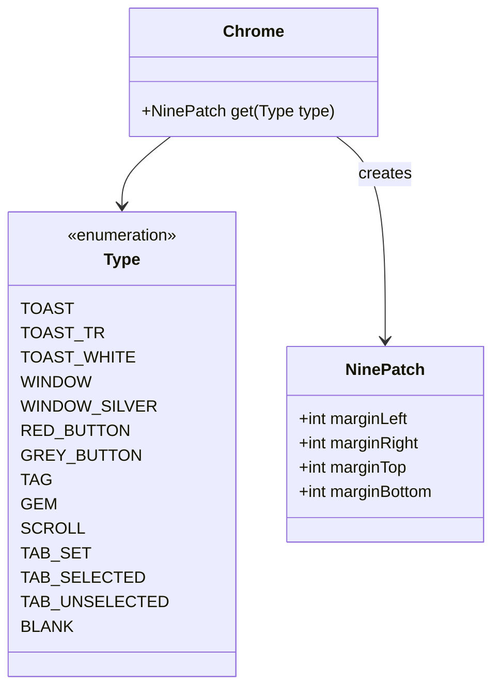

# Chrome 类文档

## 1. 基本信息
| 属性 | 值 |
|------|-----|
| 文件路径 | core/src/main/java/com/shatteredpixel/shatteredpixeldungeon/Challenges.java |
| 包名 | com.shatteredpixel.shatteredpixeldungeon |
| 类类型 | public class |
| 继承关系 | 无（顶层类） |
| 代码行数 | 85 行 |

## 2. 类职责说明
Chrome 类是一个简单的UI工具类，用于创建各种UI元素的九宫格边框。它定义了不同类型的UI组件外观，如窗口、按钮、标签等，通过九宫格（NinePatch）实现可伸缩的UI边框渲染。

## 4. 继承与协作关系


## 静态常量表

### Type 枚举
| 枚举值 | 说明 |
|--------|------|
| TOAST | 标准提示框边框 |
| TOAST_TR | 透明提示框边框 |
| TOAST_TR_HEAVY | 重透明提示框边框 |
| TOAST_WHITE | 白色提示框边框 |
| WINDOW | 标准窗口边框 |
| WINDOW_SILVER | 银色窗口边框 |
| RED_BUTTON | 红色按钮边框 |
| GREY_BUTTON | 灰色按钮边框 |
| GREY_BUTTON_TR | 透明灰色按钮边框 |
| TAG | 标签边框 |
| GEM | 宝石边框 |
| SCROLL | 卷轴边框 |
| TAB_SET | 标签页容器边框 |
| TAB_SELECTED | 选中的标签页边框 |
| TAB_UNSELECTED | 未选中的标签页边框 |
| BLANK | 空白边框（无可见边框） |

## 7. 方法详解

### get
**签名**: `public static NinePatch get(Type type)`
**功能**: 获取指定类型的九宫格边框
**参数**: `type` - 边框类型
**返回值**: 对应的NinePatch实例
**实现逻辑**: 
```java
// 第47-84行
String Asset = Assets.Interfaces.CHROME;
switch (type) {
    case WINDOW:
        return new NinePatch( Asset, 0, 0, 20, 20, 6 );      // 标准窗口
    case WINDOW_SILVER:
        return new NinePatch( Asset, 86, 0, 22, 22, 7 );     // 银色窗口
    case TOAST:
        return new NinePatch( Asset, 20, 0, 9, 9, 4 );       // 标准提示
    case TOAST_TR:
    case GREY_BUTTON_TR:
        return new NinePatch( Asset, 20, 9, 9, 9, 4 );       // 透明提示
    case TOAST_TR_HEAVY:
        return new NinePatch( Asset, 29, 9, 9, 9, 4 );       // 重透明提示
    case TOAST_WHITE:
        return new NinePatch( Asset, 29, 0, 9, 9, 4 );       // 白色提示
    case RED_BUTTON:
        return new NinePatch( Asset, 38, 0, 6, 6, 2 );       // 红色按钮
    case GREY_BUTTON:
        return new NinePatch( Asset, 38, 6, 6, 6, 2 );       // 灰色按钮
    case TAG:
        return new NinePatch( Asset, 22, 18, 16, 14, 3 );    // 标签
    case GEM:
        return new NinePatch( Asset, 0, 32, 32, 32, 13 );    // 宝石
    case SCROLL:
        return new NinePatch( Asset, 32, 32, 32, 32, 5, 11, 5, 11 );  // 卷轴
    case TAB_SET:
        return new NinePatch( Asset, 64, 0, 20, 20, 6 );      // 标签容器
    case TAB_SELECTED:
        return new NinePatch( Asset, 65, 22, 8, 13, 3, 7, 3, 5 );  // 选中标签
    case TAB_UNSELECTED:
        return new NinePatch( Asset, 75, 22, 8, 13, 3, 7, 3, 5 );  // 未选中标签
    case BLANK:
        return new NinePatch( Asset, 45, 0, 1, 1, 0, 0, 0, 0 );     // 空白
    default:
        return null;
}
```

## 11. 使用示例
```java
// 创建窗口边框
NinePatch windowBg = Chrome.get(Chrome.Type.WINDOW);
windowBg.setSize(200, 150);
add(windowBg);

// 创建按钮
NinePatch buttonBg = Chrome.get(Chrome.Type.RED_BUTTON);
buttonBg.setSize(100, 20);
add(buttonBg);

// 创建提示框
NinePatch toastBg = Chrome.get(Chrome.Type.TOAST);
toastBg.setSize(textWidth + 20, textHeight + 10);
add(toastBg);
```

## 注意事项
1. **九宫格参数**: NinePatch构造函数接受图片资源、起始坐标、尺寸和边距
2. **边距说明**: 最后一个或四个参数定义了可伸缩区域的边距
3. **资源来源**: 所有边框使用 Assets.Interfaces.CHROME 图片资源

## 最佳实践
1. 使用枚举类型选择边框样式，避免硬编码
2. 创建UI组件时复用边框实例
3. 根据内容大小调整边框尺寸