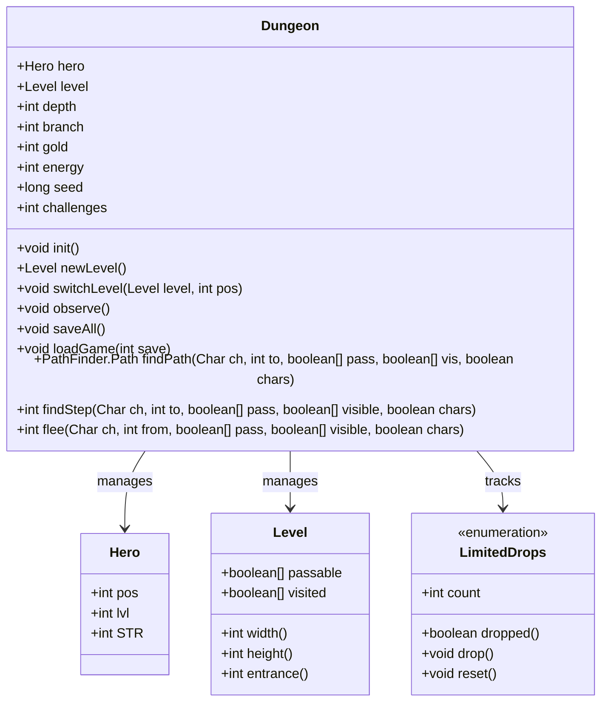

# Dungeon 类文档

## 1. 基本信息
| 属性 | 值 |
|------|-----|
| 文件路径 | core/src/main/java/com/shatteredpixel/shatteredpixeldungeon/Dungeon.java |
| 包名 | com.shatteredpixel.shatteredpixeldungeon |
| 类类型 | public class |
| 继承关系 | 无（顶层类） |
| 代码行数 | 1093 行 |

## 2. 类职责说明
Dungeon 类是游戏的核心管理类，负责管理整个游戏世界的状态。它包含当前关卡、英雄、游戏进度、保存/加载系统、视野计算、路径查找等核心功能。这是游戏中最重要的基础架构类之一，几乎所有的游戏逻辑都与此类交互。

## 4. 继承与协作关系


## 静态常量表
| 常量名 | 类型 | 值 | 说明 |
|--------|------|-----|------|
| INIT_VER | String | "init_ver" | 初始版本键名 |
| VERSION | String | "version" | 版本键名 |
| SEED | String | "seed" | 种子键名 |
| CUSTOM_SEED | String | "custom_seed" | 自定义种子键名 |
| DAILY | String | "daily" | 每日挑战键名 |
| HERO | String | "hero" | 英雄键名 |
| DEPTH | String | "depth" | 深度键名 |
| BRANCH | String | "branch" | 分支键名 |
| GOLD | String | "gold" | 金币键名 |
| ENERGY | String | "energy" | 能量键名 |
| LEVEL | String | "level" | 关卡键名 |

## 实例字段表
| 字段名 | 类型 | 修饰符 | 说明 |
|--------|------|--------|------|
| challenges | int | public static | 当前激活的挑战掩码 |
| mobsToChampion | float | public static | 精英怪生成计数器 |
| hero | Hero | public static | 当前英雄实例 |
| level | Level | public static | 当前关卡实例 |
| quickslot | QuickSlot | public static | 快捷栏管理器 |
| depth | int | public static | 当前深度（层数） |
| branch | int | public static | 当前分支（0=主线，1=任务支线） |
| generatedLevels | ArrayList&lt;Integer&gt; | public static | 已生成的关卡列表 |
| gold | int | public static | 当前金币数量 |
| energy | int | public static | 当前能量数量 |
| chapters | HashSet&lt;Integer&gt; | public static | 已解锁章节 |
| droppedItems | SparseArray&lt;ArrayList&lt;Item&gt;&gt; | public static | 掉落物品记录 |
| initialVersion | int | public static | 游戏初始版本 |
| version | int | public static | 当前游戏版本 |
| daily | boolean | public static | 是否为每日挑战 |
| dailyReplay | boolean | public static | 是否为每日挑战重玩 |
| customSeedText | String | public static | 自定义种子文本 |
| seed | long | public static | 游戏种子 |
| lastPlayed | long | public static | 最后游玩时间 |
| passable | boolean[] | private static | 可通行数组（用于路径查找） |

## 7. 方法详解

### initSeed
**签名**: `public static void initSeed()`
**功能**: 初始化游戏种子
**参数**: 无
**返回值**: 无
**实现逻辑**: 
```java
// 第217-231行
if (daily) {
    // 每日挑战使用特殊种子（超出用户可输入范围）
    seed = SPDSettings.lastDaily() + DungeonSeed.TOTAL_SEEDS;
    // 设置显示文本为日期
    DateFormat format = new SimpleDateFormat("yyyy-MM-dd", Locale.ROOT);
    format.setTimeZone(TimeZone.getTimeZone("UTC"));
    customSeedText = format.format(new Date(SPDSettings.lastDaily()));
} else if (!SPDSettings.customSeed().isEmpty()){
    // 使用自定义种子
    customSeedText = SPDSettings.customSeed();
    seed = DungeonSeed.convertFromText(customSeedText);
} else {
    // 随机种子
    customSeedText = "";
    seed = DungeonSeed.randomSeed();
}
```

### init
**签名**: `public static void init()`
**功能**: 初始化新游戏
**参数**: 无
**返回值**: 无
**实现逻辑**: 
```java
// 第233-287行
initialVersion = version = Game.versionCode;           // 记录版本
challenges = SPDSettings.challenges();                 // 加载挑战设置
mobsToChampion = 1;                                    // 重置精英计数

Actor.clear();                                         // 清除所有Actor
Actor.resetNextID();                                   // 重置ID计数器

Random.pushGenerator( seed+1 );                        // 设置随机数生成器
    Scroll.initLabels();                               // 初始化卷轴标签
    Potion.initColors();                               // 初始化药水颜色
    Ring.initGems();                                   // 初始化戒指宝石
    SpecialRoom.initForRun();                          // 初始化特殊房间
    SecretRoom.initForRun();                           // 初始化秘密房间
    Generator.fullReset();                             // 重置物品生成器
Random.resetGenerators();

Statistics.reset();                                    // 重置统计
Notes.reset();                                         // 重置笔记
quickslot.reset();                                     // 重置快捷栏
QuickSlotButton.reset();                               // 重置快捷栏按钮
Toolbar.swappedQuickslots = false;

depth = 1;                                             // 起始深度
branch = 0;                                            // 主线分支
generatedLevels.clear();                               // 清除已生成关卡

gold = 0;                                              // 初始金币
energy = 0;                                            // 初始能量

droppedItems = new SparseArray<>();                    // 初始化掉落物品
LimitedDrops.reset();                                  // 重置限制掉落
chapters = new HashSet<>();                            // 重置章节

// 重置所有任务
Ghost.Quest.reset();
Wandmaker.Quest.reset();
Blacksmith.Quest.reset();
Imp.Quest.reset();

hero = new Hero();                                     // 创建英雄
hero.live();                                           // 激活英雄
Badges.reset();                                        // 重置徽章
GamesInProgress.selectedClass.initHero( hero );        // 初始化英雄
```

### isChallenged
**签名**: `public static boolean isChallenged(int mask)`
**功能**: 检查指定挑战是否激活
**参数**: `mask` - 挑战掩码
**返回值**: 如果挑战激活返回true
**实现逻辑**: 
```java
// 第289-291行
return (challenges & mask) != 0;                       // 位运算检查
```

### newLevel
**签名**: `public static Level newLevel()`
**功能**: 创建新关卡
**参数**: 无
**返回值**: 新创建的关卡实例
**实现逻辑**: 
```java
// 第297-404行
Dungeon.level = null;
Actor.clear();

Level level;
if (branch == 0) {
    // 主线分支：根据深度创建对应关卡
    switch (depth) {
        case 1-4: level = new SewerLevel(); break;     // 下水道
        case 5: level = new SewerBossLevel(); break;   // 下水道Boss
        case 6-9: level = new PrisonLevel(); break;    // 监狱
        case 10: level = new PrisonBossLevel(); break; // 监狱Boss
        case 11-14: level = new CavesLevel(); break;   // 洞穴
        case 15: level = new CavesBossLevel(); break;  // 洞穴Boss
        case 16-19: level = new CityLevel(); break;    // 城市
        case 20: level = new CityBossLevel(); break;   // 城市Boss
        case 21-24: level = new HallsLevel(); break;   // 大厅
        case 25: level = new HallsBossLevel(); break;  // 大厅Boss
        case 26: level = new LastLevel(); break;       // 最终关卡
        default: level = new DeadEndLevel();           // 死胡同
    }
} else if (branch == 1) {
    // 任务分支
    switch (depth) {
        case 11-14: level = new MiningLevel(); break;  // 矿山
        case 16-19: level = new VaultLevel(); break;   // 金库
        default: level = new DeadEndLevel();
    }
} else {
    level = new DeadEndLevel();
}

// 记录已生成的关卡
if (!(level instanceof DeadEndLevel || level instanceof VaultLevel)){
    if (!generatedLevels.contains(depth + 1000*branch)) {
        generatedLevels.add(depth + 1000 * branch);
    }
    // 更新最深层数
    if (depth > Statistics.deepestFloor && branch == 0) {
        Statistics.deepestFloor = depth;
    }
}

level.create();                                        // 生成关卡

return level;
```

### seedCurDepth / seedForDepth
**签名**: `public static long seedCurDepth()` / `public static long seedForDepth(int depth, int branch)`
**功能**: 获取当前/指定深度的种子
**参数**: `depth` - 深度，`branch` - 分支
**返回值**: 该深度的种子值
**实现逻辑**: 
```java
// 第414-431行
int lookAhead = depth;
lookAhead += 30*branch;                                // 分支偏移

Random.pushGenerator( seed );
    for (int i = 0; i < lookAhead; i ++) {
        Random.Long();                                 // 跳过前面的随机数
    }
    long result = Random.Long();                       // 获取该深度的种子
Random.popGenerator();
return result;
```

### shopOnLevel
**签名**: `public static boolean shopOnLevel()`
**功能**: 检查当前层是否有商店
**参数**: 无
**返回值**: 如果有商店返回true
**实现逻辑**: 
```java
// 第433-435行
return depth == 6 || depth == 11 || depth == 16;       // 第6、11、16层有商店
```

### bossLevel
**签名**: `public static boolean bossLevel()` / `public static boolean bossLevel(int depth)`
**功能**: 检查当前/指定层是否为Boss层
**参数**: `depth` - 深度（可选）
**返回值**: 如果是Boss层返回true
**实现逻辑**: 
```java
// 第437-443行
return depth == 5 || depth == 10 || depth == 15 || depth == 20 || depth == 25;
// 第5、10、15、20、25层为Boss层
```

### scalingDepth
**签名**: `public static int scalingDepth()`
**功能**: 获取用于伤害缩放的深度值
**参数**: 无
**返回值**: 缩放深度
**实现逻辑**: 
```java
// 第447-453行
if (Dungeon.hero != null && Dungeon.hero.buff(AscensionChallenge.class) != null){
    return 26;                                         // 飞升挑战时使用最大深度
} else {
    return depth;
}
```

### switchLevel
**签名**: `public static void switchLevel(final Level level, int pos)`
**功能**: 切换到指定关卡
**参数**: `level` - 目标关卡，`pos` - 英雄位置
**返回值**: 无
**实现逻辑**: 
```java
// 第464-518行
// 处理特殊位置
if (pos == -2){
    LevelTransition t = level.getTransition(LevelTransition.Type.REGULAR_EXIT);
    if (t != null) pos = t.cell();
}

// 处理无效位置
if (pos < 0 || pos >= level.length() || level.invalidHeroPos(pos)){
    pos = level.getTransition(null).cell();
}

PathFinder.setMapSize(level.width(), level.height());

Dungeon.level = level;
hero.pos = pos;

// 处理飞升挑战
if (hero.buff(AscensionChallenge.class) != null){
    hero.buff(AscensionChallenge.class).onLevelSwitch();
}

Mob.restoreAllies( level, pos );                       // 恢复友军

Actor.init();                                          // 初始化Actor系统
level.addRespawner();                                  // 添加怪物重生器

// 处理英雄位置重叠的怪物
for(Mob m : level.mobs){
    if (m.pos == hero.pos && !Char.hasProp(m, Char.Property.IMMOVABLE)){
        for(int i : PathFinder.NEIGHBOURS8){
            if (Actor.findChar(m.pos+i) == null && level.passable[m.pos + i]){
                m.pos += i;
                break;
            }
        }
    }
}

// 设置视野距离
Light light = hero.buff( Light.class );
hero.viewDistance = light == null ? level.viewDistance : Math.max( Light.DISTANCE, level.viewDistance );

hero.curAction = hero.lastAction = null;

observe();                                             // 更新视野
saveAll();                                             // 保存游戏
```

### observe
**签名**: `public static void observe()` / `public static void observe(int dist)`
**功能**: 更新英雄视野
**参数**: `dist` - 视野距离（可选）
**返回值**: 无
**实现逻辑**: 
```java
// 第897-1019行
// 计算视野距离
int dist = Math.max(Dungeon.hero.viewDistance, 8);
dist *= 1f + 0.25f*Dungeon.hero.pointsInTalent(Talent.FARSIGHT);
if (Dungeon.hero.buff(MagicalSight.class) != null){
    dist = Math.max( dist, MagicalSight.DISTANCE );
}

level.updateFieldOfView(hero, level.heroFOV);          // 更新视野数组

// 计算视野范围
int x = hero.pos % level.width();
int y = hero.pos / level.width();
int l = Math.max( 0, x - dist );
int r = Math.min( x + dist, level.width() - 1 );
int t = Math.max( 0, y - dist );
int b = Math.min( y + dist, level.height() - 1 );

// 更新已访问区域
for (int i = t; i <= b; i++) {
    BArray.or( level.visited, level.heroFOV, pos, width, level.visited );
    pos+=level.width();
}

// 始终访问相邻格子
for (int i : PathFinder.NEIGHBOURS9){
    level.visited[hero.pos+i] = true;
}

GameScene.updateFog(l, t, width, height);              // 更新战争迷雾

// 处理心灵视野、神圣感知等特殊视野
// ...

GameScene.afterObserve();                              // 视野更新后处理
```

### findPath / findStep / flee
**签名**: 
- `public static PathFinder.Path findPath(Char ch, int to, boolean[] pass, boolean[] vis, boolean chars)`
- `public static int findStep(Char ch, int to, boolean[] pass, boolean[] visible, boolean chars)`
- `public static int flee(Char ch, int from, boolean[] pass, boolean[] visible, boolean chars)`

**功能**: 路径查找相关方法
**参数**: 
- `ch` - 角色
- `to/from` - 目标/逃跑位置
- `pass` - 可通行数组
- `vis/visible` - 可见数组
- `chars` - 是否考虑其他角色

**返回值**: 路径或位置
**实现逻辑**: 
```java
// findPath - 第1060-1064行
return PathFinder.find( ch.pos, to, findPassable(ch, pass, vis, chars) );

// findStep - 第1066-1074行
if (Dungeon.level.adjacent( ch.pos, to )) {
    return Actor.findChar( to ) == null && pass[to] ? to : -1;
}
return PathFinder.getStep( ch.pos, to, findPassable(ch, pass, visible, chars) );

// flee - 第1076-1091行
boolean[] passable = findPassable(ch, pass, visible, false, true);
passable[ch.pos] = true;

// 恐惧效果的角色有更短的逃跑距离
boolean canApproachFromPos = ch.buff(Terror.class) == null && ch.buff(Dread.class) == null;
int step = PathFinder.getStepBack( ch.pos, from, canApproachFromPos ? 8 : 4, passable, canApproachFromPos );

// 避开其他角色
while (step != -1 && Actor.findChar(step) != null && chars){
    passable[step] = false;
    step = PathFinder.getStepBack( ch.pos, from, canApproachFromPos ? 8 : 4, passable, canApproachFromPos );
}
return step;
```

### saveGame / saveLevel / saveAll
**签名**: 
- `public static void saveGame(int save)`
- `public static void saveLevel(int save)`
- `public static void saveAll()`

**功能**: 保存游戏数据
**参数**: `save` - 存档槽位
**返回值**: 无
**实现逻辑**: 
```java
// saveGame - 第624-697行
Bundle bundle = new Bundle();
bundle.put( INIT_VER, initialVersion );
bundle.put( VERSION, version = Game.versionCode );
bundle.put( SEED, seed );
bundle.put( HERO, hero );
bundle.put( DEPTH, depth );
bundle.put( GOLD, gold );
// ... 保存所有游戏状态
FileUtils.bundleToFile( GamesInProgress.gameFile(save), bundle);

// saveLevel - 第699-704行
Bundle bundle = new Bundle();
bundle.put( LEVEL, level );
FileUtils.bundleToFile(GamesInProgress.depthFile( save, depth, branch ), bundle);

// saveAll - 第706-717行
if (hero != null && (hero.isAlive() || WndResurrect.instance != null)) {
    Actor.fixTime();
    updateLevelExplored();
    saveGame( GamesInProgress.curSlot );
    saveLevel( GamesInProgress.curSlot );
    GamesInProgress.set( GamesInProgress.curSlot );
}
```

### loadGame / loadLevel
**签名**: 
- `public static void loadGame(int save)` / `public static void loadGame(int save, boolean fullLoad)`
- `public static Level loadLevel(int save)`

**功能**: 加载游戏数据
**参数**: `save` - 存档槽位，`fullLoad` - 是否完全加载
**返回值**: loadLevel返回加载的关卡
**实现逻辑**: 略（与saveGame对称）

## 内部类 LimitedDrops

### 1. 基本信息
LimitedDrops 是一个枚举类，用于跟踪游戏中有限数量的掉落物。

### 枚举值
| 枚举值 | 说明 |
|--------|------|
| STRENGTH_POTIONS | 力量药水 |
| UPGRADE_SCROLLS | 升级卷轴 |
| ARCANE_STYLI | 神秘墨水笔 |
| ENCH_STONE | 附魔石 |
| INT_STONE | 智力石 |
| TRINKET_CATA | 饰品催化剂 |
| LAB_ROOM | 实验室房间 |
| SWARM_HP | 蜂群生命药水 |
| NECRO_HP | 死灵生命药水 |
| BAT_HP | 蝙蝠生命药水 |
| WARLOCK_HP | 术士生命药水 |
| COOKING_HP | 烹饪生命药水 |
| BLANDFRUIT_SEED | 淡果种子 |
| SLIME_WEP | 史莱姆武器 |
| SKELE_WEP | 骷髅武器 |
| THEIF_MISC | 盗贼杂物 |
| GUARD_ARM | 守卫护甲 |
| SHAMAN_WAND | 萨满法杖 |
| DM200_EQUIP | DM200装备 |
| GOLEM_EQUIP | 魔像装备 |
| VELVET_POUCH | 天鹅绒袋 |
| SCROLL_HOLDER | 卷轴筒 |
| POTION_BANDOLIER | 药水带 |
| MAGICAL_HOLSTER | 魔法枪套 |
| LORE_SEWERS | 下水道传说 |
| LORE_PRISON | 监狱传说 |
| LORE_CAVES | 洞穴传说 |
| LORE_CITY | 城市传说 |
| LORE_HALLS | 大厅传说 |

## 11. 使用示例
```java
// 初始化新游戏
Dungeon.init();

// 创建新关卡
Level level = Dungeon.newLevel();
Dungeon.switchLevel(level, level.entrance());

// 检查是否为Boss层
if (Dungeon.bossLevel()) {
    // 特殊处理
}

// 保存游戏
Dungeon.saveAll();

// 路径查找
PathFinder.Path path = Dungeon.findPath(hero, targetPos, level.passable, level.heroFOV, true);
```

## 注意事项
1. **单例模式**: Dungeon 的所有字段都是静态的，全局唯一
2. **深度与分支**: depth表示层数(1-26)，branch表示分支(0=主线，1=支线)
3. **Boss层**: 第5、10、15、20、25层为Boss层
4. **商店层**: 第6、11、16层有商店
5. **种子系统**: 使用种子确保每次游戏的可重复性

## 最佳实践
1. 使用 `Dungeon.seedCurDepth()` 获取当前层的种子用于随机生成
2. 使用 `Dungeon.scalingDepth()` 获取用于伤害计算的深度值
3. 保存游戏时调用 `Dungeon.saveAll()`，它会自动保存游戏状态和关卡
4. 使用 `Dungeon.observe()` 在英雄移动后更新视野