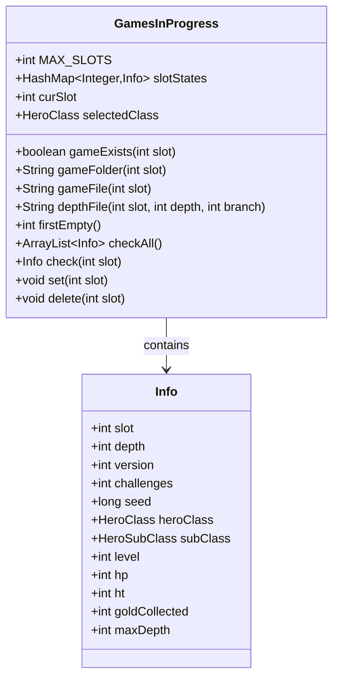

# GamesInProgress 类文档

## 1. 基本信息
| 属性 | 值 |
|------|-----|
| 文件路径 | core/src/main/java/com/shatteredpixel/shatteredpixeldungeon/GamesInProgress.java |
| 包名 | com.shatteredpixel.shatteredpixeldungeon |
| 类类型 | public class |
| 继承关系 | 无（顶层类） |
| 代码行数 | 222 行 |

## 2. 类职责说明
GamesInProgress 类管理游戏存档槽位系统。它追踪每个存档槽位的游戏状态，提供存档信息的加载、保存和删除功能。该类支持多个存档槽位（每个职业一个），并提供存档排序和预览功能。

## 4. 继承与协作关系


## 静态常量表
| 常量名 | 类型 | 值 | 说明 |
|--------|------|-----|------|
| MAX_SLOTS | int | HeroClass.values().length | 最大存档槽数量（每个职业一个） |
| GAME_FOLDER | String | "game%d" | 存档文件夹格式 |
| GAME_FILE | String | "game.dat" | 游戏数据文件名 |
| DEPTH_FILE | String | "depth%d.dat" | 关卡数据文件格式（主线） |
| DEPTH_BRANCH_FILE | String | "depth%d-branch%d.dat" | 关卡数据文件格式（支线） |

## 实例字段表
| 字段名 | 类型 | 修饰符 | 说明 |
|--------|------|--------|------|
| slotStates | HashMap&lt;Integer, Info&gt; | private static | 存档槽位状态映射 |
| curSlot | int | public static | 当前存档槽位 |
| selectedClass | HeroClass | public static | 选择的英雄职业 |
| randomizedClass | boolean | public static | 是否为随机职业 |

## 7. 方法详解

### gameExists
**签名**: `public static boolean gameExists(int slot)`
**功能**: 检查指定存档是否存在
**参数**: `slot` - 存档槽位
**返回值**: 如果存档存在返回true
**实现逻辑**: 
```java
// 第52-55行
return FileUtils.dirExists(gameFolder(slot))
        && FileUtils.fileLength(gameFile(slot)) > 1;
```

### gameFolder / gameFile / depthFile
**签名**: 
- `public static String gameFolder(int slot)`
- `public static String gameFile(int slot)`
- `public static String depthFile(int slot, int depth, int branch)`

**功能**: 获取存档相关路径
**参数**: 
- `slot` - 存档槽位
- `depth` - 关卡深度
- `branch` - 分支

**返回值**: 对应的路径字符串
**实现逻辑**: 
```java
// gameFolder - 第57-59行
return Messages.format(GAME_FOLDER, slot);              // "game1", "game2", etc.

// gameFile - 第61-63行
return gameFolder(slot) + "/" + GAME_FILE;              // "game1/game.dat"

// depthFile - 第65-71行
if (branch == 0) {
    return gameFolder(slot) + "/" + Messages.format(DEPTH_FILE, depth);  // 主线
} else {
    return gameFolder(slot) + "/" + Messages.format(DEPTH_BRANCH_FILE, depth, branch);  // 支线
}
```

### firstEmpty
**签名**: `public static int firstEmpty()`
**功能**: 获取第一个空存档槽位
**参数**: 无
**返回值**: 第一个空存档槽位号，如果没有返回-1
**实现逻辑**: 
```java
// 第73-78行
for (int i = 1; i <= MAX_SLOTS; i++){
    if (check(i) == null) return i;
}
return -1;
```

### checkAll
**签名**: `public static ArrayList<Info> checkAll()`
**功能**: 获取所有存档信息
**参数**: 无
**返回值**: 所有有效存档的信息列表
**实现逻辑**: 
```java
// 第80-96行
ArrayList<Info> result = new ArrayList<>();
for (int i = 1; i <= MAX_SLOTS; i++){
    Info curr = check(i);
    if (curr != null) result.add(curr);
}

// 根据设置排序
switch (SPDSettings.gamesInProgressSort()){
    case "level": default:
        Collections.sort(result, levelComparator);      // 按等级排序
        break;
    case "last_played":
        Collections.sort(result, lastPlayedComparator); // 按最后游玩时间排序
        break;
}
return result;
```

### check
**签名**: `public static Info check(int slot)`
**功能**: 检查指定存档并返回信息
**参数**: `slot` - 存档槽位
**返回值**: 存档信息，如果不存在返回null
**实现逻辑**: 
```java
// 第98-136行
if (slotStates.containsKey(slot)) {
    return slotStates.get(slot);                        // 已缓存，直接返回
} else if (!gameExists(slot)) {
    slotStates.put(slot, null);
    return null;                                        // 存档不存在
} else {
    Info info;
    try {
        Bundle bundle = FileUtils.bundleFromFile(gameFile(slot));
        
        // 检查版本兼容性
        if (bundle.getInt("version") < ShatteredPixelDungeon.v2_5_4) {
            info = null;                                // 版本过旧
        } else {
            info = new Info();
            info.slot = slot;
            Dungeon.preview(info, bundle);              // 预览存档数据
        }
    } catch (IOException e) {
        info = null;
    }
    
    slotStates.put(slot, info);
    return info;
}
```

### set
**签名**: `public static void set(int slot)`
**功能**: 更新存档信息
**参数**: `slot` - 存档槽位
**返回值**: 无
**实现逻辑**: 
```java
// 第138-167行
Info info = new Info();
info.slot = slot;
info.lastPlayed = Dungeon.lastPlayed;
info.depth = Dungeon.depth;
info.challenges = Dungeon.challenges;
info.seed = Dungeon.seed;
info.customSeed = Dungeon.customSeedText;
info.daily = Dungeon.daily;
info.dailyReplay = Dungeon.dailyReplay;
info.level = Dungeon.hero.lvl;
info.str = Dungeon.hero.STR;
info.strBonus = Dungeon.hero.STR() - Dungeon.hero.STR;
info.exp = Dungeon.hero.exp;
info.hp = Dungeon.hero.HP;
info.ht = Dungeon.hero.HT;
info.shld = Dungeon.hero.shielding();
info.heroClass = Dungeon.hero.heroClass;
info.subClass = Dungeon.hero.subClass;
info.armorTier = Dungeon.hero.tier();
info.goldCollected = Statistics.goldCollected;
info.maxDepth = Statistics.deepestFloor;

slotStates.put(slot, info);
```

### delete / setUnknown
**签名**: 
- `public static void delete(int slot)`
- `public static void setUnknown(int slot)`

**功能**: 删除存档信息 / 标记存档为未知
**实现逻辑**: 
```java
// delete - 第173-175行
slotStates.put(slot, null);

// setUnknown - 第169-171行
slotStates.remove(slot);
```

## Info 内部类

### 1. 基本信息
Info 类存储单个存档的预览信息，用于在存档选择界面显示。

### 字段表
| 字段名 | 类型 | 说明 |
|--------|------|------|
| slot | int | 存档槽位 |
| depth | int | 当前深度 |
| version | int | 游戏版本 |
| challenges | int | 激活的挑战 |
| seed | long | 游戏种子 |
| customSeed | String | 自定义种子 |
| daily | boolean | 是否为每日挑战 |
| dailyReplay | boolean | 是否为每日重玩 |
| lastPlayed | long | 最后游玩时间 |
| level | int | 英雄等级 |
| str | int | 基础力量 |
| strBonus | int | 力量加成 |
| exp | int | 经验值 |
| hp | int | 当前生命 |
| ht | int | 最大生命 |
| shld | int | 护盾值 |
| heroClass | HeroClass | 英雄职业 |
| subClass | HeroSubClass | 英雄子职业 |
| armorTier | int | 护甲等级 |
| goldCollected | int | 收集的金币 |
| maxDepth | int | 最大深度 |

## 11. 使用示例
```java
// 检查所有存档
ArrayList<GamesInProgress.Info> games = GamesInProgress.checkAll();
for (GamesInProgress.Info info : games) {
    System.out.println("Slot " + info.slot + ": Level " + info.level);
}

// 查找空存档槽
int emptySlot = GamesInProgress.firstEmpty();

// 更新当前存档信息
GamesInProgress.set(GamesInProgress.curSlot);

// 删除存档
GamesInProgress.delete(slot);
```

## 注意事项
1. **槽位数量**: 存档槽数量等于职业数量
2. **版本兼容**: 低于v2.5.4的存档不兼容
3. **缓存机制**: 存档信息会被缓存以提高性能

## 最佳实践
1. 使用 checkAll() 获取所有存档用于显示
2. 使用 firstEmpty() 找到可用存档槽
3. 存档后调用 set() 更新缓存