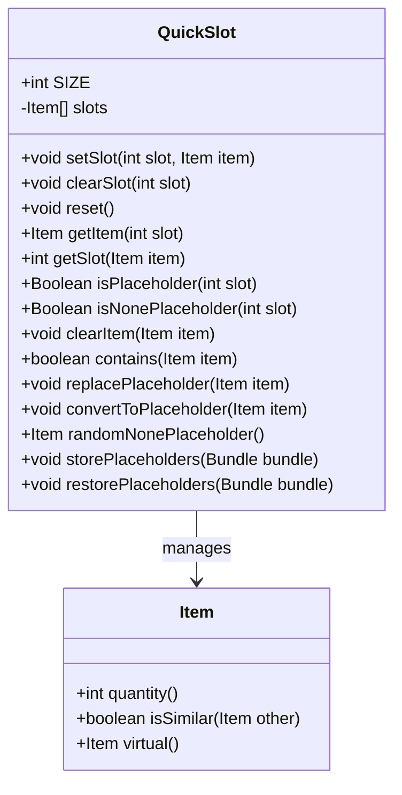

# QuickSlot 类文档

## 1. 基本信息
| 属性 | 值 |
|------|-----|
| 文件路径 | core/src/main/java/com/shatteredpixel/shatteredpixeldungeon/QuickSlot.java |
| 包名 | com.shatteredpixel.shatteredpixeldungeon |
| 类类型 | public class |
| 继承关系 | 无（顶层类） |
| 代码行数 | 159 行 |

## 2. 类职责说明
QuickSlot 类管理游戏的快捷栏系统。快捷栏允许玩家快速访问常用的物品，最多支持6个槽位。它处理物品的放置、替换、占位符管理以及数据的保存和恢复。

## 4. 继承与协作关系


## 静态常量表
| 常量名 | 类型 | 值 | 说明 |
|--------|------|-----|------|
| SIZE | int | 6 | 快捷栏大小（UI限制） |
| PLACEHOLDERS | String | "placeholders" | Bundle键名 |
| PLACEMENTS | String | "placements" | Bundle键名 |

## 实例字段表
| 字段名 | 类型 | 修饰符 | 说明 |
|--------|------|--------|------|
| slots | Item[] | private | 快捷栏槽位数组 |

## 7. 方法详解

### setSlot
**签名**: `public void setSlot(int slot, Item item)`
**功能**: 设置指定槽位的物品
**参数**: `slot` - 槽位索引，`item` - 物品
**返回值**: 无
**实现逻辑**: 
```java
// 第45-48行
clearItem(item);                                       // 先清除该物品在其他槽位
slots[slot] = item;                                    // 设置新物品
```

### clearSlot
**签名**: `public void clearSlot(int slot)`
**功能**: 清除指定槽位
**参数**: `slot` - 槽位索引
**返回值**: 无
**实现逻辑**: 
```java
// 第50-52行
slots[slot] = null;
```

### reset
**签名**: `public void reset()`
**功能**: 重置所有槽位
**参数**: 无
**返回值**: 无
**实现逻辑**: 
```java
// 第54-56行
slots = new Item[SIZE];                                // 创建新数组
```

### getItem
**签名**: `public Item getItem(int slot)`
**功能**: 获取指定槽位的物品
**参数**: `slot` - 槽位索引
**返回值**: 槽位中的物品，可能为null
**实现逻辑**: 
```java
// 第58-60行
return slots[slot];
```

### getSlot
**签名**: `public int getSlot(Item item)`
**功能**: 获取物品所在的槽位
**参数**: `item` - 要查找的物品
**返回值**: 槽位索引，如果不存在返回-1
**实现逻辑**: 
```java
// 第63-70行
for (int i = 0; i < SIZE; i++) {
    if (getItem(i) == item) {
        return i;
    }
}
return -1;
```

### isPlaceholder
**签名**: `public Boolean isPlaceholder(int slot)`
**功能**: 检查槽位是否为占位符
**参数**: `slot` - 槽位索引
**返回值**: 如果是占位符返回true
**实现逻辑**: 
```java
// 第72-74行
return getItem(slot) != null && getItem(slot).quantity() == 0;
// 占位符是数量为0的物品
```

### isNonePlaceholder
**签名**: `public Boolean isNonePlaceholder(int slot)`
**功能**: 检查槽位是否为非占位符（实际物品）
**参数**: `slot` - 槽位索引
**返回值**: 如果是非占位符返回true
**实现逻辑**: 
```java
// 第76-78行
return getItem(slot) != null && getItem(slot).quantity() > 0;
```

### clearItem
**签名**: `public void clearItem(Item item)`
**功能**: 从快捷栏中清除指定物品
**参数**: `item` - 要清除的物品
**返回值**: 无
**实现逻辑**: 
```java
// 第80-84行
if (contains(item)) {
    clearSlot(getSlot(item));
}
```

### contains
**签名**: `public boolean contains(Item item)`
**功能**: 检查快捷栏是否包含指定物品
**参数**: `item` - 要检查的物品
**返回值**: 如果包含返回true
**实现逻辑**: 
```java
// 第86-88行
return getSlot(item) != -1;
```

### replacePlaceholder
**签名**: `public void replacePlaceholder(Item item)`
**功能**: 用实际物品替换相同类型的占位符
**参数**: `item` - 新物品
**返回值**: 无
**实现逻辑**: 
```java
// 第90-96行
for (int i = 0; i < SIZE; i++) {
    if (isPlaceholder(i) && item.isSimilar(getItem(i))) {
        setSlot(i, item);                              // 替换占位符
    }
}
```

### convertToPlaceholder
**签名**: `public void convertToPlaceholder(Item item)`
**功能**: 将快捷栏中的物品转换为占位符
**参数**: `item` - 要转换的物品
**返回值**: 无
**实现逻辑**: 
```java
// 第98-108行
if (contains(item)) {
    Item placeholder = item.virtual();                  // 创建虚拟物品
    if (placeholder == null) return;
    
    for (int i = 0; i < SIZE; i++) {
        if (getItem(i) == item) setSlot(i, placeholder);
    }
}
```

### randomNonePlaceholder
**签名**: `public Item randomNonePlaceholder()`
**功能**: 随机获取一个非占位符物品
**参数**: 无
**返回值**: 随机的非占位符物品
**实现逻辑**: 
```java
// 第110-119行
ArrayList<Item> result = new ArrayList<>();
for (int i = 0; i < SIZE; i ++) {
    if (getItem(i) != null && !isPlaceholder(i)) {
        result.add(getItem(i));
    }
}
return Random.element(result);
```

### storePlaceholders / restorePlaceholders
**签名**: 
- `public void storePlaceholders(Bundle bundle)`
- `public void restorePlaceholders(Bundle bundle)`

**功能**: 保存/恢复占位符信息
**参数**: `bundle` - 数据Bundle
**实现逻辑**: 
```java
// storePlaceholders - 第130-142行
ArrayList<Item> placeholders = new ArrayList<>(SIZE);
boolean[] placements = new boolean[SIZE];

for (int i = 0; i < SIZE; i++) {
    if (isPlaceholder(i)) {
        placeholders.add(getItem(i));
        placements[i] = true;
    }
}
bundle.put(PLACEHOLDERS, placeholders);
bundle.put(PLACEMENTS, placements);

// restorePlaceholders - 第144-157行
Collection<Bundlable> placeholders = bundle.getCollection(PLACEHOLDERS);
boolean[] placements = bundle.getBooleanArray(PLACEMENTS);

int i = 0;
for (Bundlable item : placeholders){
    while (!placements[i]){
        i++;
    }
    setSlot(i, (Item)item);
    i++;
}
```

## 11. 使用示例
```java
// 设置快捷栏
Dungeon.quickslot.setSlot(0, potion);
Dungeon.quickslot.setSlot(1, scroll);

// 使用快捷栏物品
Item item = Dungeon.quickslot.getItem(0);
if (item != null) {
    item.execute(hero);
}

// 物品用完后转为占位符
Dungeon.quickslot.convertToPlaceholder(item);

// 新获得的相同物品替换占位符
Dungeon.quickslot.replacePlaceholder(newPotion);
```

## 注意事项
1. **占位符**: 数量为0的物品作为占位符，用于追踪物品类型
2. **唯一性**: 同一物品不能出现在多个槽位
3. **UI限制**: 当前最大槽位数为6

## 最佳实践
1. 物品用完时转换为占位符以保持槽位
2. 新获得物品时检查是否可以替换占位符
3. 使用 randomNonePlaceholder 为遗骸系统选择物品