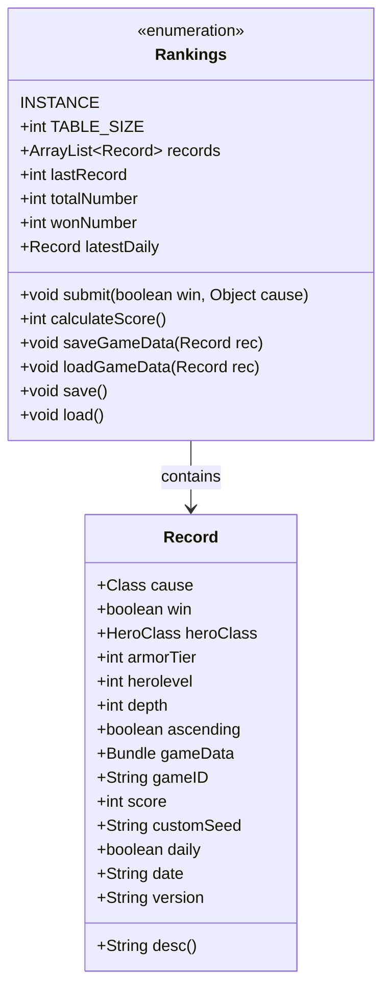

# Rankings 类文档

## 1. 基本信息
| 属性 | 值 |
|------|-----|
| 文件路径 | core/src/main/java/com/shatteredpixel/shatteredpixeldungeon/Rankings.java |
| 包名 | com.shatteredpixel.shatteredpixeldungeon |
| 类类型 | public enum |
| 继承关系 | 单例枚举 |
| 代码行数 | 587 行 |

## 2. 类职责说明
Rankings 类管理游戏的排行榜系统。它记录游戏结束时的各种数据（得分、职业、深度、原因等），保存和加载排行榜数据，并支持每日挑战和历史记录功能。排行榜最多保存11条记录，按分数排序。

## 4. 继承与协作关系


## 静态常量表
| 常量名 | 类型 | 值 | 说明 |
|--------|------|-----|------|
| TABLE_SIZE | int | 11 | 排行榜最大记录数 |
| RANKINGS_FILE | String | "rankings.dat" | 排行榜数据文件 |
| HERO | String | "hero" | Bundle键名 |
| STATS | String | "stats" | Bundle键名 |
| BADGES | String | "badges" | Bundle键名 |
| RECORDS | String | "records" | Bundle键名 |
| LATEST | String | "latest" | Bundle键名 |
| TOTAL | String | "total" | Bundle键名 |
| WON | String | "won" | Bundle键名 |

## 实例字段表
| 字段名 | 类型 | 修饰符 | 说明 |
|--------|------|--------|------|
| records | ArrayList&lt;Record&gt; | public | 排行榜记录列表 |
| lastRecord | int | public | 最后一条记录索引 |
| totalNumber | int | public | 总游戏次数 |
| wonNumber | int | public | 获胜次数 |
| localTotal | int | public | 本地游戏次数 |
| localWon | int | public | 本地获胜次数 |
| latestDaily | Record | public | 最新每日挑战记录 |
| latestDailyReplay | Record | public | 每日重玩记录 |
| dailyScoreHistory | LinkedHashMap&lt;Long, Integer&gt; | public | 每日分数历史 |

## 7. 方法详解

### submit
**签名**: `public void submit(boolean win, Object cause)`
**功能**: 提交游戏结果到排行榜
**参数**: 
- `win` - 是否获胜
- `cause` - 死亡/获胜原因

**返回值**: 无
**实现逻辑**: 
```java
// 第82-166行
load();                                                // 加载现有排行榜

Record rec = new Record();

// 记录版本
Pattern p = Pattern.compile("\\d+\\.\\d+\\.\\d+");
Matcher m = p.matcher(ShatteredPixelDungeon.version);
if (m.find()) {
    rec.version = "v" + m.group();
}

// 记录日期
DateFormat format = new SimpleDateFormat("yyyy-MM-dd", Locale.ROOT);
rec.date = format.format(new Date(Game.realTime));

// 记录游戏数据
rec.cause = cause instanceof Class ? (Class)cause : cause.getClass();
rec.win = win;
rec.heroClass = Dungeon.hero.heroClass;
rec.armorTier = Dungeon.hero.tier();
rec.herolevel = Dungeon.hero.lvl;
rec.depth = Statistics.deepestFloor;
rec.ascending = Statistics.highestAscent > 0;
rec.score = calculateScore();
rec.customSeed = Dungeon.customSeedText;
rec.daily = Dungeon.daily;

Badges.validateHighScore(rec.score);

saveGameData(rec);                                     // 保存游戏数据

rec.gameID = UUID.randomUUID().toString();

// 每日挑战特殊处理
if (rec.daily){
    if (Dungeon.dailyReplay){
        latestDailyReplay = rec;
        return;
    }
    latestDaily = rec;
    dailyScoreHistory.put(Dungeon.seed, rec.score);
    save();
    return;
}

// 添加到排行榜
records.add(rec);
Collections.sort(records, scoreComparator);

// 保持排行榜大小
lastRecord = records.indexOf(rec);
int size = records.size();
while (size > TABLE_SIZE) {
    if (lastRecord == size - 1) {
        records.remove(size - 2);
        lastRecord--;
    } else {
        records.remove(size - 1);
    }
    size = records.size();
}

// 更新统计
if (rec.customSeed.isEmpty()) {
    totalNumber++;
    if (win) wonNumber++;
}

Badges.validateGamesPlayed();
save();
```

### calculateScore
**签名**: `public int calculateScore()`
**功能**: 计算当前游戏得分
**参数**: 无
**返回值**: 总分数
**实现逻辑**: 
```java
// 第173-234行
if (Dungeon.initialVersion > ShatteredPixelDungeon.v1_2_3){
    // v1.3.0+ 分数计算
    
    // 进度分数（等级×深度×65，最大50000）
    Statistics.progressScore = Dungeon.hero.lvl * Statistics.deepestFloor * 65;
    Statistics.progressScore = Math.min(Statistics.progressScore, 50_000);
    
    // 持有物品价值
    if (Statistics.heldItemValue == 0) {
        for (Item i : Dungeon.hero.belongings) {
            Statistics.heldItemValue += i.value();
        }
    }
    
    // 财富分数（金币+物品价值，最大20000）
    Statistics.treasureScore = Statistics.goldCollected + Statistics.heldItemValue;
    Statistics.treasureScore = Math.min(Statistics.treasureScore, 20_000);
    
    // 探索分数
    Statistics.exploreScore = 0;
    int scorePerFloor = Statistics.floorsExplored.size * 50;
    for (float percentExplored : Statistics.floorsExplored.valueList()){
        Statistics.exploreScore += Math.round(percentExplored * scorePerFloor);
    }
    
    // Boss分数和任务分数
    Statistics.totalBossScore = 0;
    for (int i : Statistics.bossScores){
        if (i > 0) Statistics.totalBossScore += i;
    }
    
    Statistics.totalQuestScore = 0;
    for (int i : Statistics.questScores){
        if (i > 0) Statistics.totalQuestScore += i;
    }
    
    // 获胜倍率
    Statistics.winMultiplier = 1f;
    if (Statistics.gameWon) Statistics.winMultiplier += 1f;
    if (Statistics.ascended) Statistics.winMultiplier += 0.5f;
    
} else {
    // 旧版本分数计算
    Statistics.progressScore = Dungeon.hero.lvl * Statistics.deepestFloor * 100;
    Statistics.treasureScore = Math.min(Statistics.goldCollected, 30_000);
    Statistics.exploreScore = Statistics.totalBossScore = Statistics.totalQuestScore = 0;
    Statistics.winMultiplier = Statistics.gameWon ? 2 : 1;
}

// 挑战倍率
Statistics.chalMultiplier = (float)Math.pow(1.25, Challenges.activeChallenges());
Statistics.chalMultiplier = Math.round(Statistics.chalMultiplier * 20f) / 20f;

// 总分
Statistics.totalScore = Statistics.progressScore + Statistics.treasureScore + Statistics.exploreScore
            + Statistics.totalBossScore + Statistics.totalQuestScore;

Statistics.totalScore *= Statistics.winMultiplier * Statistics.chalMultiplier;

return Statistics.totalScore;
```

### saveGameData / loadGameData
**签名**: 
- `public void saveGameData(Record rec)`
- `public void loadGameData(Record rec)`

**功能**: 保存/加载游戏数据到记录
**参数**: `rec` - 排行榜记录
**实现逻辑**: 
```java
// saveGameData - 第247-316行
rec.gameData = new Bundle();

Belongings belongings = Dungeon.hero.belongings;

// 保存英雄和装备
ArrayList<Item> allItems = (ArrayList<Item>) belongings.backpack.items.clone();
// 处理物品显示
// ...

// 移除buff
for(Buff b : Dungeon.hero.buffs()){
    if (!(b instanceof MeleeWeapon.Charger)) {
        Dungeon.hero.remove(b);
    }
}

rec.gameData.put(HERO, Dungeon.hero);

// 保存统计
Bundle stats = new Bundle();
Statistics.storeInBundle(stats);
rec.gameData.put(STATS, stats);

// 保存徽章
Bundle badges = new Bundle();
Badges.saveLocal(badges);
rec.gameData.put(BADGES, badges);

// 保存物品处理器信息
// ...

// 恢复物品
belongings.backpack.items = allItems;

// 保存挑战、版本、种子等
rec.gameData.put(CHALLENGES, Dungeon.challenges);
rec.gameData.put(GAME_VERSION, Dungeon.initialVersion);
rec.gameData.put(SEED, Dungeon.seed);
```

### save / load
**签名**: 
- `public void save()`
- `public void load()`

**功能**: 保存/加载排行榜到文件
**实现逻辑**: 略

## Record 内部类

### 1. 基本信息
Record 存储单条排行榜记录的所有数据。

### 字段表
| 字段名 | 类型 | 说明 |
|--------|------|------|
| cause | Class | 死亡原因类 |
| win | boolean | 是否获胜 |
| heroClass | HeroClass | 英雄职业 |
| armorTier | int | 护甲等级 |
| herolevel | int | 英雄等级 |
| depth | int | 到达深度 |
| ascending | boolean | 是否飞升 |
| gameData | Bundle | 完整游戏数据 |
| gameID | String | 游戏唯一ID |
| score | int | 得分 |
| customSeed | String | 自定义种子 |
| daily | boolean | 是否每日挑战 |
| date | String | 日期 |
| version | String | 版本号 |

### desc 方法
**签名**: `public String desc()`
**功能**: 获取记录描述文本
**返回值**: 描述字符串

## 11. 使用示例
```java
// 游戏结束时提交
if (hero.isAlive()) {
    Rankings.INSTANCE.submit(true, Amulet.class);       // 获胜
} else {
    Rankings.INSTANCE.submit(false, cause);              // 死亡
}

// 查看排行榜
Rankings.INSTANCE.load();
for (Rankings.Record rec : Rankings.INSTANCE.records) {
    System.out.println(rec.heroClass + ": " + rec.score);
}
```

## 注意事项
1. **记录限制**: 最多保存11条记录
2. **每日挑战**: 每日挑战有独立的记录系统
3. **分数计算**: 不同版本使用不同的分数公式

## 最佳实践
1. 游戏结束时调用 submit() 记录结果
2. 使用 calculateScore() 获取实时分数
3. 使用 saveGameData/loadGameData 保存完整游戏状态