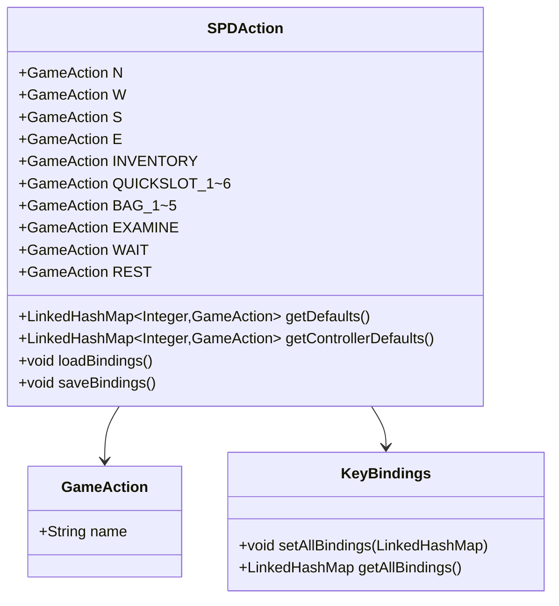

# SPDAction 类文档

## 1. 基本信息
| 属性 | 值 |
|------|-----|
| 文件路径 | core/src/main/java/com/shatteredpixel/shatteredpixeldungeon/SPDAction.java |
| 包名 | com.shatteredpixel.shatteredpixeldungeon |
| 类类型 | public class extends GameAction |
| 继承关系 | extends GameAction |
| 代码行数 | 496 行 |

## 2. 类职责说明
SPDAction 类定义了游戏中所有可绑定的操作动作。它管理键盘和手柄的按键绑定，允许玩家自定义控制方案。该类支持每个动作最多绑定三个按键，以及完整的键盘和手柄配置保存/加载。

## 4. 继承与协作关系


## 静态常量表

### 方向动作
| 常量名 | 类型 | 说明 |
|--------|------|------|
| N | GameAction | 向北移动 |
| W | GameAction | 向西移动 |
| S | GameAction | 向南移动 |
| E | GameAction | 向东移动 |
| NW | GameAction | 向西北移动 |
| NE | GameAction | 向东北移动 |
| SW | GameAction | 向西南移动 |
| SE | GameAction | 向东南移动 |
| WAIT_OR_PICKUP | GameAction | 等待或拾取 |

### 背包和快捷栏
| 常量名 | 类型 | 说明 |
|--------|------|------|
| INVENTORY | GameAction | 打开背包 |
| INVENTORY_SELECTOR | GameAction | 背包选择器 |
| QUICKSLOT_SELECTOR | GameAction | 快捷栏选择器 |
| QUICKSLOT_1~6 | GameAction | 快捷栏1-6 |
| BAG_1~5 | GameAction | 容器袋1-5 |

### 游戏操作
| 常量名 | 类型 | 说明 |
|--------|------|------|
| EXAMINE | GameAction | 检查 |
| WAIT | GameAction | 等待 |
| REST | GameAction | 休息 |
| TAG_ATTACK | GameAction | 标记攻击 |
| TAG_ACTION | GameAction | 标记动作 |
| TAG_LOOT | GameAction | 标记战利品 |
| TAG_RESUME | GameAction | 标记继续 |
| CYCLE | GameAction | 循环切换 |

### 信息和界面
| 常量名 | 类型 | 说明 |
|--------|------|------|
| HERO_INFO | GameAction | 英雄信息 |
| JOURNAL | GameAction | 日志 |
| ZOOM_IN | GameAction | 放大 |
| ZOOM_OUT | GameAction | 缩小 |

### 继承的动作
| 常量名 | 类型 | 说明 |
|--------|------|------|
| NONE | GameAction | 无操作 |
| BACK | GameAction | 返回 |
| LEFT_CLICK | GameAction | 左键点击 |
| RIGHT_CLICK | GameAction | 右键点击 |
| MIDDLE_CLICK | GameAction | 中键点击 |

## 7. 方法详解

### getDefaults
**签名**: `public static LinkedHashMap<Integer, GameAction> getDefaults()`
**功能**: 获取默认键盘绑定
**参数**: 无
**返回值**: 默认键盘绑定映射
**实现逻辑**: 
```java
// 第152-154行
return new LinkedHashMap<>(defaultBindings);
```

默认键盘绑定包括：
- W/A/S/D 或 方向键：移动
- 空格：等待/拾取
- F/I：背包
- 1-6：快捷栏
- E：检查
- Z：休息
- Q：攻击标记
- Tab：循环
- H：英雄信息
- J：日志
- +/-：缩放

### getControllerDefaults
**签名**: `public static LinkedHashMap<Integer, GameAction> getControllerDefaults()`
**功能**: 获取默认手柄绑定
**参数**: 无
**返回值**: 默认手柄绑定映射
**实现逻辑**: 
```java
// 第181-183行
return new LinkedHashMap<>(defaultControllerBindings);
```

默认手柄绑定包括：
- Start：返回
- Select：日志
- R2/右摇杆：左键点击
- L2：右键点击
- D-Pad：标记操作
- A：攻击标记
- B：检查
- X：快捷栏选择器
- Y：背包选择器
- L1/R1：缩放

### loadBindings
**签名**: `public static void loadBindings()`
**功能**: 加载自定义按键绑定
**参数**: 无
**返回值**: 无
**实现逻辑**: 
```java
// 第200-376行
if (!KeyBindings.getAllBindings().isEmpty()){
    return;                                            // 已加载
}

try {
    Bundle b = FileUtils.bundleFromFile(BINDINGS_FILE);
    
    // 加载键盘绑定
    Bundle firstKeys = b.getBundle("first_keys");
    Bundle secondKeys = b.getBundle("second_keys");
    Bundle thirdKeys = b.getBundle("third_keys");
    
    LinkedHashMap<Integer, GameAction> defaults = getDefaults();
    LinkedHashMap<Integer, GameAction> merged = new LinkedHashMap<>();
    
    // 合并自定义绑定和默认绑定
    for (GameAction a : allActions()) {
        // 处理第一、第二、第三个绑定键
        // ...
    }
    
    KeyBindings.setAllBindings(merged);
    
    // 加载手柄绑定（类似逻辑）
    // ...
    
} catch (Exception e){
    // 加载失败，使用默认绑定
    KeyBindings.setAllBindings(getDefaults());
    KeyBindings.setAllControllerBindings(getControllerDefaults());
}
```

### saveBindings
**签名**: `public static void saveBindings()`
**功能**: 保存当前按键绑定
**参数**: 无
**返回值**: 无
**实现逻辑**: 
```java
// 第378-494行
Bundle b = new Bundle();

Bundle firstKeys = new Bundle();
Bundle secondKeys = new Bundle();
Bundle thirdKeys = new Bundle();

// 只保存与默认值不同的绑定
for (GameAction a : allActions()){
    int firstCur = 0, secondCur = 0, thirdCur = 0;
    int firstDef = 0, secondDef = 0, thirdDef = 0;
    
    // 查找默认绑定
    for (int i : defaultBindings.keySet()){
        if (defaultBindings.get(i) == a){
            if (firstDef == 0) firstDef = i;
            else if (secondDef == 0) secondDef = i;
            else thirdDef = i;
        }
    }
    
    // 查找当前绑定
    LinkedHashMap<Integer, GameAction> curBindings = KeyBindings.getAllBindings();
    for (int i : curBindings.keySet()){
        if (curBindings.get(i) == a){
            if (firstCur == 0) firstCur = i;
            else if (secondCur == 0) secondCur = i;
            else thirdCur = i;
        }
    }
    
    // 只保存不同的绑定
    if (firstCur != firstDef) firstKeys.put(a.name(), firstCur);
    if (secondCur != secondDef) secondKeys.put(a.name(), secondCur);
    if (thirdCur != thirdDef) thirdKeys.put(a.name(), thirdCur);
}

b.put("first_keys", firstKeys);
b.put("second_keys", secondKeys);
b.put("third_keys", thirdKeys);

// 手柄绑定（类似逻辑）
// ...

FileUtils.bundleToFile(BINDINGS_FILE, b);
```

## 11. 使用示例
```java
// 加载按键绑定
SPDAction.loadBindings();

// 检查动作是否激活
if (KeyBindings.isKeyPressed(SPDAction.INVENTORY)) {
    // 打开背包
}

// 获取默认绑定
LinkedHashMap<Integer, GameAction> defaults = SPDAction.getDefaults();

// 保存自定义绑定
SPDAction.saveBindings();
```

## 注意事项
1. **多绑定支持**: 每个动作可以绑定最多3个键
2. **增量保存**: 只保存与默认值不同的绑定
3. **硬绑定**: Android返回键和菜单键有硬编码绑定

## 最佳实践
1. 游戏启动时调用 loadBindings()
2. 设置界面更改后调用 saveBindings()
3. 使用 KeyBindings.isKeyPressed() 检查输入