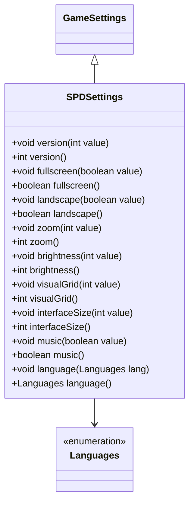

# SPDSettings 类文档

## 1. 基本信息
| 属性 | 值 |
|------|-----|
| 文件路径 | core/src/main/java/com/shatteredpixel/shatteredpixeldungeon/SPDSettings.java |
| 包名 | com.shatteredpixel.shatteredpixeldungeon |
| 类类型 | public class extends GameSettings |
| 继承关系 | extends GameSettings |
| 代码行数 | 469 行 |

## 2. 类职责说明
SPDSettings 类管理游戏的所有设置选项，包括显示、界面、游戏状态、输入、连接、音频和语言等设置。它继承自GameSettings，提供类型安全的设置访问和修改方法，并在设置更改时自动触发相应的UI更新。

## 4. 继承与协作关系


## 设置分类

### 版本信息
| 键名 | 类型 | 说明 |
|------|------|------|
| KEY_VERSION | String | "version" |

### 显示设置
| 键名 | 类型 | 默认值 | 说明 |
|------|------|--------|------|
| KEY_FULLSCREEN | String | "fullscreen" | 全屏模式 |
| KEY_LANDSCAPE | String | "force_landscape" | 强制横屏 |
| KEY_ZOOM | String | "zoom" | 缩放级别 |
| KEY_BRIGHTNESS | String | "brightness" | 亮度(-1~1) |
| KEY_GRID | String | "visual_grid" | 可视网格(-1~2) |
| KEY_CAMERA_FOLLOW | String | "camera_follow" | 摄像机跟随(1~4) |
| KEY_SCREEN_SHAKE | String | "screen_shake" | 屏幕震动(0~4) |

### 界面设置
| 键名 | 类型 | 默认值 | 说明 |
|------|------|--------|------|
| KEY_UI_SIZE | String | "full_ui" | 界面大小(0~2) |
| KEY_SCALE | String | "scale" | 缩放 |
| KEY_QUICK_SWAP | String | "quickslot_swapper" | 快捷栏交换器 |
| KEY_FLIPTOOLBAR | String | "flipped_ui" | 翻转工具栏 |
| KEY_FLIPTAGS | String | "flip_tags" | 翻转标签 |
| KEY_BARMODE | String | "toolbar_mode" | 工具栏模式 |
| KEY_SLOTWATERSKIN | String | "quickslot_waterskin" | 快捷栏水袋 |
| KEY_SYSTEMFONT | String | "system_font" | 系统字体 |
| KEY_VIBRATION | String | "vibration" | 震动 |
| KEY_GAMES_SORT | String | "games_sort" | 游戏排序方式 |

### 游戏状态
| 键名 | 类型 | 默认值 | 说明 |
|------|------|--------|------|
| KEY_LAST_CLASS | String | "last_class" | 最后选择的职业 |
| KEY_CHALLENGES | String | "challenges" | 激活的挑战 |
| KEY_CUSTOM_SEED | String | "custom_seed" | 自定义种子 |
| KEY_LAST_DAILY | String | "last_daily" | 最后每日挑战 |
| KEY_INTRO | String | "intro" | 是否显示介绍 |
| KEY_SUPPORT_NAGGED | String | "support_nagged" | 支持提醒 |
| KEY_VICTORY_NAGGED | String | "victory_nagged" | 胜利提醒 |

### 输入设置
| 键名 | 类型 | 默认值 | 说明 |
|------|------|--------|------|
| KEY_CONTROLLER_SENS | String | "controller_sens" | 手柄灵敏度(1~10) |
| KEY_MOVE_SENS | String | "move_sens" | 移动灵敏度(0~4) |

### 连接设置
| 键名 | 类型 | 默认值 | 说明 |
|------|------|--------|------|
| KEY_NEWS | String | "news" | 新闻 |
| KEY_UPDATES | String | "updates" | 更新检查 |
| KEY_BETAS | String | "betas" | Beta版本 |
| KEY_WIFI | String | "wifi" | WiFi设置 |
| KEY_NEWS_LAST_READ | String | "news_last_read" | 最后阅读新闻时间 |

### 音频设置
| 键名 | 类型 | 默认值 | 说明 |
|------|------|--------|------|
| KEY_MUSIC | String | "music" | 音乐开关 |
| KEY_MUSIC_VOL | String | "music_vol" | 音乐音量(0~10) |
| KEY_SOUND_FX | String | "soundfx" | 音效开关 |
| KEY_SFX_VOL | String | "sfx_vol" | 音效音量(0~10) |
| KEY_IGNORE_SILENT | String | "ignore_silent" | 忽略静音模式 |
| KEY_MUSIC_BG | String | "music_bg" | 后台播放音乐 |

### 语言设置
| 键名 | 类型 | 说明 |
|------|------|------|
| KEY_LANG | String | "language" | 语言代码 |

### 窗口管理（桌面端）
| 键名 | 类型 | 说明 |
|------|------|------|
| KEY_WINDOW_WIDTH | String | "window_width" | 窗口宽度 |
| KEY_WINDOW_HEIGHT | String | "window_height" | 窗口高度 |
| KEY_WINDOW_MAXIMIZED | String | "window_maximized" | 最大化状态 |
| KEY_FULLSCREEN_MONITOR | String | "fullscreen_monitor" | 全屏显示器 |

## 7. 方法详解

### 显示设置方法
```java
// 全屏
public static void fullscreen(boolean value) {
    put(KEY_FULLSCREEN, value);
    ShatteredPixelDungeon.updateSystemUI();
}
public static boolean fullscreen() {
    return getBoolean(KEY_FULLSCREEN, true);
}

// 横屏
public static void landscape(boolean value) {
    put(KEY_LANDSCAPE, value);
    ((ShatteredPixelDungeon)ShatteredPixelDungeon.instance).updateDisplaySize();
}

// 亮度（带UI更新）
public static void brightness(int value) {
    put(KEY_BRIGHTNESS, value);
    GameScene.updateFog();                               // 更新战争迷雾
}

// 可视网格（带UI更新）
public static void visualGrid(int value) {
    put(KEY_GRID, value);
    GameScene.updateMap();                               // 更新地图
}
```

### 界面设置方法
```java
// 界面大小（带验证）
public static int interfaceSize() {
    int size = getInt(KEY_UI_SIZE, DeviceCompat.isDesktop() ? 2 : 0);
    if (size > 0) {
        // 强制移动UI如果空间不足
        float wMin = Game.width / PixelScene.MIN_WIDTH_FULL;
        float hMin = Game.height / PixelScene.MIN_HEIGHT_FULL;
        if (Math.min(wMin, hMin) < 2*Game.density){
            size = 0;
        }
    }
    return size;
}

// 系统字体（语言相关默认值）
public static boolean systemFont() {
    return getBoolean(KEY_SYSTEMFONT,
            (language() == Languages.CHI_SMPL || language() == Languages.CHI_TRAD
                    || language() == Languages.KOREAN || language() == Languages.JAPANESE));
}
```

### 音频设置方法
```java
// 音乐（带实时更新）
public static void music(boolean value) {
    Music.INSTANCE.enable(value);
    put(KEY_MUSIC, value);
}

// 音乐音量（带实时更新）
public static void musicVol(int value) {
    Music.INSTANCE.volume(value * value / 100f);        // 平方使音量变化更平滑
    put(KEY_MUSIC_VOL, value);
}

// 忽略静音模式
public static void ignoreSilentMode(boolean value) {
    put(KEY_IGNORE_SILENT, value);
    Game.platform.setHonorSilentSwitch(!value);
}
```

### 语言设置方法
```java
public static void language(Languages lang) {
    put(KEY_LANG, lang.code());
}

public static Languages language() {
    String code = getString(KEY_LANG, null);
    if (code == null) {
        return Languages.matchLocale(Locale.getDefault());  // 使用系统语言
    } else {
        return Languages.matchCode(code);
    }
}
```

### 窗口管理方法（桌面端）
```java
public static void windowResolution(Point p) {
    put(KEY_WINDOW_WIDTH, p.x);
    put(KEY_WINDOW_HEIGHT, p.y);
}

public static Point windowResolution() {
    return new Point(
            getInt(KEY_WINDOW_WIDTH, 800, 720, Integer.MAX_VALUE),
            getInt(KEY_WINDOW_HEIGHT, 600, 400, Integer.MAX_VALUE)
    );
}
```

## 11. 使用示例
```java
// 显示设置
SPDSettings.fullscreen(true);
SPDSettings.brightness(1);  // 更亮

// 界面设置
SPDSettings.interfaceSize(2);  // 大界面
SPDSettings.toolbarMode("GROUP");

// 音频设置
SPDSettings.music(true);
SPDSettings.musicVol(8);

// 语言设置
SPDSettings.language(Languages.CHINESE_SIMPLIFIED);

// 游戏状态
SPDSettings.challenges(Challenges.NO_FOOD | Challenges.DARKNESS);
SPDSettings.customSeed("test123");
```

## 注意事项
1. **实时更新**: 某些设置更改会立即触发UI更新
2. **验证逻辑**: 部分设置有范围验证
3. **平台差异**: 某些设置仅适用于特定平台

## 最佳实践
1. 使用getter/setter方法而非直接操作Bundle
2. 注意某些设置的副作用（如亮度更新迷雾）
3. 桌面和移动端使用不同的默认值