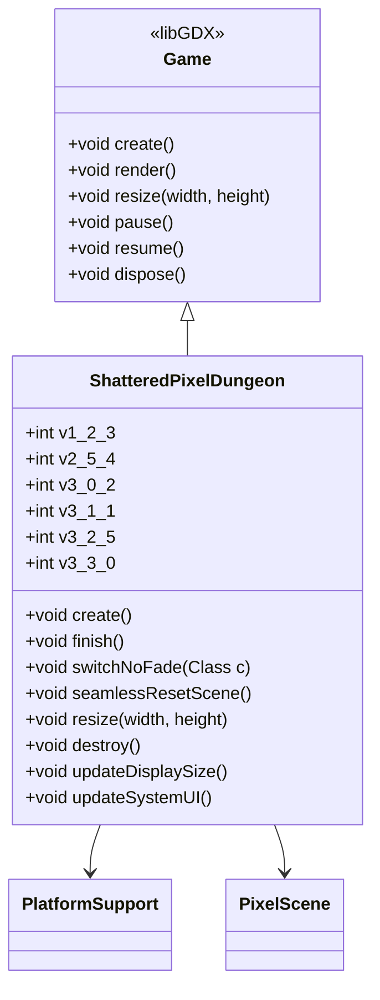

# ShatteredPixelDungeon 类文档

## 1. 基本信息
| 属性 | 值 |
|------|-----|
| 文件路径 | core/src/main/java/com/shatteredpixel/shatteredpixeldungeon/ShatteredPixelDungeon.java |
| 包名 | com.shatteredpixel.shatteredpixeldungeon |
| 类类型 | public class |
| 继承关系 | extends Game |
| 代码行数 | 144 行 |

## 2. 类职责说明
ShatteredPixelDungeon 类是游戏的主入口点，继承自libGDX的Game类。它负责游戏的初始化、场景切换、显示管理、系统UI更新等核心功能。作为游戏的主类，它协调所有子系统的启动和运行。

## 4. 继承与协作关系


## 静态常量表
| 常量名 | 类型 | 值 | 说明 |
|--------|------|-----|------|
| v1_2_3 | int | 628 | v1.2.3版本号（旧分数公式参考） |
| v2_5_4 | int | 802 | v2.5.4版本号（最低支持存档版本） |
| v3_0_2 | int | 833 | v3.0.2版本号 |
| v3_1_1 | int | 850 | v3.1.1版本号 |
| v3_2_5 | int | 877 | v3.2.5版本号 |
| v3_3_0 | int | 883 | v3.3.0版本号 |

## 7. 方法详解

### 构造函数
**签名**: `public ShatteredPixelDungeon(PlatformSupport platform)`
**功能**: 初始化游戏实例
**参数**: `platform` - 平台支持接口
**实现逻辑**:

```java
// 第47-55行
super(sceneClass ==null?WelcomeScene .class :sceneClass,platform);

// pre-v3.3.0 兼容性别名
        com.watabou.utils.Bundle.

addAlias(
        com.dustedpixel.dustedpixeldungeon.items.keys.WornKey .class,
    "com.shatteredpixel.shatteredpixeldungeon.items.keys.SkeletonKey");
```

### create
**签名**: `public void create()`
**功能**: 游戏创建时调用，初始化所有系统
**参数**: 无
**返回值**: 无
**实现逻辑**: 
```java
// 第58-71行
super.create();

updateSystemUI();                                       // 更新系统UI
SPDAction.loadBindings();                              // 加载按键绑定

// 初始化音频系统
Music.INSTANCE.enable(SPDSettings.music());            // 音乐开关
Music.INSTANCE.volume(SPDSettings.musicVol() * SPDSettings.musicVol() / 100f);  // 音量
Sample.INSTANCE.enable(SPDSettings.soundFx());          // 音效开关
Sample.INSTANCE.volume(SPDSettings.SFXVol() * SPDSettings.SFXVol() / 100f);

Sample.INSTANCE.load(Assets.Sounds.all);               // 预加载所有音效
```

### finish
**签名**: `public void finish()`
**功能**: 结束游戏
**参数**: 无
**返回值**: 无
**实现逻辑**: 
```java
// 第74-81行
if (!DeviceCompat.isiOS()) {
    super.finish();                                    // 正常退出
} else {
    // iOS不能退出（苹果指南），返回标题界面
    switchScene(TitleScene.class);
}
```

### switchNoFade
**签名**: `public static void switchNoFade(Class<? extends PixelScene> c)`
**功能**: 无淡出切换场景
**参数**: `c` - 目标场景类
**返回值**: 无
**实现逻辑**: 
```java
// 第83-89行
PixelScene.noFade = true;                              // 禁用淡出效果
switchScene(c, callback);
```

### seamlessResetScene
**签名**: `public static void seamlessResetScene()`
**功能**: 无缝重置当前场景
**参数**: 无
**返回值**: 无
**实现逻辑**: 
```java
// 第92-99行
if (scene() instanceof PixelScene) {
    ((PixelScene) scene()).saveWindows();              // 保存窗口状态
    switchNoFade((Class<? extends PixelScene>) sceneClass, callback);
} else {
    resetScene();
}
```

### resize
**签名**: `public void resize(int width, int height)`
**功能**: 窗口大小改变时调用
**参数**: `width` - 新宽度，`height` - 新高度
**返回值**: 无
**实现逻辑**: 
```java
// 第114-129行
if (width == 0 || height == 0) {
    return;                                            // 忽略零尺寸
}

if (scene instanceof PixelScene &&
        (height != Game.height || width != Game.width)) {
    PixelScene.noFade = true;
    ((PixelScene) scene).saveWindows();                // 保存窗口状态
}

super.resize(width, height);

updateDisplaySize();                                   // 更新显示尺寸
```

### destroy
**签名**: `public void destroy()`
**功能**: 销毁游戏时调用
**参数**: 无
**返回值**: 无
**实现逻辑**: 
```java
// 第132-135行
super.destroy();
GameScene.endActorThread();                            // 结束Actor线程
```

### updateDisplaySize
**签名**: `public void updateDisplaySize()`
**功能**: 更新显示尺寸
**参数**: 无
**返回值**: 无
**实现逻辑**: 
```java
// 第137-139行
platform.updateDisplaySize();                          // 委托给平台实现
```

### updateSystemUI
**签名**: `public static void updateSystemUI()`
**功能**: 更新系统UI（状态栏、导航栏等）
**参数**: 无
**返回值**: 无
**实现逻辑**: 
```java
// 第141-143行
platform.updateSystemUI();                             // 委托给平台实现
```

## 11. 使用示例
```java
// 游戏入口（由平台代码调用）
new ShatteredPixelDungeon(platform);

// 场景切换
ShatteredPixelDungeon.switchNoFade(TitleScene.class);

// 无缝重置场景
ShatteredPixelDungeon.seamlessResetScene();

// 更新系统UI
ShatteredPixelDungeon.updateSystemUI();
```

## 注意事项
1. **版本兼容**: 类中定义了各版本的版本号常量
2. **iOS限制**: iOS平台不能正常退出游戏
3. **场景管理**: 使用无缝切换可以保持UI状态

## 最佳实践
1. 使用 switchNoFade 进行快速场景切换
2. 使用 seamlessResetScene 重置场景时保持UI状态
3. 让平台层处理系统UI和显示尺寸更新