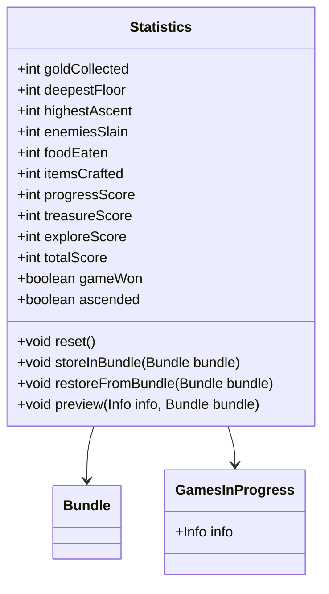

# Statistics 类文档

## 1. 基本信息
| 属性 | 值 |
|------|-----|
| 文件路径 | core/src/main/java/com/shatteredpixel/shatteredpixeldungeon/Statistics.java |
| 包名 | com.shatteredpixel.shatteredpixeldungeon |
| 类类型 | public class |
| 继承关系 | 无（顶层类） |
| 代码行数 | 278 行 |

## 2. 类职责说明
Statistics 类追踪和记录游戏的各项统计数据，包括击杀数、金币收集、深度探索、分数计算等。这些数据用于排行榜分数计算、徽章验证和游戏进度追踪。

## 4. 继承与协作关系


## 实例字段表

### 基础统计
| 字段名 | 类型 | 说明 |
|--------|------|------|
| goldCollected | int | 收集的金币总数 |
| deepestFloor | int | 到达的最深层数 |
| highestAscent | int | 飞升时的最高层数 |
| enemiesSlain | int | 击杀的敌人数 |
| foodEaten | int | 进食次数 |
| itemsCrafted | int | 炼金制作次数 |
| piranhasKilled | int | 击杀的食人鱼数 |
| hazardAssistedKills | int | 环境协助击杀数 |
| ankhsUsed | int | 使用的安卡数 |
| itemTypesDiscovered | HashSet&lt;Class&gt; | 发现的物品类型 |

### 分数计算相关
| 字段名 | 类型 | 说明 |
|--------|------|------|
| progressScore | int | 进度分数 |
| heldItemValue | int | 持有物品价值 |
| treasureScore | int | 财富分数 |
| floorsExplored | SparseArray&lt;Float&gt; | 各层探索度 |
| exploreScore | int | 探索分数 |
| bossScores | int[] | Boss战分数(5个) |
| totalBossScore | int | Boss总分 |
| questScores | int[] | 任务分数(5个) |
| totalQuestScore | int | 任务总分 |
| winMultiplier | float | 获胜倍率 |
| chalMultiplier | float | 挑战倍率 |
| totalScore | int | 总分数 |

### 解锁徽章相关
| 字段名 | 类型 | 说明 |
|--------|------|------|
| upgradesUsed | int | 使用的升级次数 |
| sneakAttacks | int | 潜行攻击次数 |
| thrownAttacks | int | 投掷攻击次数 |

### 其他
| 字段名 | 类型 | 说明 |
|--------|------|------|
| spawnersAlive | int | 存活的生成器数 |
| duration | float | 游戏时长 |
| qualifiedForNoKilling | boolean | 是否有资格获得不杀怪徽章 |
| completedWithNoKilling | boolean | 是否完成不杀怪 |
| qualifiedForBossRemainsBadge | boolean | Boss遗骸徽章资格 |
| qualifiedForBossChallengeBadge | boolean | Boss挑战徽章资格 |
| qualifiedForRandomVictoryBadge | boolean | 随机胜利徽章资格 |
| amuletObtained | boolean | 是否获得护身符 |
| gameWon | boolean | 是否获胜 |
| ascended | boolean | 是否飞升 |

## 7. 方法详解

### reset
**签名**: `public static void reset()`
**功能**: 重置所有统计数据
**参数**: 无
**返回值**: 无
**实现逻辑**: 
```java
// 第78-121行
goldCollected = 0;
deepestFloor = 0;
highestAscent = 0;
enemiesSlain = 0;
foodEaten = 0;
itemsCrafted = 0;
piranhasKilled = 0;
hazardAssistedKills = 0;
ankhsUsed = 0;
itemTypesDiscovered.clear();

progressScore = 0;
heldItemValue = 0;
treasureScore = 0;
floorsExplored = new SparseArray<>();
exploreScore = 0;
bossScores = new int[5];
totalBossScore = 0;
questScores = new int[5];
totalQuestScore = 0;
winMultiplier = 1;
chalMultiplier = 1;
totalScore = 0;

upgradesUsed = 0;
sneakAttacks = 0;
thrownAttacks = 0;

spawnersAlive = 0;
duration = 0;

qualifiedForNoKilling = false;
qualifiedForBossRemainsBadge = false;
qualifiedForBossChallengeBadge = false;
qualifiedForRandomVictoryBadge = GamesInProgress.randomizedClass;

amuletObtained = false;
gameWon = false;
ascended = false;
```

### storeInBundle
**签名**: `public static void storeInBundle(Bundle bundle)`
**功能**: 将统计数据保存到Bundle
**参数**: `bundle` - 目标Bundle
**返回值**: 无
**实现逻辑**: 
```java
// 第165-210行
bundle.put(GOLD, goldCollected);
bundle.put(DEEPEST, deepestFloor);
bundle.put(HIGHEST, highestAscent);
bundle.put(SLAIN, enemiesSlain);
bundle.put(FOOD, foodEaten);
bundle.put(ALCHEMY, itemsCrafted);
bundle.put(PIRANHAS, piranhasKilled);
bundle.put(HAZARD_ASSISTS, hazardAssistedKills);
bundle.put(ANKHS, ankhsUsed);
bundle.put(ITEM_TYPES_DISCOVERED, itemTypesDiscovered.toArray(new Class<?>[0]));

// 分数相关
bundle.put(PROG_SCORE, progressScore);
bundle.put(ITEM_VAL, heldItemValue);
bundle.put(TRES_SCORE, treasureScore);
// 保存各层探索度
for (int i = 1; i < 26; i++){
    if (floorsExplored.containsKey(i)){
        bundle.put(FLR_EXPL+i, floorsExplored.get(i));
    }
}
bundle.put(EXPL_SCORE, exploreScore);
bundle.put(BOSS_SCORES, bossScores);
bundle.put(TOT_BOSS, totalBossScore);
bundle.put(QUEST_SCORES, questScores);
bundle.put(TOT_QUEST, totalQuestScore);
bundle.put(WIN_MULT, winMultiplier);
bundle.put(CHAL_MULT, chalMultiplier);
bundle.put(TOTAL_SCORE, totalScore);

// 其他数据
bundle.put(UPGRADES, upgradesUsed);
bundle.put(SNEAKS, sneakAttacks);
bundle.put(THROWN, thrownAttacks);
bundle.put(SPAWNERS, spawnersAlive);
bundle.put(DURATION, duration);

// 徽章资格
bundle.put(NO_KILLING_QUALIFIED, qualifiedForNoKilling);
bundle.put(BOSS_REMAINS_QUALIFIED, qualifiedForBossRemainsBadge);
bundle.put(BOSS_CHALLENGE_QUALIFIED, qualifiedForBossChallengeBadge);
bundle.put(RANDOM_VICTORY_QUALIFIED, qualifiedForRandomVictoryBadge);

bundle.put(AMULET, amuletObtained);
bundle.put(WON, gameWon);
bundle.put(ASCENDED, ascended);
```

### restoreFromBundle
**签名**: `public static void restoreFromBundle(Bundle bundle)`
**功能**: 从Bundle恢复统计数据
**参数**: `bundle` - 源Bundle
**返回值**: 无
**实现逻辑**: 与storeInBundle对称，略

### preview
**签名**: `public static void preview(GamesInProgress.Info info, Bundle bundle)`
**功能**: 预览存档的统计数据
**参数**: 
- `info` - 存档信息对象
- `bundle` - 存档Bundle

**实现逻辑**: 
```java
// 第273-276行
info.goldCollected = bundle.getInt(GOLD);
info.maxDepth = bundle.getInt(DEEPEST);
```

## 11. 使用示例
```java
// 更新统计
Statistics.enemiesSlain++;
Badges.validateMonstersSlain();

Statistics.goldCollected += gold;
Badges.validateGoldCollected();

// 检查游戏状态
if (Statistics.gameWon) {
    Rankings.INSTANCE.submit(true, cause);
}

// 计算分数
int score = Statistics.totalScore;
float multiplier = Statistics.winMultiplier * Statistics.chalMultiplier;
```

## 注意事项
1. **分数计算**: 分数由进度、财富、探索、Boss、任务几部分组成
2. **版本兼容**: 旧版本存档使用不同的分数计算方式
3. **徽章关联**: 统计数据更新后需要调用对应的徽章验证方法

## 最佳实践
1. 统计更新后立即验证相关徽章
2. 使用 floorsExplored 追踪各层探索度
3. 分数计算使用 Rankings.calculateScore()