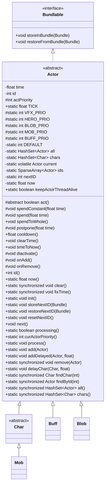

# Actor 抽象类文档

## 1. 基本信息
| 属性 | 值 |
|------|-----|
| 文件路径 | core/src/main/java/com/shatteredpixel/shatteredpixeldungeon/actors/Actor.java |
| 包名 | com.shatteredpixel.shatteredpixeldungeon.actors |
| 类类型 | abstract class |
| 继承关系 | implements Bundlable |
| 代码行数 | 396 |

## 2. 类职责说明
Actor 是游戏中所有"行动者"的抽象基类，实现了回合制行动系统的核心逻辑。它管理游戏中的时间流动、行动顺序、行动者注册与移除，是整个游戏行动系统的调度中心。所有能在游戏中执行行动的对象（角色、怪物、buff、blob等）都继承自此类。

## 4. 继承与协作关系


## 静态常量表
| 常量名 | 类型 | 值 | 说明 |
|--------|------|-----|------|
| TICK | float | 1f | 一个回合的时间单位，所有行动时间基于此计算 |
| VFX_PRIO | int | 100 | 视觉效果优先级，最先执行 |
| HERO_PRIO | int | 0 | 英雄优先级，正值在英雄前执行，负值在后 |
| BLOB_PRIO | int | -10 | Blob优先级，在英雄后、怪物前执行 |
| MOB_PRIO | int | -20 | 怪物优先级，在buff和blob之间执行 |
| BUFF_PRIO | int | -30 | Buff优先级，回合中最后执行 |
| DEFAULT | int | -100 | 默认优先级，未指定时使用，最后执行 |

## 实例字段表
| 字段名 | 类型 | 修饰符 | 说明 |
|--------|------|--------|------|
| time | float | private | 该行动者的时间点，决定何时行动 |
| id | int | private | 唯一标识符，用于序列化和查找 |
| actPriority | int | protected | 行动优先级，时间相同时优先级高的先行动 |

## 静态字段表
| 字段名 | 类型 | 修饰符 | 说明 |
|--------|------|--------|------|
| all | HashSet\<Actor\> | private static | 所有已注册的行动者集合 |
| chars | HashSet\<Char\> | private static | 所有角色集合，用于快速查找 |
| current | volatile Actor | private static | 当前正在行动的行动者 |
| ids | SparseArray\<Actor\> | private static | ID到行动者的映射表 |
| nextID | int | private static | 下一个可用的ID |
| now | float | private static | 当前游戏时间 |
| keepActorThreadAlive | boolean | public static | 控制行动线程是否继续运行 |

## 7. 方法详解

### act()
**签名**: `protected abstract boolean act()`
**功能**: 执行一次行动，子类必须实现此方法
**参数**: 无
**返回值**: `boolean` - true表示继续处理下一个行动者，false表示暂停等待
**实现逻辑**: 
- 这是一个抽象方法，每个子类必须实现自己的行动逻辑
- 返回true时，Actor.process()会立即选择下一个行动者
- 返回false时，Actor.process()会暂停并等待游戏场景通知继续

### spendConstant(float time)
**签名**: `protected void spendConstant(float time)`
**功能**: 消耗固定时间，不受时间影响效果（如加速/减速）影响
**参数**: `time` - 要消耗的时间量
**返回值**: 无
**实现逻辑**:
```
第61-68行:
1. 将传入的时间加到当前行动者的time字段上
2. 检查time是否非常接近整数（误差小于0.001）
3. 如果接近整数，四舍五入到整数以修正浮点误差
```

### spend(float time)
**签名**: `protected void spend(float time)`
**功能**: 消耗时间，可能受时间影响效果（如加速/减速）影响
**参数**: `time` - 要消耗的时间量
**返回值**: 无
**实现逻辑**:
```
第71-73行:
1. 默认实现直接调用spendConstant()
2. Char子类会重写此方法，考虑加速/减速效果
```

### spendToWhole()
**签名**: `public void spendToWhole()`
**功能**: 将时间消耗到下一个整数时间点
**参数**: 无
**返回值**: 无
**实现逻辑**:
```
第75-77行:
1. 将time向上取整到最近的整数
2. 用于需要等待完整回合的情况
```

### postpone(float time)
**签名**: `protected void postpone(float time)`
**功能**: 将行动推迟指定时间
**参数**: `time` - 要推迟的时间量
**返回值**: 无
**实现逻辑**:
```
第79-88行:
1. 如果当前时间小于now+time，才更新time
2. 将time设置为now+time，使行动者延后行动
3. 同样处理浮点误差修正
```

### cooldown()
**签名**: `public float cooldown()`
**功能**: 获取距离下次行动的冷却时间
**参数**: 无
**返回值**: `float` - 冷却时间
**实现逻辑**:
```
第90-92行:
1. 返回time - now，即距离当前时间的差值
2. 正值表示还需要等待，0表示可以行动
```

### clearTime()
**签名**: `public void clearTime()`
**功能**: 清除时间，将时间设置为当前时刻
**参数**: 无
**返回值**: 无
**实现逻辑**:
```
第94-101行:
1. 调用spendConstant(-Actor.now())将时间归零
2. 如果是Char实例，同时清除其所有buff的时间
3. 用于重置行动者状态
```

### timeToNow()
**签名**: `public void timeToNow()`
**功能**: 将时间设置为当前时刻
**参数**: 无
**返回值**: 无
**实现逻辑**:
```
第103-105行:
1. 直接将time设置为now
2. 使行动者可以立即行动
```

### diactivate()
**签名**: `protected void diactivate()`
**功能**: 停用行动者，使其不再参与行动调度
**参数**: 无
**返回值**: 无
**实现逻辑**:
```
第107-109行:
1. 将time设置为Float.MAX_VALUE
2. 极大的时间值使其永远不会被选中执行
```

### id()
**签名**: `public int id()`
**功能**: 获取行动者的唯一ID
**参数**: 无
**返回值**: `int` - 唯一ID
**实现逻辑**:
```
第135-141行:
1. 如果id大于0，直接返回
2. 否则分配一个新的ID并递增nextID
```

### now()
**签名**: `public static float now()`
**功能**: 获取当前游戏时间
**参数**: 无
**返回值**: `float` - 当前时间
**实现逻辑**:
```
第156-158行:
1. 返回静态变量now的值
2. now在每次process()中更新为当前行动者的时间
```

### clear()
**签名**: `public static synchronized void clear()`
**功能**: 清除所有行动者，重置游戏状态
**参数**: 无
**返回值**: 无
**实现逻辑**:
```
第160-168行:
1. 将now重置为0
2. 清空all集合（所有行动者）
3. 清空chars集合（所有角色）
4. 清空ids映射表
5. 用于开始新游戏或重置关卡
```

### fixTime()
**签名**: `public static synchronized void fixTime()`
**功能**: 修正时间，防止时间值无限增长
**参数**: 无
**返回值**: 无
**实现逻辑**:
```
第170-192行:
1. 如果没有行动者，直接返回
2. 找出所有行动者中的最小时间值
3. 将最小值取整
4. 所有行动者的时间减去这个最小值
5. 如果英雄存在且不在金库关卡，增加Statistics.duration
6. now也减去这个最小值
7. 这样可以防止时间值无限增长导致精度问题
```

### init()
**签名**: `public static void init()`
**功能**: 初始化行动系统，添加关卡中的所有行动者
**参数**: 无
**返回值**: 无
**实现逻辑**:
```
第194-212行:
1. 添加英雄到行动系统
2. 添加关卡中所有怪物
3. 让所有怪物恢复其目标（在所有actor添加后）
4. 添加关卡中所有blob
5. 将current设为null
```

### next()
**签名**: `public void next()`
**功能**: 结束当前行动，通知处理循环继续
**参数**: 无
**返回值**: 无
**实现逻辑**:
```
第228-232行:
1. 如果current是当前行动者，将其设为null
2. 这会触发process()选择下一个行动者
```

### processing()
**签名**: `public static boolean processing()`
**功能**: 检查是否正在处理行动
**参数**: 无
**返回值**: `boolean` - true表示正在处理
**实现逻辑**:
```
第234-236行:
1. 返回current是否不为null
2. 用于判断游戏是否在执行行动
```

### curActorPriority()
**签名**: `public static int curActorPriority()`
**功能**: 获取当前行动者的优先级
**参数**: 无
**返回值**: `int` - 当前优先级，如果没有则返回HERO_PRIO
**实现逻辑**:
```
第238-240行:
1. 如果current不为null，返回其actPriority
2. 否则返回HERO_PRIO作为默认值
```

### process()
**签名**: `public static void process()`
**功能**: 核心行动处理循环，选择并执行行动者
**参数**: 无
**返回值**: 无
**实现逻辑**:
```
第244-326行:
这是游戏的核心循环:
1. do-while循环，由keepActorThreadAlive控制
2. 在循环中:
   a. 找出时间最早且优先级最高的行动者作为current
   b. 更新now为current.time
   c. 如果是Char且sprite正在移动，等待移动完成
   d. 执行current.act()
   e. 如果act()返回false或游戏状态变化，暂停并等待通知
3. 线程同步机制确保正确处理中断和场景切换
4. 支持角色移动动画的等待机制
```

### add(Actor actor)
**签名**: `public static void add(Actor actor)`
**功能**: 添加行动者到系统，时间设为当前时间
**参数**: `actor` - 要添加的行动者
**返回值**: 无
**实现逻辑**:
```
第328-330行:
1. 调用私有add方法，时间为now
```

### addDelayed(Actor actor, float delay)
**签名**: `public static void addDelayed(Actor actor, float delay)`
**功能**: 延迟添加行动者
**参数**: 
- `actor` - 要添加的行动者
- `delay` - 延迟时间
**返回值**: 无
**实现逻辑**:
```
第332-334行:
1. 调用私有add方法，时间为now+delay
2. delay最小为0
```

### add(Actor actor, float time) [私有]
**签名**: `private static synchronized void add(Actor actor, float time)`
**功能**: 内部添加行动者的实现
**参数**: 
- `actor` - 要添加的行动者
- `time` - 添加时间
**返回值**: 无
**实现逻辑**:
```
第336-355行:
1. 如果actor已在all中，直接返回
2. 将actor的ID加入ids映射
3. 将actor加入all集合
4. 设置actor的时间
5. 调用actor.onAdd()回调
6. 如果是Char，加入chars集合并添加其所有buff
```

### remove(Actor actor)
**签名**: `public static synchronized void remove(Actor actor)`
**功能**: 从系统中移除行动者
**参数**: `actor` - 要移除的行动者
**返回值**: 无
**实现逻辑**:
```
第357-368行:
1. 如果actor为null，直接返回
2. 从all集合中移除
3. 从chars集合中移除
4. 调用actor.onRemove()回调
5. 如果有有效ID，从ids映射中移除
```

### delayChar(Char ch, float time)
**签名**: `public static void delayChar(Char ch, float time)`
**功能**: 延迟角色及其所有buff的时间
**参数**: 
- `ch` - 要延迟的角色
- `time` - 延迟时间
**返回值**: 无
**实现逻辑**:
```
第372-377行:
1. 对角色调用spendConstant增加时间
2. 对角色的所有buff也调用spendConstant
3. 注释提醒要谨慎使用，这可能影响游戏平衡
```

### findChar(int pos)
**签名**: `public static synchronized Char findChar(int pos)`
**功能**: 查找指定位置的角色
**参数**: `pos` - 地图位置
**返回值**: `Char` - 该位置的角色，没有则返回null
**实现逻辑**:
```
第379-385行:
1. 遍历chars集合
2. 找到pos匹配的角色并返回
3. 没找到返回null
```

### findById(int id)
**签名**: `public static synchronized Actor findById(int id)`
**功能**: 通过ID查找行动者
**参数**: `id` - 行动者ID
**返回值**: `Actor` - 对应的行动者，没有则返回null
**实现逻辑**:
```
第387-389行:
1. 从ids映射中获取并返回
```

### all()
**签名**: `public static synchronized HashSet<Actor> all()`
**功能**: 获取所有行动者的副本
**参数**: 无
**返回值**: `HashSet<Actor>` - 所有行动者的集合副本
**实现逻辑**:
```
第391-393行:
1. 返回all集合的副本，防止外部修改
```

### chars()
**签名**: `public static synchronized HashSet<Char> chars()`
**功能**: 获取所有角色的副本
**参数**: 无
**返回值**: `HashSet<Char>` - 所有角色的集合副本
**实现逻辑**:
```
第395行:
1. 返回chars集合的副本，防止外部修改
```

### storeInBundle(Bundle bundle)
**签名**: `@Override public void storeInBundle(Bundle bundle)`
**功能**: 序列化行动者状态到Bundle
**参数**: `bundle` - 存储容器
**返回值**: 无
**实现逻辑**:
```
第118-122行:
1. 存储time字段
2. 存储id字段
```

### restoreFromBundle(Bundle bundle)
**签名**: `@Override public void restoreFromBundle(Bundle bundle)`
**功能**: 从Bundle恢复行动者状态
**参数**: `bundle` - 存储容器
**返回值**: 无
**实现逻辑**:
```
第124-133行:
1. 恢复time字段
2. 获取存储的id
3. 如果该ID未被使用，使用该ID
4. 否则分配新ID
```

## 11. 使用示例

```java
// 自定义行动者示例
public class CustomActor extends Actor {
    
    @Override
    protected boolean act() {
        // 执行行动逻辑
        doSomething();
        
        // 消耗一个回合
        spend(TICK);
        
        // 返回true继续处理下一个行动者
        return true;
    }
}

// 添加行动者
CustomActor actor = new CustomActor();
Actor.add(actor);

// 延迟添加
Actor.addDelayed(actor, 5f); // 5个回合后添加

// 查找位置上的角色
Char ch = Actor.findChar(pos);

// 移除行动者
Actor.remove(actor);
```

## 注意事项

1. **线程安全**: process()方法在独立线程中运行，与主游戏线程通过wait/notify同步
2. **时间精度**: 浮点时间值会在接近整数时自动取整，防止精度误差累积
3. **优先级系统**: 时间相同时，优先级高的行动者优先执行
4. **行动者移除**: 使用remove()而非直接修改集合，确保正确触发回调
5. **Char同步**: 添加/移除Char时会自动处理其buff

## 最佳实践

1. **实现act()**: 子类必须实现act()方法，并在最后调用spend()消耗时间
2. **使用next()**: 当行动需要等待用户输入时，调用next()结束当前行动
3. **优先级选择**: 自定义行动者应根据其类型设置合适的actPriority
4. **时间管理**: 使用spend()而非直接修改time，确保正确处理时间效果
5. **清理资源**: 在onRemove()回调中清理行动者占用的资源