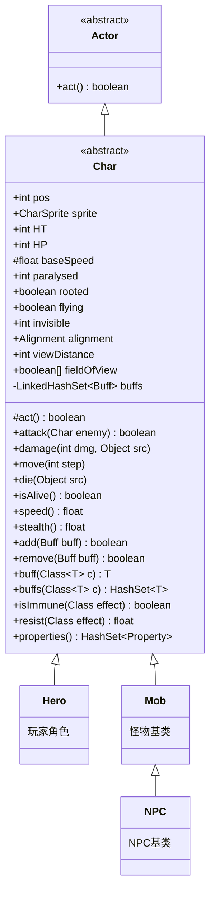

# Char 抽象类文档

## 1. 基本信息
| 属性 | 值 |
|------|-----|
| 文件路径 | core/src/main/java/com/shatteredpixel/shatteredpixeldungeon/actors/Char.java |
| 包名 | com.shatteredpixel.shatteredpixeldungeon.actors |
| 类类型 | abstract class |
| 继承关系 extends Actor |
| 代码行数 | 1415 |

## 2. 类职责说明
Char 是游戏中所有"角色"的抽象基类，代表地图上具有生命值、可以移动、战斗的实体。Hero（英雄）、Mob（怪物）、NPC 都继承自此类。Char 管理角色的生命值、Buff系统、战斗计算、移动逻辑、属性（抗性/免疫）等核心功能。

## 4. 继承与协作关系


## 静态常量表
| 常量名 | 类型 | 值 | 说明 |
|--------|------|-----|------|
| INFINITE_ACCURACY | int | 1_000_000 | 无限精准度，用于必定命中的情况 |
| INFINITE_EVASION | int | 1_000_000 | 无限闪避，用于必定闪避的情况 |

## 实例字段表
| 字段名 | 类型 | 修饰符 | 说明 |
|--------|------|--------|------|
| pos | int | public | 角色在地图上的位置索引 |
| sprite | CharSprite | public | 角色的可视精灵 |
| HT | int | public | 最大生命值（Health Total） |
| HP | int | public | 当前生命值 |
| baseSpeed | float | protected | 基础移动速度 |
| path | PathFinder.Path | protected | 移动路径 |
| paralysed | int | public | 麻痹回合数，>0时无法行动 |
| rooted | boolean | public | 是否被定身，无法移动 |
| flying | boolean | public | 是否飞行，可越过障碍和陷阱 |
| invisible | int | public | 隐形层数，>0时隐形 |
| alignment | Alignment | public | 阵营（ENEMY/NEUTRAL/ALLY） |
| viewDistance | int | public | 视野距离，默认8 |
| fieldOfView | boolean[] | public | 视野数组，记录可见格子 |
| buffs | LinkedHashSet\<Buff\> | private | 角色身上的所有Buff |
| resistances | HashSet\<Class\> | protected final | 抗性列表 |
| immunities | HashSet\<Class\> | protected final | 免疫列表 |
| properties | HashSet\<Property\> | protected | 角色属性集合 |
| deathMarked | boolean | public | 是否被标记为死亡（用于缓存） |
| cachedShield | int | private | 缓存的护盾值 |
| needsShieldUpdate | boolean | public | 是否需要更新护盾缓存 |

## 内部枚举

### Alignment（阵营）
| 值 | 说明 |
|----|------|
| ENEMY | 敌对阵营，与英雄敌对 |
| NEUTRAL | 中立阵营 |
| ALLY | 友方阵营，与英雄同盟 |

### Property（属性）
| 值 | 说明 | 特殊抗性/免疫 |
|----|------|--------------|
| BOSS | Boss怪物 | 抗：Grim/GrimTrap/ScrollOfRetribution；免：AllyBuff/Dread |
| MINIBOSS | 小Boss | 免：AllyBuff/Dread |
| BOSS_MINION | Boss仆从 | - |
| UNDEAD | 亡灵 | - |
| DEMONIC | 恶魔 | - |
| INORGANIC | 无机物 | 免：Bleeding/ToxicGas/Poison |
| FIERY | 火焰属性 | 抗：WandOfFireblast；免：Burning/Blazing |
| ICY | 冰霜属性 | 抗：WandOfFrost；免：Frost/Chill |
| ACIDIC | 酸性属性 | 抗：Corrosion；免：Ooze |
| ELECTRIC | 闪电属性 | 抗：WandOfLightning/Shocking等 | 免 |
| LARGE | 大体型 | 占用2x2格子 |
| IMMOVABLE | 不可移动 | 免：Vertigo |
| STATIC | 静态角色 | 免：多种AI状态效果 |

## 7. 方法详解

### act()
**签名**: `protected boolean act()`
**功能**: 执行角色回合，更新视野
**参数**: 无
**返回值**: 默认返回false
**实现逻辑**: 
- 第197-208行：
  - 第198-200行：初始化或调整视野数组大小
  - 第201行：更新视野
  - 第204-206行：如果是不可移动角色，踢开身上的物品

### attack(Char enemy)
**签名**: `public boolean attack(Char enemy)`
**功能**: 攻击敌人
**参数**: `enemy` - 目标敌人
**返回值**: `true`表示命中，`false`表示未命中
**实现逻辑**: 
- 第364-615行：核心战斗逻辑
  - 第372行：判断战斗是否可见
  - 第374-383行：如果敌人无敌，显示状态并返回
  - 第384行：调用 `hit()` 判断是否命中
  - 第386-399行：计算敌人的防御减免（DR）
  - 第401-412行：计算基础伤害，考虑刺客准备状态
  - 第414-489行：应用各种伤害修正（狂暴、祝福、天赋等）
  - 第490-506行：调用防御处理，计算最终伤害
  - 第519行：对敌人造成伤害
  - 第521-522行：处理武器附魔效果
  - 第524-539行：处理刺客一击必杀
  - 第541-562行：处理连击致死天赋
  - 第564-567行：显示血液效果
  - 第569-586行：处理死亡日志

### hit(Char attacker, Char defender, float accMulti, boolean magic)
**签名**: `public static boolean hit(Char attacker, Char defender, float accMulti, boolean magic)`
**功能**: 计算攻击是否命中
**参数**: `attacker`-攻击者，`defender`-防御者，`accMulti`-精准倍率，`magic`-是否魔法攻击
**返回值**: `true`表示命中
**实现逻辑**: 
- 第624-690行：命中判定算法
  - 第625-626行：获取攻击方精准和防御方闪避
  - 第633-635行：隐形单位必定命中（惊喜攻击）
  - 第637-639行：武僧专注状态无限闪避
  - 第643-649行：无限闪避>无限精准
  - 第651-665行：计算攻击方掷骰（考虑各种Buff修正）
  - 第667-681行：计算防御方掷骰
  - 第683-689行：比较大小决定命中

### damage(int dmg, Object src)
**签名**: `public void damage(int dmg, Object src)`
**功能**: 对角色造成伤害
**参数**: `dmg`-伤害值，`src`-伤害来源
**返回值**: 无
**实现逻辑**: 
- 第812-1034行：伤害处理流程
  - 第814-816行：无效情况检查
  - 第818-821行：无敌检查
  - 第823-846行：生命链接伤害分摊
  - 第849-891行：应用各种伤害修正（保护光环、恐惧恢复等）
  - 第893-907行：镰刀收割流血处理
  - 第909-914行：免疫和抗性计算
  - 第920-931行：魔法伤害减免
  - 第933-935行：麻痹伤害处理
  - 第937-946行：战士护盾激活
  - 第948-951行：护盾吸收伤害
  - 第953-968行：Grim附魔处决判定
  - 第970-980行：动能附魔伤害转移
  - 第982-1025行：显示伤害数字图标
  - 第1027-1033行：检查死亡

### move(int step, boolean travelling)
**签名**: `public void move(int step, boolean travelling)`
**功能**: 移动角色到新位置
**参数**: `step`-目标位置，`travelling`-是否为真实移动（非传送）
**返回值**: 无
**实现逻辑**: 
- 第1251-1277行：
  - 第1253-1264行：眩晕状态随机方向移动
  - 第1266-1268行：离开时关闭门
  - 第1270行：更新位置
  - 第1272-1274行：更新精灵可见性
  - 第1276行：通知地图格子被占用

### die(Object src)
**签名**: `public void die(Object src)`
**功能**: 角色死亡处理
**参数**: `src`-致死来源
**返回值**: 无
**实现逻辑**: 
- 第1081-1089行：
  - 第1082行：调用 `destroy()`
  - 第1083-1088行：播放死亡动画（非深渊死亡时）

### destroy()
**签名**: `public void destroy()`
**功能**: 销毁角色，从游戏中移除
**参数**: 无
**返回值**: 无
**实现逻辑**: 
- 第1053-1079行：
  - 第1054行：HP设为0
  - 第1055行：从Actor系统移除
  - 第1057-1078行：清理其他角色身上与该角色相关的Buff（魅惑、恐惧、狙击标记等）

### isAlive()
**签名**: `public boolean isAlive()`
**功能**: 判断角色是否存活
**参数**: 无
**返回值**: 存活返回true
**实现逻辑**: 
- 第1096-1098行：`HP > 0` 或 `deathMarked` 为true

### speed()
**签名**: `public float speed()`
**功能**: 获取当前移动速度
**参数**: 无
**返回值**: 速度值
**实现逻辑**: 
- 第775-788行：
  - 第776行：从基础速度开始
  - 第777行：致残减半
  - 第778行：耐力1.5倍
  - 第779行：激素涌动2倍
  - 第780行：急速3倍
  - 第781行：恐惧2倍
  - 第783-785行：甲胄符文加成

### shielding()
**签名**: `public int shielding()`
**功能**: 获取护盾值
**参数**: 无
**返回值**: 护盾值
**实现逻辑**: 
- 第799-810行：遍历所有ShieldBuff累加护盾值，使用缓存优化

### add(Buff buff)
**签名**: `public synchronized boolean add(Buff buff)`
**功能**: 添加Buff到角色
**参数**: `buff`-要添加的Buff
**返回值**: 成功返回true，被净化等阻止返回false
**实现逻辑**: 
- 第1175-1209行：
  - 第1177-1183行：净化状态下阻止负面Buff
  - 第1185-1187行：冻结状态下不能添加Buff
  - 第1189-1190行：添加到集合和Actor系统
  - 第1192-1205行：显示Buff名称状态

### remove(Buff buff)
**签名**: `public synchronized boolean remove(Buff buff)`
**功能**: 移除Buff
**参数**: `buff`-要移除的Buff
**返回值**: 始终返回true
**实现逻辑**: 
- 第1211-1217行：从集合和Actor系统移除

### buff(Class\<T\> c)
**签名**: `public synchronized <T extends Buff> T buff(Class<T> c)`
**功能**: 获取指定类型的Buff实例
**参数**: `c`-Buff类型
**返回值**: Buff实例，不存在返回null
**实现逻辑**: 
- 第1156-1163行：遍历查找精确类型匹配

### buffs(Class\<T\> c)
**签名**: `public synchronized <T extends Buff> HashSet<T> buffs(Class<T> c)`
**功能**: 获取所有指定类型的Buff
**参数**: `c`-Buff类型
**返回值**: Buff集合
**实现逻辑**: 
- 第1144-1152行：遍历过滤可分配类型的Buff

### isImmune(Class effect)
**签名**: `public boolean isImmune(Class effect)`
**功能**: 检查是否免疫某效果
**参数**: `effect`-效果类
**返回值**: 免疫返回true
**实现逻辑**: 
- 第1326-1344行：
  - 第1327-1333行：收集所有免疫来源（属性、Buff、符文）
  - 第1338-1342行：检查是否有匹配的免疫

### resist(Class effect)
**签名**: `public float resist(Class effect)`
**功能**: 计算对某效果的抗性
**参数**: `effect`-效果类
**返回值**: 效果倍率（0.5表示50%抗性）
**实现逻辑**: 
- 第1306-1322行：
  - 第1307-1313行：收集所有抗性来源
  - 第1315-1320行：每个匹配抗性减半效果
  - 第1321行：叠加元素戒指抗性

### properties()
**签名**: `public HashSet<Property> properties()`
**功能**: 获取角色属性集合
**参数**: 无
**返回值**: 属性集合
**实现逻辑**: 
- 第1354-1361行：复制属性集合，添加巨人冠军的LARGE属性

### interact(Char c)
**签名**: `public boolean interact(Char c)`
**功能**: 与另一个角色交互（通常是交换位置）
**参数**: `c`-目标角色
**返回值**: 成功返回true
**实现逻辑**: 
- 第245-309行：
  - 第249-257行：检查交换可行性（地形、体积）
  - 第265-267行：不可移动角色不能交换
  - 第270-282行：盟友传送天赋处理
  - 第285-288行：移动受限检查
  - 第290-306行：执行位置交换

### canInteract(Char c)
**签名**: `public boolean canInteract(Char c)`
**功能**: 判断是否可以与目标角色交互
**参数**: `c`-目标角色
**返回值**: 可交互返回true
**实现逻辑**: 
- 第231-242行：
  - 第232-233行：相邻可直接交互
  - 第234-238行：盟友且有传送天赋可远程交互
  - 第240行：其他情况返回false

### storeInBundle(Bundle bundle)
**签名**: `public void storeInBundle(Bundle bundle)`
**功能**: 保存状态到Bundle
**参数**: `bundle`-存储容器
**返回值**: 无
**实现逻辑**: 
- 第338-346行：保存位置、HP、HT、Buff列表

### restoreFromBundle(Bundle bundle)
**签名**: `public void restoreFromBundle(Bundle bundle)`
**功能**: 从Bundle恢复状态
**参数**: `bundle`-存储容器
**返回值**: 无
**实现逻辑**: 
- 第349-362行：恢复位置、HP、HT，重新附加所有Buff

## 11. 使用示例

```java
// 检查角色是否存活并造成伤害
if (enemy.isAlive()) {
    enemy.damage(10, this);
}

// 添加Buff
Buff buff = new Poison();
buff.set(5); // 5回合
target.add(buff);

// 检查免疫
if (!target.isImmune(Poison.class)) {
    Buff.affect(target, Poison.class).set(5);
}

// 计算抗性
float resistance = target.resist(Fire.class);
int actualDamage = (int)(rawDamage * resistance);

// 移动角色
character.move(newPosition);

// 检查属性
if (Char.hasProp(enemy, Property.BOSS)) {
    // Boss特殊处理
}

// 获取视野
Dungeon.level.updateFieldOfView(character, character.fieldOfView);
```

## 注意事项

1. **线程安全**: Buff操作方法使用 `synchronized` 确保线程安全
2. **伤害处理顺序**: damage方法中的修正顺序很重要，后处理的会覆盖先处理的
3. **护盾缓存**: 使用缓存减少频繁计算，修改护盾后需设置 `needsShieldUpdate = true`
4. **死亡标记**: `deathMarked` 用于优化绘制性能，避免在绘制时调用复杂逻辑
5. **属性叠加**: 属性、Buff、符文都可以提供抗性和免疫，最终值是所有来源的并集

## 最佳实践

1. 创建新角色时，重写 `attackSkill()`、`defenseSkill()`、`damageRoll()` 等方法定义战斗属性
2. 使用 `properties.add()` 在构造函数中添加角色属性
3. 使用 `resistances.add()` 和 `immunities.add()` 添加抗性和免疫
4. 重写 `defenseProc()` 和 `attackProc()` 实现特殊战斗效果
5. 使用 `onAdd()` 和 `onRemove()` 进行初始化和清理