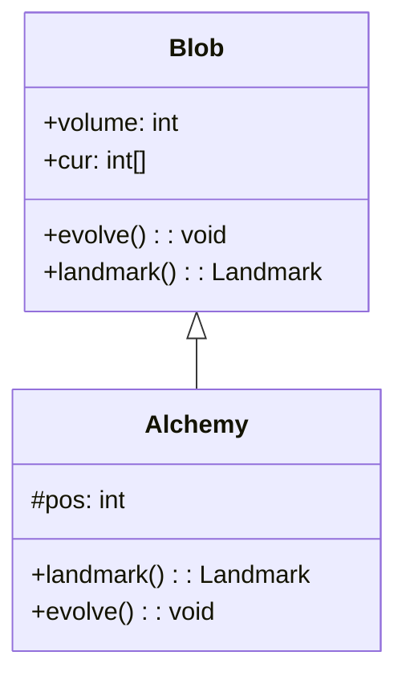

# Alchemy 类文档

## 1. 基本信息

| 属性 | 值 |
|------|-----|
| **文件路径** | core/src/main/java/com/shatteredpixel/shatteredpixeldungeon/actors/blobs/Alchemy.java |
| **包名** | com.shatteredpixel.shatteredpixeldungeon.actors.blobs |
| **类类型** | public class |
| **继承关系** | extends Blob |
| **代码行数** | 59 行 |
| **直接子类** | 无 |

## 2. 文件职责说明

Alchemy 类代表游戏中的"炼金锅"位置标记。它是一个简单的装饰性 Blob，主要用于提供地图标记和视觉效果。

**核心职责**：
- 标记炼金锅的位置
- 提供气泡视觉效果
- 支持地图标记系统

**设计意图**：Alchemy 是一个"静态"Blob，不会扩散或衰减。它仅用于标记炼金锅的存在，方便玩家在地图上找到。

## 3. 结构总览

```
Alchemy (extends Blob)
├── 字段
│   └── pos: int               // 位置（未使用）
│
├── 方法
│   ├── landmark(): Landmark   // 返回地图标记（覆盖父类）
│   ├── evolve(): void         // 扩散逻辑（覆盖父类）
│   └── use(BlobEmitter): void // 设置视觉效果（覆盖父类）
```

## 4. 继承与协作关系

### 继承关系图



### 协作关系

| 协作类 | 协作方式 |
|--------|----------|
| **Blob** | 父类，提供基础框架 |
| **Notes.Landmark** | 地图标记系统 |
| **Speck** | 气泡粒子效果 |
| **BlobEmitter** | 粒子发射器 |

## 5. 字段与常量详解

### 实例字段

| 字段名 | 类型 | 访问级别 | 说明 |
|--------|------|----------|------|
| `pos` | int | protected | 位置字段（源码中未使用） |

### 继承字段

| 字段名 | 类型 | 用途 |
|--------|------|------|
| `volume` | int | 炼金锅标记存在性 |
| `cur` | int[] | 位置标记数组 |

## 6. 构造与初始化机制

Alchemy 类没有显式构造函数，使用默认构造函数。

### 典型初始化方式

```java
// 通过静态 seed 方法创建
Blob.seed(alchemyPos, 1, Alchemy.class);
```

## 7. 方法详解

### landmark() - 地图标记

```java
@Override
public Notes.Landmark landmark()
```

**职责**：返回与炼金锅相关的地图标记。

**返回值**：`Notes.Landmark.ALCHEMY`

### evolve() - 扩散逻辑

```java
@Override
protected void evolve()
```

**职责**：实现炼金锅的扩散逻辑，不衰减。

**实现**：
```java
for (int i = area.top-1; i <= area.bottom; i++) {
    for (int j = area.left-1; j <= area.right; j++) {
        cell = j + i * Dungeon.level.width();
        if (Dungeon.level.insideMap(cell)) {
            off[cell] = cur[cell];  // 不衰减
            volume += off[cell];
        }
    }
}
```

**特点**：
- off[cell] = cur[cell]，不衰减
- 与 WellWater 类似，是静态 Blob

### use() - 视觉效果设置

```java
@Override
public void use(BlobEmitter emitter)
```

**职责**：设置炼金锅的粒子效果。

**实现**：
```java
super.use(emitter);
emitter.start(Speck.factory(Speck.BUBBLE), 0.33f, 0);
```
- 使用气泡粒子效果

## 8. 对外暴露能力

### 公共 API

| 方法 | 用途 | 调用者 |
|------|------|--------|
| `landmark()` | 返回地图标记 | 地图标记系统 |

### 继承自 Blob 的 API

| 方法 | 用途 |
|------|------|
| `seed(cell, amount, Alchemy.class)` | 创建炼金锅标记 |
| `volumeAt(cell, Alchemy.class)` | 查询是否存在炼金锅 |

## 9. 运行机制与调用链

### 炼金锅标记流程

```
炼金锅房间生成
    └── SpecialRoom.createItems()
        └── Blob.seed(alchemyPos, 1, Alchemy.class)
            └── 炼金锅位置被标记
                └── 地图显示炼金锅标记
```

### 地图标记显示

```
玩家查看地图
    └── Notes.Landmark 检查
        └── Alchemy.landmark() 返回 ALCHEMY
            └── 地图上显示炼金锅图标
```

## 10. 资源、配置与国际化关联

### 国际化资源

Alchemy 类本身不直接使用国际化资源，炼金锅的名称和描述来自其他地方。

### 视觉资源

| 资源 | 说明 |
|------|------|
| **Speck.BUBBLE** | 气泡粒子效果 |
| **BlobEmitter** | 粒子发射器 |

## 11. 使用示例

### 创建炼金锅标记

```java
// 在炼金锅位置创建标记
Blob.seed(alchemyPos, 1, Alchemy.class);
```

### 检查炼金锅是否存在

```java
Alchemy alchemy = Dungeon.level.blobs.get(Alchemy.class);
if (alchemy != null && alchemy.volume > 0) {
    // 存在炼金锅
}
```

## 12. 开发注意事项

### 静态 Blob

- Alchemy 不会扩散或衰减
- 它仅用于标记位置
- 与 WellWater 类似的设计

### pos 字段未使用

- 源码中定义了 `pos` 字段但未使用
- 可能是历史遗留代码

### 与炼金系统的关系

- Alchemy Blob 仅用于位置标记
- 实际的炼金功能由其他类实现
- 炼金锅的交互由场景处理

## 13. 修改建议与扩展点

### 扩展点

1. **添加交互功能**：可以在 evolve() 中添加自动交互
2. **增强视觉效果**：添加更多粒子效果

### 修改建议

1. **移除未使用的 pos 字段**：清理代码
2. **添加 tileDesc()**：提供格子描述

## 14. 事实核查清单

- [x] 是否已覆盖全部 public/protected 方法
- [x] 是否已覆盖全部字段（pos）
- [x] 是否已验证继承关系（extends Blob）
- [x] 是否已验证与 Notes.Landmark 的协作关系
- [x] 是否已验证不衰减机制
- [x] 是否已验证视觉效果设置
- [x] 所有中文术语是否来自官方翻译文件
- [x] 是否存在臆测性内容（无）
