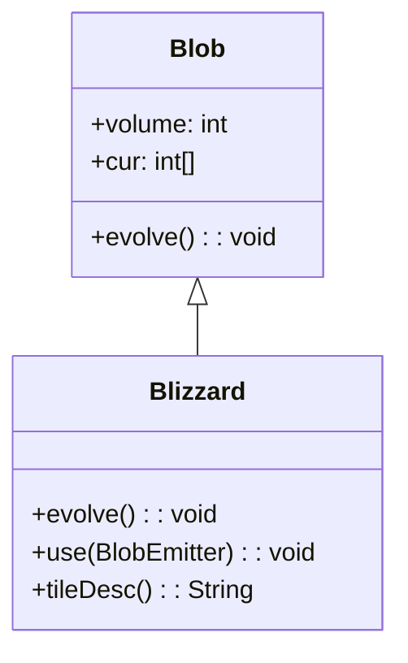

# Blizzard 类文档

## 1. 基本信息

| 属性 | 值 |
|------|-----|
| **文件路径** | core/src/main/java/com/shatteredpixel/shatteredpixeldungeon/actors/blobs/Blizzard.java |
| **包名** | com.shatteredpixel.shatteredpixeldungeon.actors.blobs |
| **类类型** | public class |
| **继承关系** | extends Blob |
| **代码行数** | 76 行 |
| **直接子类** | 无 |

## 2. 文件职责说明

Blizzard 类代表游戏中的"暴雪"区域效果。这是一种强力的冰冻效果，能够熄灭火焰和普通冰冻，并对格子施加双重冰冻效果。

**核心职责**：
- 实现暴雪的扩散逻辑（继承自 Blob）
- 清除火焰和普通冰冻效果
- 对格子施加双重冰冻效果
- 与狱火效果互斥抵消

**设计意图**：暴雪是冰冻效果的强化版本，代表极端寒冷。它与狱火形成对立关系，两者相遇时互相抵消。

## 3. 结构总览

```
Blizzard (extends Blob)
├── 方法
│   ├── evolve(): void           // 扩散并处理冰冻（覆盖父类）
│   ├── use(BlobEmitter): void   // 设置视觉效果（覆盖父类）
│   └── tileDesc(): String       // 返回描述文本（覆盖父类）
│
└── 无字段（完全继承 Blob）
```

## 4. 继承与协作关系

### 继承关系图



### 协作关系

| 协作类 | 协作方式 |
|--------|----------|
| **Blob** | 父类，提供扩散框架 |
| **Fire** | 被暴雪清除 |
| **Freezing** | 被暴雪清除，同时被调用施加冰冻 |
| **Inferno** | 互斥关系，相遇时互相抵消 |
| **Speck** | 暴雪粒子效果 |
| **Messages** | 国际化消息获取 |

## 5. 字段与常量详解

### 实例字段

Blizzard 类没有定义自己的字段，完全继承自 Blob。

### 效果优先级

暴雪会清除以下效果：
- Fire（火焰）
- Freezing（冰冻）

与以下效果互斥：
- Inferno（狱火）

## 6. 构造与初始化机制

Blizzard 类没有显式构造函数，使用默认构造函数。

### 典型初始化方式

```java
// 通过静态 seed 方法创建
Blob.seed(targetCell, amount, Blizzard.class);
```

## 7. 方法详解

### evolve() - 扩散与冰冻处理

```java
@Override
protected void evolve()
```

**职责**：调用父类扩散算法，然后处理冰冻效果和效果互斥。

**执行流程**：

1. **调用父类扩散**：
   ```java
   super.evolve();
   ```

2. **获取其他 Blob 引用**：
   ```java
   Fire fire = (Fire)Dungeon.level.blobs.get(Fire.class);
   Freezing freeze = (Freezing)Dungeon.level.blobs.get(Freezing.class);
   Inferno inf = (Inferno)Dungeon.level.blobs.get(Inferno.class);
   ```

3. **遍历暴雪区域**：
   ```java
   for (int i = area.left; i < area.right; i++) {
       for (int j = area.top; j < area.bottom; j++) {
           cell = i + j * Dungeon.level.width();
           if (cur[cell] > 0) {
               // 处理效果
           }
       }
   }
   ```

4. **处理有暴雪的格子**：
   - 清除火焰和冰冻：
     ```java
     if (fire != null) fire.clear(cell);
     if (freeze != null) freeze.clear(cell);
     ```
   - 检查狱火互斥：
     ```java
     if (inf != null && inf.volume > 0 && inf.cur[cell] > 0) {
         inf.clear(cell);
         off[cell] = cur[cell] = 0;
         continue;
     }
     ```
   - 施加双重冰冻：
     ```java
     Freezing.freeze(cell);
     Freezing.freeze(cell);
     ```

**双重冰冻**：调用两次 `Freezing.freeze(cell)` 意味着暴雪比普通冰冻效果更强。

### use() - 视觉效果设置

```java
@Override
public void use(BlobEmitter emitter)
```

**职责**：设置暴雪的粒子效果。

**实现**：
```java
super.use(emitter);
emitter.pour(Speck.factory(Speck.BLIZZARD, true), 0.4f);
```
- 使用 BLIZZARD 类型的 Speck 粒子
- 第二个参数 `true` 表示使用特定变体

### tileDesc() - 描述文本

```java
@Override
public String tileDesc()
```

**职责**：返回玩家查看暴雪格子时显示的描述文本。

## 8. 对外暴露能力

### 公共 API

| 方法 | 用途 | 调用者 |
|------|------|--------|
| `tileDesc()` | 获取暴雪描述文本 | UI 显示 |

### 继承自 Blob 的 API

| 方法 | 用途 |
|------|------|
| `seed(cell, amount, Blizzard.class)` | 创建暴雪效果 |
| `volumeAt(cell, Blizzard.class)` | 查询暴雪强度 |
| `clear(cell)` | 清除指定位置的暴雪 |

## 9. 运行机制与调用链

### 每回合执行流程

```
Game Loop
    └── Actor.process()
        └── Blizzard.act()
            ├── spend(TICK)
            ├── Blob.evolve() [父类扩散]
            ├── 交换 cur[] ↔ off[]
            └── Blizzard.evolve() [冰冻处理]
                ├── 清除 Fire 和 Freezing
                ├── 检查 Inferno 互斥
                └── 施加双重 Freezing.freeze()
```

### 效果互斥关系

```
暴雪格子
    ├── 有火焰 → 清除火焰
    ├── 有冰冻 → 清除冰冻
    ├── 有狱火 → 双方都清除（互斥）
    └── 无互斥 → 施加双重冰冻
```

### 与其他冰冻效果的区别

| 效果类型 | 冰冻强度 | 与狱火关系 |
|----------|----------|------------|
| Freezing | 单次冰冻 | 被狱火清除 |
| Blizzard | 双重冰冻 | 与狱火互斥 |

## 10. 资源、配置与国际化关联

### 国际化资源

**资源文件位置**：
- `core/src/main/assets/messages/actors/actors_zh.properties`

**相关翻译键**：
```properties
actors.blobs.blizzard.name=暴雪
actors.blobs.blizzard.desc=这里刮起了一阵暴风雪。
```

### 视觉资源

| 资源 | 说明 |
|------|------|
| **Speck.BLIZZARD** | 暴雪粒子效果 |
| **BlobEmitter** | 粒子发射器 |

## 11. 使用示例

### 创建暴雪

```java
// 在指定位置创建暴雪
Blob.seed(targetCell, 50, Blizzard.class);
```

### 检查暴雪强度

```java
int blizzardLevel = Blob.volumeAt(hero.pos, Blizzard.class);
if (blizzardLevel > 0) {
    // 玩家在暴雪中
}
```

### 清除暴雪

```java
Blizzard bliz = Dungeon.level.blobs.get(Blizzard.class);
if (bliz != null) {
    bliz.fullyClear();
}
```

## 12. 开发注意事项

### 双重冰冻的含义

- 调用两次 `Freezing.freeze(cell)`
- 可能意味着更强的冰冻效果或更长的持续时间
- 具体效果取决于 Freezing 类的实现

### 与狱火的互斥

- 暴雪和狱火在同一格子相遇时互相抵消
- 双方都会被清除
- 这是通过检查 Inferno 实现的

### 效果清除顺序

- 先清除 Fire 和 Freezing
- 再检查 Inferno 互斥
- 最后施加冰冻

## 13. 修改建议与扩展点

### 扩展点

1. **自定义冰冻强度**：添加字段控制冰冻次数
   ```java
   private int freezePower = 2;
   ```

2. **修改互斥逻辑**：添加与其他效果的互斥关系

### 修改建议

1. **冰冻强度配置化**：将双重冰冻提取为可配置参数
2. **视觉效果增强**：添加暴雪强度对应的粒子密度变化

## 14. 事实核查清单

- [x] 是否已覆盖全部 public/protected 方法
- [x] 是否已验证继承关系（extends Blob）
- [x] 是否已验证与 Fire/Freezing 的清除关系
- [x] 是否已验证与 Inferno 的互斥关系
- [x] 是否已验证双重冰冻逻辑
- [x] 是否已验证视觉效果设置
- [x] 所有中文术语是否来自官方翻译文件
- [x] 是否存在臆测性内容（无）
