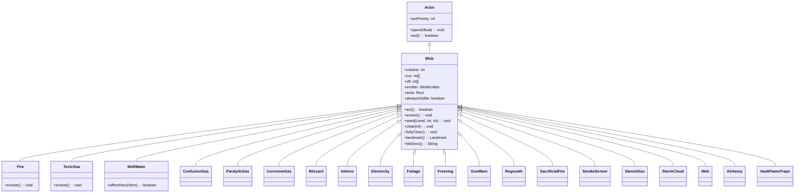

# Blob 类文档

## 1. 基本信息

| 属性 | 值 |
|------|-----|
| **文件路径** | core/src/main/java/com/shatteredpixel/shatteredpixeldungeon/actors/blobs/Blob.java |
| **包名** | com.shatteredpixel.shatteredpixeldungeon.actors.blobs |
| **类类型** | public class |
| **继承关系** | extends Actor |
| **代码行数** | 283 行 |
| **直接子类** | Alchemy, Blizzard, ConfusionGas, CorrosiveGas, Electricity, Fire, Foliage, Freezing, GooWarn, Inferno, ParalyticGas, Regrowth, SacrificialFire, SmokeScreen, StenchGas, StormCloud, ToxicGas, VaultFlameTraps, WellWater, Web 等 |

## 2. 文件职责说明

Blob 类是游戏中所有"区域效果"（Area of Effect）的基类。它定义了在地图格子中存在、扩散和演变的游戏效果的通用行为模式。

**核心职责**：
- 提供区域效果的生命周期管理（生成、演变、消散）
- 实现效果的扩散算法（通过 `evolve()` 方法）
- 管理效果在地图格子中的分布状态
- 支持游戏存档/读档时的状态序列化
- 与 `BlobEmitter` 配合提供视觉效果

**设计意图**：Blob 系统采用"格子值"模型，每个格子有一个整数值表示该位置效果的强度。效果每回合通过 `evolve()` 方法根据邻近格子的值进行扩散和衰减。

## 3. 结构总览

```
Blob (extends Actor)
├── 字段
│   ├── volume: int                    // 总体积（所有格子值的总和）
│   ├── cur: int[]                     // 当前帧各格子的效果值
│   ├── off: int[]                     // 下一帧各格子的效果值（双缓冲）
│   ├── emitter: BlobEmitter           // 视觉效果发射器
│   ├── area: Rect                     // 效果覆盖的矩形区域
│   └── alwaysVisible: boolean         // 是否始终可见
│
├── 常量（Bundle键名）
│   ├── CUR = "cur"
│   ├── START = "start"
│   └── LENGTH = "length"
│
├── 核心方法
│   ├── act(): boolean                 // 每回合执行的主逻辑
│   ├── evolve(): void                 // 扩散算法实现
│   ├── seed(Level, int, int): void    // 在指定位置生成效果
│   └── clear(int) / fullyClear()      // 清除效果
│
├── 序列化方法
│   ├── storeInBundle(Bundle): void    // 保存状态
│   └── restoreFromBundle(Bundle): void // 恢复状态
│
├── 地形标志方法
│   ├── onBuildFlagMaps(Level): void   // 构建地形标志
│   └── onUpdateCellFlags(Level, int)  // 更新单格地形标志
│
├── 辅助方法
│   ├── use(BlobEmitter): void         // 设置视觉效果器
│   ├── setupArea(): void              // 计算效果覆盖区域
│   ├── landmark(): Landmark           // 返回相关地图标记
│   └── tileDesc(): String             // 返回格子描述文本
│
└── 静态工具方法
    ├── seed(int, int, Class<T>, Level): T  // 静态工厂方法
    └── volumeAt(int, Class<? extends Blob>): int // 查询指定位置的强度
```

## 4. 继承与协作关系

### 继承关系图



### 协作关系

| 协作类 | 协作方式 |
|--------|----------|
| **Actor** | 父类，提供行动调度机制 |
| **Level** | 提供地图数据、格子属性、blob存储容器 |
| **Dungeon** | 提供当前关卡引用 |
| **BlobEmitter** | 接收视觉效果发射器，用于渲染 |
| **Bundle** | 序列化支持，保存/恢复blob状态 |
| **Notes.Landmark** | 地图标记系统，部分blob会创建标记 |
| **Rect** | 矩形区域计算，用于优化遍历范围 |

## 5. 字段与常量详解

### 实例字段

| 字段名 | 类型 | 访问级别 | 说明 |
|--------|------|----------|------|
| `volume` | int | public | 效果的总体积，等于所有格子中效果值的总和。当 volume 为 0 时，效果被视为不存在 |
| `cur` | int[] | public | 当前帧各格子的效果强度值数组。数组长度等于地图格子总数 |
| `off` | int[] | protected | 下一帧的效果值数组，用于双缓冲计算。evolve() 写入此数组，然后与 cur 交换 |
| `emitter` | BlobEmitter | public | 视觉效果发射器，由游戏场景设置，用于渲染粒子效果 |
| `area` | Rect | public | 效果覆盖的矩形区域，用于优化遍历范围，避免遍历整个地图 |
| `alwaysVisible` | boolean | public | 是否始终可见。设为 true 时，即使玩家不在视野内也能看到效果 |

### 常量（Bundle 键名）

| 常量名 | 值 | 用途 |
|--------|-----|------|
| `CUR` | "cur" | Bundle 中存储效果值数组的键 |
| `START` | "start" | Bundle 中存储效果起始位置的键 |
| `LENGTH` | "length" | Bundle 中存储数组长度的键 |

### 继承自 Actor 的字段

| 字段名 | 值 | 说明 |
|--------|-----|------|
| `actPriority` | BLOB_PRIO | 行动优先级，定义在 Actor 类中 |

## 6. 构造与初始化机制

Blob 类没有显式构造函数，使用默认构造函数。初始化流程：

### 实例初始化块
```java
{
    actPriority = BLOB_PRIO;
}
```
设置行动优先级为 BLOB_PRIO，确保 Blob 在每回合的特定时机执行。

### 典型初始化流程

1. **通过静态 seed() 方法创建**：
   ```java
   Blob.seed(cell, amount, Fire.class);
   ```
   - 从 Level.blobs 容器获取或创建实例
   - 调用实例的 seed() 方法设置初始值

2. **通过 Reflection.newInstance 创建**：
   - 静态 seed() 方法使用反射创建新实例
   - 新实例自动添加到 Level.blobs 容器

3. **数组初始化**：
   - cur 和 off 数组在首次调用 seed() 时初始化
   - 数组长度等于 Level.length()

## 7. 方法详解

### act() - 主行动方法

```java
@Override
public boolean act()
```

**职责**：每回合执行的核心逻辑，处理效果的演变。

**执行流程**：
1. 调用 `spend(TICK)` 消耗一回合
2. 如果 volume > 0：
   - 若 area 为空，调用 setupArea() 计算区域
   - 重置 volume 为 0
   - 调用 evolve() 执行扩散算法
   - 交换 cur 和 off 数组（双缓冲）
   - 更新需要刷新的格子标志
3. 如果 volume == 0：
   - 清空 area
   - 清理 off 数组中的残留值

**返回值**：始终返回 true

### evolve() - 扩散算法

```java
protected void evolve()
```

**职责**：实现默认的扩散算法，子类可覆盖以实现不同行为。

**算法逻辑**：
1. 遍历 area 范围内的所有格子
2. 对于每个非阻挡格子：
   - 计算自身及四个相邻格子的效果值总和
   - 新值 = 总和 / 格子数 - 1（衰减）
   - 写入 off 数组
3. 更新 area 边界以反映新的覆盖范围
4. 累加 volume

**扩散公式**：
```
newValue = (sum + count) / count - 1
```
其中 sum 是自身和相邻非阻挡格子的值之和，count 是参与计算的格子数。

### seed() - 生成效果

```java
public void seed(Level level, int cell, int amount)
```

**职责**：在指定位置添加效果值。

**参数**：
- `level`: 目标关卡
- `cell`: 目标格子索引
- `amount`: 添加的效果值

**行为**：
- 初始化 cur 和 off 数组（如果需要）
- 累加效果值到指定格子
- 更新 volume
- 扩展 area 以包含新格子

### 静态 seed() - 工厂方法

```java
public static <T extends Blob> T seed(int cell, int amount, Class<T> type, Level level)
```

**职责**：获取或创建指定类型的 Blob 实例并添加效果。

**执行流程**：
1. 从 level.blobs 获取现有实例
2. 若不存在，通过反射创建新实例
3. 检查行动优先级，避免"额外回合"问题
4. 将实例存入 level.blobs
5. 调用实例的 seed() 方法

### clear() / fullyClear() - 清除效果

```java
public void clear(int cell)
public void fullyClear()
```

**clear(int cell)**：清除指定格子的效果值，更新 volume。

**fullyClear()**：完全清除所有效果，重置 volume、area、cur、off。

### storeInBundle() / restoreFromBundle() - 序列化

```java
@Override
public void storeInBundle(Bundle bundle)
@Override
public void restoreFromBundle(Bundle bundle)
```

**存储策略**：
- 仅当 volume > 0 时存储
- 使用"裁剪"策略：只存储有效值的连续区间
- 存储起始位置、数组长度和裁剪后的数据

**恢复策略**：
- 检查是否存在 CUR 键
- 重建完整大小的数组
- 将裁剪的数据恢复到正确位置

### onBuildFlagMaps() / onUpdateCellFlags() - 地形标志

```java
public void onBuildFlagMaps(Level l)
public void onUpdateCellFlags(Level l, int cell)
```

**职责**：允许 Blob 影响地形标志（如可通行性）。

**默认行为**：空实现，子类可覆盖以实现特定效果（如 Web 影响移动）。

### landmark() - 地图标记

```java
public Notes.Landmark landmark()
```

**职责**：返回与此 Blob 相关的地图标记。

**默认行为**：返回 null，子类可覆盖（如 WellWater 返回井水标记）。

### tileDesc() - 格子描述

```java
public String tileDesc()
```

**职责**：返回玩家查看该格子时显示的描述文本。

**默认行为**：返回 null，子类应覆盖以提供具体描述。

### volumeAt() - 静态查询方法

```java
public static int volumeAt(int cell, Class<? extends Blob> type)
```

**职责**：查询指定位置特定类型 Blob 的效果强度。

**返回值**：该位置的 cur 值，若 Blob 不存在或 volume 为 0 则返回 0。

## 8. 对外暴露能力

### 公共 API

| 方法 | 用途 | 调用者 |
|------|------|--------|
| `seed(cell, amount, type)` | 创建或扩展 Blob 效果 | 法杖、陷阱、怪物技能 |
| `volumeAt(cell, type)` | 查询某位置的 Blob 强度 | 伤害计算、效果判定 |
| `clear(cell)` | 清除指定位置的 Blob | 玩家行动、效果消散 |
| `fullyClear()` | 完全清除 Blob | 关卡切换、效果结束 |
| `tileDesc()` | 获取格子描述文本 | UI 显示 |

### 供子类覆盖的方法

| 方法 | 覆盖目的 |
|------|----------|
| `evolve()` | 自定义扩散/演变逻辑 |
| `onBuildFlagMaps()` | 影响地形标志 |
| `onUpdateCellFlags()` | 更新单格地形标志 |
| `landmark()` | 提供地图标记 |
| `tileDesc()` | 提供描述文本 |

## 9. 运行机制与调用链

### 每回合执行流程

```
Game Loop
    └── Actor.process()
        └── Blob.act()
            ├── spend(TICK)
            ├── [volume > 0]
            │   ├── setupArea() [若 area 为空]
            │   ├── evolve()
            │   │   └── 计算扩散 → 写入 off[]
            │   ├── 交换 cur[] ↔ off[]
            │   └── 更新格子标志
            └── [volume == 0]
                └── 清空 area 和 off[]
```

### Blob 创建流程

```
调用方（如法杖/陷阱）
    └── Blob.seed(cell, amount, Fire.class)
        ├── level.blobs.get(Fire.class)
        ├── [不存在] Reflection.newInstance(Fire.class)
        ├── [新实例] spend(1f) [避免额外回合]
        ├── level.blobs.put(Fire.class, gas)
        └── gas.seed(level, cell, amount)
            ├── 初始化 cur[] / off[]
            ├── cur[cell] += amount
            ├── volume += amount
            └── area.union(x, y)
```

### 伤害判定流程

```
角色移动/停留
    └── 角色所在格子的 Blob 检查
        └── Blob.volumeAt(cell, ToxicGas.class)
            └── 返回 cur[cell] 值
                └── 根据值计算伤害/效果
```

## 10. 资源、配置与国际化关联

### 国际化资源

Blob 类本身不直接使用国际化资源，但子类通过 `tileDesc()` 返回的字符串通常来自 properties 文件：

**资源文件位置**：
- `core/src/main/assets/messages/actors/actors_zh.properties`

**相关翻译键**：
```properties
actors.blobs.fire.name=火焰
actors.blobs.fire.desc=一团火焰正在这里肆虐。
actors.blobs.toxicgas.name=毒气
actors.blobs.toxicgas.desc=这里盘绕着一片发绿的毒气。
# ... 其他 Blob 类型的翻译
```

### 配置关联

Blob 的行为参数主要硬编码在各子类中，无外部配置文件。

## 11. 使用示例

### 创建火焰效果

```java
// 在指定位置创建火焰，强度为 4
Blob.seed(targetCell, 4, Fire.class);
```

### 查询毒气强度

```java
// 检查玩家位置是否有毒气
int toxicLevel = Blob.volumeAt(hero.pos, ToxicGas.class);
if (toxicLevel > 0) {
    // 玩家在毒气中，计算伤害
}
```

### 清除特定位置的效果

```java
// 清除某位置的火焰
Fire fire = Dungeon.level.blobs.get(Fire.class);
if (fire != null) {
    fire.clear(cell);
}
```

### 完全清除某种效果

```java
// 完全清除本层的所有毒气
ToxicGas gas = Dungeon.level.blobs.get(ToxicGas.class);
if (gas != null) {
    gas.fullyClear();
}
```

## 12. 开发注意事项

### 双缓冲机制

Blob 使用 `cur` 和 `off` 两个数组实现双缓冲：
- `evolve()` 读取 `cur`，写入 `off`
- 计算完成后交换数组
- 这确保了扩散计算的正确性，避免"波纹"效应

### 区域优化

`area` 字段用于限制遍历范围：
- 只遍历有效值可能存在的区域
- evolve() 会动态调整 area 边界
- 显著提升大地图上的性能

### 序列化优化

`storeInBundle()` 使用裁剪策略：
- 找到有效值的起始和结束位置
- 只存储有效区间，节省存档空间
- 恢复时重建完整数组并填充数据

### 行动优先级

新创建的 Blob 可能获得"额外回合"：
- 静态 seed() 方法检查当前行动优先级
- 如果当前 Actor 优先级低于 Blob，则 spend(1f)
- 这确保 Blob 不会在创建当回合立即执行

### 线程安全

Blob 系统在游戏主线程运行，无需考虑多线程问题。但需注意：
- 不要在 act() 之外修改 cur/off 数组
- 清除操作应通过 clear() 方法进行

## 13. 修改建议与扩展点

### 扩展点

1. **自定义扩散算法**：覆盖 `evolve()` 实现不同的扩散模式
   ```java
   @Override
   protected void evolve() {
       // 自定义扩散逻辑
   }
   ```

2. **地形交互**：覆盖 `onBuildFlagMaps()` 和 `onUpdateCellFlags()`
   ```java
   @Override
   public void onBuildFlagMaps(Level l) {
       // 影响地形标志
   }
   ```

3. **地图标记**：覆盖 `landmark()` 添加发现记录
   ```java
   @Override
   public Notes.Landmark landmark() {
       return Notes.Landmark.WELL_OF_HEALTH;
   }
   ```

### 修改建议

1. **性能优化**：对于大量小范围 Blob，考虑使用稀疏存储
2. **调试支持**：添加可视化调试工具显示 Blob 分布
3. **效果组合**：考虑添加 Blob 之间的交互规则

## 14. 事实核查清单

- [x] 是否已覆盖全部 public/protected 字段
- [x] 是否已覆盖全部 public/protected 方法
- [x] 是否已验证继承关系（extends Actor）
- [x] 是否已验证与 BlobEmitter 的协作关系
- [x] 是否已验证与 Level.blobs 的存储关系
- [x] 是否已验证双缓冲机制（cur/off 数组交换）
- [x] 是否已验证序列化机制（裁剪存储策略）
- [x] 是否已验证扩散算法公式
- [x] 是否已验证静态工厂方法的行为
- [x] 是否已验证行动优先级处理逻辑
- [x] 所有中文术语是否来自官方翻译文件
- [x] 是否存在臆测性内容（无）
