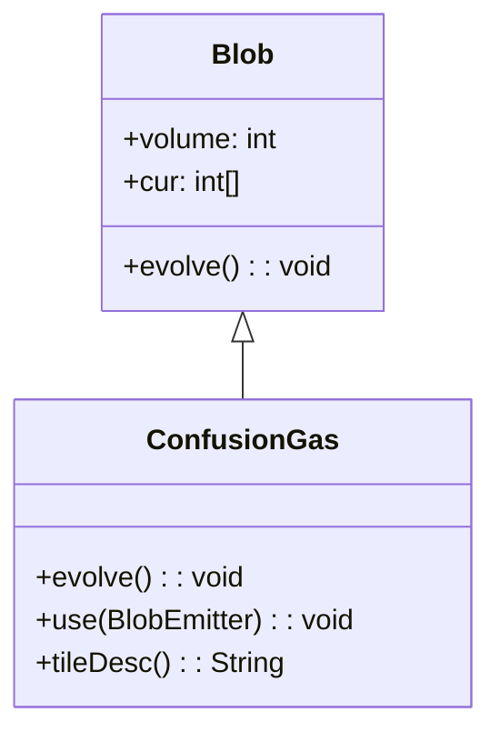

# ConfusionGas 类文档

## 1. 基本信息

| 属性 | 值 |
|------|-----|
| **文件路径** | core/src/main/java/com/shatteredpixel/shatteredpixeldungeon/actors/blobs/ConfusionGas.java |
| **包名** | com.shatteredpixel.shatteredpixeldungeon.actors.blobs |
| **类类型** | public class |
| **继承关系** | extends Blob |
| **代码行数** | 65 行 |
| **直接子类** | 无 |

## 2. 文件职责说明

ConfusionGas 类代表游戏中的"致眩气体"区域效果。吸入该气体的角色会陷入眩晕状态，移动方向变得不可预测。

**核心职责**：
- 实现致眩气体的扩散逻辑（继承自 Blob）
- 对气体中的角色施加眩晕 Buff
- 提供视觉效果和描述文本

**设计意图**：致眩气体是一种控制型区域效果，不造成直接伤害，但会干扰角色的移动，使其在战斗中处于劣势。

## 3. 结构总览

```
ConfusionGas (extends Blob)
├── 方法
│   ├── evolve(): void           // 扩散并施加眩晕（覆盖父类）
│   ├── use(BlobEmitter): void   // 设置视觉效果（覆盖父类）
│   └── tileDesc(): String       // 返回描述文本（覆盖父类）
│
└── 无字段（完全继承 Blob）
```

## 4. 继承与协作关系

### 继承关系图



### 协作关系

| 协作类 | 协作方式 |
|--------|----------|
| **Blob** | 父类，提供扩散框架 |
| **Vertigo** | 施加的 Buff 效果 |
| **Char** | 气体中的角色，被施加眩晕 |
| **Speck** | 气体粒子效果 |
| **Messages** | 国际化消息获取 |

## 5. 字段与常量详解

### 实例字段

ConfusionGas 类没有定义自己的字段，完全继承自 Blob。

### 眩晕持续时间

```java
Buff.prolong(ch, Vertigo.class, 2);
```

眩晕效果持续 2 回合，每次在气体中都会刷新持续时间。

## 6. 构造与初始化机制

ConfusionGas 类没有显式构造函数，使用默认构造函数。

### 典型初始化方式

```java
// 通过静态 seed 方法创建
Blob.seed(targetCell, amount, ConfusionGas.class);
```

## 7. 方法详解

### evolve() - 扩散与施加眩晕

```java
@Override
protected void evolve()
```

**职责**：调用父类扩散算法，然后对气体中的角色施加眩晕效果。

**执行流程**：

1. **调用父类扩散**：
   ```java
   super.evolve();
   ```

2. **遍历气体区域**：
   ```java
   for (int i = area.left; i < area.right; i++) {
       for (int j = area.top; j < area.bottom; j++) {
           cell = i + j * Dungeon.level.width();
           if (cur[cell] > 0 && (ch = Actor.findChar(cell)) != null) {
               if (!ch.isImmune(this.getClass())) {
                   Buff.prolong(ch, Vertigo.class, 2);
               }
           }
       }
   }
   ```

**眩晕条件**：
- 格子有气体（cur[cell] > 0）
- 格子上有角色
- 角色不免疫致眩气体

**眩晕效果**：
- 使用 `Buff.prolong()` 延长/施加眩晕
- 持续时间 2 回合
- 每回合都会刷新持续时间

### use() - 视觉效果设置

```java
@Override
public void use(BlobEmitter emitter)
```

**职责**：设置致眩气体的粒子效果。

**实现**：
```java
super.use(emitter);
emitter.pour(Speck.factory(Speck.CONFUSION, true), 0.4f);
```
- 使用 CONFUSION 类型的 Speck 粒子
- 第二个参数 `true` 表示使用特定变体
- 粒子生成频率 0.4f

### tileDesc() - 描述文本

```java
@Override
public String tileDesc()
```

**职责**：返回玩家查看致眩气体格子时显示的描述文本。

**返回值**：来自国际化资源的描述文本。

## 8. 对外暴露能力

### 公共 API

| 方法 | 用途 | 调用者 |
|------|------|--------|
| `tileDesc()` | 获取气体描述文本 | UI 显示 |

### 继承自 Blob 的 API

| 方法 | 用途 |
|------|------|
| `seed(cell, amount, ConfusionGas.class)` | 创建致眩气体效果 |
| `volumeAt(cell, ConfusionGas.class)` | 查询气体强度 |
| `clear(cell)` | 清除指定位置的气体 |

## 9. 运行机制与调用链

### 每回合执行流程

```
Game Loop
    └── Actor.process()
        └── ConfusionGas.act()
            ├── spend(TICK)
            ├── Blob.evolve() [父类扩散]
            ├── 交换 cur[] ↔ off[]
            └── ConfusionGas.evolve() [眩晕处理]
                └── 遍历区域 → 对角色施加 Vertigo Buff
```

### 眩晕效果机制

```
角色在气体中
    └── Buff.prolong(ch, Vertigo.class, 2)
        └── 若已有 Vertigo，延长持续时间
        └── 若无，创建新的 Vertigo（2回合）

角色移动
    └── Vertigo 影响移动方向
        └── 实际移动方向 = 随机方向
```

## 10. 资源、配置与国际化关联

### 国际化资源

**资源文件位置**：
- `core/src/main/assets/messages/actors/actors_zh.properties`

**相关翻译键**：
```properties
actors.blobs.confusiongas.name=致眩气体
actors.blobs.confusiongas.desc=这里盘绕着一片致眩气体。
```

**眩晕 Buff 翻译**：
```properties
actors.buffs.vertigo.name=眩晕
actors.buffs.vertigo.desc=如果整个世界都在旋转的话，想走直线会变得十分困难。
```

### 视觉资源

| 资源 | 说明 |
|------|------|
| **Speck.CONFUSION** | 致眩气体粒子效果 |
| **BlobEmitter** | 粒子发射器 |

## 11. 使用示例

### 创建致眩气体

```java
// 在指定位置创建致眩气体
Blob.seed(targetCell, 50, ConfusionGas.class);
```

### 检查气体强度

```java
int gasLevel = Blob.volumeAt(hero.pos, ConfusionGas.class);
if (gasLevel > 0) {
    // 玩家在致眩气体中
}
```

### 清除气体

```java
ConfusionGas gas = Dungeon.level.blobs.get(ConfusionGas.class);
if (gas != null) {
    gas.fullyClear();
}
```

## 12. 开发注意事项

### 眩晕与致盲的区别

- **眩晕（Vertigo）**：移动方向随机
- **失明（Blindness）**：视野受限
- 两者可同时存在，效果叠加

### Buff.prolong vs Buff.affect

- `Buff.prolong()`：延长现有 Buff 或创建新的
- `Buff.affect()`：总是创建新的 Buff
- 致眩气体使用 prolong 确保持续时间刷新

### 免疫检查

- 使用 `ch.isImmune(this.getClass())` 检查免疫
- 某些敌人（如幽灵）可能免疫致眩气体

## 13. 修改建议与扩展点

### 扩展点

1. **自定义眩晕时长**：覆盖 evolve() 修改持续时间
   ```java
   @Override
   protected void evolve() {
       super.evolve();
       // 使用不同的持续时间
       Buff.prolong(ch, Vertigo.class, customDuration);
   }
   ```

2. **添加额外效果**：在 evolve() 中添加其他 Buff

### 修改建议

1. **持续时间配置化**：将眩晕时长提取为常量或配置项
2. **强度关联效果**：根据气体强度调整眩晕时长

## 14. 事实核查清单

- [x] 是否已覆盖全部 public/protected 方法
- [x] 是否已验证继承关系（extends Blob）
- [x] 是否已验证与 Vertigo Buff 的协作关系
- [x] 是否已验证眩晕持续时间（2回合）
- [x] 是否已验证免疫检查逻辑
- [x] 是否已验证视觉效果设置
- [x] 所有中文术语是否来自官方翻译文件
- [x] 是否存在臆测性内容（无）
