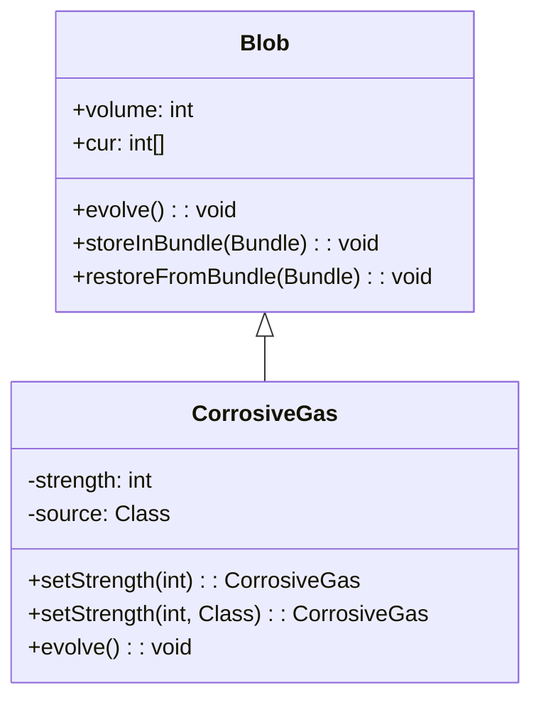

# CorrosiveGas 类文档

## 1. 基本信息

| 属性 | 值 |
|------|-----|
| **文件路径** | core/src/main/java/com/shatteredpixel/shatteredpixeldungeon/actors/blobs/CorrosiveGas.java |
| **包名** | com.shatteredpixel.shatteredpixeldungeon.actors.blobs |
| **类类型** | public class |
| **继承关系** | extends Blob |
| **代码行数** | 105 行 |
| **直接子类** | 无 |

## 2. 文件职责说明

CorrosiveGas 类代表游戏中的"腐蚀酸雾"区域效果。这是一种强力的持续性伤害气体，对吸入者施加腐蚀状态，造成递增伤害。

**核心职责**：
- 实现腐蚀酸雾的扩散逻辑（继承自 Blob）
- 对气体中的角色施加腐蚀 Buff
- 管理腐蚀强度和伤害来源
- 支持状态序列化

**设计意图**：腐蚀酸雾比普通毒气更危险，因为它施加的腐蚀状态会造成递增伤害。强度参数允许不同来源的腐蚀酸雾有不同的伤害能力。

## 3. 结构总览

```
CorrosiveGas (extends Blob)
├── 字段
│   ├── strength: int            // 腐蚀强度
│   └── source: Class            // 伤害来源类
│
├── 常量（Bundle键名）
│   ├── STRENGTH = "strength"
│   └── SOURCE = "source"
│
├── 方法
│   ├── evolve(): void                    // 扩散并施加腐蚀（覆盖父类）
│   ├── setStrength(int): CorrosiveGas    // 设置强度（链式调用）
│   ├── setStrength(int, Class): CorrosiveGas // 设置强度和来源
│   ├── use(BlobEmitter): void            // 设置视觉效果（覆盖父类）
│   ├── tileDesc(): String                // 返回描述文本（覆盖父类）
│   ├── storeInBundle(Bundle): void       // 保存状态（覆盖父类）
│   └── restoreFromBundle(Bundle): void   // 恢复状态（覆盖父类）
```

## 4. 继承与协作关系

### 继承关系图



### 协作关系

| 协作类 | 协作方式 |
|--------|----------|
| **Blob** | 父类，提供扩散框架 |
| **Corrosion** | 施加的 Buff 效果 |
| **Char** | 气体中的角色，被施加腐蚀 |
| **Speck** | 气体粒子效果 |
| **Bundle** | 序列化支持 |
| **Messages** | 国际化消息获取 |

## 5. 字段与常量详解

### 实例字段

| 字段名 | 类型 | 访问级别 | 说明 |
|--------|------|----------|------|
| `strength` | int | private | 腐蚀强度，影响腐蚀 Buff 的伤害 |
| `source` | Class | private | 伤害来源类，用于特定死亡逻辑处理 |

### 常量（Bundle 键名）

| 常量名 | 值 | 用途 |
|--------|-----|------|
| `STRENGTH` | "strength" | Bundle 中存储腐蚀强度的键 |
| `SOURCE` | "source" | Bundle 中存储伤害来源的键 |

### 强度机制

```java
// FIXME should have strength per-cell
private int strength = 0;
```

源码注释表明当前实现使用单一强度值，未来可能改为每格独立强度。

## 6. 构造与初始化机制

CorrosiveGas 类没有显式构造函数，使用默认构造函数。

### 典型初始化方式

```java
// 创建并设置强度
CorrosiveGas gas = Blob.seed(cell, amount, CorrosiveGas.class);
gas.setStrength(5); // 设置强度为 5

// 或链式调用
Blob.seed(cell, amount, CorrosiveGas.class).setStrength(5);
```

### 强度设置

```java
public CorrosiveGas setStrength(int str, Class source) {
    if (str > strength) {
        strength = str;
        this.source = source;
    }
    return this;
}
```

- 只有新强度大于当前强度时才更新
- 返回 this 支持链式调用

## 7. 方法详解

### evolve() - 扩散与施加腐蚀

```java
@Override
protected void evolve()
```

**职责**：调用父类扩散算法，然后对气体中的角色施加腐蚀效果。

**执行流程**：

1. **调用父类扩散**：
   ```java
   super.evolve();
   ```

2. **检查体积**：
   ```java
   if (volume == 0) {
       strength = 0;
       source = null;
   }
   ```
   气体消散时重置强度和来源。

3. **遍历气体区域**：
   ```java
   for (int i = area.left; i < area.right; i++) {
       for (int j = area.top; j < area.bottom; j++) {
           cell = i + j * Dungeon.level.width();
           if (cur[cell] > 0 && (ch = Actor.findChar(cell)) != null) {
               if (!ch.isImmune(this.getClass())) {
                   Buff.affect(ch, Corrosion.class).set(2f, strength, source);
               }
           }
       }
   }
   ```

**腐蚀参数**：
- 持续时间：2f（2回合初始）
- 强度：由 setStrength() 设置
- 来源：用于死亡逻辑

### setStrength() - 设置强度

```java
public CorrosiveGas setStrength(int str)
public CorrosiveGas setStrength(int str, Class source)
```

**职责**：设置腐蚀强度和可选的伤害来源。

**参数**：
- `str`: 腐蚀强度
- `source`: 伤害来源类（可选）

**行为**：
- 只有新强度大于当前强度时才更新
- 返回 this 支持链式调用

### storeInBundle() / restoreFromBundle() - 序列化

```java
@Override
public void storeInBundle(Bundle bundle)
@Override
public void restoreFromBundle(Bundle bundle)
```

**职责**：保存和恢复腐蚀气体的状态，包括强度和来源。

**实现**：
```java
// 保存
bundle.put(STRENGTH, strength);
bundle.put(SOURCE, source);

// 恢复
strength = bundle.getInt(STRENGTH);
source = bundle.getClass(SOURCE);
```

### use() - 视觉效果设置

```java
@Override
public void use(BlobEmitter emitter)
```

**职责**：设置腐蚀酸雾的粒子效果。

**实现**：
```java
super.use(emitter);
emitter.pour(Speck.factory(Speck.CORROSION), 0.4f);
```

### tileDesc() - 描述文本

```java
@Override
public String tileDesc()
```

**职责**：返回玩家查看腐蚀酸雾格子时显示的描述文本。

## 8. 对外暴露能力

### 公共 API

| 方法 | 用途 | 调用者 |
|------|------|--------|
| `setStrength(int)` | 设置腐蚀强度 | 创建气体时 |
| `setStrength(int, Class)` | 设置强度和来源 | 特定死亡逻辑 |
| `tileDesc()` | 获取气体描述文本 | UI 显示 |

### 继承自 Blob 的 API

| 方法 | 用途 |
|------|------|
| `seed(cell, amount, CorrosiveGas.class)` | 创建腐蚀酸雾效果 |
| `volumeAt(cell, CorrosiveGas.class)` | 查询气体强度 |
| `clear(cell)` | 清除指定位置的气体 |

## 9. 运行机制与调用链

### 每回合执行流程

```
Game Loop
    └── Actor.process()
        └── CorrosiveGas.act()
            ├── spend(TICK)
            ├── Blob.evolve() [父类扩散]
            ├── 交换 cur[] ↔ off[]
            └── CorrosiveGas.evolve() [腐蚀处理]
                ├── [volume == 0] 重置强度和来源
                └── 遍历区域 → 对角色施加 Corrosion Buff
```

### 腐蚀效果机制

```
角色在气体中
    └── Buff.affect(ch, Corrosion.class).set(2f, strength, source)
        └── 创建或获取 Corrosion Buff
        └── 设置持续时间、强度和来源

腐蚀伤害
    └── Corrosion 每回合造成递增伤害
        └── 伤害值随持续时间增加
```

## 10. 资源、配置与国际化关联

### 国际化资源

**资源文件位置**：
- `core/src/main/assets/messages/actors/actors_zh.properties`

**相关翻译键**：
```properties
actors.blobs.corrosivegas.name=腐蚀酸雾
actors.blobs.corrosivegas.desc=这里盘绕着一片致命的腐蚀酸雾。
```

**腐蚀 Buff 翻译**：
```properties
actors.buffs.corrosion.name=酸蚀
actors.buffs.corrosion.desc=强酸能以惊人的速度腐蚀掉血肉、金属和骨头。
```

### 视觉资源

| 资源 | 说明 |
|------|------|
| **Speck.CORROSION** | 腐蚀酸雾粒子效果 |
| **BlobEmitter** | 粒子发射器 |

## 11. 使用示例

### 创建腐蚀酸雾

```java
// 创建腐蚀酸雾并设置强度
CorrosiveGas gas = Blob.seed(targetCell, 50, CorrosiveGas.class);
gas.setStrength(5);

// 链式调用
Blob.seed(targetCell, 50, CorrosiveGas.class).setStrength(5);
```

### 设置伤害来源

```java
// 设置强度和来源（用于特定死亡逻辑）
Blob.seed(cell, 50, CorrosiveGas.class)
    .setStrength(5, DM300.class);
```

### 检查气体强度

```java
int gasLevel = Blob.volumeAt(hero.pos, CorrosiveGas.class);
if (gasLevel > 0) {
    // 玩家在腐蚀酸雾中
}
```

## 12. 开发注意事项

### 强度设置的限制

- 只有新强度大于当前强度时才更新
- 这防止了低强度来源覆盖高强度来源
- 但也意味着无法降低强度

### 来源字段用途

- `source` 字段用于特定死亡逻辑
- 例如：DM-300 的腐蚀酸雾死亡可能有特殊处理
- 来源为 null 时使用默认死亡逻辑

### FIXME 注释

源码中的注释表明：
```java
//FIXME should have strength per-cell
```
未来可能改为每格独立强度，当前使用全局强度。

### 与 ToxicGas 的区别

| 特性 | ToxicGas | CorrosiveGas |
|------|----------|--------------|
| 伤害类型 | 固定伤害 | 递增伤害 |
| 强度 | 基于关卡深度 | 可配置 |
| 来源追踪 | 无 | 有 |
| Buff 类型 | 直接伤害 | Corrosion Buff |

## 13. 修改建议与扩展点

### 扩展点

1. **每格独立强度**：实现 FIXME 注释中的建议
   ```java
   private int[] strengthPerCell;
   ```

2. **自定义腐蚀参数**：添加更多可配置项

### 修改建议

1. **强度继承**：考虑强度如何随扩散衰减
2. **来源序列化**：确保 source 类的正确序列化

## 14. 事实核查清单

- [x] 是否已覆盖全部 public/protected 方法
- [x] 是否已覆盖全部字段（strength, source）
- [x] 是否已验证继承关系（extends Blob）
- [x] 是否已验证与 Corrosion Buff 的协作关系
- [x] 是否已验证强度设置逻辑
- [x] 是否已验证序列化逻辑
- [x] 是否已验证视觉效果设置
- [x] 所有中文术语是否来自官方翻译文件
- [x] 是否存在臆测性内容（无）
