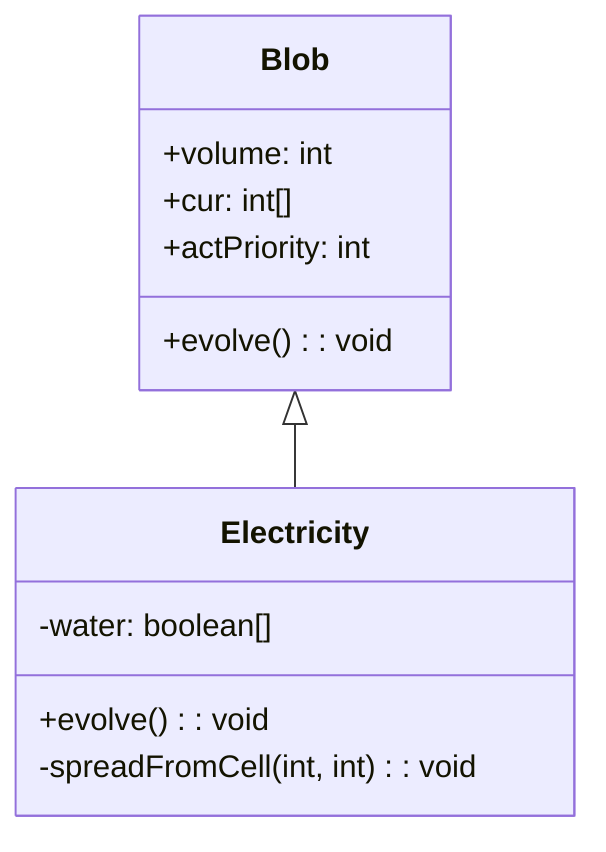

# Electricity 类文档

## 1. 基本信息

| 属性 | 值 |
|------|-----|
| **文件路径** | core/src/main/java/com/shatteredpixel/shatteredpixeldungeon/actors/blobs/Electricity.java |
| **包名** | com.shatteredpixel.shatteredpixeldungeon.actors.blobs |
| **类类型** | public class |
| **继承关系** | extends Blob |
| **代码行数** | 129 行 |
| **直接子类** | 无 |

## 2. 文件职责说明

Electricity 类代表游戏中的"电场"区域效果。它会通过水域传播，对角色造成麻痹和伤害，并能为魔杖类物品充能。

**核心职责**：
- 实现电场的扩散逻辑（通过水域传播）
- 对电场中的角色施加麻痹和伤害
- 为魔杖和法师杖充能
- 设置特殊的行动优先级

**设计意图**：电场具有独特的水域传播机制，使其在水域关卡中特别危险。充能效果为玩家提供了战术选择。

## 3. 结构总览

```
Electricity (extends Blob)
├── 实例初始化块
│   └── actPriority = MOB_PRIO - 1
│
├── 字段
│   └── water: boolean[]         // 水域标志缓存
│
├── 方法
│   ├── evolve(): void                    // 扩散并处理电击（覆盖父类）
│   ├── spreadFromCell(int, int): void    // 递归水域传播
│   ├── use(BlobEmitter): void            // 设置视觉效果（覆盖父类）
│   └── tileDesc(): String                // 返回描述文本（覆盖父类）
```

## 4. 继承与协作关系

### 继承关系图



### 协作关系

| 协作类 | 协作方式 |
|--------|----------|
| **Blob** | 父类，提供扩散框架 |
| **Paralysis** | 施加的麻痹效果 |
| **Char** | 电场中的角色，被麻痹和伤害 |
| **Heap** | 物品堆，魔杖类物品被充能 |
| **Wand** | 被充能的物品类型 |
| **MagesStaff** | 被充能的物品类型 |
| **Dungeon.level.water** | 水域标志，用于传播 |
| **SparkParticle** | 电场粒子效果 |
| **Messages** | 国际化消息获取 |
| **GLog** | 日志系统，显示死亡消息 |

## 5. 字段与常量详解

### 实例字段

| 字段名 | 类型 | 访问级别 | 说明 |
|--------|------|----------|------|
| `water` | boolean[] | private | 水域标志缓存，用于传播计算 |

### 行动优先级设置

```java
{
    //acts after mobs, to give them a chance to resist paralysis
    actPriority = MOB_PRIO - 1;
}
```

| 优先级 | 值 | 说明 |
|--------|-----|------|
| MOB_PRIO | 怪物优先级 | 怪物的行动时机 |
| MOB_PRIO - 1 | 电场优先级 | 在怪物之后行动 |

### 伤害计算公式

```java
ch.damage(Math.round(Random.Float(2 + Dungeon.scalingDepth() / 5f)), this);
```

| 关卡深度 | 基础伤害范围 |
|----------|--------------|
| 1-4 | 2-3 |
| 5-9 | 3-4 |
| 10-14 | 4-5 |
| 15+ | 5+ |

### 充能量

```java
((Wand) toShock).gainCharge(0.333f);
```

每次电击为魔杖充能 0.333 点。

## 6. 构造与初始化机制

Electricity 类没有显式构造函数，但使用实例初始化块设置行动优先级。

### 典型初始化方式

```java
// 通过静态 seed 方法创建
Blob.seed(targetCell, amount, Electricity.class);
```

## 7. 方法详解

### evolve() - 扩散与电击处理

```java
@Override
protected void evolve()
```

**职责**：实现电场的扩散、麻痹和伤害处理。

**执行流程**：

1. **获取水域标志**：
   ```java
   water = Dungeon.level.water;
   ```

2. **第一阶段：扩散**：
   ```java
   for (int i = area.left-1; i <= area.right; i++) {
       for (int j = area.top-1; j <= area.bottom; j++) {
           cell = i + j * Dungeon.level.width();
           if (cur[cell] > 0) {
               spreadFromCell(cell, cur[cell]);
           }
       }
   }
   ```

3. **第二阶段：电击和衰减**：
   ```java
   for (int i = area.left-1; i <= area.right; i++) {
       for (int j = area.top-1; j <= area.bottom; j++) {
           cell = i + j * Dungeon.level.width();
           if (cur[cell] > 0) {
               // 处理角色
               // 处理物品
               // 计算衰减
           }
       }
   }
   ```

4. **对角色的效果**：
   - 施加麻痹：
     ```java
     if (ch.buff(Paralysis.class) == null) {
         Buff.prolong(ch, Paralysis.class, cur[cell]);
     }
     ```
   - 造成伤害（奇数强度时）：
     ```java
     if (cur[cell] % 2 == 1) {
         ch.damage(Math.round(Random.Float(2 + Dungeon.scalingDepth() / 5f)), this);
     }
     ```

5. **对物品的效果**：
   ```java
   Heap h = Dungeon.level.heaps.get(cell);
   if (h != null) {
       Item toShock = h.peek();
       if (toShock instanceof Wand) {
           ((Wand) toShock).gainCharge(0.333f);
       } else if (toShock instanceof MagesStaff) {
           ((MagesStaff) toShock).gainCharge(0.333f);
       }
   }
   ```

### spreadFromCell() - 水域传播

```java
private void spreadFromCell(int cell, int power)
```

**职责**：递归地将电场传播到相邻的水域格子。

**参数**：
- `cell`: 当前格子位置
- `power`: 电场强度

**传播逻辑**：
```java
cur[cell] = Math.max(cur[cell], power);

for (int c : PathFinder.NEIGHBOURS4) {
    if (water[cell + c] && cur[cell + c] < power) {
        spreadFromCell(cell + c, power);
    }
}
```

- 设置当前格子的强度
- 检查四个相邻格子
- 若是水域且强度较低，递归传播

### use() - 视觉效果设置

```java
@Override
public void use(BlobEmitter emitter)
```

**职责**：设置电场的粒子效果。

**实现**：
```java
super.use(emitter);
emitter.start(SparkParticle.FACTORY, 0.05f, 0);
```

### tileDesc() - 描述文本

```java
@Override
public String tileDesc()
```

**职责**：返回玩家查看电场格子时显示的描述文本。

## 8. 对外暴露能力

### 公共 API

| 方法 | 用途 | 调用者 |
|------|------|--------|
| `tileDesc()` | 获取电场描述文本 | UI 显示 |

### 继承自 Blob 的 API

| 方法 | 用途 |
|------|------|
| `seed(cell, amount, Electricity.class)` | 创建电场效果 |
| `volumeAt(cell, Electricity.class)` | 查询电场强度 |
| `clear(cell)` | 清除指定位置的电场 |

## 9. 运行机制与调用链

### 每回合执行流程

```
Game Loop
    └── Actor.process() [按优先级排序]
        ├── [MOB_PRIO] 怪物行动
        └── [MOB_PRIO - 1] Electricity.act()
            ├── spend(TICK)
            └── Electricity.evolve()
                ├── 第一阶段：水域传播
                │   └── spreadFromCell() 递归传播
                └── 第二阶段：电击处理
                    ├── 对角色施加麻痹和伤害
                    ├── 对魔杖类物品充能
                    └── 计算衰减
```

### 水域传播示意

```
初始状态:          传播后:
  . . . .           . 3 3 .
  . 3 . .    →      3 3 3 3
  . . W .           . 3 3 3
  
(3=电场, W=水域, .=陆地)
电场通过水域传播到所有相连的水格
```

### 伤害触发条件

```
电场强度为奇数时造成伤害
    cur[cell] % 2 == 1
    → ch.damage(...)
```

## 10. 资源、配置与国际化关联

### 国际化资源

**资源文件位置**：
- `core/src/main/assets/messages/actors/actors_zh.properties`

**相关翻译键**：
```properties
actors.blobs.electricity.name=电场
actors.blobs.electricity.desc=火花在这片电场中不断闪烁着。
actors.blobs.electricity.rankings_desc=触电
actors.blobs.electricity.ondeath=你因触电而亡...
```

### 视觉资源

| 资源 | 说明 |
|------|------|
| **SparkParticle** | 电场火花粒子效果 |
| **BlobEmitter** | 粒子发射器 |

## 11. 使用示例

### 创建电场

```java
// 在指定位置创建电场
Blob.seed(targetCell, 5, Electricity.class);
```

### 检查电场强度

```java
int elecLevel = Blob.volumeAt(hero.pos, Electricity.class);
if (elecLevel > 0) {
    // 玩家在电场中
}
```

### 利用电场充能

```java
// 将魔杖放在电场中可以获得充能
// 每次电击充能 0.333 点
```

## 12. 开发注意事项

### 水域传播机制

- 电场只通过水域传播
- 传播是递归的，会传播到所有相连的水格
- 传播不会降低强度

### 行动优先级

- 电场在怪物之后行动
- 这确保怪物能完成自己的回合
- 麻痹效果在下一回合生效

### 奇数伤害机制

- 只有奇数强度的电场造成伤害
- 这意味着强度为 5 的电场会造成 3 次伤害（5→4→3→2→1→0）
- 强度为 4 的电场会造成 2 次伤害

### 充能效果

- 充能只对地面上的物品生效
- 玩家背包中的魔杖不会被充能
- 这提供了战术选择：将魔杖放在电场中充能

## 13. 修改建议与扩展点

### 扩展点

1. **自定义传播条件**：修改 spreadFromCell() 的传播规则
   ```java
   // 允许传播到其他类型的地形
   if (water[cell + c] || otherCondition(cell + c)) { ... }
   ```

2. **自定义充能量**：修改 gainCharge() 的参数

### 修改建议

1. **传播强度衰减**：考虑传播时降低强度
2. **充能配置化**：将充能量提取为常量

## 14. 事实核查清单

- [x] 是否已覆盖全部 public/protected 方法
- [x] 是否已覆盖全部字段（water）
- [x] 是否已验证继承关系（extends Blob）
- [x] 是否已验证行动优先级设置（MOB_PRIO - 1）
- [x] 是否已验证水域传播机制
- [x] 是否已验证麻痹和伤害逻辑
- [x] 是否已验证奇数伤害机制
- [x] 是否已验证充能效果
- [x] 是否已验证视觉效果设置
- [x] 所有中文术语是否来自官方翻译文件
- [x] 是否存在臆测性内容（无）
