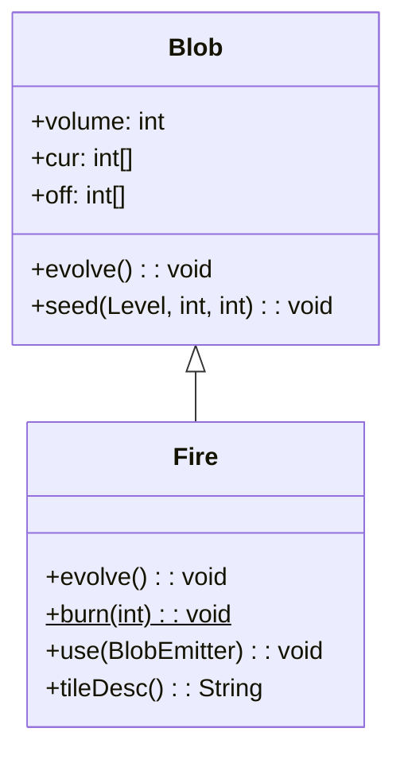

# Fire 类文档

## 1. 基本信息

| 属性 | 值 |
|------|-----|
| **文件路径** | core/src/main/java/com/shatteredpixel/shatteredpixeldungeon/actors/blobs/Fire.java |
| **包名** | com.shatteredpixel.shatteredpixeldungeon.actors.blobs |
| **类类型** | public class |
| **继承关系** | extends Blob |
| **代码行数** | 126 行 |
| **直接子类** | 无（最终类） |

## 2. 文件职责说明

Fire 类代表游戏中的"火焰"区域效果。它是最基础且最重要的 Blob 实现之一，负责：

**核心职责**：
- 实现火焰的扩散和衰减逻辑
- 对火焰中的角色施加"燃烧"状态
- 点燃物品堆和植物
- 破坏可燃地形（草地、木门等）
- 与冰冻效果互斥抵消

**设计意图**：火焰采用"蔓延式"扩散模型，会向相邻的可燃格子扩散，同时在原地逐渐衰减。火焰与冰冻的互斥机制确保了游戏逻辑的一致性。

## 3. 结构总览

```
Fire (extends Blob)
├── 方法
│   ├── evolve(): void           // 核心扩散逻辑（覆盖父类）
│   ├── burn(int): void          // 静态方法，处理单格燃烧效果
│   ├── use(BlobEmitter): void   // 设置视觉效果（覆盖父类）
│   └── tileDesc(): String       // 返回描述文本（覆盖父类）
│
└── 无字段（完全继承 Blob）
```

## 4. 继承与协作关系

### 继承关系图



### 协作关系

| 协作类 | 协作方式 |
|--------|----------|
| **Blob** | 父类，提供基础框架 |
| **Freezing** | 互斥关系，火焰与冰冻相遇时互相抵消 |
| **Burning** | 对角色施加的 Buff 效果 |
| **Char** | 火焰中的角色，会被施加燃烧状态 |
| **Heap** | 物品堆，会被点燃 |
| **Plant** | 植物，会被烧毁 |
| **Dungeon.level** | 提供地形数据（flamable 标志） |
| **FlameParticle** | 火焰粒子效果 |
| **Messages** | 国际化消息获取 |

## 5. 字段与常量详解

### 实例字段

Fire 类没有定义自己的字段，完全继承自 Blob：

| 继承字段 | 类型 | 用途 |
|----------|------|------|
| `volume` | int | 火焰总体积 |
| `cur` | int[] | 当前各格子火焰强度 |
| `off` | int[] | 下一帧火焰强度 |
| `area` | Rect | 火焰覆盖区域 |

### 地形标志依赖

Fire 依赖 Level 的 `flamable` 标志：
- `Dungeon.level.flamable[cell]` 标识格子是否可燃
- 可燃格子包括：草地、木门、书架等

## 6. 构造与初始化机制

Fire 类没有显式构造函数，使用默认构造函数。

### 典型初始化方式

```java
// 通过静态 seed 方法创建
Blob.seed(targetCell, 4, Fire.class);
```

### 火焰强度含义

| 强度值 | 含义 |
|--------|------|
| 4 | 新点燃的火焰（初始值） |
| 3-1 | 逐渐衰减的火焰 |
| 0 | 火焰熄灭 |

火焰每回合衰减 1 点强度，除非蔓延到新的可燃格子。

## 7. 方法详解

### evolve() - 核心扩散逻辑

```java
@Override
protected void evolve()
```

**职责**：实现火焰的扩散、衰减和交互逻辑。

**执行流程**：

1. **获取冰冻效果引用**：
   ```java
   Freezing freeze = (Freezing)Dungeon.level.blobs.get(Freezing.class);
   ```

2. **遍历区域内的每个格子**：
   - 对于有火焰的格子（cur[cell] > 0）：
     - 检查是否有冰冻，若有则互相抵消
     - 调用 `burn(cell)` 处理燃烧效果
     - 火焰强度减 1
     - 若火焰熄灭且格子可燃，销毁地形
   
   - 对于无火焰的格子：
     - 检查是否可燃且相邻有火焰
     - 若满足蔓延条件，点燃该格子（强度 4）

3. **更新地图观察**：
   - 若有地形被销毁，调用 `Dungeon.observe()` 更新视野

**火焰蔓延条件**：
- 格子必须可燃（flamable[cell] == true）
- 四个相邻格子中至少有一个有火焰
- 该格子没有冰冻效果

**火焰与冰冻互斥**：
- 火焰和冰冻在同一格子相遇时互相抵消
- 双方都会被清除

### burn() - 燃烧处理

```java
public static void burn(int pos)
```

**职责**：处理指定位置的燃烧效果，影响角色、物品和植物。

**参数**：
- `pos`: 目标格子位置

**执行逻辑**：

1. **对角色的效果**：
   ```java
   Char ch = Actor.findChar(pos);
   if (ch != null && !ch.isImmune(Fire.class)) {
       Buff.affect(ch, Burning.class).reignite(ch);
   }
   ```
   - 查找格子上的角色
   - 若角色存在且不免疫火焰，施加燃烧状态

2. **对物品堆的效果**：
   ```java
   Heap heap = Dungeon.level.heaps.get(pos);
   if (heap != null) {
       heap.burn();
   }
   ```
   - 点燃物品堆（可能销毁物品）

3. **对植物的效果**：
   ```java
   Plant plant = Dungeon.level.plants.get(pos);
   if (plant != null) {
       plant.wither();
   }
   ```
   - 烧毁植物

**免疫检查**：
- 通过 `ch.isImmune(Fire.class)` 检查角色是否免疫火焰
- 免疫的角色不会被施加燃烧状态

### use() - 视觉效果设置

```java
@Override
public void use(BlobEmitter emitter)
```

**职责**：设置火焰的粒子效果。

**实现**：
```java
super.use(emitter);
emitter.pour(FlameParticle.FACTORY, 0.03f);
```
- 调用父类方法保存 emitter 引用
- 使用 FlameParticle 工厂创建火焰粒子
- 粒子生成频率 0.03f

### tileDesc() - 描述文本

```java
@Override
public String tileDesc()
```

**职责**：返回玩家查看火焰格子时显示的描述文本。

**实现**：
```java
return Messages.get(this, "desc");
```

**返回值**：来自国际化资源的描述文本。

## 8. 对外暴露能力

### 公共 API

| 方法 | 用途 | 调用者 |
|------|------|--------|
| `burn(int pos)` | 静态方法，处理单格燃烧效果 | 其他需要点燃效果的地方 |
| `tileDesc()` | 获取火焰描述文本 | UI 显示 |

### 继承自 Blob 的 API

| 方法 | 用途 |
|------|------|
| `seed(cell, amount, Fire.class)` | 创建火焰效果 |
| `volumeAt(cell, Fire.class)` | 查询火焰强度 |
| `clear(cell)` | 熄灭指定位置的火焰 |

## 9. 运行机制与调用链

### 火焰生命周期

```
创建火焰
    └── Blob.seed(cell, 4, Fire.class)
        └── Fire 实例添加到 level.blobs

每回合演变
    └── Fire.evolve()
        ├── 检查冰冻互斥
        ├── 调用 burn(cell) 处理燃烧
        ├── 计算火焰衰减
        ├── 检查蔓延条件
        └── 更新地形（若需要）

燃烧效果
    └── Fire.burn(cell)
        ├── 对角色施加 Burning Buff
        ├── 点燃物品堆
        └── 烧毁植物
```

### 火焰蔓延示意图

```
初始状态:          一回合后:         两回合后:
  . . . .           . 4 . .          . 3 4 .
  . 4 . .    →      4 3 4 .    →     4 2 3 4
  . . . .           . 4 . .          . 3 4 .
  
(4=新火焰, 3/2=衰减中, .=无火焰)
```

### 与冰冻的互斥

```
火焰格子 + 冰冻格子 → 双方都清除
    cur[cell] > 0 && freeze.cur[cell] > 0
    → freeze.clear(cell)
    → cur[cell] = off[cell] = 0
```

## 10. 资源、配置与国际化关联

### 国际化资源

**资源文件位置**：
- `core/src/main/assets/messages/actors/actors_zh.properties`

**相关翻译键**：
```properties
actors.blobs.fire.name=火焰
actors.blobs.fire.desc=一团火焰正在这里肆虐。
```

### 视觉资源

| 资源 | 说明 |
|------|------|
| **FlameParticle** | 火焰粒子效果 |
| **BlobEmitter** | 粒子发射器 |

### 地形标志依赖

| 标志 | 用途 |
|------|------|
| `Level.flamable` | 标识格子是否可燃 |
| `Level.destroy(cell)` | 销毁可燃地形 |

## 11. 使用示例

### 创建火焰

```java
// 在指定位置创建火焰，强度 4
Blob.seed(targetCell, 4, Fire.class);
```

### 点燃敌人

```java
// 使用静态 burn 方法点燃指定位置
Fire.burn(enemy.pos);
```

### 检查火焰强度

```java
int fireLevel = Blob.volumeAt(hero.pos, Fire.class);
if (fireLevel > 0) {
    // 玩家在火焰中
}
```

### 熄灭火焰

```java
Fire fire = Dungeon.level.blobs.get(Fire.class);
if (fire != null) {
    fire.clear(cell);  // 熄灭指定位置
    // 或
    fire.fullyClear(); // 熄灭所有火焰
}
```

## 12. 开发注意事项

### 火焰与冰冻的互斥

- 火焰和冰冻在同一格子相遇时会互相抵消
- 这是通过在 evolve() 中检查 Freezing 实现的
- 修改任一类时需确保互斥逻辑的一致性

### 地形销毁

- 火焰熄灭时会销毁可燃地形
- 销毁后需要调用 `GameScene.updateMap()` 和 `Dungeon.observe()`
- 这会影响视野和地图显示

### 性能考虑

- evolve() 遍历整个 area 范围
- 每个有火焰的格子都会调用 burn()
- 大范围火焰可能影响性能

### 静态 burn() 方法的使用

- burn() 是静态方法，可在任何地方调用
- 不需要 Fire 实例即可点燃指定位置
- 但不会创建持续的火焰效果

## 13. 修改建议与扩展点

### 扩展点

1. **自定义火焰类型**：创建 Fire 的变体类
   ```java
   public class Hellfire extends Fire {
       @Override
       protected void evolve() {
           // 更强的火焰，不会衰减
       }
   }
   ```

2. **修改蔓延逻辑**：覆盖 evolve() 改变蔓延规则

3. **添加新的燃烧效果**：扩展 burn() 方法

### 修改建议

1. **性能优化**：对于大范围火焰，考虑批量处理 burn() 调用
2. **效果配置**：将火焰强度、衰减率等参数提取为可配置项
3. **调试支持**：添加火焰分布的可视化调试工具

## 14. 事实核查清单

- [x] 是否已覆盖全部 public/protected 方法
- [x] 是否已验证继承关系（extends Blob）
- [x] 是否已验证与 Freezing 的互斥关系
- [x] 是否已验证与 Burning Buff 的协作关系
- [x] 是否已验证与 Heap/Plant 的交互
- [x] 是否已验证火焰蔓延逻辑
- [x] 是否已验证地形销毁逻辑
- [x] 是否已验证静态 burn() 方法的行为
- [x] 是否已验证视觉效果设置
- [x] 所有中文术语是否来自官方翻译文件
- [x] 是否存在臆测性内容（无）
