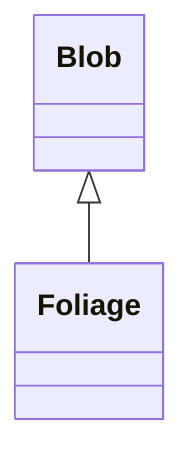

# Foliage 类文档

## 1. 基本信息

| 属性 | 值 |
|------|-----|
| **文件路径** | core/src/main/java/com/shatteredpixel/shatteredpixeldungeon/actors/blobs/Foliage.java |
| **包名** | com.shatteredpixel.shatteredpixeldungeon.actors.blobs |
| **类类型** | public class |
| **继承关系** | extends Blob |
| **代码行数** | 105 行 |
| **直接子类** | 无 |

## 2. 文件职责说明

Foliage 类代表游戏中的“落叶”区域效果。它用于花园区域，负责把灰烬恢复为草地，并在英雄站在区域内时持续提供 `Shadows` 效果。

**核心职责**：
- 提供花园地标 `GARDEN`
- 把满足条件的 `EMBERS` 恢复为 `GRASS`
- 为英雄持续施加或续延 `Shadows`
- 提供花园的视觉表现

## 3. 结构总览

```
Foliage (extends Blob)
├── 方法
│   ├── landmark(): Landmark
│   ├── evolve(): void
│   ├── use(BlobEmitter): void
│   └── tileDesc(): String
└── 无自有字段
```

## 4. 继承与协作关系

### 继承关系图



### 协作关系

| 协作类 | 协作方式 |
|--------|----------|
| **Blob** | 父类，提供基础区域数据 |
| **Notes.Landmark** | 提供 `GARDEN` 地标 |
| **Fire** | 用于判定附近是否仍有火焰 |
| **Hero** | 区域内英雄会获得 `Shadows` |
| **Shadows** | 英雄在花园中的效果 Buff |
| **Level** | 更新格子地形 |
| **Terrain** | 判断 `EMBERS` 与 `GRASS` |
| **GameScene** | 刷新地图显示 |
| **ShaftParticle** | 光束粒子效果 |

## 5. 字段与常量详解

Foliage 没有定义自有字段，完全依赖 `Blob` 的 `cur`、`off`、`volume`、`area`。\n
### 地形变化规则

仅在：
- 当前格为 `Terrain.EMBERS`
- 且周围 `NEIGHBOURS9` 中没有火焰覆盖

时，将该格设置为 `Terrain.GRASS`。

## 6. 构造与初始化机制

Foliage 没有显式构造函数，通常通过：

```java
Blob.seed(cell, amount, Foliage.class);
```

创建。它的扩散实现不做衰减，保持当前区域存在。

## 7. 方法详解

### landmark()

返回 `Notes.Landmark.GARDEN`。

### evolve()

**职责**：维持当前区域、恢复部分灰烬地形，并在英雄位于区域中时续延 `Shadows`。\n
**执行流程**：
1. 遍历 `area`。
2. 对 `cur[cell] > 0` 的格子：
   - `off[cell] = cur[cell]`，不衰减。\n
   - 若该格是 `EMBERS`，检查相邻 9 格内是否有火焰；若无则改成 `GRASS` 并刷新地图。\n
   - 记录该格是否已访问。\n
3. 若英雄存活且 `cur[hero.pos] > 0`：
   - `Buff.affect(hero, Shadows.class)`\n
   - 调用 `s.prolong()` 续延效果。

### use()

使用 `ShaftParticle.FACTORY`，速率为 `0.9f`。

### tileDesc()

返回国际化描述文本。

## 8. 对外暴露能力

| 方法 | 用途 |
|------|------|
| `landmark()` | 在地图笔记系统中标注花园 |
| `tileDesc()` | UI 查看格子说明 |

## 9. 运行机制与调用链

```
Foliage.act()
└── Blob.act()
    └── Foliage.evolve()
        ├── 维持当前区域强度
        ├── EMBERS -> GRASS [满足无火条件]
        └── 英雄在区域中时续延 Shadows
```

## 10. 资源、配置与国际化关联

文件：`core/src/main/assets/messages/actors/actors_zh.properties`

```properties
actors.blobs.foliage.name=落叶
actors.blobs.foliage.desc=光柱刺破了地下花园中的黑暗。
```

## 11. 使用示例

```java
Blob.seed(gardenCell, 1, Foliage.class);

if (Blob.volumeAt(hero.pos, Foliage.class) > 0) {
    // 英雄站在花园区域中
}
```

## 12. 开发注意事项

- `Foliage` 不做自然衰减。
- 灰烬恢复草地时会检查周围 9 格的火焰，避免火焰未熄灭时立即长草。
- 英雄效果不是一次性赋予，而是每回合在区域内持续续延 `Shadows`。

## 13. 修改建议与扩展点

- 若需要扩展更多花园机制，可在 `evolve()` 中加入对植物或隐藏单位的额外处理。
- `seen` 局部变量被写入但未参与后续逻辑，后续维护时可重新确认其必要性。

## 14. 事实核查清单

- [x] 已覆盖全部自有方法
- [x] 已验证继承关系 `extends Blob`
- [x] 已验证 `GARDEN` 地标返回值
- [x] 已验证 `EMBERS -> GRASS` 条件
- [x] 已验证英雄在区域内续延 `Shadows`
- [x] 已核对中文名与描述来自官方翻译
- [x] 无臆测性机制说明
