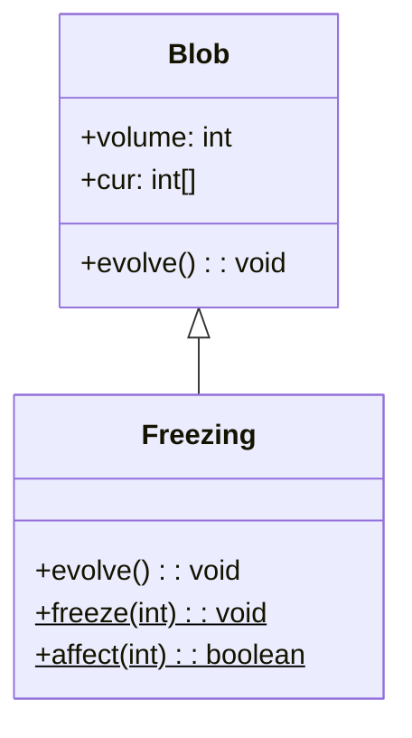

# Freezing 类文档

## 1. 基本信息

| 属性 | 值 |
|------|-----|
| **文件路径** | core/src/main/java/com/shatteredpixel/shatteredpixeldungeon/actors/blobs/Freezing.java |
| **包名** | com.shatteredpixel.shatteredpixeldungeon.actors.blobs |
| **类类型** | public class |
| **继承关系** | extends Blob |
| **代码行数** | 141 行 |
| **直接子类** | 无 |

## 2. 文件职责说明

Freezing 类代表游戏中的"冰霜"区域效果。它会对角色施加冻伤和冻结状态，冻结物品堆，并与火焰效果互斥。

**核心职责**：
- 实现冰霜的扩散和衰减逻辑
- 对角色施加冻伤（Chill）和冻结（Frost）状态
- 冻结物品堆
- 与火焰效果互斥抵消
- 提供静态 freeze() 方法供其他系统调用

**设计意图**：冰霜采用渐进式冻结机制，先施加冻伤，累积到一定程度后转为冻结。水域中的冰霜效果更强。

## 3. 结构总览

```
Freezing (extends Blob)
├── 方法
│   ├── evolve(): void           // 扩散并处理冰冻（覆盖父类）
│   ├── freeze(int): void        // 静态方法，处理单格冰冻效果
│   ├── affect(int): boolean     // 遗留方法，手动冰冻处理
│   ├── use(BlobEmitter): void   // 设置视觉效果（覆盖父类）
│   └── tileDesc(): String       // 返回描述文本（覆盖父类）
│
└── 无字段（完全继承 Blob）
```

## 4. 继承与协作关系

### 继承关系图



### 协作关系

| 协作类 | 协作方式 |
|--------|----------|
| **Blob** | 父类，提供扩散框架 |
| **Fire** | 互斥关系，冰霜与火焰相遇时互相抵消 |
| **Chill** | 施加的初级冰冻效果 |
| **Frost** | 施加的完全冻结效果 |
| **Char** | 冰霜中的角色，被施加冰冻状态 |
| **Heap** | 物品堆，被冻结 |
| **SnowParticle** | 冰霜粒子效果 |
| **Messages** | 国际化消息获取 |

## 5. 字段与常量详解

### 实例字段

Freezing 类没有定义自己的字段，完全继承自 Blob。

### 冻伤持续时间计算

```java
float turnsToAdd = Dungeon.level.water[cell] ? 5f : 3f;
```

| 环境 | 冻伤回合数 |
|------|------------|
| 水域 | 5 回合 |
| 陆地 | 3 回合 |

### 冻结触发条件

```java
if (chill != null
        && chill.cooldown() >= Chill.DURATION
        && !ch.isImmune(Frost.class)) {
    Buff.affect(ch, Frost.class, Frost.DURATION);
}
```

冻伤累积到最大持续时间后触发冻结。

## 6. 构造与初始化机制

Freezing 类没有显式构造函数，使用默认构造函数。

### 典型初始化方式

```java
// 通过静态 seed 方法创建
Blob.seed(targetCell, amount, Freezing.class);
```

## 7. 方法详解

### evolve() - 扩散与冰冻处理

```java
@Override
protected void evolve()
```

**职责**：实现冰霜的扩散、衰减和效果处理。

**执行流程**：

1. **获取火焰引用**：
   ```java
   Fire fire = (Fire)Dungeon.level.blobs.get(Fire.class);
   ```

2. **遍历冰霜区域**：
   ```java
   for (int i = area.left-1; i <= area.right; i++) {
       for (int j = area.top-1; j <= area.bottom; j++) {
           cell = i + j * Dungeon.level.width();
           // 处理冰霜
       }
   }
   ```

3. **处理有冰霜的格子**：
   - 检查火焰互斥：
     ```java
     if (fire != null && fire.volume > 0 && fire.cur[cell] > 0) {
         fire.clear(cell);
         off[cell] = cur[cell] = 0;
         continue;
     }
     ```
   - 调用 freeze() 处理冰冻效果：
     ```java
     Freezing.freeze(cell);
     ```
   - 计算衰减：
     ```java
     off[cell] = cur[cell] - 1;
     volume += off[cell];
     ```

### freeze() - 静态冰冻方法

```java
public static void freeze(int cell)
```

**职责**：处理指定格子的冰冻效果，影响角色和物品。

**参数**：
- `cell`: 目标格子位置

**执行逻辑**：

1. **对角色的效果**：
   - 若已有 Frost，延长冻结时间：
     ```java
     if (ch.buff(Frost.class) != null) {
         Buff.affect(ch, Frost.class, 2f);
     }
     ```
   - 否则施加冻伤：
     ```java
     float turnsToAdd = Dungeon.level.water[cell] ? 5f : 3f;
     // 考虑抗性和现有冻伤
     Buff.affect(ch, Chill.class, turnsToAdd);
     ```
   - 冻伤累积后触发冻结：
     ```java
     if (chill.cooldown() >= Chill.DURATION) {
         Buff.affect(ch, Frost.class, Frost.DURATION);
     }
     ```

2. **对物品堆的效果**：
   ```java
   Heap heap = Dungeon.level.heaps.get(cell);
   if (heap != null) heap.freeze();
   ```

### affect() - 遗留方法

```java
public static boolean affect(int cell)
```

**职责**：遗留功能，用于 Blob 系统之前的手动冰冻处理。

**参数**：
- `cell`: 目标格子位置

**返回值**：格子是否在玩家视野内

**执行逻辑**：
- 对角色施加冻结（非渐进式）
- 清除火焰和永恒之火
- 冻结物品堆
- 显示雪花粒子效果

## 8. 对外暴露能力

### 公共 API

| 方法 | 用途 | 调用者 |
|------|------|--------|
| `freeze(int cell)` | 静态方法，处理单格冰冻效果 | Blizzard、其他系统 |
| `affect(int cell)` | 遗留方法，手动冰冻处理 | 特殊场景 |
| `tileDesc()` | 获取冰霜描述文本 | UI 显示 |

### 继承自 Blob 的 API

| 方法 | 用途 |
|------|------|
| `seed(cell, amount, Freezing.class)` | 创建冰霜效果 |
| `volumeAt(cell, Freezing.class)` | 查询冰霜强度 |
| `clear(cell)` | 清除指定位置的冰霜 |

## 9. 运行机制与调用链

### 每回合执行流程

```
Game Loop
    └── Actor.process()
        └── Freezing.act()
            ├── spend(TICK)
            └── Freezing.evolve()
                ├── 遍历区域
                ├── 检查火焰互斥
                ├── 调用 freeze() 处理冰冻
                └── 计算衰减
```

### 渐进式冻结机制

```
冰霜格子
    └── freeze(cell)
        ├── 角色已有 Frost → 延长冻结
        └── 角色无 Frost → 施加 Chill
            └── Chill 累积到最大 → 触发 Frost
```

### 与火焰的互斥

```
冰霜格子 + 火焰格子 → 双方都清除
    cur[cell] > 0 && fire.cur[cell] > 0
    → fire.clear(cell)
    → cur[cell] = off[cell] = 0
```

## 10. 资源、配置与国际化关联

### 国际化资源

**资源文件位置**：
- `core/src/main/assets/messages/actors/actors_zh.properties`

**相关翻译键**：
```properties
actors.blobs.freezing.name=冰霜
actors.blobs.freezing.desc=这里的空气寒冷刺骨，很不寻常。
```

**冻伤/冻结 Buff 翻译**：
```properties
actors.buffs.chill.name=冻伤
actors.buffs.frost.name=冻结
```

### 视觉资源

| 资源 | 说明 |
|------|------|
| **SnowParticle** | 冰霜雪花粒子效果 |
| **BlobEmitter** | 粒子发射器 |

## 11. 使用示例

### 创建冰霜

```java
// 在指定位置创建冰霜
Blob.seed(targetCell, 10, Freezing.class);
```

### 静态冰冻方法

```java
// 直接对格子施加冰冻效果
Freezing.freeze(targetCell);
```

### 检查冰霜强度

```java
int freezeLevel = Blob.volumeAt(hero.pos, Freezing.class);
if (freezeLevel > 0) {
    // 玩家在冰霜中
}
```

## 12. 开发注意事项

### 渐进式冻结

- 冰霜先施加冻伤（Chill）
- 冻伤累积到最大后触发冻结（Frost）
- 这给予玩家反应时间

### 水域增强

- 水域中的冰霜效果更强（5回合 vs 3回合）
- 这模拟了水更容易冻结的特性

### 遗留方法

- `affect()` 方法标记为遗留功能
- 它直接施加冻结，跳过渐进式机制
- 仅在特殊场景使用

### 免疫检查

- 使用 `ch.isImmune(Freezing.class)` 检查冰霜免疫
- 使用 `ch.isImmune(Frost.class)` 检查冻结免疫
- 免疫的角色不会被施加相应效果

## 13. 修改建议与扩展点

### 扩展点

1. **自定义冻伤时长**：修改 freeze() 中的时间计算
   ```java
   float turnsToAdd = customFormula(cell);
   ```

2. **添加额外效果**：在 freeze() 中添加其他 Buff

### 修改建议

1. **移除遗留方法**：考虑移除 affect() 方法
2. **配置化**：将冻伤时长提取为常量

## 14. 事实核查清单

- [x] 是否已覆盖全部 public/protected 方法
- [x] 是否已验证继承关系（extends Blob）
- [x] 是否已验证与 Fire 的互斥关系
- [x] 是否已验证与 Chill/Frost 的协作关系
- [x] 是否已验证渐进式冻结机制
- [x] 是否已验证水域增强效果
- [x] 是否已验证静态 freeze() 方法
- [x] 是否已验证遗留 affect() 方法
- [x] 所有中文术语是否来自官方翻译文件
- [x] 是否存在臆测性内容（无）
