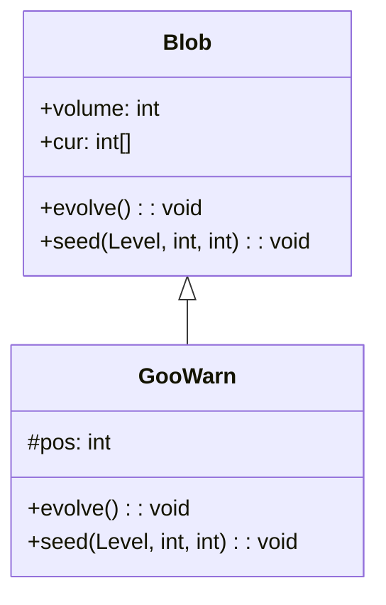

# GooWarn 类文档

## 1. 基本信息

| 属性 | 值 |
|------|-----|
| **文件路径** | core/src/main/java/com/shatteredpixel/shatteredpixeldungeon/actors/blobs/GooWarn.java |
| **包名** | com.shatteredpixel.shatteredpixeldungeon.actors.blobs |
| **类类型** | public class |
| **继承关系** | extends Blob |
| **代码行数** | 85 行 |
| **直接子类** | 无 |

## 2. 文件职责说明

GooWarn 类代表游戏中的"黑暗能量"警告效果。它是一个装饰性 Blob，主要用于显示 Goo（粘液怪）Boss 的蓄力攻击警告。

**核心职责**：
- 显示警告视觉效果
- 提供格子描述

**设计意图**：GooWarn 是一个历史遗留类。根据源码注释，它原本用于 Goo 的蓄力攻击视觉效果，但现在由 Goo 的精灵直接处理。它可能在某些特殊场景中仍有使用。

## 3. 结构总览

```
GooWarn (extends Blob)
├── 实例初始化块
│   └── actPriority = MOB_PRIO + 1
│
├── 字段
│   └── pos: int               // 位置（未使用）
│
├── 方法
│   ├── evolve(): void         // 消退逻辑（覆盖父类）
│   ├── seed(Level, int, int): void  // 特殊播种方法（覆盖父类）
│   ├── use(BlobEmitter): void // 设置视觉效果（覆盖父类）
│   └── tileDesc(): String     // 返回描述文本（覆盖父类）
```

## 4. 继承与协作关系

### 继承关系图



### 协作关系

| 协作类 | 协作方式 |
|--------|----------|
| **Blob** | 父类，提供基础框架 |
| **GooSprite.GooParticle** | Goo 粒子效果 |
| **BlobEmitter** | 粒子发射器 |
| **Messages** | 国际化消息获取 |

## 5. 字段与常量详解

### 实例字段

| 字段名 | 类型 | 访问级别 | 说明 |
|--------|------|----------|------|
| `pos` | int | protected | 位置字段（源码中未使用） |

### 行动优先级设置

```java
{
    //this one needs to act just before the Goo
    actPriority = MOB_PRIO + 1;
}
```

GooWarn 在 Goo 之前行动，确保警告效果在 Goo 行动前显示。

## 6. 构造与初始化机制

GooWarn 类没有显式构造函数，使用默认构造函数和实例初始化块。

### 典型初始化方式

```java
// 通过静态 seed 方法创建
Blob.seed(warnPos, amount, GooWarn.class);
```

## 7. 方法详解

### evolve() - 消退逻辑

```java
@Override
protected void evolve()
```

**职责**：实现 GooWarn 的消退逻辑，每回合减少强度。

**实现**：
```java
for (int i = area.left; i < area.right; i++) {
    for (int j = area.top; j < area.bottom; j++) {
        cell = i + j * Dungeon.level.width();
        off[cell] = cur[cell] > 0 ? cur[cell] - 1 : 0;
        
        if (off[cell] > 0) {
            volume += off[cell];
        }
    }
}
```

**特点**：
- 每回合强度减 1
- 自然消退

### seed() - 特殊播种方法

```java
@Override
public void seed(Level level, int cell, int amount)
```

**职责**：在指定位置生成警告效果，防止多个效果叠加。

**实现**：
```java
if (cur == null) cur = new int[level.length()];
if (off == null) off = new int[cur.length];

int toAdd = amount - cur[cell];
if (toAdd > 0) {
    cur[cell] += toAdd;
    volume += toAdd;
}

area.union(cell % level.width(), cell / level.width());
```

**特点**：
- 只增加差值（amount - cur[cell]）
- 防止多个弧光炸弹效果叠加

### use() - 视觉效果设置

```java
@Override
public void use(BlobEmitter emitter)
```

**职责**：设置 GooWarn 的粒子效果。

**实现**：
```java
super.use(emitter);
emitter.pour(GooSprite.GooParticle.FACTORY, 0.03f);
```
- 使用 Goo 粒子效果

### tileDesc() - 描述文本

```java
@Override
public String tileDesc()
```

**职责**：返回玩家查看警告格子时显示的描述文本。

## 8. 对外暴露能力

### 公共 API

| 方法 | 用途 | 调用者 |
|------|------|--------|
| `tileDesc()` | 获取警告描述文本 | UI 显示 |

### 继承自 Blob 的 API

| 方法 | 用途 |
|------|------|
| `seed(cell, amount, GooWarn.class)` | 创建警告效果 |
| `volumeAt(cell, GooWarn.class)` | 查询警告强度 |
| `clear(cell)` | 清除指定位置的警告 |

## 9. 运行机制与调用链

### 警告显示流程

```
Goo 蓄力攻击
    └── GooSprite 处理视觉效果
        └── [历史] GooWarn.seed()
            └── 显示警告效果
                └── 每回合消退
```

### 消退流程

```
GooWarn 存在
    └── GooWarn.evolve()
        └── 强度减 1
            └── [强度为 0] 效果消失
```

## 10. 资源、配置与国际化关联

### 国际化资源

**资源文件位置**：
- `core/src/main/assets/messages/actors/actors_zh.properties`

**相关翻译键**：
```properties
actors.blobs.goowarn.name=黑暗能量
actors.blobs.goowarn.desc=黑暗能量正在这里涌动！
```

### 视觉资源

| 资源 | 说明 |
|------|------|
| **GooSprite.GooParticle** | Goo 粒子效果 |
| **BlobEmitter** | 粒子发射器 |

## 11. 使用示例

### 创建警告效果

```java
// 在指定位置创建警告
Blob.seed(warnPos, 3, GooWarn.class);
```

### 检查警告强度

```java
int warnLevel = Blob.volumeAt(pos, GooWarn.class);
if (warnLevel > 0) {
    // 该位置有警告效果
}
```

## 12. 开发注意事项

### 历史遗留代码

根据源码注释：
```java
//cosmetic blob, previously used for Goo's pump up attack (that's now handled by Goo's sprite)
// as of v3.3.4 it's not longer used by arcane bomb either
```

- 这是一个装饰性 Blob
- 原本用于 Goo 的蓄力攻击
- 现在由 GooSprite 直接处理
- v3.3.4 后不再被弧光炸弹使用

### 特殊的 seed() 方法

- 覆盖了父类的 seed() 方法
- 只增加差值，防止叠加
- 这与标准 Blob 行为不同

### pos 字段未使用

- 源码中定义了 `pos` 字段但未使用
- 可能是历史遗留代码

## 13. 修改建议与扩展点

### 扩展点

1. **重新启用**：可以在新的 Boss 机制中使用
2. **自定义粒子**：修改粒子效果类型

### 修改建议

1. **考虑移除**：如果不再使用，可以考虑移除
2. **添加文档**：说明当前的使用场景（如果有）

## 14. 事实核查清单

- [x] 是否已覆盖全部 public/protected 方法
- [x] 是否已覆盖全部字段（pos）
- [x] 是否已验证继承关系（extends Blob）
- [x] 是否已验证行动优先级设置（MOB_PRIO + 1）
- [x] 是否已验证消退逻辑
- [x] 是否已验证特殊的 seed() 方法
- [x] 是否已验证视觉效果设置
- [x] 所有中文术语是否来自官方翻译文件
- [x] 是否存在臆测性内容（无）
