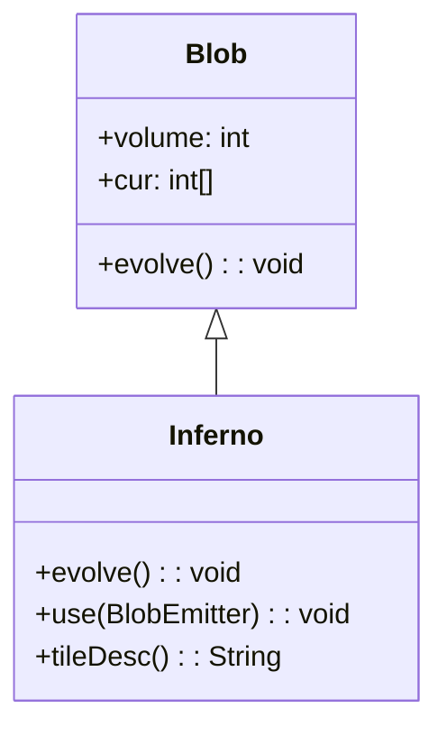

# Inferno 类文档

## 1. 基本信息

| 属性 | 值 |
|------|-----|
| **文件路径** | core/src/main/java/com/shatteredpixel/shatteredpixeldungeon/actors/blobs/Inferno.java |
| **包名** | com.shatteredpixel.shatteredpixeldungeon.actors.blobs |
| **类类型** | public class |
| **继承关系** | extends Blob |
| **代码行数** | 98 行 |
| **直接子类** | 无 |

## 2. 文件职责说明

Inferno 类代表游戏中的"狱火"区域效果。这是一种强力的火焰效果，能够熄灭普通火焰和冰冻，对格子造成燃烧伤害，并能点燃可燃地形。

**核心职责**：
- 实现狱火的扩散逻辑（继承自 Blob）
- 清除普通火焰和冰冻效果
- 对格子施加燃烧效果
- 破坏可燃地形
- 与暴雪效果互斥抵消

**设计意图**：狱火是火焰效果的强化版本，代表极端高温。它与暴雪形成对立关系，两者相遇时互相抵消。

## 3. 结构总览

```
Inferno (extends Blob)
├── 方法
│   ├── evolve(): void           // 扩散并处理燃烧（覆盖父类）
│   ├── use(BlobEmitter): void   // 设置视觉效果（覆盖父类）
│   └── tileDesc(): String       // 返回描述文本（覆盖父类）
│
└── 无字段（完全继承 Blob）
```

## 4. 继承与协作关系

### 继承关系图



### 协作关系

| 协作类 | 协作方式 |
|--------|----------|
| **Blob** | 父类，提供扩散框架 |
| **Fire** | 被狱火清除，同时被调用施加燃烧 |
| **Freezing** | 被狱火清除 |
| **Blizzard** | 互斥关系，相遇时互相抵消 |
| **Dungeon.level** | 提供地形数据（flamable 标志） |
| **GameScene** | 更新地图显示 |
| **Speck** | 狱火粒子效果 |
| **Messages** | 国际化消息获取 |

## 5. 字段与常量详解

### 实例字段

Inferno 类没有定义自己的字段，完全继承自 Blob。

### 效果优先级

狱火会清除以下效果：
- Fire（火焰）
- Freezing（冰冻）

与以下效果互斥：
- Blizzard（暴雪）

## 6. 构造与初始化机制

Inferno 类没有显式构造函数，使用默认构造函数。

### 典型初始化方式

```java
// 通过静态 seed 方法创建
Blob.seed(targetCell, amount, Inferno.class);
```

## 7. 方法详解

### evolve() - 扩散与燃烧处理

```java
@Override
protected void evolve()
```

**职责**：调用父类扩散算法，然后处理燃烧效果、地形破坏和效果互斥。

**执行流程**：

1. **调用父类扩散**：
   ```java
   super.evolve();
   ```

2. **获取其他 Blob 引用**：
   ```java
   Fire fire = (Fire)Dungeon.level.blobs.get(Fire.class);
   Freezing freeze = (Freezing)Dungeon.level.blobs.get(Freezing.class);
   Blizzard bliz = (Blizzard)Dungeon.level.blobs.get(Blizzard.class);
   ```

3. **遍历狱火区域**：
   ```java
   for (int i = area.left-1; i <= area.right; i++) {
       for (int j = area.top-1; j <= area.bottom; j++) {
           cell = i + j * Dungeon.level.width();
           // 处理效果
       }
   }
   ```
   注意：遍历范围比 area 大一格，用于检测蔓延。

4. **处理有狱火的格子**：
   - 清除火焰和冰冻：
     ```java
     if (fire != null) fire.clear(cell);
     if (freeze != null) freeze.clear(cell);
     ```
   - 检查暴雪互斥：
     ```java
     if (bliz != null && bliz.volume > 0 && bliz.cur[cell] > 0) {
         bliz.clear(cell);
         off[cell] = cur[cell] = 0;
         continue;
     }
     ```
   - 施加燃烧效果：
     ```java
     Fire.burn(cell);
     ```
   - 破坏可燃地形：
     ```java
     if (Dungeon.level.flamable[cell]) {
         Dungeon.level.destroy(cell);
         observe = true;
         GameScene.updateMap(cell);
     }
     ```

5. **处理蔓延**：
   ```java
   } else if (Dungeon.level.flamable[cell]
           && (cur[cell-1] > 0
           || cur[cell+1] > 0
           || cur[cell-Dungeon.level.width()] > 0
           || cur[cell+Dungeon.level.width()] > 0)) {
       if (fire == null || fire.cur == null || fire.cur[cell] == 0) {
           GameScene.add(Fire.seed(cell, 4, Fire.class));
       }
   }
   ```
   - 检查相邻格子是否有狱火
   - 若格子可燃且没有火焰，点燃该格子

6. **更新地图观察**：
   ```java
   if (observe) {
       Dungeon.observe();
   }
   ```

### use() - 视觉效果设置

```java
@Override
public void use(BlobEmitter emitter)
```

**职责**：设置狱火的粒子效果。

**实现**：
```java
super.use(emitter);
emitter.pour(Speck.factory(Speck.INFERNO, true), 0.4f);
```
- 使用 INFERNO 类型的 Speck 粒子
- 第二个参数 `true` 表示使用特定变体

### tileDesc() - 描述文本

```java
@Override
public String tileDesc()
```

**职责**：返回玩家查看狱火格子时显示的描述文本。

## 8. 对外暴露能力

### 公共 API

| 方法 | 用途 | 调用者 |
|------|------|--------|
| `tileDesc()` | 获取狱火描述文本 | UI 显示 |

### 继承自 Blob 的 API

| 方法 | 用途 |
|------|------|
| `seed(cell, amount, Inferno.class)` | 创建狱火效果 |
| `volumeAt(cell, Inferno.class)` | 查询狱火强度 |
| `clear(cell)` | 清除指定位置的狱火 |

## 9. 运行机制与调用链

### 每回合执行流程

```
Game Loop
    └── Actor.process()
        └── Inferno.act()
            ├── spend(TICK)
            ├── Blob.evolve() [父类扩散]
            ├── 交换 cur[] ↔ off[]
            └── Inferno.evolve() [燃烧处理]
                ├── 清除 Fire 和 Freezing
                ├── 检查 Blizzard 互斥
                ├── 调用 Fire.burn() 施加燃烧
                ├── 破坏可燃地形
                └── 蔓延到相邻可燃格子
```

### 效果互斥关系

```
狱火格子
    ├── 有火焰 → 清除火焰
    ├── 有冰冻 → 清除冰冻
    ├── 有暴雪 → 双方都清除（互斥）
    └── 无互斥 → 施加燃烧效果
```

### 蔓延机制

```
狱火格子相邻的可燃格子
    └── 检查是否有火焰
        ├── 无火焰 → 创建火焰（强度4）
        └── 有火焰 → 不处理
```

### 与其他火焰效果的区别

| 效果类型 | 燃烧方式 | 与暴雪关系 | 地形破坏 |
|----------|----------|------------|----------|
| Fire | 直接燃烧 | 被暴雪清除 | 是 |
| Inferno | 调用 Fire.burn() | 与暴雪互斥 | 是 |
| Blizzard | 双重冰冻 | 与狱火互斥 | 否 |

## 10. 资源、配置与国际化关联

### 国际化资源

**资源文件位置**：
- `core/src/main/assets/messages/actors/actors_zh.properties`

**相关翻译键**：
```properties
actors.blobs.inferno.name=狱火
actors.blobs.inferno.desc=一阵狱火正在这里肆虐。
```

### 视觉资源

| 资源 | 说明 |
|------|------|
| **Speck.INFERNO** | 狱火粒子效果 |
| **BlobEmitter** | 粒子发射器 |

## 11. 使用示例

### 创建狱火

```java
// 在指定位置创建狱火
Blob.seed(targetCell, 50, Inferno.class);
```

### 检查狱火强度

```java
int infernoLevel = Blob.volumeAt(hero.pos, Inferno.class);
if (infernoLevel > 0) {
    // 玩家在狱火中
}
```

### 清除狱火

```java
Inferno inf = Dungeon.level.blobs.get(Inferno.class);
if (inf != null) {
    inf.fullyClear();
}
```

## 12. 开发注意事项

### 与暴雪的互斥

- 狱火和暴雪在同一格子相遇时互相抵消
- 双方都会被清除
- 这是通过检查 Blizzard 实现的

### 蔓延机制

- 狱火会蔓延到相邻的可燃格子
- 蔓延时创建的是普通火焰（Fire），不是狱火
- 这确保了狱火不会无限扩散

### 地形破坏

- 狱火会破坏可燃地形
- 破坏后需要更新地图显示
- 这会影响视野和地图

### 遍历范围

- evolve() 遍历范围比 area 大一格
- 这是为了检测蔓延条件
- 可能影响性能

## 13. 修改建议与扩展点

### 扩展点

1. **自定义蔓延规则**：修改蔓延条件和创建的效果类型
   ```java
   // 创建狱火而非普通火焰
   GameScene.add(Inferno.seed(cell, 4, Inferno.class));
   ```

2. **添加额外效果**：在 evolve() 中添加其他效果

### 修改建议

1. **蔓延配置化**：将蔓延条件提取为可配置参数
2. **视觉效果增强**：添加狱火强度对应的粒子密度变化

## 14. 事实核查清单

- [x] 是否已覆盖全部 public/protected 方法
- [x] 是否已验证继承关系（extends Blob）
- [x] 是否已验证与 Fire/Freezing 的清除关系
- [x] 是否已验证与 Blizzard 的互斥关系
- [x] 是否已验证燃烧效果逻辑
- [x] 是否已验证地形破坏逻辑
- [x] 是否已验证蔓延机制
- [x] 是否已验证视觉效果设置
- [x] 所有中文术语是否来自官方翻译文件
- [x] 是否存在臆测性内容（无）
