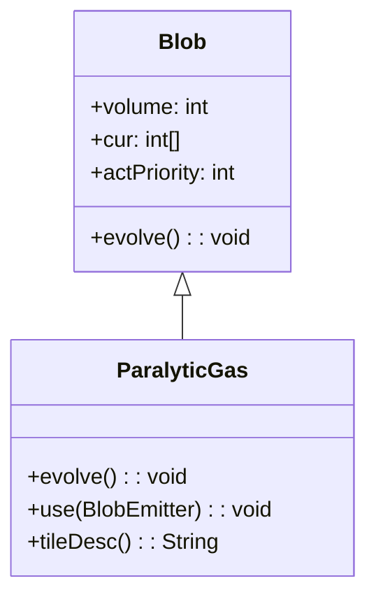

# ParalyticGas 类文档

## 1. 基本信息

| 属性 | 值 |
|------|-----|
| **文件路径** | core/src/main/java/com/shatteredpixel/shatteredpixeldungeon/actors/blobs/ParalyticGas.java |
| **包名** | com.shatteredpixel.shatteredpixeldungeon.actors.blobs |
| **类类型** | public class |
| **继承关系** | extends Blob |
| **代码行数** | 69 行 |
| **直接子类** | 无 |

## 2. 文件职责说明

ParalyticGas 类代表游戏中的"麻痹气体"区域效果。吸入该气体的角色会陷入麻痹状态，无法进行任何行动。

**核心职责**：
- 实现麻痹气体的扩散逻辑（继承自 Blob）
- 对气体中的角色施加麻痹 Buff
- 设置特殊的行动优先级以确保敌人有机会抵抗

**设计意图**：麻痹气体是一种强力的控制型区域效果。通过设置比怪物更低的行动优先级，确保怪物在自己的回合结束后才被麻痹，给予它们"抵抗"的机会。

## 3. 结构总览

```
ParalyticGas (extends Blob)
├── 实例初始化块
│   └── actPriority = MOB_PRIO - 1
│
├── 方法
│   ├── evolve(): void           // 扩散并施加麻痹（覆盖父类）
│   ├── use(BlobEmitter): void   // 设置视觉效果（覆盖父类）
│   └── tileDesc(): String       // 返回描述文本（覆盖父类）
│
└── 无字段（完全继承 Blob）
```

## 4. 继承与协作关系

### 继承关系图



### 协作关系

| 协作类 | 协作方式 |
|--------|----------|
| **Blob** | 父类，提供扩散框架 |
| **Paralysis** | 施加的 Buff 效果 |
| **Char** | 气体中的角色，被施加麻痹 |
| **Speck** | 气体粒子效果 |
| **Messages** | 国际化消息获取 |

## 5. 字段与常量详解

### 实例字段

ParalyticGas 类没有定义自己的字段，但通过实例初始化块修改了继承的字段：

### 行动优先级设置

```java
{
    //acts after mobs, to give them a chance to resist paralysis
    actPriority = MOB_PRIO - 1;
}
```

| 优先级 | 值 | 说明 |
|--------|-----|------|
| MOB_PRIO | 怪物优先级 | 怪物的行动时机 |
| MOB_PRIO - 1 | 麻痹气体优先级 | 在怪物之后行动 |

**设计意图**：麻痹气体在怪物行动后才执行，这样怪物可以在被麻痹前完成自己的回合，感觉上像是"抵抗"了麻痹效果。

### 麻痹持续时间

```java
Buff.prolong(ch, Paralysis.class, Paralysis.DURATION);
```

使用 `Paralysis.DURATION` 常量作为麻痹持续时间。

## 6. 构造与初始化机制

ParalyticGas 类没有显式构造函数，但使用实例初始化块设置行动优先级。

### 典型初始化方式

```java
// 通过静态 seed 方法创建
Blob.seed(targetCell, amount, ParalyticGas.class);
```

## 7. 方法详解

### evolve() - 扩散与施加麻痹

```java
@Override
protected void evolve()
```

**职责**：调用父类扩散算法，然后对气体中的角色施加麻痹效果。

**执行流程**：

1. **调用父类扩散**：
   ```java
   super.evolve();
   ```

2. **遍历气体区域**：
   ```java
   for (int i = area.left; i < area.right; i++) {
       for (int j = area.top; j < area.bottom; j++) {
           cell = i + j * Dungeon.level.width();
           if (cur[cell] > 0 && (ch = Actor.findChar(cell)) != null) {
               if (!ch.isImmune(this.getClass())) {
                   Buff.prolong(ch, Paralysis.class, Paralysis.DURATION);
               }
           }
       }
   }
   ```

**麻痹条件**：
- 格子有气体（cur[cell] > 0）
- 格子上有角色
- 角色不免疫麻痹气体

**麻痹效果**：
- 使用 `Buff.prolong()` 延长/施加麻痹
- 持续时间为 `Paralysis.DURATION`
- 每回合都会刷新持续时间

### use() - 视觉效果设置

```java
@Override
public void use(BlobEmitter emitter)
```

**职责**：设置麻痹气体的粒子效果。

**实现**：
```java
super.use(emitter);
emitter.pour(Speck.factory(Speck.PARALYSIS), 0.4f);
```
- 使用 PARALYSIS 类型的 Speck 粒子
- 粒子生成频率 0.4f

### tileDesc() - 描述文本

```java
@Override
public String tileDesc()
```

**职责**：返回玩家查看麻痹气体格子时显示的描述文本。

**返回值**：来自国际化资源的描述文本。

## 8. 对外暴露能力

### 公共 API

| 方法 | 用途 | 调用者 |
|------|------|--------|
| `tileDesc()` | 获取气体描述文本 | UI 显示 |

### 继承自 Blob 的 API

| 方法 | 用途 |
|------|------|
| `seed(cell, amount, ParalyticGas.class)` | 创建麻痹气体效果 |
| `volumeAt(cell, ParalyticGas.class)` | 查询气体强度 |
| `clear(cell)` | 清除指定位置的气体 |

## 9. 运行机制与调用链

### 每回合执行流程

```
Game Loop
    └── Actor.process() [按优先级排序]
        ├── [MOB_PRIO] 怪物行动
        └── [MOB_PRIO - 1] ParalyticGas.act()
            ├── spend(TICK)
            ├── Blob.evolve() [父类扩散]
            ├── 交换 cur[] ↔ off[]
            └── ParalyticGas.evolve() [麻痹处理]
                └── 遍历区域 → 对角色施加 Paralysis Buff
```

### 麻痹效果机制

```
角色在气体中
    └── Buff.prolong(ch, Paralysis.class, Paralysis.DURATION)
        └── 若已有 Paralysis，延长持续时间
        └── 若无，创建新的 Paralysis

角色回合
    └── Paralysis 检查
        └── 角色无法行动，跳过回合
```

### 行动优先级示意

```
回合执行顺序：
1. 英雄 (HERO_PRIO)
2. 怪物 (MOB_PRIO)        ← 怪物先行动
3. 麻痹气体 (MOB_PRIO-1)  ← 然后气体才麻痹
4. 其他 Blob (BLOB_PRIO)
```

## 10. 资源、配置与国际化关联

### 国际化资源

**资源文件位置**：
- `core/src/main/assets/messages/actors/actors_zh.properties`

**相关翻译键**：
```properties
actors.blobs.paralyticgas.name=麻痹气体
actors.blobs.paralyticgas.desc=这里盘绕着一片麻痹气体。
```

**麻痹 Buff 翻译**：
```properties
actors.buffs.paralysis.name=麻痹
actors.buffs.paralysis.desc=通常最坏的事就是什么事都做不了。
```

### 视觉资源

| 资源 | 说明 |
|------|------|
| **Speck.PARALYSIS** | 麻痹气体粒子效果 |
| **BlobEmitter** | 粒子发射器 |

## 11. 使用示例

### 创建麻痹气体

```java
// 在指定位置创建麻痹气体
Blob.seed(targetCell, 50, ParalyticGas.class);
```

### 检查气体强度

```java
int gasLevel = Blob.volumeAt(hero.pos, ParalyticGas.class);
if (gasLevel > 0) {
    // 玩家在麻痹气体中
}
```

### 清除气体

```java
ParalyticGas gas = Dungeon.level.blobs.get(ParalyticGas.class);
if (gas != null) {
    gas.fullyClear();
}
```

## 12. 开发注意事项

### 行动优先级的重要性

- 麻痹气体在怪物之后行动
- 这确保怪物能完成自己的回合
- 如果气体先行动，怪物会在回合开始时就被麻痹

### Paralysis.DURATION 常量

- 使用 Paralysis 类定义的持续时间常量
- 确保麻痹效果的一致性
- 修改 Paralysis.DURATION 会影响所有麻痹来源

### 免疫检查

- 使用 `ch.isImmune(this.getClass())` 检查免疫
- 某些敌人（如 Golem）可能免疫麻痹
- 免疫的角色不会被施加麻痹效果

### 与其他气体的区别

| 气体类型 | 效果 | 行动优先级 |
|----------|------|------------|
| ToxicGas | 伤害 | BLOB_PRIO |
| ConfusionGas | 眩晕 | BLOB_PRIO |
| ParalyticGas | 麻痹 | MOB_PRIO - 1 |

## 13. 修改建议与扩展点

### 扩展点

1. **自定义麻痹时长**：覆盖 evolve() 修改持续时间
   ```java
   @Override
   protected void evolve() {
       super.evolve();
       // 使用不同的持续时间
       Buff.prolong(ch, Paralysis.class, customDuration);
   }
   ```

2. **修改行动优先级**：调整实例初始化块

### 修改建议

1. **持续时间配置化**：将麻痹时长提取为实例字段
2. **强度关联效果**：根据气体强度调整麻痹时长

## 14. 事实核查清单

- [x] 是否已覆盖全部 public/protected 方法
- [x] 是否已验证继承关系（extends Blob）
- [x] 是否已验证与 Paralysis Buff 的协作关系
- [x] 是否已验证行动优先级设置（MOB_PRIO - 1）
- [x] 是否已验证麻痹持续时间（Paralysis.DURATION）
- [x] 是否已验证免疫检查逻辑
- [x] 是否已验证视觉效果设置
- [x] 所有中文术语是否来自官方翻译文件
- [x] 是否存在臆测性内容（无）
