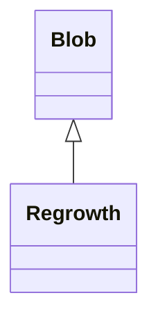

# Regrowth 类文档

## 1. 基本信息

| 属性 | 值 |
|------|-----|
| **文件路径** | core/src/main/java/com/shatteredpixel/shatteredpixeldungeon/actors/blobs/Regrowth.java |
| **包名** | com.shatteredpixel.shatteredpixeldungeon.actors.blobs |
| **类类型** | public class |
| **继承关系** | extends Blob |
| **代码行数** | 81 行 |
| **直接子类** | 无 |

## 2. 文件职责说明

Regrowth 类代表游戏中的“草木再生”区域效果。它会把空地、灰烬或草地进一步恢复成草地/高草，并在覆盖格子中对角色施加 `Roots`。

**核心职责**：
- 调用标准 Blob 扩散逻辑
- 根据强度把地形变成 `GRASS` 或 `HIGH_GRASS`
- 对覆盖格中的单位施加缠绕
- 在地形变化后刷新地图观察结果

## 3. 结构总览

```
Regrowth (extends Blob)
├── 方法
│   ├── evolve(): void
│   └── use(BlobEmitter): void
└── 无自有字段
```

## 4. 继承与协作关系

### 继承关系图



### 协作关系

| 协作类 | 协作方式 |
|--------|----------|
| **Blob** | 父类，提供标准扩散 |
| **Actor/Char** | 用于检查格子角色 |
| **Roots** | 对区域内角色施加缠绕 |
| **Level** | 更新格子地形 |
| **Terrain** | 判断与写入草地/高草类型 |
| **GameScene** | 刷新地图显示 |
| **LeafParticle** | 视觉粒子效果 |

## 5. 字段与常量详解

Regrowth 没有自有字段。\n
### 地形转换规则

| 原地形 | 条件 | 结果 |
|--------|------|------|
| `EMPTY` / `EMBERS` / `EMPTY_DECO` | `cur[cell] <= 9` 或有角色 | `GRASS` |
| `EMPTY` / `EMBERS` / `EMPTY_DECO` | `cur[cell] > 9` 且无角色 | `HIGH_GRASS` |
| `GRASS` / `FURROWED_GRASS` | `cur[cell] > 9` 且无植物且无角色 | `HIGH_GRASS` |

## 6. 构造与初始化机制

Regrowth 没有显式构造函数。通常通过：

```java
Blob.seed(cell, amount, Regrowth.class);
```

创建实例。强度值会影响最终生成普通草还是高草。

## 7. 方法详解

### evolve()

```java
@Override
protected void evolve()
```

**职责**：在父类扩散结果基础上，处理地形恢复与角色缠绕。\n
**执行流程**：
1. 调用 `super.evolve()` 完成标准扩散。\n
2. 若 `volume > 0`，遍历 `area` 范围。\n
3. 对每个 `off[cell] > 0` 的格子：
   - 根据当前地形与强度决定是否改成 `GRASS` / `HIGH_GRASS`。\n
   - 若地形变化，调用 `Level.set(cell, c1)` 与 `GameScene.updateMap(cell)`。\n
   - 若该格有角色、角色不免疫 `Regrowth` 且 `off[cell] > 1`，则 `Buff.prolong(ch, Roots.class, TICK)`。\n
4. 结束后调用 `Dungeon.observe()`。\n

### use()

使用 `LeafParticle.LEVEL_SPECIFIC` 设置树叶粒子效果。

## 8. 对外暴露能力

| 方法 | 用途 |
|------|------|
| `seed(..., Regrowth.class)` | 创建草木再生区域 |
| `volumeAt(..., Regrowth.class)` | 查询格子中再生强度 |

## 9. 运行机制与调用链

```
Regrowth.act()
└── Blob.act()
    └── Regrowth.evolve()
        ├── Blob.evolve()
        ├── 地形转成 GRASS / HIGH_GRASS
        ├── 区域内角色获得 Roots
        └── Dungeon.observe()
```

## 10. 资源、配置与国际化关联

文件：`core/src/main/assets/messages/actors/actors_zh.properties`

```properties
actors.blobs.regrowth.name=草木再生
```

该类本身没有 `tileDesc()`，因此源码中没有直接读取描述文本。

## 11. 使用示例

```java
Blob.seed(targetCell, 12, Regrowth.class);

int strength = Blob.volumeAt(hero.pos, Regrowth.class);
if (strength > 1) {
    // 英雄可能被 Roots 缠绕
}
```

## 12. 开发注意事项

- `cur[cell] > 9` 是生成高草的关键阈值。
- 生成高草还要求该格没有角色；已有草地升成高草时还要求没有植物。
- 缠绕效果看的是 `off[cell] > 1`，不是 `cur[cell] > 1`。

## 13. 修改建议与扩展点

- 若要改动高草生成逻辑，建议把强度阈值抽成常量。
- 若需让再生效果生成植物，可在地形恢复后追加植物播种逻辑。

## 14. 事实核查清单

- [x] 已覆盖全部自有方法
- [x] 已验证继承关系 `extends Blob`
- [x] 已验证普通草/高草的转换规则
- [x] 已验证 `Roots` 施加条件
- [x] 已验证 `Dungeon.observe()` 调用
- [x] 已核对中文名来自官方翻译
- [x] 无臆测性机制说明
