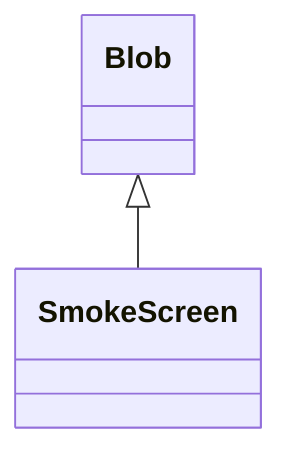

# SmokeScreen 类文档

## 1. 基本信息

| 属性 | 值 |
|------|-----|
| **文件路径** | core/src/main/java/com/shatteredpixel/shatteredpixeldungeon/actors/blobs/SmokeScreen.java |
| **包名** | com.shatteredpixel.shatteredpixeldungeon.actors.blobs |
| **类类型** | public class |
| **继承关系** | extends Blob |
| **代码行数** | 41 行 |
| **直接子类** | 无 |

## 2. 文件职责说明

SmokeScreen 类代表游戏中的“烟幕”区域效果。它本身不增加额外逻辑，只覆盖视觉表现和格子描述，扩散与衰减行为完全沿用 `Blob` 默认实现。

**核心职责**：
- 提供烟幕视觉效果
- 提供格子描述文本

## 3. 结构总览

```
SmokeScreen (extends Blob)
├── 方法
│   ├── use(BlobEmitter): void
│   └── tileDesc(): String
└── 无自有字段与额外逻辑
```

## 4. 继承与协作关系

### 继承关系图



### 协作关系

| 协作类 | 协作方式 |
|--------|----------|
| **Blob** | 提供默认扩散与衰减 |
| **BlobEmitter** | 发射烟雾粒子 |
| **Speck** | `SMOKE` 粒子效果 |
| **Messages** | 国际化描述文本 |

## 5. 字段与常量详解

SmokeScreen 没有自有字段，完全依赖 `Blob` 的标准字段与行为。

## 6. 构造与初始化机制

SmokeScreen 没有显式构造函数。通常通过：

```java
Blob.seed(cell, amount, SmokeScreen.class);
```

创建烟幕区域。

## 7. 方法详解

### use()

```java
@Override
public void use(BlobEmitter emitter)
```

调用父类记录发射器后，持续喷出烟雾粒子：

```java
emitter.pour(Speck.factory(Speck.SMOKE), 0.1f);
```

### tileDesc()

```java
@Override
public String tileDesc()
```

返回国际化描述文本。

## 8. 对外暴露能力

| 方法 | 用途 |
|------|------|
| `tileDesc()` | UI 查看格子说明 |
| `seed(..., SmokeScreen.class)` | 创建烟幕区域 |

## 9. 运行机制与调用链

```
SmokeScreen.act()
└── Blob.act()
    └── Blob.evolve()  // 使用父类默认扩散与衰减
```

## 10. 资源、配置与国际化关联

文件：`core/src/main/assets/messages/actors/actors_zh.properties`

```properties
actors.blobs.smokescreen.name=烟幕
actors.blobs.smokescreen.desc=这里翻腾着一团浓密的黑烟。
```

### 视觉资源

| 资源 | 说明 |
|------|------|
| `Speck.SMOKE` | 烟雾粒子效果 |

## 11. 使用示例

```java
Blob.seed(targetCell, 15, SmokeScreen.class);
```

## 12. 开发注意事项

- 此类没有覆盖 `evolve()`，所以所有扩散与衰减规则完全跟随 `Blob`。
- 如果后续想让烟幕影响视野、命中或 AI，需要新增 `evolve()` 或地形标志逻辑。

## 13. 修改建议与扩展点

- 可扩展为“致盲烟幕”“毒烟幕”等，方式是在当前类中增加 Buff 或伤害处理。
- 若只保留纯视觉用途，当前实现已经足够简洁。

## 14. 事实核查清单

- [x] 已覆盖全部自有方法
- [x] 已验证继承关系 `extends Blob`
- [x] 已确认未覆盖 `evolve()`
- [x] 已验证视觉效果设置
- [x] 已核对中文名与描述来自官方翻译
- [x] 无臆测性机制说明
