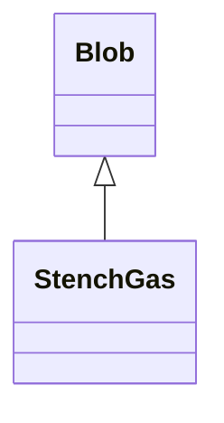

# StenchGas 类文档

## 1. 基本信息

| 属性 | 值 |
|------|-----|
| **文件路径** | core/src/main/java/com/shatteredpixel/shatteredpixeldungeon/actors/blobs/StenchGas.java |
| **包名** | com.shatteredpixel.shatteredpixeldungeon.actors.blobs |
| **类类型** | public class |
| **继承关系** | extends Blob |
| **代码行数** | 79 行 |
| **直接子类** | 无 |

## 2. 文件职责说明

StenchGas 类代表游戏中的“腐臭气体”区域效果。它会对区域内单位施加短时 `Paralysis`，并在特定条件下扣减腐臭鼠任务分数。

**核心职责**：
- 调用标准 Blob 扩散逻辑
- 对覆盖格内单位施加短时麻痹
- 在腐臭鼠仍存在时，对英雄的首次命中施加任务分数惩罚

## 3. 结构总览

```
StenchGas (extends Blob)
├── 方法
│   ├── evolve(): void
│   ├── use(BlobEmitter): void
│   └── tileDesc(): String
└── 无自有字段
```

## 4. 继承与协作关系

### 继承关系图



### 协作关系

| 协作类 | 协作方式 |
|--------|----------|
| **Blob** | 父类，提供扩散与区域管理 |
| **Actor/Char** | 查找格子中的角色 |
| **Paralysis** | 施加的麻痹效果 |
| **FetidRat** | 用于判断腐臭鼠任务是否仍在进行 |
| **Statistics** | 扣减 `questScores[0]` |
| **Speck** | 腐臭粒子效果 |
| **Messages** | 国际化描述文本 |

## 5. 字段与常量详解

StenchGas 没有自有字段。\n
### 麻痹持续时间

```java
Paralysis.DURATION / 5
```

相比完整 `ParalyticGas`，这里只施加缩短后的麻痹时长。

### 分数惩罚

```java
Statistics.questScores[0] -= 100;
```

触发条件：
- 目标是英雄
- 英雄当前没有 `Paralysis`
- 楼层中存在 `FetidRat`

## 6. 构造与初始化机制

StenchGas 没有显式构造函数，通常通过：

```java
Blob.seed(cell, amount, StenchGas.class);
```

创建实例。

## 7. 方法详解

### evolve()

```java
@Override
protected void evolve()
```

**职责**：在父类扩散完成后，对区域内单位施加短时麻痹，并处理腐臭鼠任务扣分。\n
**执行流程**：
1. 调用 `super.evolve()`。
2. 扫描 `Dungeon.level.mobs`，判断当前楼层是否存在 `FetidRat`。
3. 遍历 `area` 范围。\n
4. 对每个 `cur[cell] > 0` 且有角色的格子：
   - 若目标不免疫 `StenchGas`：\n
     - 若目标是英雄、当前没有 `Paralysis` 且存在 `FetidRat`，扣 `Statistics.questScores[0]` 100 分。\n
     - 调用 `Buff.prolong(ch, Paralysis.class, Paralysis.DURATION / 5)` 施加麻痹。\n

### use()

设置腐臭粒子效果：

```java
emitter.pour(Speck.factory(Speck.STENCH), 0.4f);
```

### tileDesc()

返回国际化描述文本。

## 8. 对外暴露能力

| 方法 | 用途 |
|------|------|
| `tileDesc()` | UI 查看格子说明 |
| `seed(..., StenchGas.class)` | 创建腐臭气体区域 |

## 9. 运行机制与调用链

```
StenchGas.act()
└── Blob.act()
    └── StenchGas.evolve()
        ├── Blob.evolve()
        ├── 检查楼层是否存在 FetidRat
        ├── [命中英雄且无麻痹] 扣 questScores[0]
        └── Buff.prolong(..., Paralysis.class, DURATION/5)
```

## 10. 资源、配置与国际化关联

文件：`core/src/main/assets/messages/actors/actors_zh.properties`

```properties
actors.blobs.stenchgas.name=腐臭气体
actors.blobs.stenchgas.desc=这里盘绕着一片腐烂的臭气。
```

## 11. 使用示例

```java
Blob.seed(targetCell, 12, StenchGas.class);

if (Blob.volumeAt(hero.pos, StenchGas.class) > 0) {
    // 英雄正在腐臭气体中
}
```

## 12. 开发注意事项

- 此类的麻痹时间明显短于 `ParalyticGas`。
- 分数惩罚只会在英雄当前还没有 `Paralysis` 时触发，避免同一段麻痹期间重复扣分。
- 任务分数逻辑依赖楼层中是否还存在 `FetidRat`，修改腐臭鼠任务时要同步审查这里。

## 13. 修改建议与扩展点

- 若需要让腐臭气体附带伤害，可在 `evolve()` 中叠加类似 `ToxicGas` 的伤害逻辑。
- 若未来任务分数结构变化，应把 `questScores[0]` 抽象为明确的任务枚举或常量索引。

## 14. 事实核查清单

- [x] 已覆盖全部自有方法
- [x] 已验证继承关系 `extends Blob`
- [x] 已验证 `FetidRat` 存在检查
- [x] 已验证任务分数扣减条件
- [x] 已验证麻痹持续时间为 `Paralysis.DURATION / 5`
- [x] 已验证视觉效果设置
- [x] 已核对中文名与描述来自官方翻译
- [x] 无臆测性机制说明
