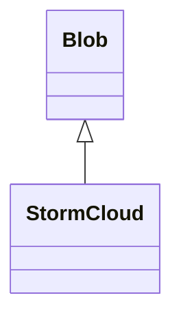

# StormCloud 类文档

## 1. 基本信息

| 属性 | 值 |
|------|-----|
| **文件路径** | core/src/main/java/com/shatteredpixel/shatteredpixeldungeon/actors/blobs/StormCloud.java |
| **包名** | com.shatteredpixel.shatteredpixeldungeon.actors.blobs |
| **类类型** | public class |
| **继承关系** | extends Blob |
| **代码行数** | 72 行 |
| **直接子类** | 无 |

## 2. 文件职责说明

StormCloud 类代表游戏中的“暴雨”区域效果。它会把覆盖格子设置为水面、熄灭同格火焰，并对带有 `FIERY` 属性的单位造成伤害。

**核心职责**：
- 实现暴雨云扩散后的地形处理
- 把覆盖格子转换为水面状态
- 清除同格火焰
- 对火焰属性单位造成深度缩放伤害

## 3. 结构总览

```
StormCloud (extends Blob)
├── 方法
│   ├── evolve(): void         // 扩散并处理水面/伤害
│   ├── use(BlobEmitter): void // 设置视觉效果
│   └── tileDesc(): String     // 返回描述文本
└── 无自有字段
```

## 4. 继承与协作关系

### 继承关系图



### 协作关系

| 协作类 | 协作方式 |
|--------|----------|
| **Blob** | 父类，提供扩散与生命周期 |
| **Level** | 通过 `setCellToWater(true, cell)` 改变地形水面状态 |
| **Fire** | 被暴雨逐格清除 |
| **Char** | 受暴雨影响的单位 |
| **Char.Property.FIERY** | 用于判定火焰属性单位 |
| **Speck** | 暴雨粒子效果 |
| **Messages** | 国际化描述文本 |

## 5. 字段与常量详解

StormCloud 没有定义自有字段，完全依赖 `Blob` 的：

| 继承字段 | 用途 |
|----------|------|
| `cur` | 当前覆盖强度 |
| `off` | 下一帧强度 |
| `volume` | 总体积 |
| `area` | 遍历范围 |

### 伤害公式

```java
1 + Dungeon.scalingDepth()/5
```

该公式与 `ToxicGas` 的深度伤害缩放一致。

## 6. 构造与初始化机制

StormCloud 没有显式构造函数，使用默认构造函数。通常通过：

```java
Blob.seed(cell, amount, StormCloud.class);
```

创建实例并加入当前楼层的 `level.blobs`。

## 7. 方法详解

### evolve()

```java
@Override
protected void evolve()
```

**职责**：调用父类扩散逻辑后，对覆盖格子施加“暴雨”效果。

**执行流程**：
1. 调用 `super.evolve()` 完成标准 Blob 扩散。
2. 获取当前楼层中的 `Fire` Blob。
3. 遍历 `area` 范围内所有格子。
4. 对每个 `cur[cell] > 0` 的格子：
   - 调用 `Dungeon.level.setCellToWater(true, cell)` 把格子设为水面。
   - 若有 `Fire`，调用 `fire.clear(cell)` 清除该格火焰。
   - 若该格存在单位、单位不免疫 `StormCloud` 且具有 `FIERY` 属性，则造成伤害。

### use()

```java
@Override
public void use(BlobEmitter emitter)
```

设置视觉效果：

```java
emitter.pour(Speck.factory(Speck.STORM), 0.4f);
```

### tileDesc()

```java
@Override
public String tileDesc()
```

返回国际化描述文本。

## 8. 对外暴露能力

| 方法 | 用途 |
|------|------|
| `tileDesc()` | UI 查看格子时显示说明 |
| `seed(..., StormCloud.class)` | 创建暴雨效果 |
| `volumeAt(..., StormCloud.class)` | 查询某格暴雨强度 |

## 9. 运行机制与调用链

```
StormCloud.act()
└── Blob.act()
    ├── StormCloud.evolve()
    │   ├── Blob.evolve()
    │   ├── setCellToWater(true, cell)
    │   ├── fire.clear(cell)
    │   └── ch.damage(...) [仅火焰属性目标]
    └── 交换 cur/off
```

## 10. 资源、配置与国际化关联

### 国际化资源

文件：`core/src/main/assets/messages/actors/actors_zh.properties`

```properties
actors.blobs.stormcloud.name=暴雨
actors.blobs.stormcloud.desc=这里盘绕着一片翻腾的水汽。
```

### 视觉资源

| 资源 | 说明 |
|------|------|
| `Speck.STORM` | 暴雨粒子效果 |

## 11. 使用示例

```java
Blob.seed(targetCell, 20, StormCloud.class);

int storm = Blob.volumeAt(hero.pos, StormCloud.class);
if (storm > 0) {
    // 玩家处在暴雨区域
}
```

## 12. 开发注意事项

- `setCellToWater(true, cell)` 会直接改变格子水面状态，修改时要同时注意地形与路径系统。
- 暴雨不会对普通单位造成伤害，只针对具有 `FIERY` 属性的单位。
- 火焰清除逻辑是逐格处理，不会整体移除 `Fire` Blob 实例。

## 13. 修改建议与扩展点

- 若需要扩展为导电雨云，可在 `evolve()` 中增加对水面连锁效果的处理。
- 若需要不同伤害曲线，可把伤害公式抽出为单独方法。

## 14. 事实核查清单

- [x] 已覆盖全部自有方法
- [x] 已验证继承关系 `extends Blob`
- [x] 已验证水面设置逻辑
- [x] 已验证与 `Fire` 的清除关系
- [x] 已验证仅对 `FIERY` 属性单位造成伤害
- [x] 已核对中文名与描述来自官方翻译
- [x] 无臆测性机制说明
