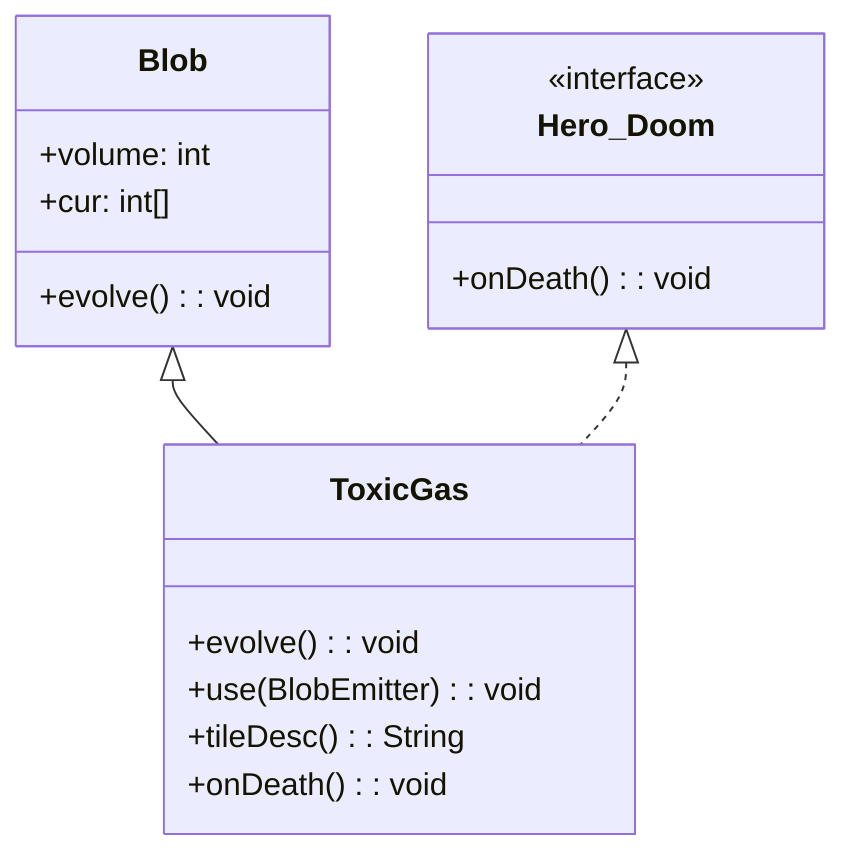

# ToxicGas 类文档

## 1. 基本信息

| 属性 | 值 |
|------|-----|
| **文件路径** | core/src/main/java/com/shatteredpixel/shatteredpixeldungeon/actors/blobs/ToxicGas.java |
| **包名** | com.shatteredpixel.shatteredpixeldungeon.actors.blobs |
| **类类型** | public class |
| **继承关系** | extends Blob implements Hero.Doom |
| **代码行数** | 78 行 |
| **直接子类** | 无 |

## 2. 文件职责说明

ToxicGas 类代表游戏中的"毒气"区域效果。它是游戏中最早出现的危险气体之一，对吸入者造成持续伤害。

**核心职责**：
- 实现毒气的扩散逻辑（继承自 Blob）
- 对毒气中的角色造成伤害
- 处理英雄因毒气死亡的特殊情况
- 实现 Hero.Doom 接口以记录死亡原因

**设计意图**：毒气使用标准的 Blob 扩散算法，但增加了每回合伤害机制。伤害值随关卡深度增加，体现游戏难度递进。

## 3. 结构总览

```
ToxicGas (extends Blob implements Hero.Doom)
├── 实例初始化块
│   └── 无（使用默认 actPriority）
│
├── 方法
│   ├── evolve(): void           // 扩散并造成伤害（覆盖父类）
│   ├── use(BlobEmitter): void   // 设置视觉效果（覆盖父类）
│   ├── tileDesc(): String       // 返回描述文本（覆盖父类）
│   └── onDeath(): void          // Hero.Doom 接口实现
│
└── 无字段（完全继承 Blob）
```

## 4. 继承与协作关系

### 继承关系图



### 协作关系

| 协作类 | 协作方式 |
|--------|----------|
| **Blob** | 父类，提供扩散框架 |
| **Hero.Doom** | 接口，定义死亡处理方法 |
| **Char** | 毒气中的角色，受到伤害 |
| **Badges** | 成就系统，验证毒气死亡成就 |
| **Dungeon** | 提供关卡深度用于伤害计算 |
| **GLog** | 日志系统，显示死亡消息 |
| **Speck** | 毒气粒子效果 |
| **Messages** | 国际化消息获取 |

## 5. 字段与常量详解

### 实例字段

ToxicGas 类没有定义自己的字段，完全继承自 Blob。

### 伤害计算公式

```java
int damage = 1 + Dungeon.scalingDepth() / 5;
```

| 关卡深度 | 伤害值 |
|----------|--------|
| 1-4 | 1 |
| 5-9 | 2 |
| 10-14 | 3 |
| 15-19 | 4 |
| 20-24 | 5 |
| 25+ | 6+ |

## 6. 构造与初始化机制

ToxicGas 类没有显式构造函数，使用默认构造函数。

### 典型初始化方式

```java
// 通过静态 seed 方法创建
Blob.seed(targetCell, amount, ToxicGas.class);
```

### 行动优先级

ToxicGas 使用默认的 BLOB_PRIO 优先级，继承自 Blob。

## 7. 方法详解

### evolve() - 扩散与伤害

```java
@Override
protected void evolve()
```

**职责**：调用父类扩散算法，然后对毒气中的角色造成伤害。

**执行流程**：

1. **调用父类扩散**：
   ```java
   super.evolve();
   ```
   执行标准的 Blob 扩散算法。

2. **计算伤害值**：
   ```java
   int damage = 1 + Dungeon.scalingDepth() / 5;
   ```
   伤害随关卡深度增加。

3. **遍历毒气区域**：
   ```java
   for (int i = area.left; i < area.right; i++) {
       for (int j = area.top; j < area.bottom; j++) {
           cell = i + j * Dungeon.level.width();
           if (cur[cell] > 0 && (ch = Actor.findChar(cell)) != null) {
               if (!ch.isImmune(this.getClass())) {
                   ch.damage(damage, this);
               }
           }
       }
   }
   ```

**伤害条件**：
- 格子有毒气（cur[cell] > 0）
- 格子上有角色
- 角色不免疫毒气

### use() - 视觉效果设置

```java
@Override
public void use(BlobEmitter emitter)
```

**职责**：设置毒气的粒子效果。

**实现**：
```java
super.use(emitter);
emitter.pour(Speck.factory(Speck.TOXIC), 0.4f);
```
- 使用 TOXIC 类型的 Speck 粒子
- 粒子生成频率 0.4f

### tileDesc() - 描述文本

```java
@Override
public String tileDesc()
```

**职责**：返回玩家查看毒气格子时显示的描述文本。

**返回值**：来自国际化资源的描述文本。

### onDeath() - 死亡处理

```java
@Override
public void onDeath()
```

**职责**：处理英雄因毒气死亡的情况。

**执行逻辑**：
1. 验证毒气死亡成就：
   ```java
   Badges.validateDeathFromGas();
   ```
2. 记录失败原因：
   ```java
   Dungeon.fail(this);
   ```
3. 显示死亡消息：
   ```java
   GLog.n(Messages.get(this, "ondeath"));
   ```

## 8. 对外暴露能力

### 公共 API

| 方法 | 用途 | 调用者 |
|------|------|--------|
| `onDeath()` | Hero.Doom 接口方法 | 英雄死亡时调用 |
| `tileDesc()` | 获取毒气描述文本 | UI 显示 |

### 继承自 Blob 的 API

| 方法 | 用途 |
|------|------|
| `seed(cell, amount, ToxicGas.class)` | 创建毒气效果 |
| `volumeAt(cell, ToxicGas.class)` | 查询毒气强度 |
| `clear(cell)` | 清除指定位置的毒气 |

## 9. 运行机制与调用链

### 每回合执行流程

```
Game Loop
    └── Actor.process()
        └── ToxicGas.act()
            ├── spend(TICK)
            ├── Blob.evolve() [父类扩散]
            │   └── 计算扩散 → 写入 off[]
            ├── 交换 cur[] ↔ off[]
            └── ToxicGas.evolve() [伤害处理]
                ├── 计算伤害值
                └── 遍历区域 → 对角色造成伤害
```

### 英雄死亡处理流程

```
Hero.takeDamage()
    └── HP <= 0
        └── 检查死亡原因
            └── 若是 ToxicGas
                └── ToxicGas.onDeath()
                    ├── Badges.validateDeathFromGas()
                    ├── Dungeon.fail(this)
                    └── GLog.n(死亡消息)
```

## 10. 资源、配置与国际化关联

### 国际化资源

**资源文件位置**：
- `core/src/main/assets/messages/actors/actors_zh.properties`

**相关翻译键**：
```properties
actors.blobs.toxicgas.name=毒气
actors.blobs.toxicgas.desc=这里盘绕着一片发绿的毒气。
actors.blobs.toxicgas.rankings_desc=窒息而死
actors.blobs.toxicgas.ondeath=你被毒气毒死了...
```

### 视觉资源

| 资源 | 说明 |
|------|------|
| **Speck.TOXIC** | 毒气粒子效果 |
| **BlobEmitter** | 粒子发射器 |

## 11. 使用示例

### 创建毒气

```java
// 在指定位置创建毒气
Blob.seed(targetCell, 100, ToxicGas.class);
```

### 检查毒气强度

```java
int toxicLevel = Blob.volumeAt(hero.pos, ToxicGas.class);
if (toxicLevel > 0) {
    // 玩家在毒气中
}
```

### 清除毒气

```java
ToxicGas gas = Dungeon.level.blobs.get(ToxicGas.class);
if (gas != null) {
    gas.fullyClear();
}
```

## 12. 开发注意事项

### 伤害随深度增加

- 毒气伤害随关卡深度增加
- 使用 `Dungeon.scalingDepth()` 而非 `Dungeon.depth`
- 这确保了挑战关卡（如恶魔层）的伤害正确计算

### 免疫检查

- 使用 `ch.isImmune(this.getClass())` 检查免疫
- 免疫的角色不会受到伤害
- 某些 Buff（如净化屏障）提供免疫

### Hero.Doom 接口

- 实现 onDeath() 方法处理英雄死亡
- 用于记录死亡原因和触发成就
- 其他 Blob（如 CorrosiveGas）也实现此接口

## 13. 修改建议与扩展点

### 扩展点

1. **自定义伤害公式**：覆盖 evolve() 修改伤害计算
   ```java
   @Override
   protected void evolve() {
       super.evolve();
       int damage = customDamageFormula();
       // ...
   }
   ```

2. **添加额外效果**：在 evolve() 中添加 Buff 施加

### 修改建议

1. **伤害配置化**：将伤害公式提取为可配置参数
2. **视觉效果增强**：添加毒气浓度对应的粒子密度变化

## 14. 事实核查清单

- [x] 是否已覆盖全部 public/protected 方法
- [x] 是否已验证继承关系（extends Blob implements Hero.Doom）
- [x] 是否已验证与 Badges 的协作关系
- [x] 是否已验证伤害计算公式
- [x] 是否已验证免疫检查逻辑
- [x] 是否已验证 onDeath() 的行为
- [x] 是否已验证视觉效果设置
- [x] 所有中文术语是否来自官方翻译文件
- [x] 是否存在臆测性内容（无）
