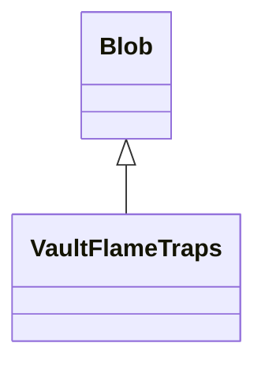

# VaultFlameTraps 类文档

## 1. 基本信息

| 属性 | 值 |
|------|-----|
| **文件路径** | core/src/main/java/com/shatteredpixel/shatteredpixeldungeon/actors/blobs/VaultFlameTraps.java |
| **包名** | com.shatteredpixel.shatteredpixeldungeon.actors.blobs |
| **类类型** | public class |
| **继承关系** | extends Blob |
| **代码行数** | 178 行 |
| **直接子类** | 无 |

## 2. 文件职责说明

VaultFlameTraps 类实现“金库火焰陷阱”专用 Blob。它同时承担火焰警告显示、陷阱冷却计时、冷却结束后重新触发与存档恢复逻辑。

**核心职责**：
- 管理每格火焰陷阱的冷却数据
- 在冷却结束后自动重新 `seed`
- 显示火焰警告与英雄命中反馈
- 持久化陷阱运行状态

## 3. 结构总览

```
VaultFlameTraps (extends Blob)
├── 字段
│   ├── afterTriggerCooldowns: int[]   // 触发后冷却时长
│   ├── curCooldowns: int[]            // 当前冷却剩余
│   └── triggersAfterCooldown: int[]   // 冷却结束后重新触发强度
├── 静态字段
│   └── SFXLastPlayed: long            // 全局音效限流
├── 方法
│   ├── act(): boolean
│   ├── evolve(): void
│   ├── seed(Level,int,int): void
│   ├── storeInBundle(Bundle): void
│   ├── restoreFromBundle(Bundle): void
│   ├── use(BlobEmitter): void
│   └── tileDesc(): String
```

## 4. 继承与协作关系

### 继承关系图



### 协作关系

| 协作类 | 协作方式 |
|--------|----------|
| **Blob** | 父类，提供区域生命周期 |
| **Level** | 用于重新播种陷阱与提供地图长度 |
| **Hero** | 进入火焰格时显示警告反馈 |
| **CellEmitter** | 单格火焰粒子播放 |
| **ElmoParticle** | 火焰粒子效果 |
| **Bundle** | 存档读写 |
| **Sample** | 燃烧音效播放 |
| **ShatteredPixelDungeon.realTime** | 音效播放限流 |
| **Messages** | 描述文本国际化 |

## 5. 字段与常量详解

### 实例字段

| 字段名 | 类型 | 说明 |
|--------|------|------|
| `afterTriggerCooldowns` | int[] | 某格被触发后，多久再次触发；`-1` 表示不自动重触发 |
| `curCooldowns` | int[] | 当前剩余冷却 |
| `triggersAfterCooldown` | int[] | 冷却结束后重新触发时使用的强度 |

### 静态字段

| 字段名 | 类型 | 说明 |
|--------|------|------|
| `SFXLastPlayed` | long | 所有金库火焰陷阱共享的燃烧音效时间戳 |

### Bundle 键

| 常量 | 值 | 用途 |
|------|-----|------|
| `AFTER_TRIGGER_CDS` | `after_trigger_cds` | 保存触发后冷却数组 |
| `CUR_COOLDOWNS` | `cur_cooldowns` | 保存当前冷却数组 |
| `TRIGGERS` | `triggers` | 保存重触发强度数组 |

## 6. 构造与初始化机制

VaultFlameTraps 没有显式构造函数，使用默认构造函数。\n
### 初始化方式

```java
Blob.seed(cell, amount, VaultFlameTraps.class);
```

在首次调用 `seed(Level, cell, amount)` 时：
- 初始化 `afterTriggerCooldowns`
- 初始化 `curCooldowns`
- 初始化 `triggersAfterCooldown`
- `afterTriggerCooldowns` 默认填充为 `-1`

## 7. 方法详解

### act()

```java
@Override
public boolean act()
```

**职责**：先调用父类执行本回合 Blob 行为，再推进每格冷却并在倒计时结束时重新播种。\n
**执行流程**：
1. 调用 `super.act()`。
2. 遍历 `afterTriggerCooldowns`。
3. 对每个 `afterTriggerCooldowns[i] > -1` 的格子：
   - 若 `curCooldowns[i] <= 0`，先设置为 `afterTriggerCooldowns[i]`。
   - 然后自减。
   - 若减到 `<= 0`，调用 `seed(Dungeon.level, i, triggersAfterCooldown[i])`。

### evolve()

```java
@Override
protected void evolve()
```

**职责**：处理当前回合的火焰警告、英雄反馈、粒子播放和强度衰减。\n
**关键逻辑**：
- 当 `cur[cell] > 0` 时：
  - 若英雄在该格：播放燃烧音效，记录 `SFXLastPlayed`，并显示 `!!!`。
  - 若该格在英雄视野中：用 `CellEmitter` 播放 `ElmoParticle`，并标记本回合可播放公共燃烧音效。
  - `off[cell] = cur[cell] - 1`，自然衰减。
- 回合末根据 `playSfx` 和 `SFXLastPlayed` 限流播放环境火焰音效。

源码中有一大段被注释掉的普通火焰逻辑，当前实现没有对物品、植物、可燃地形执行 `Fire.burn()` 那套完整破坏流程。

### seed(Level, int, int)

```java
public void seed(Level level, int cell, int amount)
```

先调用 `super.seed(...)` 写入 Blob 强度，再确保三组冷却数组存在。

### storeInBundle() / restoreFromBundle()

保存和恢复：
- `afterTriggerCooldowns`
- `curCooldowns`
- `triggersAfterCooldown`

### use()

```java
@Override
public void use(BlobEmitter emitter)
```

设置粒子范围并持续喷出火焰粒子：

```java
emitter.bound.set(0.4f, 0.4f, 0.6f, 0.6f);
emitter.pour(ElmoParticle.FACTORY, 0.3f);
```

### tileDesc()

返回国际化描述文本。

## 8. 对外暴露能力

| 方法 | 用途 |
|------|------|
| `act()` | 推进冷却并自动重触发 |
| `seed(Level,int,int)` | 创建陷阱火焰并初始化冷却结构 |
| `tileDesc()` | UI 查看格子说明 |

## 9. 运行机制与调用链

```
VaultFlameTraps.act()
├── Blob.act()
│   └── VaultFlameTraps.evolve()
│       ├── 英雄格显示 !!!
│       ├── 视野内播放火焰粒子
│       └── 强度衰减
└── 处理冷却数组
    └── 冷却结束后 seed(level, i, triggersAfterCooldown[i])
```

## 10. 资源、配置与国际化关联

### 国际化资源

该类通过 `Messages.get(this, "desc")` 读取描述文本。对应中文资源位于：

- `core/src/main/assets/messages/actors/actors_zh.properties`

### 视觉与音效资源

| 资源 | 说明 |
|------|------|
| `ElmoParticle.FACTORY` | 火焰粒子效果 |
| `Assets.Sounds.BURNING` | 燃烧音效 |

## 11. 使用示例

```java
VaultFlameTraps traps = Blob.seed(cell, 3, VaultFlameTraps.class);
traps.afterTriggerCooldowns[cell] = 5;
traps.triggersAfterCooldown[cell] = 3;
```

## 12. 开发注意事项

- 此类不仅是 Blob，也内置了“重新触发陷阱”的调度逻辑。
- `SFXLastPlayed` 是静态共享字段，修改音效逻辑时要注意多处陷阱的全局限流行为。
- 当前实现只对英雄显示明显反馈，没有复用普通 `Fire` 的完整燃烧逻辑。
- 重新播种依赖三个平行数组，修改时必须保持下标一致。

## 13. 修改建议与扩展点

- 若需要更安全的状态管理，可把三组并行数组封装为单独的陷阱状态对象。
- 若需要恢复普通火焰破坏逻辑，可在 `evolve()` 中重新启用并审查注释掉的代码块。

## 14. 事实核查清单

- [x] 已覆盖全部字段与方法
- [x] 已验证继承关系 `extends Blob`
- [x] 已验证冷却与自动重触发逻辑
- [x] 已验证 `Bundle` 存档字段
- [x] 已验证音效限流逻辑
- [x] 已验证视觉效果设置
- [x] 已核对描述文本来源于国际化资源
- [x] 无把注释代码误写成当前生效逻辑
