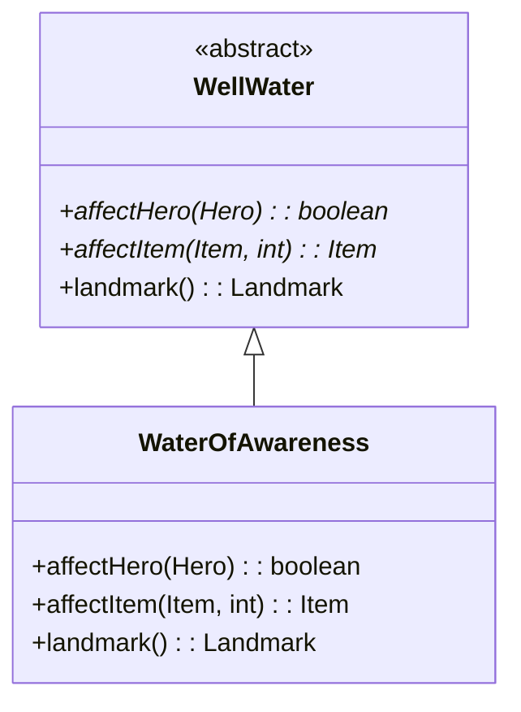

# WaterOfAwareness 类文档

## 1. 基本信息

| 属性 | 值 |
|------|-----|
| **文件路径** | core/src/main/java/com/shatteredpixel/shatteredpixeldungeon/actors/blobs/WaterOfAwareness.java |
| **包名** | com.shatteredpixel.shatteredpixeldungeon.actors.blobs |
| **类类型** | public class |
| **继承关系** | extends WellWater |
| **代码行数** | 104 行 |
| **直接子类** | 无 |

## 2. 文件职责说明

WaterOfAwareness 类代表游戏中的"觉察之泉"井水效果。英雄饮用后会识别所有已装备物品、揭示地图中的隐藏地形，并获得短暂的感知 Buff。

**核心职责**：
- 实现英雄饮用觉察之泉的效果
- 处理物品在觉察之泉中的浸泡效果（识别物品）
- 提供地图标记

**设计意图**：觉察之泉是一种信息获取资源，帮助玩家了解物品属性和地图布局。它还能识别未鉴定的物品。

## 3. 结构总览

```
WaterOfAwareness (extends WellWater)
├── 方法
│   ├── affectHero(Hero): boolean      // 英雄饮用效果（实现父类抽象方法）
│   ├── affectItem(Item, int): Item    // 物品浸泡效果（实现父类抽象方法）
│   ├── landmark(): Landmark           // 返回地图标记（覆盖父类）
│   ├── use(BlobEmitter): void         // 设置视觉效果（覆盖父类）
│   └── tileDesc(): String             // 返回描述文本（覆盖父类）
│
└── 无字段（完全继承 WellWater）
```

## 4. 继承与协作关系

### 继承关系图



### 协作关系

| 协作类 | 协作方式 |
|--------|----------|
| **WellWater** | 父类，提供基础框架 |
| **Hero** | 饮用觉察之泉的角色 |
| **Awareness** | 施加的感知 Buff |
| **ScrollOfIdentify** | 提供识别效果 |
| **Level** | 地图数据，揭示隐藏地形 |
| **Terrain** | 地形标志（SECRET） |
| **GameScene** | 地图显示更新 |
| **Identification** | 识别特效 |
| **Speck** | 问号粒子效果 |
| **Messages** | 国际化消息获取 |
| **GLog** | 日志系统 |

## 5. 字段与常量详解

### 实例字段

WaterOfAwareness 类没有定义自己的字段，完全继承自 WellWater。

### 效果详情

| 效果 | 说明 |
|------|------|
| 识别已装备物品 | 通过 hero.belongings.observe() |
| 揭示隐藏地形 | 遍历整个地图，发现 SECRET 标志的地形 |
| 感知 Buff | Awareness.DURATION 持续时间 |

## 6. 构造与初始化机制

WaterOfAwareness 类没有显式构造函数，使用默认构造函数。

### 典型初始化方式

```java
// 通过静态 seed 方法创建
Blob.seed(wellPos, 1, WaterOfAwareness.class);
```

## 7. 方法详解

### affectHero() - 英雄饮用效果

```java
@Override
protected boolean affectHero(Hero hero)
```

**职责**：实现英雄饮用觉察之泉后的效果。

**参数**：
- `hero`: 饮用觉察之泉的英雄

**返回值**：是否成功消耗了井水

**执行逻辑**：

1. **播放音效**：
   ```java
   Sample.INSTANCE.play(Assets.Sounds.DRINK);
   ```

2. **显示识别特效**：
   ```java
   emitter.parent.add(new Identification(hero.sprite.center()));
   ```

3. **识别已装备物品**：
   ```java
   hero.belongings.observe();
   ```

4. **揭示隐藏地形**：
   ```java
   for (int i = 0; i < Dungeon.level.length(); i++) {
       int terr = Dungeon.level.map[i];
       if ((Terrain.flags[terr] & Terrain.SECRET) != 0) {
           Dungeon.level.discover(i);
           if (Dungeon.level.heroFOV[i]) {
               GameScene.discoverTile(i, terr);
           }
       }
   }
   ```

5. **施加感知 Buff**：
   ```java
   Buff.affect(hero, Awareness.class, Awareness.DURATION);
   ```

6. **更新视野**：
   ```java
   Dungeon.observe();
   ```

7. **显示消息**：
   ```java
   GLog.p(Messages.get(this, "procced"));
   ```

### affectItem() - 物品浸泡效果

```java
@Override
protected Item affectItem(Item item, int pos)
```

**职责**：处理物品在觉察之泉中的浸泡效果（识别物品）。

**参数**：
- `item`: 被浸泡的物品
- `pos`: 觉察之泉位置

**返回值**：识别后的物品，或 null 表示物品已识别（被弹开）

**执行逻辑**：

1. **检查是否已识别**：
   ```java
   if (item.isIdentified()) {
       return null;  // 已识别，弹开
   }
   ```

2. **识别物品**：
   ```java
   ScrollOfIdentify.IDItem(item);
   ```

3. **显示特效**：
   ```java
   Sample.INSTANCE.play(Assets.Sounds.DRINK);
   emitter.parent.add(new Identification(DungeonTilemap.tileCenterToWorld(pos)));
   ```

### landmark() - 地图标记

```java
@Override
public Landmark landmark()
```

**职责**：返回与觉察之泉相关的地图标记。

**返回值**：`Landmark.WELL_OF_AWARENESS`

### use() - 视觉效果设置

```java
@Override
public void use(BlobEmitter emitter)
```

**职责**：设置觉察之泉的粒子效果。

**实现**：
```java
super.use(emitter);
emitter.pour(Speck.factory(Speck.QUESTION), 0.3f);
```
- 使用问号粒子表示识别效果

### tileDesc() - 描述文本

```java
@Override
public String tileDesc()
```

**职责**：返回玩家查看觉察之泉格子时显示的描述文本。

## 8. 对外暴露能力

### 公共 API

| 方法 | 用途 | 调用者 |
|------|------|--------|
| `landmark()` | 返回地图标记 | WellWater.affectCell() |
| `tileDesc()` | 获取描述文本 | UI 显示 |

### 继承自 WellWater 的 API

| 方法 | 用途 |
|------|------|
| `affectCell(cell)` | 触发觉察之泉效果 |

## 9. 运行机制与调用链

### 英雄饮用流程

```
英雄移动到觉察之泉格子
    └── WellWater.affectCell(cell)
        └── WaterOfAwareness.affect(cell)
            └── affectHero(hero)
                ├── hero.belongings.observe()
                ├── 遍历地图揭示隐藏地形
                ├── Buff.affect(hero, Awareness.class)
                └── Dungeon.observe()
            └── clear(cell)
            └── Level.set(cell, Terrain.EMPTY_WELL)
```

### 物品浸泡流程

```
物品扔到觉察之泉格子
    └── WellWater.affectCell(cell)
        └── WaterOfAwareness.affect(cell)
            └── affectItem(item, pos)
                ├── 已识别 → null（弹开）
                └── 未识别 → ScrollOfIdentify.IDItem()
```

### 隐藏地形揭示流程

```
遍历所有格子
    └── 检查 SECRET 标志
        └── Dungeon.level.discover(i)
            └── [在视野内] GameScene.discoverTile()
```

## 10. 资源、配置与国际化关联

### 国际化资源

**资源文件位置**：
- `core/src/main/assets/messages/actors/actors_zh.properties`

**相关翻译键**：
```properties
actors.blobs.waterofawareness.name=觉察之泉
actors.blobs.waterofawareness.procced=在你小酌一口时，你感觉到知识涌入了你的头脑。
actors.blobs.waterofawareness.desc=知识的力量正在从这口井的水里涌出。饮下井中的水将会鉴定所有已装备的物品、探测背包中所有物品的诅咒并揭示本层所有物品的位置。
```

### 视觉资源

| 资源 | 说明 |
|------|------|
| **Speck.QUESTION** | 问号粒子效果 |
| **Identification** | 识别特效 |
| **BlobEmitter** | 粒子发射器 |

### 音效资源

| 资源 | 说明 |
|------|------|
| **Assets.Sounds.DRINK** | 饮水音效 |

## 11. 使用示例

### 创建觉察之泉

```java
// 在指定位置创建觉察之泉
Blob.seed(wellPos, 1, WaterOfAwareness.class);
```

### 英雄饮用

```java
// 英雄移动到井水位置会自动触发
WellWater.affectCell(hero.pos);
```

### 物品浸泡

```java
// 将未识别的物品扔到觉察之泉中
Dungeon.level.drop(unidentifiedItem, wellPos);
// 物品会被识别
```

## 12. 开发注意事项

### 已识别物品的处理

- 已识别的物品会被弹开（返回 null）
- 这防止了玩家"浪费"觉察之泉

### 隐藏地形揭示

- 揭示整个地图的隐藏地形
- 包括秘密门、陷阱等
- 这是永久性的，不会恢复隐藏

### Awareness Buff

- 提供短暂的视野增强
- 持续时间为 Awareness.DURATION
- 与揭示隐藏地形是分开的效果

### 与识别卷轴的比较

| 来源 | 效果 |
|------|------|
| 觉察之泉 | 识别已装备 + 揭示地图 + Awareness Buff |
| 识别卷轴 | 识别单个物品 |
| 鉴定药水 | 识别单个物品 |

## 13. 修改建议与扩展点

### 扩展点

1. **自定义识别范围**：修改 affectHero() 中的识别逻辑
   ```java
   // 识别背包中所有物品
   for (Item item : hero.belongings) {
       item.identify();
   }
   ```

2. **添加额外效果**：在 affectHero() 中添加其他 Buff

### 修改建议

1. **效果配置化**：将 Awareness 持续时间提取为常量
2. **物品交互优化**：考虑是否允许识别已识别物品

## 14. 事实核查清单

- [x] 是否已覆盖全部 public/protected 方法
- [x] 是否已验证继承关系（extends WellWater）
- [x] 是否已验证与 ScrollOfIdentify 的协作关系
- [x] 是否已验证与 Awareness Buff 的协作关系
- [x] 是否已验证隐藏地形揭示逻辑
- [x] 是否已验证物品识别逻辑
- [x] 是否已验证视觉效果设置
- [x] 所有中文术语是否来自官方翻译文件
- [x] 是否存在臆测性内容（无）
