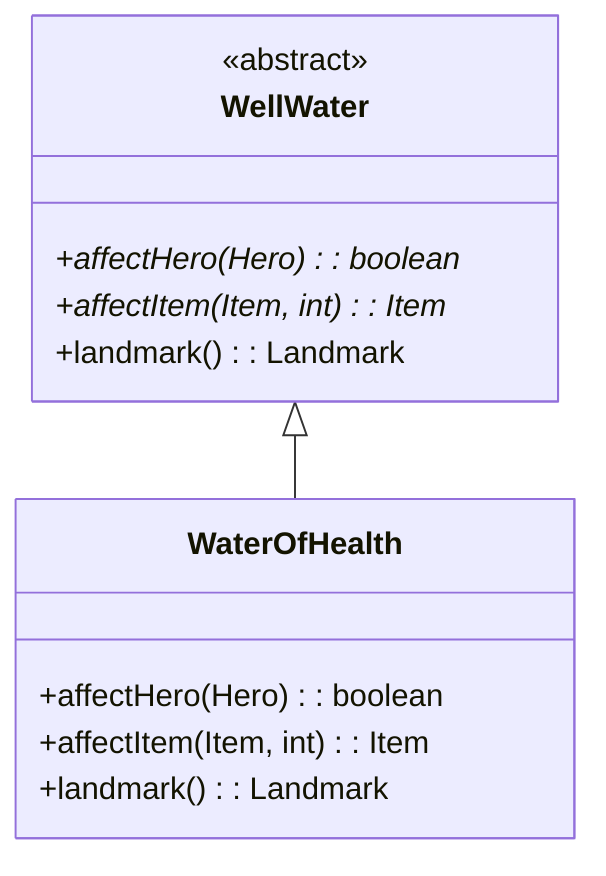

# WaterOfHealth 类文档

## 1. 基本信息

| 属性 | 值 |
|------|-----|
| **文件路径** | core/src/main/java/com/shatteredpixel/shatteredpixeldungeon/actors/blobs/WaterOfHealth.java |
| **包名** | com.shatteredpixel.shatteredpixeldungeon.actors.blobs |
| **类类型** | public class |
| **继承关系** | extends WellWater |
| **代码行数** | 117 行 |
| **直接子类** | 无 |

## 2. 文件职责说明

WaterOfHealth 类代表游戏中的"生命之泉"井水效果。英雄饮用后会完全恢复生命值、治愈负面状态、解除装备诅咒并满足饥饿值。

**核心职责**：
- 实现英雄饮用生命之泉的效果
- 处理物品在生命之泉中的浸泡效果
- 提供地图标记

**设计意图**：生命之泉是一种强力的恢复资源，提供多种治疗效果。它还能与特定物品交互，提供额外的战术选择。

## 3. 结构总览

```
WaterOfHealth (extends WellWater)
├── 方法
│   ├── affectHero(Hero): boolean      // 英雄饮用效果（实现父类抽象方法）
│   ├── affectItem(Item, int): Item    // 物品浸泡效果（实现父类抽象方法）
│   ├── landmark(): Landmark           // 返回地图标记（覆盖父类）
│   ├── use(BlobEmitter): void         // 设置视觉效果（覆盖父类）
│   └── tileDesc(): String             // 返回描述文本（覆盖父类）
│
└── 无字段（完全继承 WellWater）
```

## 4. 继承与协作关系

### 继承关系图



### 协作关系

| 协作类 | 协作方式 |
|--------|----------|
| **WellWater** | 父类，提供基础框架 |
| **Hero** | 饮用生命之泉的角色 |
| **PotionOfHealing** | 提供治愈效果 |
| **Hunger** | 饥饿状态，被满足 |
| **Healing** | 治疗 Buff |
| **Waterskin** | 可被填充的物品 |
| **Ankh** | 可被祝福的物品 |
| **ScrollOfRemoveCurse** | 提供解咒效果 |
| **VialOfBlood** | 影响治疗方式 |
| **Speck** | 治疗粒子效果 |
| **ShaftParticle** | 光柱粒子效果 |
| **Messages** | 国际化消息获取 |
| **GLog** | 日志系统 |

## 5. 字段与常量详解

### 实例字段

WaterOfHealth 类没有定义自己的字段，完全继承自 WellWater。

### 治疗效果

| 效果 | 说明 |
|------|------|
| 治愈负面状态 | 通过 PotionOfHealing.cure() |
| 解除装备诅咒 | 通过 hero.belongings.uncurseEquipped() |
| 满足饥饿 | Hunger.STARVING |
| 恢复生命 | HP = HT 或 Healing Buff |

## 6. 构造与初始化机制

WaterOfHealth 类没有显式构造函数，使用默认构造函数。

### 典型初始化方式

```java
// 通过静态 seed 方法创建
Blob.seed(wellPos, 1, WaterOfHealth.class);
```

## 7. 方法详解

### affectHero() - 英雄饮用效果

```java
@Override
protected boolean affectHero(Hero hero)
```

**职责**：实现英雄饮用生命之泉后的效果。

**参数**：
- `hero`: 饮用生命之泉的英雄

**返回值**：是否成功消耗了井水

**执行逻辑**：

1. **检查存活**：
   ```java
   if (!hero.isAlive()) return false;
   ```

2. **播放音效**：
   ```java
   Sample.INSTANCE.play(Assets.Sounds.DRINK);
   ```

3. **治愈负面状态**：
   ```java
   PotionOfHealing.cure(hero);
   ```

4. **解除装备诅咒**：
   ```java
   hero.belongings.uncurseEquipped();
   ```

5. **满足饥饿**：
   ```java
   hero.buff(Hunger.class).satisfy(Hunger.STARVING);
   ```

6. **恢复生命**：
   ```java
   if (VialOfBlood.delayBurstHealing()) {
       Healing healing = Buff.affect(hero, Healing.class);
       healing.setHeal(hero.HT, 0, VialOfBlood.maxHealPerTurn());
       healing.applyVialEffect();
   } else {
       hero.HP = hero.HT;
       // 显示治疗特效
   }
   ```

7. **显示特效**：
   ```java
   CellEmitter.get(hero.pos).start(ShaftParticle.FACTORY, 0.2f, 3);
   ```

8. **显示消息**：
   ```java
   GLog.p(Messages.get(this, "procced"));
   ```

### affectItem() - 物品浸泡效果

```java
@Override
protected Item affectItem(Item item, int pos)
```

**职责**：处理物品在生命之泉中的浸泡效果。

**参数**：
- `item`: 被浸泡的物品
- `pos`: 生命之泉位置

**返回值**：变化后的物品，或 null 表示物品被弹开

**支持的物品**：

1. **水囊（Waterskin）**：
   ```java
   if (item instanceof Waterskin && !((Waterskin)item).isFull()) {
       ((Waterskin)item).fill();
       // 显示特效
       return item;
   }
   ```

2. **安克护符（Ankh）**：
   ```java
   if (item instanceof Ankh && !(((Ankh) item).isBlessed())) {
       ((Ankh) item).bless();
       // 显示特效
       return item;
   }
   ```

3. **可解咒物品**：
   ```java
   if (ScrollOfRemoveCurse.uncursable(item)) {
       ScrollOfRemoveCurse.uncurse(null, item);
       // 显示特效
       return item;
   }
   ```

### landmark() - 地图标记

```java
@Override
public Landmark landmark()
```

**职责**：返回与生命之泉相关的地图标记。

**返回值**：`Landmark.WELL_OF_HEALTH`

### use() - 视觉效果设置

```java
@Override
public void use(BlobEmitter emitter)
```

**职责**：设置生命之泉的粒子效果。

**实现**：
```java
super.use(emitter);
emitter.start(Speck.factory(Speck.HEALING), 0.5f, 0);
```

### tileDesc() - 描述文本

```java
@Override
public String tileDesc()
```

**职责**：返回玩家查看生命之泉格子时显示的描述文本。

## 8. 对外暴露能力

### 公共 API

| 方法 | 用途 | 调用者 |
|------|------|--------|
| `landmark()` | 返回地图标记 | WellWater.affectCell() |
| `tileDesc()` | 获取描述文本 | UI 显示 |

### 继承自 WellWater 的 API

| 方法 | 用途 |
|------|------|
| `affectCell(cell)` | 触发生命之泉效果 |

## 9. 运行机制与调用链

### 英雄饮用流程

```
英雄移动到生命之泉格子
    └── WellWater.affectCell(cell)
        └── WaterOfHealth.affect(cell)
            └── affectHero(hero)
                ├── PotionOfHealing.cure(hero)
                ├── hero.belongings.uncurseEquipped()
                ├── hero.buff(Hunger.class).satisfy(STARVING)
                ├── [VialOfBlood] Healing Buff
                └── [无VialOfBlood] hero.HP = hero.HT
            └── clear(cell)
            └── Level.set(cell, Terrain.EMPTY_WELL)
```

### 物品浸泡流程

```
物品扔到生命之泉格子
    └── WellWater.affectCell(cell)
        └── WaterOfHealth.affect(cell)
            └── affectItem(item, pos)
                ├── Waterskin → fill()
                ├── Ankh → bless()
                ├── 可解咒物品 → uncurse()
                └── 其他物品 → null（弹开）
```

## 10. 资源、配置与国际化关联

### 国际化资源

**资源文件位置**：
- `core/src/main/assets/messages/actors/actors_zh.properties`

**相关翻译键**：
```properties
actors.blobs.waterofhealth.name=生命之泉
actors.blobs.waterofhealth.procced=你小酌一口后，立刻感到所有伤口都痊愈了。
actors.blobs.waterofhealth.desc=生命的力量正在从这口井的水里涌出。饮下井中的水可以治疗伤口、解除饥饿并净化所有已装备物品的诅咒。
```

### 视觉资源

| 资源 | 说明 |
|------|------|
| **Speck.HEALING** | 治疗粒子效果 |
| **ShaftParticle** | 光柱粒子效果 |
| **ShadowParticle.UP** | 解咒粒子效果 |
| **BlobEmitter** | 粒子发射器 |

### 音效资源

| 资源 | 说明 |
|------|------|
| **Assets.Sounds.DRINK** | 饮水音效 |

## 11. 使用示例

### 创建生命之泉

```java
// 在指定位置创建生命之泉
Blob.seed(wellPos, 1, WaterOfHealth.class);
```

### 英雄饮用

```java
// 英雄移动到井水位置会自动触发
WellWater.affectCell(hero.pos);
```

### 物品浸泡

```java
// 将水囊扔到生命之泉中
Dungeon.level.drop(new Waterskin(), wellPos);
// 水囊会被填充
```

## 12. 开发注意事项

### VialOfBlood 的影响

- 如果玩家有血瓶饰品，治疗会变为 Healing Buff
- 否则直接恢复满血
- 这影响治疗的即时性和安全性

### 物品交互优先级

- Waterskin 和 Ankh 有特殊效果
- 其他可解咒物品会被解咒
- 不符合条件的物品会被弹开

### 与其他治疗来源的比较

| 来源 | 效果 |
|------|------|
| 生命之泉 | 完全恢复 + 治愈 + 解咒 + 饱食 |
| 治疗药水 | 完全恢复 + 治愈 |
| 治疗卷轴 | 完全恢复 |

## 13. 修改建议与扩展点

### 扩展点

1. **添加新的物品交互**：在 affectItem() 中添加新的物品类型
   ```java
   if (item instanceof CustomItem) {
       // 自定义效果
   }
   ```

2. **自定义治疗效果**：修改 affectHero() 中的治疗逻辑

### 修改建议

1. **效果配置化**：将治疗效果提取为可配置参数
2. **物品交互注册**：将物品交互逻辑提取为注册表

## 14. 事实核查清单

- [x] 是否已覆盖全部 public/protected 方法
- [x] 是否已验证继承关系（extends WellWater）
- [x] 是否已验证与 PotionOfHealing 的协作关系
- [x] 是否已验证与 Hunger 的协作关系
- [x] 是否已验证与 Waterskin/Ankh 的交互
- [x] 是否已验证 VialOfBlood 的影响
- [x] 是否已验证视觉效果设置
- [x] 所有中文术语是否来自官方翻译文件
- [x] 是否存在臆测性内容（无）
