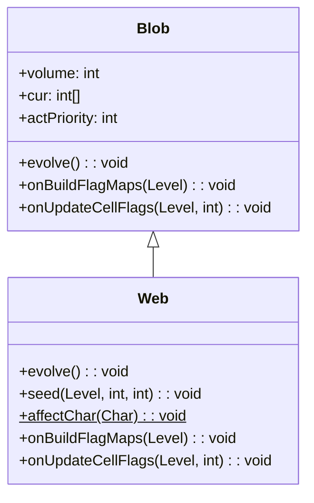

# Web 类文档

## 1. 基本信息

| 属性 | 值 |
|------|-----|
| **文件路径** | core/src/main/java/com/shatteredpixel/shatteredpixeldungeon/actors/blobs/Web.java |
| **包名** | com.shatteredpixel.shatteredpixeldungeon.actors.blobs |
| **类类型** | public class |
| **继承关系** | extends Blob |
| **代码行数** | 114 行 |
| **直接子类** | 无 |

## 2. 文件职责说明

Web 类代表游戏中的"蛛网"区域效果。角色踩到蛛网时会被缠绕，无法移动。蛛网还会改变地形属性，使格子变为不可通行且可燃。

**核心职责**：
- 实现蛛网的自然消退逻辑
- 对踩到蛛网的角色施加缠绕状态
- 更新地形标志（solid 和 flamable）
- 设置特殊的行动优先级

**设计意图**：蛛网是一种陷阱型区域效果，不主动影响角色，而是在角色踩到时触发。它改变了地形属性，使角色无法穿过。

## 3. 结构总览

```
Web (extends Blob)
├── 实例初始化块
│   └── actPriority = HERO_PRIO + 1
│
├── 方法
│   ├── evolve(): void                    // 自然消退（覆盖父类）
│   ├── seed(Level, int, int): void       // 生成蛛网并更新标志（覆盖父类）
│   ├── affectChar(Char): void            // 静态方法，对角色施加缠绕
│   ├── clear(int): void                  // 清除蛛网并更新标志（覆盖父类）
│   ├── fullyClear(): void                // 完全清除并重建标志（覆盖父类）
│   ├── onBuildFlagMaps(Level): void      // 构建地形标志（覆盖父类）
│   ├── onUpdateCellFlags(Level, int): void // 更新单格标志（覆盖父类）
│   ├── use(BlobEmitter): void            // 设置视觉效果（覆盖父类）
│   └── tileDesc(): String                // 返回描述文本（覆盖父类）
│
└── 无字段（完全继承 Blob）
```

## 4. 继承与协作关系

### 继承关系图



### 协作关系

| 协作类 | 协作方式 |
|--------|----------|
| **Blob** | 父类，提供基础框架 |
| **Roots** | 施加的缠绕效果 |
| **Char** | 踩到蛛网的角色，被施加缠绕 |
| **Level** | 地形标志管理 |
| **WebParticle** | 蛛网粒子效果 |
| **Messages** | 国际化消息获取 |

## 5. 字段与常量详解

### 实例字段

Web 类没有定义自己的字段，完全继承自 Blob。

### 行动优先级设置

```java
{
    //acts before the hero, to ensure terrain is adjusted correctly
    actPriority = HERO_PRIO + 1;
}
```

| 优先级 | 值 | 说明 |
|--------|-----|------|
| HERO_PRIO | 英雄优先级 | 英雄的行动时机 |
| HERO_PRIO + 1 | 蛛网优先级 | 在英雄之前行动 |

**设计意图**：蛛网在英雄之前行动，确保地形标志在英雄移动前正确更新。

### 地形属性变化

| 属性 | 原值 | 蛛网后 |
|------|------|--------|
| `solid` | 取决于地形 | true |
| `flamable` | 取决于地形 | true |

蛛网使格子变为不可通行且可燃。

## 6. 构造与初始化机制

Web 类没有显式构造函数，但使用实例初始化块设置行动优先级。

### 典型初始化方式

```java
// 通过静态 seed 方法创建
Blob.seed(targetCell, amount, Web.class);
```

## 7. 方法详解

### evolve() - 自然消退

```java
@Override
protected void evolve()
```

**职责**：实现蛛网的自然消退逻辑。

**执行流程**：
```java
for (int i = area.left; i < area.right; i++) {
    for (int j = area.top; j < area.bottom; j++) {
        cell = i + j * l.width();
        off[cell] = cur[cell] > 0 ? cur[cell] - 1 : 0;
        volume += off[cell];
        
        if (off[cell] == 0 && cur[cell] > 0) {
            cellsToFlagUpdate.add(cell);
        }
    }
}
```

- 每回合强度减 1
- 当蛛网消失时，标记格子需要更新标志

### seed() - 生成蛛网

```java
@Override
public void seed(Level level, int cell, int amount)
```

**职责**：在指定位置生成蛛网，并更新地形标志。

**实现**：
```java
super.seed(level, cell, amount);
level.updateCellFlags(cell);
```

### affectChar() - 对角色施加缠绕

```java
public static void affectChar(Char ch)
```

**职责**：当角色踩到蛛网时，对其施加缠绕状态。

**参数**：
- `ch`: 目标角色

**实现**：
```java
Buff.prolong(ch, Roots.class, Roots.DURATION);
```

**调用时机**：由 `Level.OccupyCell` 和 `Level.PressCell` 调用。

### clear() - 清除蛛网

```java
@Override
public void clear(int cell)
```

**职责**：清除指定位置的蛛网，并更新地形标志。

**实现**：
```java
super.clear(cell);
if (cur == null) return;
Dungeon.level.updateCellFlags(cell);
```

### fullyClear() - 完全清除

```java
@Override
public void fullyClear()
```

**职责**：完全清除所有蛛网，并重建地形标志。

**实现**：
```java
super.fullyClear();
Dungeon.level.buildFlagMaps();
```

### onBuildFlagMaps() - 构建地形标志

```java
@Override
public void onBuildFlagMaps(Level l)
```

**职责**：在构建地形标志时，更新所有蛛网格子的属性。

**实现**：
```java
if (volume > 0) {
    for (int i = 0; i < l.length(); i++) {
        onUpdateCellFlags(l, i);
    }
}
```

### onUpdateCellFlags() - 更新单格标志

```java
@Override
public void onUpdateCellFlags(Level l, int cell)
```

**职责**：更新指定格子的地形属性。

**实现**：
```java
if (volume > 0 && cur[cell] > 0) {
    l.solid[cell] = true;
    l.flamable[cell] = true;
}
```

### use() - 视觉效果设置

```java
@Override
public void use(BlobEmitter emitter)
```

**职责**：设置蛛网的粒子效果。

**实现**：
```java
super.use(emitter);
emitter.pour(WebParticle.FACTORY, 0.25f);
```

### tileDesc() - 描述文本

```java
@Override
public String tileDesc()
```

**职责**：返回玩家查看蛛网格子时显示的描述文本。

## 8. 对外暴露能力

### 公共 API

| 方法 | 用途 | 调用者 |
|------|------|--------|
| `affectChar(Char)` | 静态方法，对角色施加缠绕 | Level.OccupyCell, Level.PressCell |
| `tileDesc()` | 获取蛛网描述文本 | UI 显示 |

### 继承自 Blob 的 API

| 方法 | 用途 |
|------|------|
| `seed(cell, amount, Web.class)` | 创建蛛网效果 |
| `volumeAt(cell, Web.class)` | 查询蛛网强度 |
| `clear(cell)` | 清除指定位置的蛛网 |

## 9. 运行机制与调用链

### 每回合执行流程

```
Game Loop
    └── Actor.process() [按优先级排序]
        ├── [HERO_PRIO + 1] Web.act()  ← 蛛网先行动
        │   ├── spend(TICK)
        │   └── Web.evolve()
        │       ├── 计算衰减
        │       └── 标记需要更新的格子
        └── [HERO_PRIO] 英雄行动
            └── 移动时检查地形标志
```

### 角色踩到蛛网的流程

```
角色移动到蛛网格子
    └── Level.OccupyCell / Level.PressCell
        └── Web.affectChar(ch)
            └── Buff.prolong(ch, Roots.class, Roots.DURATION)
                └── 角色被缠绕，无法移动
```

### 地形标志更新流程

```
蛛网生成
    └── Web.seed()
        └── level.updateCellFlags(cell)
            └── Web.onUpdateCellFlags()
                └── solid[cell] = true, flamable[cell] = true

蛛网消失
    └── Web.evolve()
        └── cellsToFlagUpdate.add(cell)
            └── Blob.act() 中更新标志
                └── level.updateCellFlags(cell)
```

## 10. 资源、配置与国际化关联

### 国际化资源

**资源文件位置**：
- `core/src/main/assets/messages/actors/actors_zh.properties`

**相关翻译键**：
```properties
actors.blobs.web.name=蛛网
actors.blobs.web.desc=这里所有东西都被厚厚的蜘蛛网覆盖着。任何接触或丢向蛛网的东西都会打破它，但也都会被固定在原地。
```

**缠绕 Buff 翻译**：
```properties
actors.buffs.roots.name=缠绕
actors.buffs.roots.desc=一些根系(不论是自然或魔法产生)缠到了脚上，牢牢将其缚在地面。
```

### 视觉资源

| 资源 | 说明 |
|------|------|
| **WebParticle** | 蛛网粒子效果 |
| **BlobEmitter** | 粒子发射器 |

## 11. 使用示例

### 创建蛛网

```java
// 在指定位置创建蛛网
Blob.seed(targetCell, 5, Web.class);
```

### 检查蛛网强度

```java
int webLevel = Blob.volumeAt(hero.pos, Web.class);
if (webLevel > 0) {
    // 玩家在蛛网上
}
```

### 对角色施加缠绕

```java
// 当角色踩到蛛网时
Web.affectChar(enemy);
```

### 清除蛛网

```java
Web web = Dungeon.level.blobs.get(Web.class);
if (web != null) {
    web.clear(cell);  // 清除指定位置
    // 或
    web.fullyClear(); // 清除所有蛛网
}
```

## 12. 开发注意事项

### 行动优先级的重要性

- 蛛网在英雄之前行动
- 这确保地形标志在英雄移动前正确更新
- 如果蛛网后行动，英雄可能会穿过本应被阻挡的格子

### 地形属性变化

- 蛛网使格子变为 solid（不可通行）
- 同时使格子变为 flamable（可燃）
- 这意味着火焰可以烧毁蛛网

### affectChar() 的调用时机

- 由 Level 类在角色踩到蛛网时调用
- 不是在 evolve() 中主动调用
- 这是"触发型"效果的设计模式

### 与其他 Blob 的区别

| 特性 | Web | 其他 Blob |
|------|-----|-----------|
| 影响地形 | 是 | 通常否 |
| 触发方式 | 踩到时 | 每回合 |
| 行动优先级 | HERO_PRIO + 1 | BLOB_PRIO |

## 13. 修改建议与扩展点

### 扩展点

1. **自定义缠绕时长**：修改 affectChar() 中的持续时间
   ```java
   Buff.prolong(ch, Roots.class, customDuration);
   ```

2. **添加其他效果**：在 affectChar() 中添加额外 Buff

### 修改建议

1. **缠绕时长配置化**：将持续时间提取为常量
2. **视觉效果增强**：添加蛛网强度对应的粒子密度变化

## 14. 事实核查清单

- [x] 是否已覆盖全部 public/protected 方法
- [x] 是否已验证继承关系（extends Blob）
- [x] 是否已验证行动优先级设置（HERO_PRIO + 1）
- [x] 是否已验证与 Roots Buff 的协作关系
- [x] 是否已验证地形标志更新逻辑
- [x] 是否已验证 affectChar() 的调用时机
- [x] 是否已验证视觉效果设置
- [x] 所有中文术语是否来自官方翻译文件
- [x] 是否存在臆测性内容（无）
