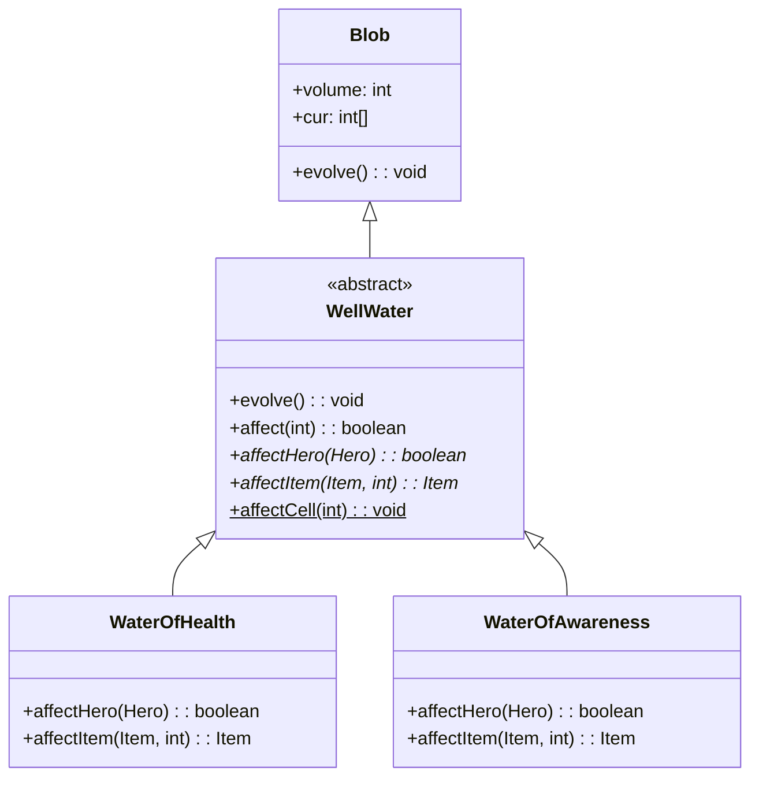

# WellWater 类文档

## 1. 基本信息

| 属性 | 值 |
|------|-----|
| **文件路径** | core/src/main/java/com/shatteredpixel/shatteredpixeldungeon/actors/blobs/WellWater.java |
| **包名** | com.shatteredpixel.shatteredpixeldungeon.actors.blobs |
| **类类型** | public abstract class |
| **继承关系** | extends Blob |
| **代码行数** | 140 行 |
| **直接子类** | WaterOfHealth, WaterOfAwareness |

## 2. 文件职责说明

WellWater 类是所有"井水"效果的抽象基类。它定义了井水影响英雄和物品的基本逻辑框架，具体的实现由子类完成。

**核心职责**：
- 定义井水的扩散逻辑（不衰减）
- 提供影响英雄和物品的抽象方法
- 处理井水消耗后的地形更新
- 管理地图标记的移除

**设计意图**：井水是一种特殊的 Blob，不会自然衰减，而是通过英雄或物品的交互被消耗。消耗后井水会干涸，地形变为空井。

## 3. 结构总览

```
WellWater (extends Blob) [abstract]
├── 方法
│   ├── evolve(): void                    // 扩散逻辑（覆盖父类）
│   ├── affect(int): boolean              // 处理井水效果
│   ├── affectHero(Hero): boolean         // 抽象方法，影响英雄
│   ├── affectItem(Item, int): Item       // 抽象方法，影响物品
│   └── affectCell(int): void             // 静态方法，触发井水效果
│
└── 无字段（完全继承 Blob）
```

## 4. 继承与协作关系

### 继承关系图



### 协作关系

| 协作类 | 协作方式 |
|--------|----------|
| **Blob** | 父类，提供基础框架 |
| **Hero** | 饮用井水的角色 |
| **Heap** | 井水中的物品堆 |
| **Item** | 被井水影响的物品 |
| **Level** | 地形更新 |
| **Terrain** | 地形类型（EMPTY_WELL） |
| **Notes.Landmark** | 地图标记管理 |
| **GameScene** | 地图显示更新 |

## 5. 字段与常量详解

### 实例字段

WellWater 类没有定义自己的字段，完全继承自 Blob。

### 井水特性

- 井水不会自然衰减（evolve 中 off[cell] = cur[cell]）
- 井水通过交互被消耗
- 消耗后地形变为 EMPTY_WELL

## 6. 构造与初始化机制

WellWater 类是抽象类，不能直接实例化。

### 子类实例化

```java
// 通过静态 seed 方法创建子类实例
Blob.seed(wellPos, 1, WaterOfHealth.class);
```

## 7. 方法详解

### evolve() - 扩散逻辑

```java
@Override
protected void evolve()
```

**职责**：实现井水的扩散逻辑，井水不会自然衰减。

**实现**：
```java
for (int i = area.top-1; i <= area.bottom; i++) {
    for (int j = area.left-1; j <= area.right; j++) {
        cell = j + i * Dungeon.level.width();
        if (Dungeon.level.insideMap(cell)) {
            off[cell] = cur[cell];  // 不衰减
            volume += off[cell];
        }
    }
}
```

**特点**：
- off[cell] = cur[cell]，井水不会衰减
- 这与大多数 Blob 不同

### affect() - 处理井水效果

```java
protected boolean affect(int pos)
```

**职责**：处理井水对指定位置的影响，可以影响英雄或物品。

**参数**：
- `pos`: 目标格子位置

**返回值**：是否成功消耗了井水

**执行逻辑**：

1. **英雄饮用**：
   ```java
   if (pos == Dungeon.hero.pos && affectHero(Dungeon.hero)) {
       clear(pos);
       return true;
   }
   ```

2. **物品浸泡**：
   ```java
   if ((heap = Dungeon.level.heaps.get(pos)) != null) {
       Item newItem = affectItem(oldItem, pos);
       if (newItem != null) {
           // 处理物品变化
           clear(pos);
           return true;
       } else {
           // 物品被弹开
           return false;
       }
   }
   ```

3. **物品弹开逻辑**：
   ```java
   int newPlace;
   do {
       newPlace = pos + PathFinder.NEIGHBOURS8[Random.Int(8)];
   } while (!Dungeon.level.passable[newPlace] && !Dungeon.level.avoid[newPlace]);
   Dungeon.level.drop(heap.pickUp(), newPlace).sprite.drop(pos);
   ```

### affectHero() - 抽象方法

```java
protected abstract boolean affectHero(Hero hero)
```

**职责**：由子类实现，定义英雄饮用井水后的效果。

**参数**：
- `hero`: 饮用井水的英雄

**返回值**：是否成功消耗了井水

### affectItem() - 抽象方法

```java
protected abstract Item affectItem(Item item, int pos)
```

**职责**：由子类实现，定义物品在井水中的效果。

**参数**：
- `item`: 被浸泡的物品
- `pos`: 井水位置

**返回值**：变化后的物品，或 null 表示物品被弹开

### affectCell() - 静态方法

```java
public static void affectCell(int cell)
```

**职责**：触发指定格子的井水效果，处理地形更新和标记移除。

**参数**：
- `cell`: 目标格子位置

**执行逻辑**：

1. **遍历所有井水类型**：
   ```java
   Class<?>[] waters = {WaterOfHealth.class, WaterOfAwareness.class};
   for (Class<?> waterClass : waters) {
       WellWater water = (WellWater)Dungeon.level.blobs.get(waterClass);
       // ...
   }
   ```

2. **检查并触发效果**：
   ```java
   if (water != null && water.volume > 0 && water.cur[cell] > 0 && water.affect(cell)) {
       Level.set(cell, Terrain.EMPTY_WELL);
       GameScene.updateMap(cell);
       // 处理标记
   }
   ```

3. **处理地图标记**：
   ```java
   if (water.landmark() != null) {
       if (water.volume <= 0) {
           Notes.remove(water.landmark());
       } else {
           // 检查是否还有可见的井水
       }
   }
   ```

## 8. 对外暴露能力

### 公共 API

| 方法 | 用途 | 调用者 |
|------|------|--------|
| `affectCell(int cell)` | 静态方法，触发井水效果 | 英雄交互 |

### 供子类实现的抽象方法

| 方法 | 用途 |
|------|------|
| `affectHero(Hero)` | 定义英雄饮用效果 |
| `affectItem(Item, int)` | 定义物品浸泡效果 |

## 9. 运行机制与调用链

### 英雄饮用井水流程

```
英雄移动到井水格子
    └── Level.press()
        └── WellWater.affectCell(cell)
            └── water.affect(cell)
                └── affectHero(hero)
                    └── 子类实现具体效果
                └── clear(cell)
                └── Level.set(cell, Terrain.EMPTY_WELL)
```

### 物品浸泡流程

```
物品扔到井水格子
    └── Level.drop()
        └── 后续调用 affectCell()
            └── water.affect(cell)
                └── affectItem(item, pos)
                    └── 子类实现具体效果
                        ├── 返回新物品 → 更新物品堆
                        └── 返回 null → 物品被弹开
```

### 井水干涸流程

```
井水被消耗
    └── clear(pos)
        └── volume -= cur[pos]
        └── cur[pos] = 0
    └── 检查 volume
        └── 若 volume <= 0
            └── Notes.remove(landmark())
```

## 10. 资源、配置与国际化关联

### 国际化资源

WellWater 类本身不直接使用国际化资源，子类使用各自的翻译键。

### 地形关联

| 地形类型 | 说明 |
|----------|------|
| **WELL** | 有水的井 |
| **EMPTY_WELL** | 干涸的井 |

## 11. 使用示例

### 创建井水

```java
// 创建生命之井
Blob.seed(wellPos, 1, WaterOfHealth.class);

// 创建觉察之井
Blob.seed(wellPos, 1, WaterOfAwareness.class);
```

### 触发井水效果

```java
// 英雄饮用或物品浸泡
WellWater.affectCell(wellPos);
```

### 检查井水

```java
WaterOfHealth health = Dungeon.level.blobs.get(WaterOfHealth.class);
if (health != null && health.cur[cell] > 0) {
    // 该位置有生命之井
}
```

## 12. 开发注意事项

### 井水不衰减

- 与大多数 Blob 不同，井水不会自然衰减
- evolve() 中 off[cell] = cur[cell]
- 这确保井水只能通过交互被消耗

### 物品弹开机制

- 当 affectItem() 返回 null 时，物品会被弹开
- 弹开位置随机选择相邻的可通行格子
- 这防止了物品"卡"在井水中

### 地图标记管理

- 井水消耗后需要更新地图标记
- 如果所有井水都被消耗，移除标记
- 如果还有剩余井水但不可见，也移除标记

### 子类实现要求

- 子类必须实现 affectHero() 和 affectItem()
- affectHero() 返回 true 表示消耗井水
- affectItem() 返回非 null 表示消耗井水

## 13. 修改建议与扩展点

### 扩展点

1. **添加新的井水类型**：创建新的子类
   ```java
   public class WaterOfPower extends WellWater {
       @Override
       protected boolean affectHero(Hero hero) {
           // 自定义效果
       }
   }
   ```

2. **修改井水消耗逻辑**：覆盖 affect() 方法

### 修改建议

1. **井水类型注册**：将 waters 数组提取为可配置列表
2. **物品弹开策略**：将弹开逻辑提取为可配置方法

## 14. 事实核查清单

- [x] 是否已覆盖全部 public/protected 方法
- [x] 是否已验证继承关系（extends Blob）
- [x] 是否已验证抽象方法定义
- [x] 是否已验证子类（WaterOfHealth, WaterOfAwareness）
- [x] 是否已验证井水不衰减机制
- [x] 是否已验证物品弹开逻辑
- [x] 是否已验证地形更新逻辑
- [x] 是否已验证地图标记管理
- [x] 所有中文术语是否来自官方翻译文件
- [x] 是否存在臆测性内容（无）
