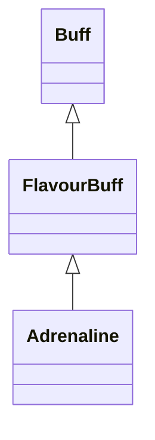

# Adrenaline 类文档

## 1. 基本信息

| 属性 | 值 |
|------|-----|
| **文件路径** | core/src/main/java/com/shatteredpixel/shatteredpixeldungeon/actors/buffs/Adrenaline.java |
| **包名** | com.shatteredpixel.shatteredpixeldungeon.actors.buffs |
| **类类型** | public class |
| **继承关系** | extends FlavourBuff |
| **代码行数** | 52 行 |
| **官方中文名** | 激素涌动 |

## 2. 文件职责说明

Adrenaline 类表示“激素涌动”Buff。它本身不实现移动速度或攻击速度计算，而是提供一个带时限的正面状态外壳，负责 UI 图标、颜色和剩余时间淡出显示。

**核心职责**：
- 标记这是一个正面 Buff
- 在施加时触发公告显示
- 提供图标与红色染色
- 按固定持续时间显示图标淡出比例

## 3. 结构总览

```
Adrenaline (extends FlavourBuff)
├── 常量
│   └── DURATION: float = 10f
├── 方法
│   ├── icon(): int
│   ├── tintIcon(Image): void
│   └── iconFadePercent(): float
└── 无自有实例字段
```

## 4. 继承与协作关系

### 继承关系图



### 协作关系

| 协作类 | 协作方式 |
|--------|----------|
| **FlavourBuff** | 父类，提供带持续时间的 Buff 基础能力 |
| **BuffIndicator** | 提供 UI 图标编号 |
| **Image** | 用于图标染色 |

## 5. 字段与常量详解

### 常量

| 常量 | 类型 | 值 | 说明 |
|------|------|----|------|
| `DURATION` | float | `10f` | 激素涌动的标准持续时间，用于图标淡出计算 |

### 初始化块

```java
{
    type = buffType.POSITIVE;
    announced = true;
}
```

含义：
- `type = POSITIVE`：归类为正面 Buff
- `announced = true`：施加时允许公告

## 6. 构造与初始化机制

Adrenaline 没有显式构造函数，依赖默认构造函数与初始化块。通常通过：

```java
Buff.affect(target, Adrenaline.class, Adrenaline.DURATION);
```

创建并附着到目标。

## 7. 方法详解

### icon()

```java
@Override
public int icon()
```

返回 `BuffIndicator.UPGRADE`，表示该 Buff 在 UI 中使用升级类图标。

### tintIcon(Image icon)

```java
@Override
public void tintIcon(Image icon)
```

通过：

```java
icon.hardlight(1, 0, 0);
```

把图标染成红色。

### iconFadePercent()

```java
@Override
public float iconFadePercent()
```

计算公式：

```java
Math.max(0, (DURATION - visualcooldown()) / DURATION)
```

用于根据剩余视觉冷却时间决定图标淡出程度。

## 8. 对外暴露能力

| 方法/成员 | 用途 |
|-----------|------|
| `DURATION` | 外部施加 Buff 时可直接使用标准持续时间 |
| `icon()` | Buff UI 图标展示 |
| `tintIcon()` | 图标染色 |

## 9. 运行机制与调用链

```
Buff.affect(target, Adrenaline.class, DURATION)
└── Buff 系统创建实例
    ├── 初始化块设置 POSITIVE / announced
    └── UI 读取 icon / tintIcon / iconFadePercent
```

## 10. 资源、配置与国际化关联

### 国际化资源

文件：`core/src/main/assets/messages/actors/actors_zh.properties`

```properties
actors.buffs.adrenaline.name=激素涌动
actors.buffs.adrenaline.desc=由肾上腺素带来的纯粹的潜能爆发，激素涌动能够增强一名角色的移动和攻击速度。
```

本类自身没有覆写 `desc()`，描述文本由继承链中的通用逻辑使用该键读取。

## 11. 使用示例

```java
Buff.affect(hero, Adrenaline.class, Adrenaline.DURATION);

if (hero.buff(Adrenaline.class) != null) {
    // 英雄当前具有激素涌动状态
}
```

## 12. 开发注意事项

- 本类不直接实现“2 倍移速 / 1.5 倍攻速”的数值计算，只承担 Buff 外壳与展示职责。
- `iconFadePercent()` 使用固定 `DURATION` 做比例计算，因此如果外部以非常规时长施加，图标淡出比例仍按 10f 基准显示。

## 13. 修改建议与扩展点

- 若要支持不同来源的不同持续时间显示，可把图标淡出逻辑改为使用实际初始时长而非固定常量。
- 若要给激素涌动增加额外表现，可新增 `fx()` 或 `desc()` 覆写。

## 14. 事实核查清单

- [x] 已覆盖全部自有方法与常量
- [x] 已验证继承关系 `extends FlavourBuff`
- [x] 已验证 `POSITIVE` 与 `announced = true`
- [x] 已验证图标为 `BuffIndicator.UPGRADE`
- [x] 已验证红色染色逻辑
- [x] 已核对中文名来自官方翻译
- [x] 无臆测性机制说明
