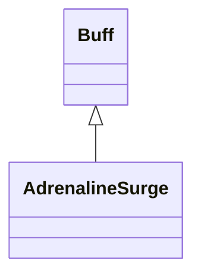

# AdrenalineSurge 类文档

## 1. 基本信息

| 属性 | 值 |
|------|-----|
| **文件路径** | core/src/main/java/com/shatteredpixel/shatteredpixeldungeon/actors/buffs/AdrenalineSurge.java |
| **包名** | com.shatteredpixel.shatteredpixeldungeon.actors.buffs |
| **类类型** | public class |
| **继承关系** | extends Buff |
| **代码行数** | 106 行 |
| **官方中文名** | 力量激发 |

## 2. 文件职责说明

AdrenalineSurge 类表示“力量激发”Buff。它通过 `boost` 和 `interval` 两个参数，按固定间隔逐步衰减加成，并在加成耗尽时自动移除自身。

**核心职责**：
- 保存当前加成值 `boost`
- 保存衰减间隔 `interval`
- 周期性减少加成并在归零时移除 Buff
- 提供图标文本、淡出比例、描述文本和存档支持

## 3. 结构总览

```
AdrenalineSurge (extends Buff)
├── 常量
│   └── DURATION: float = 200f
├── 字段
│   ├── boost: int
│   └── interval: float
├── 方法
│   ├── reset(int,float): void
│   ├── delay(float): void
│   ├── boost(): int
│   ├── act(): boolean
│   ├── icon(): int
│   ├── tintIcon(Image): void
│   ├── iconFadePercent(): float
│   ├── iconTextDisplay(): String
│   ├── desc(): String
│   ├── storeInBundle(Bundle): void
│   └── restoreFromBundle(Bundle): void
```

## 4. 继承与协作关系

### 继承关系图



### 协作关系

| 协作类 | 协作方式 |
|--------|----------|
| **Buff** | 父类，提供行动计时、附着与冷却系统 |
| **BuffIndicator** | 提供图标编号 |
| **Image** | 图标染色 |
| **Messages** | 描述文本国际化 |
| **Bundle** | 存档读写 |

## 5. 字段与常量详解

### 常量

| 常量 | 类型 | 值 | 说明 |
|------|------|----|------|
| `DURATION` | float | `200f` | 图标淡出显示的基准时长 |

### 实例字段

| 字段 | 类型 | 说明 |
|------|------|------|
| `boost` | int | 当前剩余力量加成值 |
| `interval` | float | 每次衰减发生的间隔 |

### Bundle 键

| 常量 | 值 | 用途 |
|------|-----|------|
| `BOOST` | `boost` | 保存当前加成值 |
| `INTERVAL` | `interval` | 保存衰减间隔 |

## 6. 构造与初始化机制

初始化块仅设置：

```java
type = buffType.POSITIVE;
```

常见初始化流程：

```java
AdrenalineSurge surge = Buff.affect(hero, AdrenalineSurge.class);
surge.reset(5, 2f);
```

`reset()` 会同时写入 `boost`、`interval`，并通过 `spend(interval - cooldown())` 调整下一次触发时间。

## 7. 方法详解

### reset(int boost, float interval)

设置新的 `boost` 和 `interval`，并把当前冷却修正到新的间隔上。

### delay(float value)

调用 `spend(value)`，直接把下一次触发向后延迟。

### boost()

返回当前 `boost` 数值。

### act()

```java
@Override
public boolean act()
```

**执行逻辑**：
1. `boost--`
2. 若 `boost > 0`，调用 `spend(interval)` 等待下一次衰减
3. 否则 `detach()` 移除 Buff
4. 返回 `true`

### icon() / tintIcon()

- 图标：`BuffIndicator.UPGRADE`
- 染色：`icon.hardlight(1f, 0.5f, 0)`，即橙色系

### iconFadePercent()

公式：

```java
Math.max(0, (DURATION - visualcooldown()) / DURATION)
```

### iconTextDisplay()

返回：

```java
Integer.toString((int)visualcooldown())
```

用于在大图标上显示剩余回合文本。

### desc()

```java
Messages.get(this, "desc", boost, dispTurns(visualcooldown()))
```

描述中会插入当前力量加成与剩余时间。

### storeInBundle() / restoreFromBundle()

保存并恢复 `boost` 和 `interval`。

## 8. 对外暴露能力

| 方法/成员 | 用途 |
|-----------|------|
| `reset(int,float)` | 初始化或刷新加成与衰减间隔 |
| `delay(float)` | 延后下一次衰减 |
| `boost()` | 查询当前加成值 |
| `desc()` | 返回带参数的说明文本 |

## 9. 运行机制与调用链

```
Buff.affect(target, AdrenalineSurge.class)
└── reset(boost, interval)
    └── 设置字段并校正冷却

Buff 调度系统
└── AdrenalineSurge.act()
    ├── boost--
    ├── [boost > 0] spend(interval)
    └── [boost <= 0] detach()
```

## 10. 资源、配置与国际化关联

文件：`core/src/main/assets/messages/actors/actors_zh.properties`

```properties
actors.buffs.adrenalinesurge.name=力量激发
actors.buffs.adrenalinesurge.desc=一股强大的力量，不过很可惜不是永久的。
```

## 11. 使用示例

```java
AdrenalineSurge surge = Buff.affect(hero, AdrenalineSurge.class);
surge.reset(5, 2f);

surge.delay(1f);
int currentBoost = surge.boost();
```

## 12. 开发注意事项

- `boost` 既是数值加成，也是剩余衰减次数计数器。
- `DURATION = 200f` 只用于图标淡出，不代表真实的固定持续时间。
- `reset()` 使用 `interval - cooldown()` 调整计时，因此在重复调用时会立刻重排下一次触发点。

## 13. 修改建议与扩展点

- 若要让描述更准确，可额外展示 `interval`。
- 若希望图标淡出反映真实剩余周期数，可把 `DURATION` 换成动态基准。

## 14. 事实核查清单

- [x] 已覆盖全部字段、常量与方法
- [x] 已验证继承关系 `extends Buff`
- [x] 已验证 `boost` 衰减逻辑
- [x] 已验证 `delay()` 仅调用 `spend(value)`
- [x] 已验证描述文本参数顺序
- [x] 已验证 `Bundle` 存档字段
- [x] 已核对中文名来自官方翻译
- [x] 无臆测性机制说明
